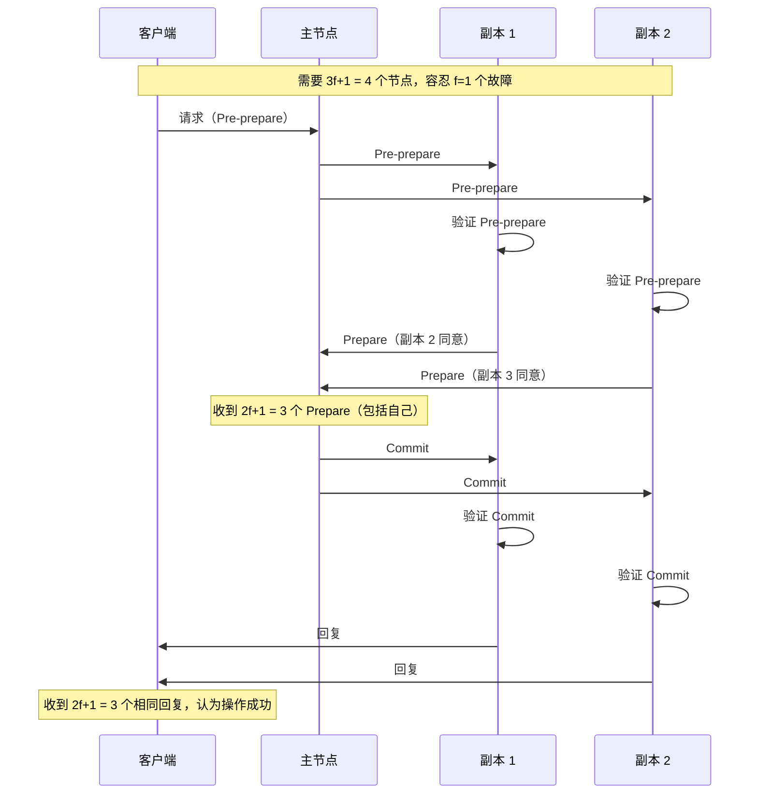

# 拜占庭故障（Byzantine Failure）

拜占庭故障是所有故障类型中最复杂、最危险的一种。

在拜占庭将军问题中，一群将军围攻一座城市，但他们中可能有叛徒——叛徒可能会发送矛盾的消息，阻止忠诚的将军们达成共识。**拜占庭故障就是分布式系统中的「叛徒」：节点可能产生任意错误的响应，而且这些错误是有意或无意的，难以检测。**

崩溃故障是「节点不响应」，遗漏故障是「节点部分响应」，拜占庭故障是「节点响应了，但响应是错误的」——可能是错误的数据，可能是矛盾的决策，可能是恶意的行为。

## 拜占庭故障的定义

**拜占庭故障的三个特征**：

1. **任意性**：节点可能产生任何可能的输出，包括矛盾的输出
2. **隐蔽性**：故障节点可能表现得像正常节点，难以检测
3. **危害性**：可能导致整个系统做出错误的决策

```mermaid
flowchart LR
    subgraph 正常节点
        A["客户端"] --> B["节点 B\n正常响应"]
        B --> A
    end

    subgraph 拜占庭节点
        C["客户端"] --> D["节点 D\n产生错误响应"]
        D --> |"可能是任意内容| E["错误数据"]
        D --> |"可能不响应| F["矛盾响应"]
        D --> |"可能恶意| G["故意破坏"]
    end
```

## 拜占庭故障的成因

| 成因 | 说明 | 示例 |
| --- | --- | --- |
| **软件 Bug** | 代码逻辑错误导致产生错误的输出 | 缓冲区溢出、内存损坏 |
| **数据损坏** | 内存或磁盘数据被破坏 | 位翻转、磁盘坏道 |
| **恶意攻击** | 节点被攻击者控制 | 被入侵的服务器 |
| **配置错误** | 错误配置导致节点行为异常 | 错误的路由表 |
| **硬件故障** | CPU/内存故障导致计算错误 | ECC 内存错误 |

## 拜占庭将军问题

拜占庭容错（BFT）的理论基础是「拜占庭将军问题」：

> n 个将军，其中 f 个可能是叛徒。需要一种算法，使得即使有 f 个叛徒，忠诚的将军们仍然能对行动计划达成一致。

**结论**：要容忍 f 个拜占庭故障，至少需要 3f + 1 个节点。

```
n = 3f + 1

- f = 1 → n = 4（4 个节点可容忍 1 个故障）
- f = 2 → n = 7（7 个节点可容忍 2 个故障）
- f = 3 → n = 10（10 个节点可容忍 3 个故障）
```

```mermaid
flowchart TD
    subgraph n = 3f + 1 的证明
        A["总节点 n"] --> B["叛徒 f"]
        A --> C["忠诚节点 n-f"]

        B --> D["叛徒可以发送矛盾消息"]
        C --> E["忠诚节点需要超过叛徒的声音"]

        D & E --> F["n-f > f + f/2 → n > 3f"]
        F --> G["n = 3f + 1"
    end
```

## 拜占庭容错协议：BFT-Smart / PBFT

实用拜占庭容错（PBFT）是第一个能实际部署的 BFT 协议：

### PBFT 的工作原理



### PBFT 的局限性

```mermaid
flowchart LR
    subgraph PBFT 局限性
        A["高复杂度"] --> |"O(n²)| B["通信开销大"]
        B --> C["节点数增加时性能急剧下降"]
        A --> D["视图切换开销大"]
        D --> E["主节点故障时需重新共识"]
    end
```

| 局限性 | 说明 | 影响 |
| --- | --- | --- |
| **通信复杂度 O(n²)** | 每条消息需要 n 个节点互相通信 | 节点数增加时性能下降 |
| **延迟高** | 需要多轮通信 | 吞吐量受限 |
| **节点数量要求高** | 需要 3f+1 个节点 | 成本高 |
| **只容忍 < 1/3 的故障** | 超过 1/3 节点故障则无法工作 | 脆弱 |

## 适合拜占庭容错的场景

### 场景一：区块链

区块链是最典型的拜占庭容错应用：

| 特点 | 说明 |
| --- | --- |
| **去中心化** | 无信任的中心节点 |
| **敌对环境** | 节点可能被恶意控制 |
| **价值转移** | 错误决策代价极高 |

比特币使用工作量证明（PoW）实现中本聪共识，以太坊正转向权益证明（PoS）。

### 场景二：关键基础设施

金融系统、军事系统、航空控制系统需要容忍拜占庭故障。

### 场景三：多数据中心协作

不同数据中心可能有不同的利益，存在「理性恶意」的可能。

## 简化方案：故障检测 + 排除

大多数生产系统不需要完整的 BFT，而是采用更实用的方案：

### 方案一：故障节点检测 + 排除

```java title="ByzantineDetector.java"
@Service
public class ByzantineDetector {

    // 记录每个节点的响应历史
    private final Map<String, List<Response>> responseHistory = new ConcurrentHashMap<>();

    public void recordResponse(String nodeId, Object response) {
        responseHistory.computeIfAbsent(nodeId, k -> new CopyOnWriteArrayList<>())
            .add(new Response(response, System.currentTimeMillis()));
    }

    // 通过多数投票检测异常节点
    public boolean isNodeSuspicious(String nodeId) {
        List<Response> responses = responseHistory.get(nodeId);
        if (responses == null || responses.size() < 10) {
            return false; // 数据不够，暂不判定
        }

        // 与多数节点对比
        Map<Object, Long> voteCount = responses.stream()
            .collect(Collectors.groupingBy(Response::getValue, Collectors.counting()));

        // 如果该节点的响应与多数不一致的比例过高
        long suspiciousCount = voteCount.entrySet().stream()
            .filter(e -> e.getValue() < responses.size() * 0.3)
            .mapToLong(Map.Entry::getValue)
            .sum();

        return suspiciousCount > responses.size() * 0.5;
    }
}
```

### 方案二：可信执行环境（TEE）

使用 Intel SGX 或 ARM TrustZone，在硬件层面保证代码执行的正确性：

| 技术 | 说明 |
| --- | --- |
| **Intel SGX** | CPU 划分出飞地（Enclave），保护代码和数据 |
| **ARM TrustZone** | 硬件隔离安全世界和普通世界 |

### 方案三：审计 + 冗余校验

```yaml
# 多副本交叉验证
replication:
  strategy: "cross-validation"
  replicas: 3
  agreement_threshold: "2/3 majority"

  validation:
    - "计算结果交叉验证"
    - "定期完整性校验"
    - "异常节点自动剔除"
```

## 拜占庭故障 vs 其他故障

```mermaid
flowchart TD
    A["故障类型"] --> B["崩溃故障\n（最简单）"]
    A --> C["遗漏故障\n（中等）"]
    A --> D["拜占庭故障\n（最复杂）"]

    B --> |"不响应| E["容易检测"]
    C --> |"部分响应| F["难以检测"]
    D --> |"任意响应| G["极难检测"]

    E --> H["冗余切换"]
    F --> I["重试 + 幂等"]
    G --> J["BFT 协议\n或 TEE + 审计"]
```

| 故障类型 | 检测难度 | 应对策略 | 成本 |
| --- | --- | --- | --- |
| 崩溃故障 | 低 | 心跳 + 冗余切换 | 低 |
| 遗漏故障 | 中 | 超时 + 重试 + 幂等 | 中 |
| 拜占庭故障 | 高 | BFT / TEE / 多数投票 | 高 |

## 本章总结

**核心要点**：

1. **拜占庭故障是最复杂的故障**：节点可能产生任意错误的响应
2. **容忍 f 个拜占庭故障至少需要 3f+1 个节点**：这是数学证明的结论
3. **PBFT 是第一个实用的 BFT 协议**：但有 O(n²) 通信开销
4. **大多数系统不需要完整 BFT**：通过故障检测 + 排除 + 审计可以处理大部分场景
5. **区块链是拜占庭容错的典型应用**：但通过经济激励（PoW/PoS）简化了协议

理解了拜占庭故障，接下来我们看另一种常见的故障：网络分区。
