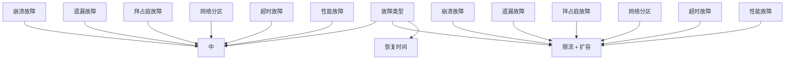
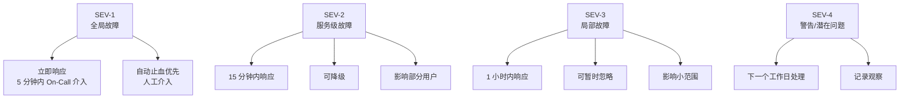

# 故障分类与处理策略矩阵

知道故障是什么类型，是制定处理策略的前提。

崩溃故障、遗漏故障、拜占庭故障、网络分区、超时故障、性能故障——每种故障有不同的特征、不同的成因、不同的处理策略。本节将建立一个完整的分类与处理策略矩阵，帮助你在遇到故障时快速定位和处理。

## 故障分类总览



## 完整处理策略矩阵

### 按故障类型

| 故障类型 | 检测方式 | 快速止血 | 根本处理 | MTTR 目标 |
| --- | --- | --- | --- | --- |
| **崩溃故障** | 心跳超时 | 故障转移 | 重启或替换节点 | `<` 5 分钟 |
| **遗漏故障** | 请求超时 | 重试（有幂等） | 检查网络/资源 | `<` 10 分钟 |
| **拜占庭故障** | 多数投票/审计 | 节点隔离 | 重新部署/修复代码 | `<` 30 分钟 |
| **网络分区** | 心跳 + 法定人数 | 降级或停写 | 等待网络恢复 | 分区持续时间 |
| **超时故障** | 客户端超时 | 降级返回 | 优化性能/扩容 | `<` 15 分钟 |
| **性能故障** | 延迟监控 | 限流降级 | 容量规划/优化 | `<` 30 分钟 |

### 按影响范围

| 影响范围 | 故障表现 | 快速处理 | 预防措施 |
| --- | --- | --- | --- |
| **单节点** | 单个服务实例不可用 | 自动重启/替换 | 健康检查 |
| **单服务** | 某个服务不可用 | 降级/熔断 | 多实例部署 |
| **多服务** | 多个相关服务不可用 | 隔离 + 降级 | 服务隔离 |
| **全局** | 整个系统受影响 | 启动应急预案 | 多活架构 |

### 按严重程度（SEV 等级）



## 不同故障的应对策略详解

### 崩溃故障的完整处理流程

```mermaid
flowchart TD
    A["崩溃检测"] --> B["触发告警"]
    B --> C["自动重启（K8s）"]
    C --> D{"重启成功？"}
    D -->|"是| E["健康检查通过"]
    E --> F["恢复服务"]
    D -->|"否| G["触发故障转移"]
    G --> H["切换到备用节点"]
    H --> I["更新服务注册"]
    I --> F

    B --> J["人工介入（如有必要）"]
```

### 遗漏故障的处理策略

```java title="OmissionHandler.java"
@Service
public class OmissionHandler {

    public Result handleOmission(String requestId, Request request) {
        // 1. 检查幂等性：请求是否已经处理过
        if (idempotencyStore.hasProcessed(requestId)) {
            log.info("请求 {} 已处理过，返回幂等结果", requestId);
            return idempotencyStore.getResult(requestId);
        }

        // 2. 检查重试次数
        int retryCount = retryCounter.increment(requestId);
        if (retryCount > MAX_RETRIES) {
            log.error("请求 {} 重试次数超限", requestId);
            throw new RetryExhaustedException(requestId);
        }

        // 3. 指数退避重试
        long delay = calculateBackoff(retryCount);
        Thread.sleep(delay);

        // 4. 再次尝试
        return sendRequest(request);
    }
}
```

### 性能故障的处理策略

```mermaid
flowchart TD
    A["性能下降检测"] --> B{"是否超过阈值？"}
    B -->|"轻微| C["持续监控"]
    B -->|"严重| D["触发限流"]
    D --> E{"有降级方案？"}
    E -->|"是| F["执行降级"]
    E -->|"否| G["限流 + 排队"]
    F --> H["继续服务（降级模式）"]
    G --> I["等待容量恢复"]

    D --> J["开始扩容"]
    J --> K["新实例就绪"]
    K --> L["流量切换"]
    L --> M["性能恢复"]
```

## 故障处理的最佳实践

### 实践一：故障分级明确

每个团队都应该有一个明确的故障分级标准：

```yaml title="severity-levels.yaml"
severity_levels:
  SEV1:
    definition: "全局服务不可用或严重降级，影响所有用户"
    response_time: "5 分钟"
    escalation: "立即通知 CTO，30 分钟内召开 incident call"
    example: "支付服务完全不可用"

  SEV2:
    definition: "核心服务不可用或严重降级，影响大部分用户"
    response_time: "15 分钟"
    escalation: "通知 team lead，1 小时内召开 incident call"
    example: "商品查询服务响应超时 50%"

  SEV3:
    definition: "非核心服务不可用或降级，影响部分用户"
    response_time: "1 小时"
    escalation: "通知 on-call"
    example: "推荐服务响应慢"

  SEV4:
    definition: "潜在问题或警告，不影响用户"
    response_time: "下一个工作日"
    escalation: "记录 ticket"
    example: "磁盘使用率 80%"
```

### 实践二：故障恢复手册

每种故障都应该有对应的恢复手册：

```yaml title="runbook-example.yaml"
runbook:
  name: "数据库连接池耗尽"
  severity: SEV2
  symptoms:
    - "应用响应超时"
    - "日志中出现 ConnectionPoolExhaustedException"
    - "数据库连接数达到上限"

  diagnosis:
    - "检查连接泄漏：SELECT * FROM pg_stat_activity WHERE state != 'idle'"
    - "检查慢查询：SELECT * FROM pg_stat_statements ORDER BY mean_time DESC LIMIT 10"
    - "检查连接池配置：确保 max_connections 足够"

  mitigation:
    - "1. 临时增加连接池大小（如果配置允许）"
    - "2. 重启应用以释放现有连接"
    - "3. 终止长时间运行的空闲连接"

  resolution:
    - "修复代码中的连接泄漏"
    - "优化慢查询"
    - "调整连接池配置"
```

### 实践三：故障后复盘（Postmortem）

每次故障处理后都应该进行复盘：

```markdown title="postmortem-template.md"
# 故障复盘报告

## 故障概要
- 时间：2024-01-15 14:30 - 15:00
- 影响：订单服务不可用 30 分钟，约 500 个订单失败
- 根因：数据库连接池配置过小，突发流量导致耗尽

## 时间线
- 14:30 告警触发：订单接口响应超时
- 14:32 On-Call 响应，开始排查
- 14:40 定位到数据库连接池耗尽
- 14:45 执行降级：暂停非核心功能
- 14:50 重启应用，连接池重置
- 15:00 服务完全恢复

## 根因分析
1. 直接原因：数据库连接池最大值设置为 50
2. 根本原因：代码中存在连接泄漏（未关闭连接）
3. 触发因素：下午两点有一个运营活动，流量突增 3 倍

## 改进措施
- [ ] 修复连接泄漏问题（Owner: 张三，Due: 2024-01-20）
- [ ] 将连接池大小增加到 200（Owner: 李四，Due: 2024-01-16）
- [ ] 添加连接池使用率监控告警（Owner: 王五，Due: 2024-01-22）

## 教训
1. 数据库连接池应该根据峰值流量预留足够的余量
2. 连接泄漏问题需要在代码审查时重点关注
3. 应该有连接池使用率的监控和告警
```

## 故障分类速查卡

```
┌─────────────────┬──────────────────┬────────────────┐
│  故障类型        │  快速识别特征      │  第一反应       │
├─────────────────┼──────────────────┼────────────────┤
│  崩溃故障        │ 无响应/心跳消失     │  重启/故障转移  │
│  遗漏故障        │ 间歇性超时/丢包    │  重试/幂等      │
│  拜占庭故障      │ 数据不一致/错误响应 │  隔离/审计      │
│  网络分区        │ 分区两侧都能工作    │  CP/AP 选择    │
│  超时故障        │ 响应慢但能连接     │  降级/超时处理  │
│  性能故障        │ 全面变慢           │  限流/扩容      │
└─────────────────┴──────────────────┴────────────────┘
```

## 本章总结

**核心要点**：

1. **故障分类是处理的基础**：崩溃/遗漏/拜占庭/分区/超时/性能各有不同策略
2. **按严重程度分级响应**：SEV1 立即响应，SEV4 可以等待
3. **每种故障都要有恢复手册**：减少故障时的决策时间
4. **故障后必须复盘**：从每次故障中学习，防止重复
5. **建立完整的故障处理流程**：检测 → 止血 → 诊断 → 修复 → 复盘

故障模型模块到此结束。接下来我们将进入「容错模式」模块，学习如何针对不同故障设计防护手段。
