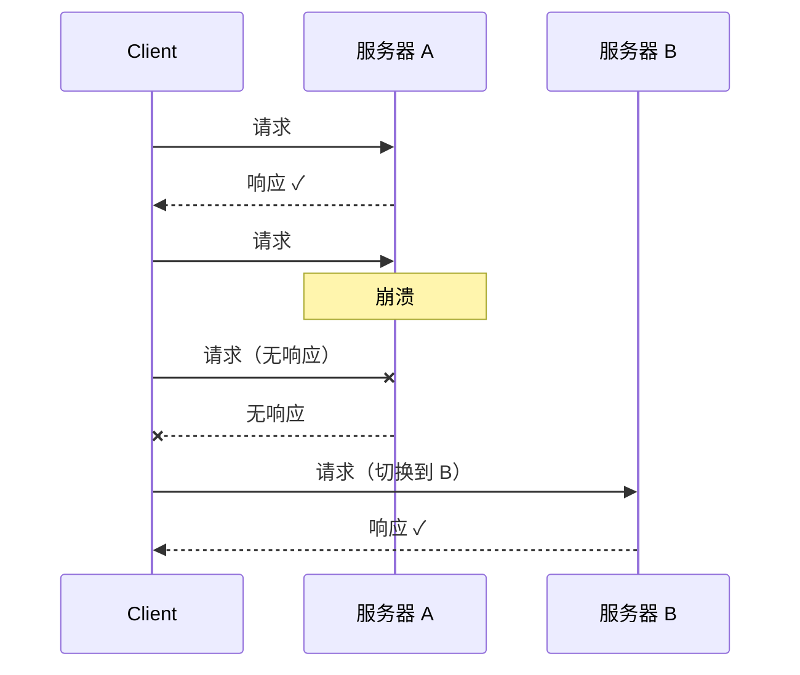
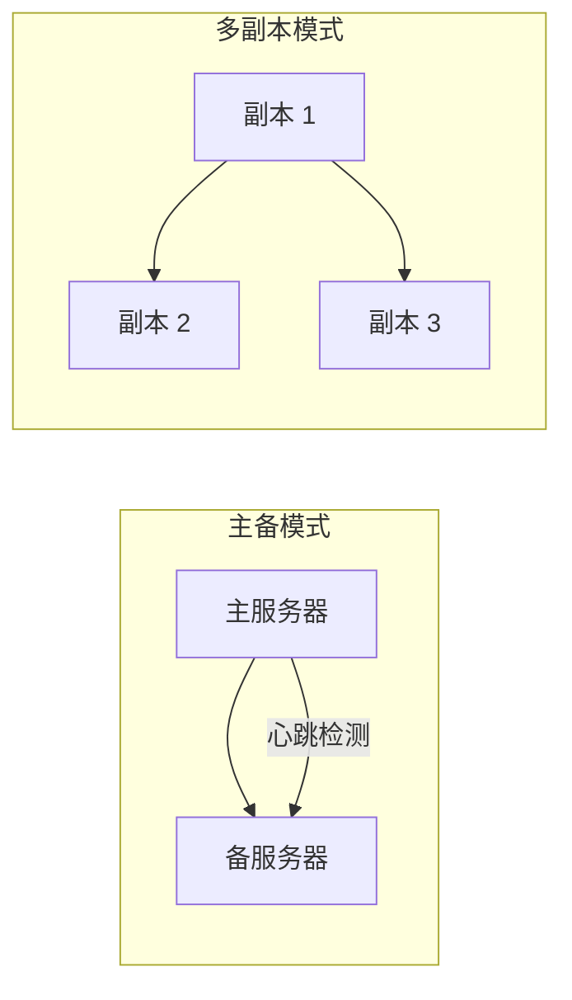
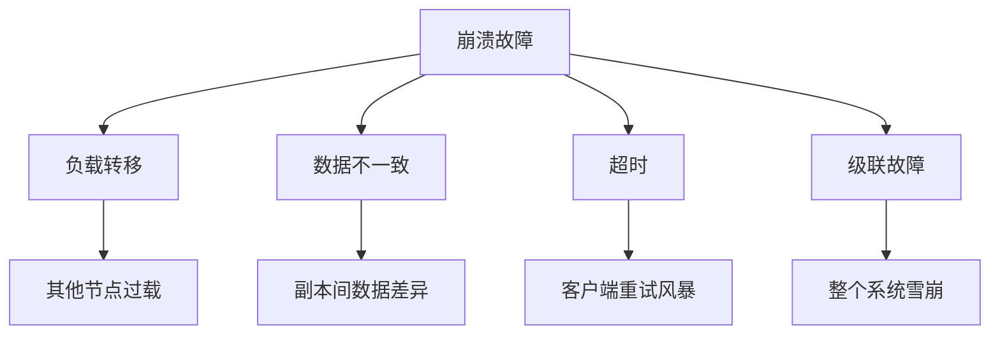

# 崩溃故障（Crash Failure）

崩溃故障是分布式系统中最简单、也最容易处理的故障类型。

当一个节点突然停止工作，既不响应请求，也不发送任何消息，我们称之为崩溃故障（Crash Failure）。在学术上，这也被称为「崩溃-停止」（Crash-Stop）模型——节点要么正常工作，要么完全停止，没有中间状态。

## 崩溃故障的特征

**崩溃故障的定义**：

1. 节点完全停止响应
2. 不会产生任何错误消息
3. 不会发送任何消息
4. 故障是突然的，没有预兆



## 崩溃故障的成因

| 成因 | 说明 | 典型场景 |
| --- | --- | --- |
| **硬件故障** | 服务器宕机、断电、硬盘损坏 | 数据中心故障 |
| **操作系统故障** | 内核崩溃、驱动问题 | 蓝屏、内核 Panic |
| **进程崩溃** | JVM 崩溃、OOM、段错误 | Java 进程被 Kill |
| **被误杀** | OOM Killer、Kubernetes Pod 被驱逐 | 资源不足时 |
| **网络完全中断** | 网线被拔、交换机故障 | 单机网络断开 |

## 崩溃故障的检测

### 心跳检测

最简单的检测方式：

```java title="HeartbeatChecker.java"
public class HeartbeatChecker {

    private final Map<String, Long> lastHeartbeat = new ConcurrentHashMap<>();
    private final long timeoutMs;
    private final ScheduledExecutorService scheduler;

    public HeartbeatChecker(long timeoutMs) {
        this.timeoutMs = timeoutMs;
        this.scheduler = Executors.newSingleThreadScheduledExecutor();
    }

    public void start() {
        // 每秒检查一次所有节点的心跳
        scheduler.scheduleAtFixedRate(() -> {
            long now = System.currentTimeMillis();
            for (Map.Entry<String, Long> entry : lastHeartbeat.entrySet()) {
                if (now - entry.getValue() > timeoutMs) {
                    // 心跳超时，节点可能崩溃
                    handleNodeFailure(entry.getKey());
                }
            }
        }, 0, 1, TimeUnit.SECONDS);
    }

    public void receiveHeartbeat(String nodeId) {
        lastHeartbeat.put(nodeId, System.currentTimeMillis());
    }

    private void handleNodeFailure(String nodeId) {
        log.warn("节点 {} 心跳超时，可能已崩溃", nodeId);
        // 触发故障转移
        failoverService.initiateFailover(nodeId);
    }
}
```

### 主动健康检查

```yaml title="Kubernetes 健康检查配置"
apiVersion: v1
kind: Pod
spec:
  containers:
  - name: myapp
    livenessProbe:
      httpGet:
        path: /health
        port: 8080
      initialDelaySeconds: 15
      periodSeconds: 10
      timeoutSeconds: 5
      failureThreshold: 3  # 连续 3 次失败则判定为崩溃
```

## 崩溃故障的应对策略

### 策略一：冗余备份



| 策略 | 说明 | 适用场景 |
| --- | --- | --- |
| **主备切换** | 一台主 + 一台备，主故障后切换 | 数据库、消息队列 |
| **多副本** | N 个副本，读取任意一个，写入所有 | 数据存储、状态服务 |
| **多活** | 多个节点同时服务，故障节点剔除 | 无状态服务 |

### 策略二：自动故障转移

```java title="AutoFailoverService.java"
@Service
public class AutoFailoverService {

    @Autowired
    private ServiceRegistry registry;

    @Autowired
    private LoadBalancer loadBalancer;

    public void initiateFailover(String failedNode) {
        log.info("开始故障转移，失效节点: {}", failedNode);

        // 1. 从注册中心剔除失效节点
        registry.deregister(failedNode);
        loadBalancer.removeNode(failedNode);

        // 2. 通知所有客户端刷新路由
        registry.notifyClientRefresh();

        // 3. 启动备用节点（如有）
        standbyManager.activateStandby(failedNode);

        // 4. 记录故障日志
        incidentLogger.log(failedNode, "CRASH");

        // 5. 触发告警
        alertingService.sendAlert("NODE_CRASH", failedNode);
    }
}
```

### 策略三：幂等设计

崩溃后重启，节点不知道之前处理了哪些请求。幂等设计保证重试不会产生副作用：

```java title="IdempotentService.java"
@Service
public class IdempotentService {

    private final RedisTemplate<String, String> redis;

    // 使用 Redis 存储已处理的请求 ID
    public Result processRequest(String requestId, String payload) {
        // SET NX：只有 key 不存在时才设置
        Boolean processed = redis.opsForValue()
            .setIfAbsent("processed:" + requestId, "1", Duration.ofHours(24));

        if (Boolean.FALSE.equals(processed)) {
            // 已经被处理过，直接返回
            log.info("请求 {} 已处理过，返回幂等结果", requestId);
            return Result.idempotentReturn();
        }

        // 正常处理请求
        return doProcess(payload);
    }
}
```

## 崩溃故障与其他故障类型的关系

崩溃故障往往会引发其他类型的故障：



**最危险的场景**：崩溃引发的超时 → 其他节点重试 → 负载增加 → 引发更多崩溃。

## 崩溃故障的 MTTR 优化

崩溃故障的 MTTR 通常包括：

```
MTTR = 检测时间 + 故障转移时间 + 服务启动时间 + 流量预热时间

典型数据：
- 检测时间：< 10 秒（自动化心跳）
- 故障转移：< 30 秒（自动化切换）
- 服务启动：30 秒 ~ 5 分钟（JVM 启动）
- 流量预热：5 ~ 10 分钟（ warmed up）
```

**优化方向**：

| 阶段 | 优化方法 |
| --- | --- |
| 检测 | 缩短心跳间隔，增加检测节点 |
| 转移 | 预建连接池，预热缓存 |
| 启动 | 懒加载、分批启动 |
| 预热 | 使用预热流量，不接受真实流量 |

## 本章总结

**核心要点**：

1. **崩溃故障是最简单的故障**：节点要么工作，要么完全停止
2. **心跳检测是最常用的检测方式**：定期 ping，无响应则判定崩溃
3. **冗余是应对崩溃的核心**：主备切换、多副本、多活
4. **幂等设计保证故障恢复后行为正确**：防止重复处理
5. **崩溃可能引发级联故障**：负载转移可能导致其他节点过载

崩溃故障虽然简单，但如果处理不当，会引发更严重的级联故障。接下来我们看另一种常见的故障类型：遗漏故障。
