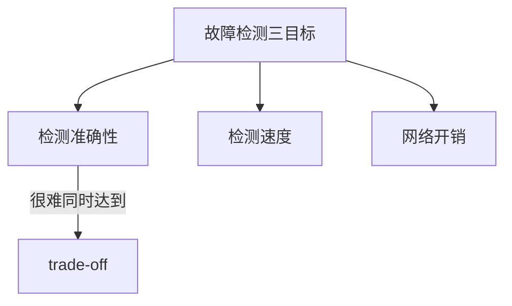
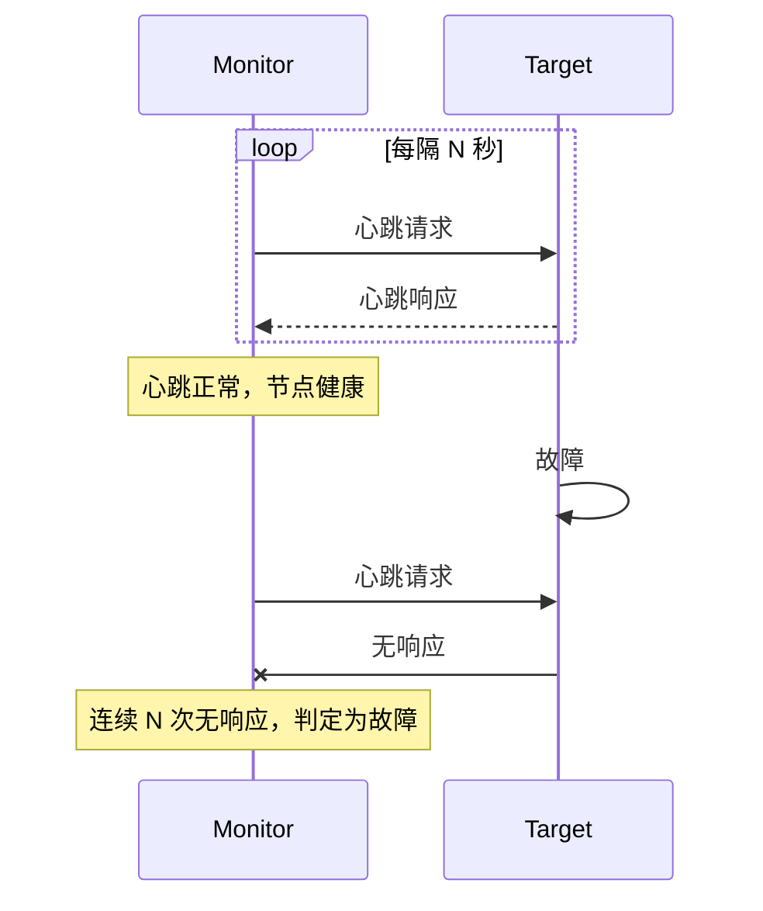

# 故障检测机制

不知道故障发生，就无法处理故障。故障检测是容错系统的第一道防线。

分布式系统的故障检测比单机系统复杂得多。在单机系统中，进程崩溃可以通过操作系统直接感知；在分布式系统中，我们需要跨网络判断一个远程节点是否还活着——而网络本身可能不可靠。

## 故障检测的挑战

### 不可能三角

分布式故障检测面临一个根本性的挑战：



| 目标 | 说明 | 挑战 |
| --- | --- | --- |
| **准确性** | 不漏报、不误报 | 网络延迟和丢包可能导致误判 |
| **速度** | 快速检测 | 太快会产生误报，太慢会延误处理 |
| **低开销** | 不影响正常服务 | 高频检测增加网络负载 |

### 故障检测的两个维度

| 维度 | 说明 | 权衡 |
| --- | --- | --- |
| **Safety（活性）** | 不漏报：故障发生时最终一定能检测到 | 可能增加误报 |
| **Liveness（活性）** | 不误报：正常节点不会被误判为故障 | 可能增加漏报 |

## 故障检测算法

### 算法一：心跳检测（Heartbeat）

最简单也最常用的方法：



```java title="HeartbeatDetector.java"
@Service
public class HeartbeatDetector {

    private final Map<String, Long> lastHeartbeat = new ConcurrentHashMap<>();
    private final int maxMissedBeats = 3;
    private final long heartbeatIntervalMs = 1000;
    private final long heartbeatTimeoutMs = heartbeatIntervalMs * maxMissedBeats;

    public void onHeartbeatReceived(String nodeId) {
        lastHeartbeat.put(nodeId, System.currentTimeMillis());
    }

    public Set<String> detectFailures() {
        Set<String> failedNodes = new HashSet<>();
        long now = System.currentTimeMillis();

        for (Map.Entry<String, Long> entry : lastHeartbeat.entrySet()) {
            if (now - entry.getValue() > heartbeatTimeoutMs) {
                failedNodes.add(entry.getKey());
                log.warn("节点 {} 心跳超时（{}ms 无响应）", entry.getKey(), now - entry.getValue());
            }
        }

        return failedNodes;
    }

    @Scheduled(fixedRate = 500)
    public void checkHeartbeats() {
        Set<String> failedNodes = detectFailures();
        for (String nodeId : failedNodes) {
            onNodeFailed(nodeId);
        }
    }
}
```

### 算法二：Gossip 协议

去中心化的故障检测，适合大规模集群：

```mermaid
flowchart LR
    A["节点 A"] --> B["节点 B"]
    B --> C["节点 C"]
    C --> D["节点 D"]
    D --> A

    Note over A,B,C,D: 每个周期随机选择节点交换信息
```

```java title="GossipFailureDetector.java"
@Service
public class GossipFailureDetector {

    private final Map<String, Long> lastKnownAlive = new ConcurrentHashMap<>();
    private final double suspicionProbability;

    public void gossip(NodeInfo node, boolean isAlive) {
        if (isAlive) {
            lastKnownAlive.put(node.getId(), System.currentTimeMillis());
        } else {
            // 逐渐增加可疑度
            long timeSinceLastKnown = System.currentTimeMillis() - lastKnownAlive.getOrDefault(node.getId(), 0L);
            // 时间越长，可疑度越高
            double suspicion = Math.min(1.0, timeSinceLastKnown / (60_000)); // 1 分钟内完全信任
            if (suspicion > suspicionProbability) {
                markAsSuspected(node.getId());
            }
        }
    }

    public boolean isAlive(String nodeId) {
        long timeSinceLastKnown = System.currentTimeMillis() - lastKnownAlive.getOrDefault(nodeId, 0L);
        return timeSinceLastKnown < 30_000; // 30 秒内没有 gossip 则认为不活跃
    }
}
```

### 算法三：SWIM 协议

Scalable Weakly-consistent Infection-style Membership Protocol，结合了心跳和 Gossip 的优点：

```java title="SWIMDetector.java"
@Service
public class SWIMDetector {

    private final int protocolPeriodMs = 100;
    private final int k = 3; // 每次 ping 探测 k 个节点

    public void protocolRound() {
        // 1. 从成员列表中随机选择 k 个节点
        List<String> targets = selector.selectRandom(k);

        for (String target : targets) {
            // 2. 尝试直接 ping
            if (ping(target)) {
                return; // 成功，继续
            }

            // 3. 直接 ping 失败，询问其他节点
            List<String> indirectNodes = selector.selectRandom(k);
            boolean anyResponded = false;

            for (String indirect : indirectNodes) {
                if (askPing(indirect, target)) {
                    anyResponded = true;
                    break;
                }
            }

            // 4. k 个间接探测都失败，标记为故障
            if (!anyResponded) {
                markAsSuspected(target);
            }
        }
    }
}
```

## 故障检测的配置

### 超时时间计算

超时设置需要平衡多个因素：

```python
# 超时时间计算
def calculate_timeout(
    network_latency_avg: float,  # 平均网络延迟
    network_latency_stddev: float, # 网络延迟标准差
    processing_time_avg: float,   # 平均处理时间
    target_false_positive_rate: float = 0.01  # 目标误报率 1%
):
    """
    基于正态分布计算合理的超时时间
    """
    # 99% 置信度：平均值 + 2.33 × 标准差
    network_overhead = network_latency_avg + 2.33 * network_latency_stddev

    # 总超时 = 网络开销 + 处理时间 + 安全缓冲
    timeout = network_overhead + processing_time_avg + (network_overhead * 0.2)

    return timeout

# 示例
timeout = calculate_timeout(
    network_latency_avg=10,      # 10ms 平均延迟
    network_latency_stddev=5,   # 5ms 标准差
    processing_time_avg=20       # 20ms 处理时间
)
print(f"建议超时: {timeout}ms")  # 约 47ms
```

### 心跳间隔选择

| 心跳间隔 | 检测速度 | 网络开销 | 适用场景 |
| --- | --- | --- | --- |
| 1 秒 | 快（几秒内检测） | 高 | 金融交易等低延迟场景 |
| 5 秒 | 中等（十几秒检测） | 中 | 普通互联网服务 |
| 30 秒 | 慢（几分钟检测） | 低 | 非关键服务 |

## 故障检测的监控

### 监控指标

```yaml title="failure-detection-metrics.yaml"
metrics:
  # 心跳检测指标
  heartbeat:
    - name: heartbeat_sent_total
      description: 发送的心跳总数"
    - name: heartbeat_received_total
      description: "接收的心跳总数"
    - name: heartbeat_timeout_total
      description: "心跳超时次数"

  # SWIM/Gossip 指标
  gossip:
    - name: node_suspicion_level
      description: "节点可疑度 (0-1)"
    - name: memberlist_size
      description: "成员列表大小"
    - name: node_state
      description: "节点状态 (alive/suspected/dead)"

  # 故障检测延迟
  detection:
    - name: failure_detection_time
      description: "故障发生到检测到的时间"
    - name: false_positive_rate
      description: "误报率"
```

## 故障检测与故障隔离的配合

检测到故障后，需要及时隔离，防止影响扩大：

```mermaid
flowchart TD
    A["故障检测"] --> B["标记为可疑"]
    B --> C{"确认故障？"}
    C -->|"是| D["从服务列表移除"]
    D --> E["触发故障转移"]
    C -->|"否| F["恢复为正常"]

    E --> G["告警通知"]
    G --> H["记录事件"]
```

## 本章总结

**核心要点**：

1. **故障检测面临不可能三角**：准确性、速度、低开销难以同时满足
2. **心跳检测是最简单的方法**：适用于小规模集群
3. **Gossip 适合大规模集群**：去中心化、可扩展
4. **SWIM 平衡了检测速度和准确性**：被 Consul、Cassandra 等采用
5. **超时时间需要根据实际情况计算**：考虑网络延迟和处理时间

故障检测是容错的第一步。接下来我们将看如何对这些故障进行分类，并制定相应的处理策略。
