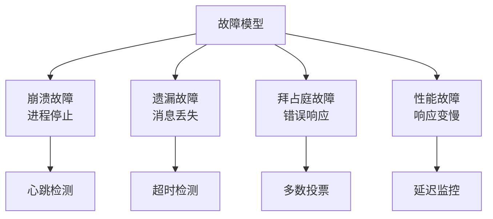

# 故障模型

知己知彼，才能百战不殆。

系统会发生哪些类型的故障？每种故障有什么特征？如何检测和处理？理解故障模型是高可用架构设计的基础——不知道敌人是谁，就无法制定防御策略。

## 模块结构

| 文章 | 核心问题 |
| --- | --- |
| [故障模型概述](/resilience/failure-models/overview) | 故障模型的完整分类 |
| [崩溃故障](/resilience/failure-models/crash) | 进程/节点突然停止 |
| [遗漏故障](/resilience/failure-models/omission) | 消息丢失或忽略 |
| [拜占庭故障](/resilience/failure-models/byzantine) | 节点产生错误响应 |
| [网络分区](/resilience/failure-models/network-partition) | 网络断开导致分区 |
| [超时故障](/resilience/failure-models/timeout) | 请求超时 |
| [性能故障](/resilience/failure-models/performance) | 系统性能下降 |
| [故障检测](/resilience/failure-models/detection) | 如何检测各类故障 |
| [分类矩阵](/resilience/failure-models/classification) | 故障分类与处理策略 |

## 故障分类总览

## 故障 vs 错误 vs 失败

| 术语 | 定义 | 关系 |
| --- | --- | --- |
| **故障（Fault）** | 导致错误的系统状态 | 原因 |
| **错误（Error）** | 系统状态的偏差 | 故障的表现 |
| **失败（Failure）** | 对外部观察者可见的错误 | 结果 |

故障是原因，错误是表现，失败是结果。一个故障可能导致多个错误，一个错误可能最终导致失败。

## 与容错模式的关系

不同的故障类型需要不同的容错机制：

| 故障类型 | 容错机制 |
| --- | --- |
| 崩溃故障 | 冗余、故障转移 |
| 遗漏故障 | 重试、幂等 |
| 拜占庭故障 | 多数投票、审计 |
| 网络分区 | CP/AP 取舍 |
| 超时故障 | 超时配置、降级 |
| 性能故障 | 限流、扩容 |

准备好开始了吗？从[故障模型概述](/resilience/failure-models/overview)开始。
