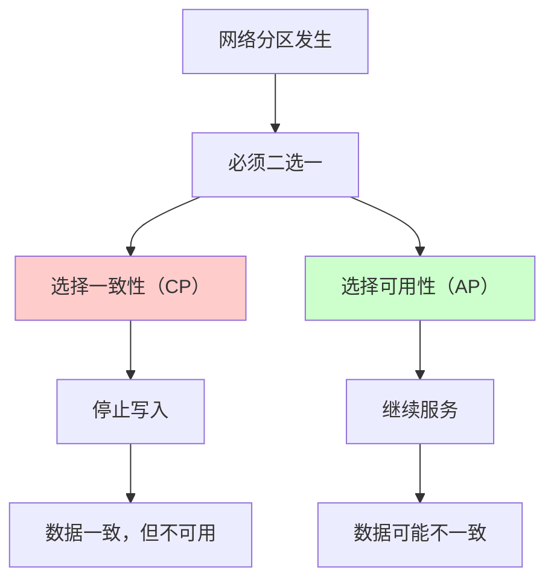
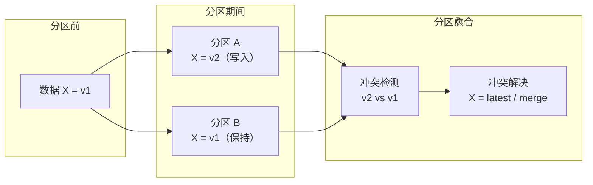
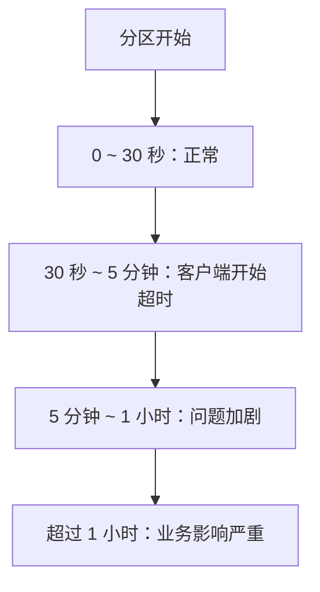
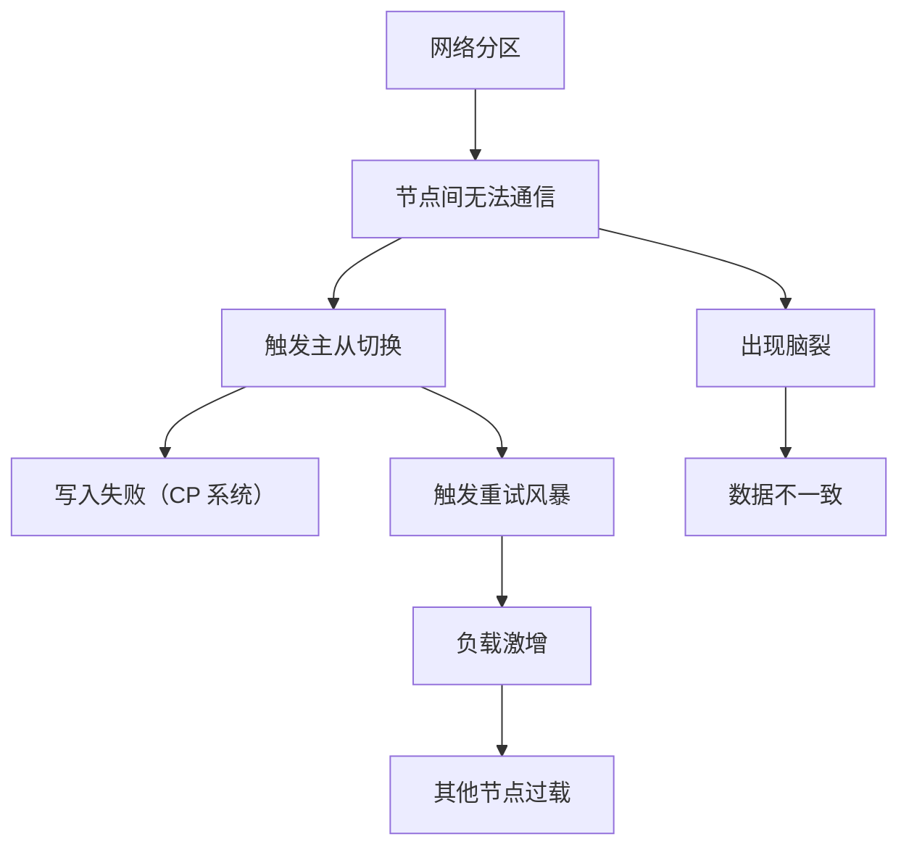

# 网络分区故障（Network Partition）

网络分区是分布式系统的「阿喀琉斯之踵」。

CAP 定理告诉我们：当网络分区发生时，系统必须在一致性和可用性之间做出选择。但很多团队直到真正遇到网络分区时才意识到这个选择的代价——要么损失一致性，要么损失可用性，而提前没有设计好系统，代价往往是两者都受损。

## 网络分区的定义

**网络分区**：网络中的部分节点之间可以通信，但与其他节点无法通信。

```mermaid
flowchart LR
    subgraph 正常网络
        A["节点 A"] <--> B["节点 B"]
        B <--> C["节点 C"]
        A <--> C
    end

    subgraph 网络分区
        D["节点 D"] <--> E["节点 E"]
        F["节点 F"] <--> G["节点 G"]
        D -x E
        F -x G
    end
```

### 分区的类型

| 类型 | 说明 | 示例 |
| --- | --- | --- |
| **单向分区** | A 能看到 B，但 B 看不到 A | 防火墙规则错误 |
| **双向分区** | A 和 B 互相看不到对方 | 网线断开、交换机故障 |
| **部分分区** | 部分节点可通信，部分不可 | 数据中心内部网络故障 |
| **全局分区** | 整个数据中心与外部断开 | 数据中心断电/断网 |

## 网络分区的成因

| 成因 | 说明 | 持续时间 |
| --- | --- | --- |
| **网络设备故障** | 交换机、路由器故障 | 分钟 ~ 小时 |
| **数据中心故障** | 整个机房断电/断网 | 小时 ~ 天 |
| **网络拥塞** | 突发流量导致丢包严重 | 秒 ~ 分钟 |
| **配置错误** | 错误的路由规则 | 分钟 ~ 小时 |
| **云厂商故障** | AWS/GCP/Azure 区域故障 | 分钟 ~ 小时 |
| **自然灾害** | 海底光缆断裂 | 小时 ~ 天 |

## 网络分区与 CAP 定理

这是理解网络分区的核心：



### CP vs AP 的权衡

| 场景 | CP 系统 | AP 系统 |
| --- | --- | --- |
| **分区期间** | 停止写入，等待恢复 | 继续写入，分区愈合后同步 |
| **分区愈合后** | 数据一致，无冲突 | 可能需要冲突解决 |
| **网络抖动** | 频繁触发 CP 选择 | 基本无感知 |
| **典型系统** | ZooKeeper、etcd | Cassandra、DynamoDB |

### 真实案例：AWS S3 2019 故障

2019 年 7 月，AWS us-east-1 区域发生故障。由于 S3 使用的是 CP 架构（在分区时牺牲可用性），这次故障导致：

- S3 服务不可用
- 依赖 S3 的服务（如 EC2 的引导脚本）也受影响
- 整个 AWS 生态系统中大量服务连锁故障

**教训**：即使是 AWS 自己，也无法完全避免分区的影响。架构设计必须考虑「依赖的依赖」。

## 网络分区的检测

### 心跳 + 法定人数检测

```java title="PartitionDetector.java"
@Service
public class PartitionDetector {

    private final int replicationFactor;
    private final Map<String, Long> lastHeartbeat = new ConcurrentHashMap<>();

    public boolean isInPartition(String nodeId, Set<String> reachableNodes) {
        // 如果无法联系到大多数节点，可能处于分区状态
        int quorum = replicationFactor / 2 + 1;
        return reachableNodes.size() < quorum;
    }

    public PartitionEvent detectPartition() {
        Set<String> allNodes = getAllNodes();
        Map<Set<String>, List<String>> partitions = new HashMap<>();

        // 通过 Gossip 协议发现分区
        for (String node : allNodes) {
            Set<String> reachable = queryReachableNodes(node);
            partitions.computeIfAbsent(reachable, k -> new ArrayList<>()).add(node);
        }

        if (partitions.size() > 1) {
            return new PartitionEvent(partitions);
        }
        return PartitionEvent.NO_PARTITION;
    }
}
```

### 法定人数（Quorum）机制

```
读取法定人数 = N / 2 + 1
写入法定人数 = N / 2 + 1

N = 3 时：
- 读取需要 2 票
- 写入需要 2 票
- 分区时，只有一侧能同时满足读写法定人数
```

## 网络分区的应对策略

### 策略一：客户端本地缓存

当服务端不可用时，返回本地缓存的数据：

```java title="PartitionTolerantClient.java"
@Service
public class PartitionTolerantClient {

    private final LocalCache cache;
    private final RemoteService remoteService;

    public Data get(String key) {
        try {
            Data data = remoteService.get(key);
            cache.put(key, data); // 更新本地缓存
            return data;
        } catch (NetworkException e) {
            // 网络故障，返回本地缓存
            log.warn("网络故障，返回本地缓存数据: {}", key);
            return cache.get(key);
        }
    }

    public void put(String key, Data value) {
        try {
            remoteService.put(key, value);
            cache.put(key, value);
        } catch (NetworkException e) {
            // 写入失败，将操作记录到队列，稍后重试
            pendingOperations.add(new PendingOp(key, value));
            log.warn("网络故障，操作已加入待重试队列");
        }
    }
}
```

### 策略二：最终一致性

接受分区期间的不一致，分区愈合后通过冲突解决达到一致：



### 策略三：隔离 + 降级

在分区发生时，主动降级部分功能，减少数据不一致的风险：

```yaml title="降级策略配置"
partition_handling:
  strategy: "degrade"

  actions:
    - name: "暂停写入"
      condition: "无法联系到法定人数"
      action: "返回 503，系统暂时只读"

    - name: "停止跨分区请求"
      condition: "检测到分区"
      action: "分区内的请求正常处理，跨分区的请求拒绝"

    - name: "通知运维"
      condition: "分区持续超过 1 分钟"
      action: "发送告警，触发应急响应"
```

## 网络分区的常见误区

### 误区一：认为分区「很少发生」

实际上，网络分区比大多数人想象的要频繁：

| 原因 | 频率 |
| --- | --- |
| 云厂商区域故障 | 每季度 1~2 次 |
| 数据中心内部网络抖动 | 每月数次 |
| 云厂商可用区之间网络问题 | 每月数次 |

> **关键数据**：AWS 公开报告显示，典型云区域每年有 2~4 次影响服务的网络事件。

### 误区二：分区期间不做任何处理

很多系统假设分区「很快就会恢复」，但实际上分区可能持续数分钟甚至数小时：



### 误区三：忽视分区的影响范围

分区不仅影响数据层，还会影响：

- 服务发现（Eureka/Consul 可能也分区了）
- 负载均衡（LB 不知道哪些节点可用）
- 配置中心（配置无法同步）
- 消息队列（消息积压）

## 网络分区与其他故障的关系

网络分区往往引发其他故障：



**脑裂（Split-Brain）** 是网络分区最危险的并发症：分区两侧都认为对方已经挂了，各自提供服务，导致数据分裂。

## 本章总结

**核心要点**：

1. **网络分区是分布式系统的本质约束**：CAP 定理告诉我们，分区时必须在 C 和 A 之间选择
2. **分区可能持续数分钟到数小时**：不要假设分区会很快恢复
3. **CP 系统选择一致性**：分区期间停止写入
4. **AP 系统选择可用性**：分区期间继续服务，但可能不一致
5. **脑裂是分区的最大风险**：需要仔细设计冲突解决机制

网络分区是 CAP 定理的现实体现。接下来我们看另一种常见的故障：超时故障。
