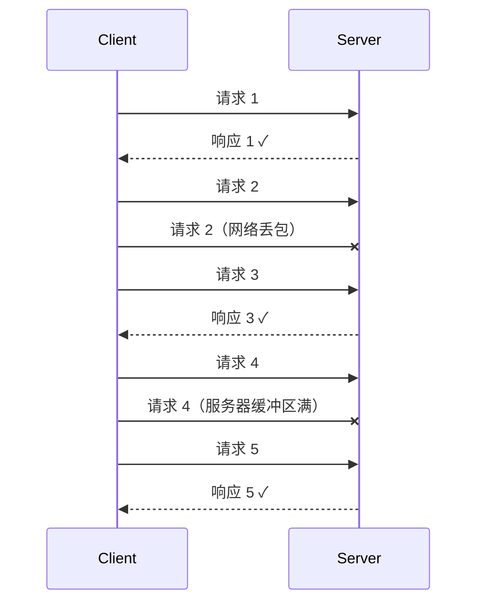
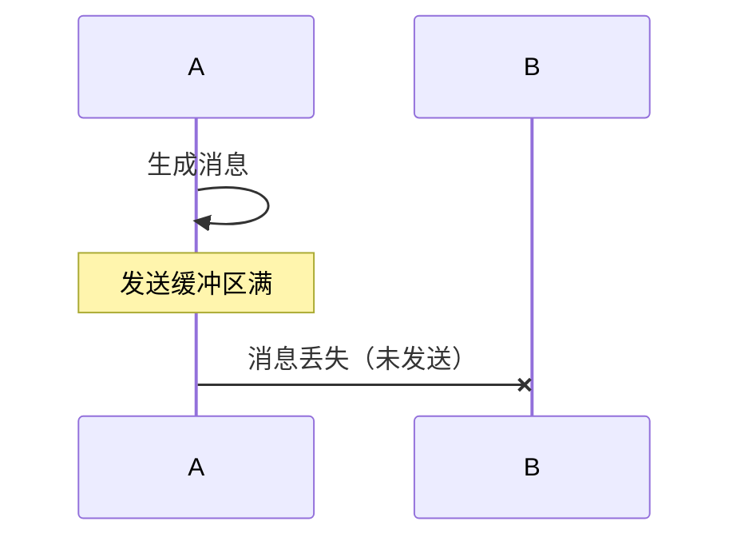
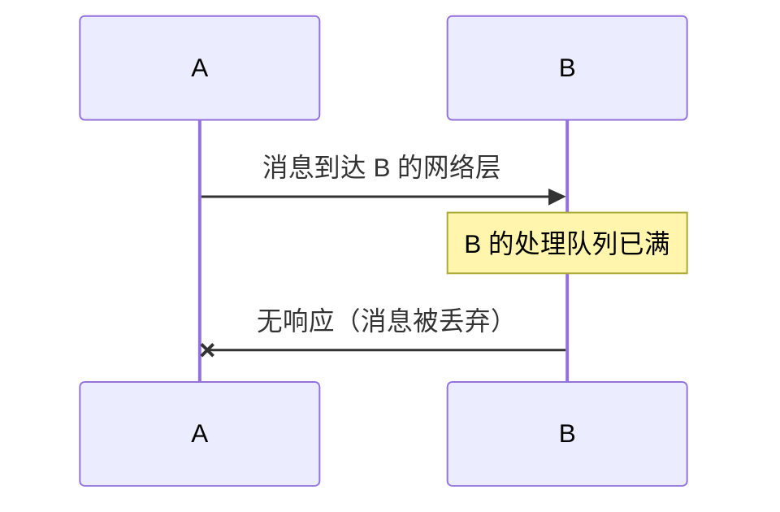
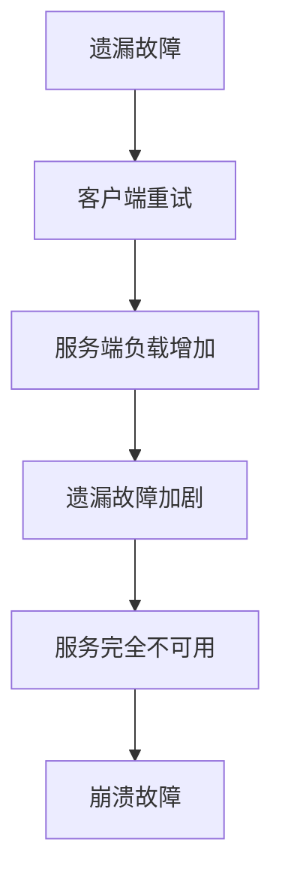

# 遗漏故障（Omission Failure）

遗漏故障比崩溃故障更隐蔽，也更难处理。

崩溃故障是「节点完全停止响应」，容易检测。遗漏故障是「节点在某些情况下不响应」——间歇性的、难以复现的。一个节点可能刚刚还在正常服务，突然就丢了一批请求，然后又恢复正常。

**这才是生产环境最常见的故障模式之一。**

## 遗漏故障的特征

**遗漏故障的定义**：

1. 节点能接收请求，但部分请求无法得到响应
2. 故障是间歇性的，不是一直存在
3. 可能是发送方、接收方或两者的网络问题
4. 难以复现，难以诊断



## 遗漏故障的成因

| 成因 | 说明 | 典型场景 |
| --- | --- | --- |
| **网络丢包** | 网络不稳定导致数据包丢失 | 弱网络环境、高延迟网络 |
| **队列满** | 请求队列已满，新请求被丢弃 | 突发流量、限流 |
| **连接池耗尽** | 所有连接都在使用中 | 连接泄漏、高并发 |
| **缓冲区溢出** | 接收缓冲区已满 | 高带宽突发 |
| **GC 停顿** | GC 时暂停处理请求 | Full GC、内存压力 |
| **资源限流** | 触发限流，请求被拒绝 | 超过服务容量 |

## 遗漏故障的子类型

### 发送遗漏（Send Omission）

节点发送了消息，但消息未进入网络：



### 接收遗漏（Receive Omission）

消息到达了节点，但节点未能处理或响应：



## 遗漏故障的检测

### 超时检测

这是检测遗漏故障最基本的方式：

```java title="TimeoutDetection.java"
public class RequestResult sendWithTimeout(String request) {
    long startTime = System.currentTimeMillis();
    CompletableFuture<Response> future = sendAsync(request);

    try {
        Response response = future.get(timeoutMs, TimeUnit.MILLISECONDS);
        return new RequestResult(true, response, System.currentTimeMillis() - startTime);
    } catch (TimeoutException e) {
        // 超时，可能是遗漏故障
        log.warn("请求超时，可能发生遗漏故障");
        return new RequestResult(false, null, timeoutMs);
    } catch (Exception e) {
        return new RequestResult(false, null, 0);
    }
}
```

### 重试 + 幂等

遗漏故障最麻烦的是不知道请求是否被服务器处理了：

```java title="RetryWithIdempotency.java"
@Service
public class RetryService {

    private final int maxRetries = 3;
    private final long retryDelayMs = 100;

    public Result sendWithRetry(String requestId, String payload) {
        for (int attempt = 0; attempt < maxRetries; attempt++) {
            try {
                Result result = send(requestId, payload);
                if (result.isSuccess()) {
                    return result;
                }
            } catch (Exception e) {
                log.warn("请求 {} 第 {} 次尝试失败: {}", requestId, attempt + 1, e.getMessage());
            }

            if (attempt < maxRetries - 1) {
                // 指数退避
                long delay = retryDelayMs * (long) Math.pow(2, attempt);
                Thread.sleep(delay);
            }
        }

        throw new SendException("最大重试次数已达，仍未成功");
    }
}
```

## 遗漏故障与超时设置

超时设置是应对遗漏故障的关键。设置太短会产生很多误判，设置太长会拖慢故障检测速度。

```mermaid
flowchart TD
    subgraph 超时设置分析
        A["超时时间"] --> B{"合理？"}
        B -->|"太短| C["误判：正常请求被判定为失败"]
        B -->|"太长| D["慢故障：真正故障检测太慢"]
        B -->|"合理| E["最佳平衡"]
    end
```

### 超时计算公式

```
合理超时 = 平均响应时间 + N × 标准差

建议：
- TP95 响应时间 + 2 倍标准差作为短超时（快速失败）
- TP99 响应时间 + 3 倍标准差作为长超时（最终超时）
```

```java title="TimeoutCalculator.java"
public class TimeoutCalculator {

    public long calculateOptimalTimeout(List<Long> responseTimes) {
        // 计算平均值
        double mean = responseTimes.stream()
            .mapToLong(Long::longValue)
            .average()
            .orElse(1000);

        // 计算标准差
        double variance = responseTimes.stream()
            .mapToDouble(t -> Math.pow(t - mean, 2))
            .average()
            .orElse(0);
        double stddev = Math.sqrt(variance);

        // 建议超时 = 平均值 + 3 倍标准差
        // 这个值能覆盖 99.7% 的正常响应
        return (long) (mean + 3 * stddev);
    }
}
```

## 遗漏故障的特殊挑战

### 挑战一：不知道请求是否被处理

这是遗漏故障最大的挑战：

```mermaid
flowchart LR
    A["客户端"] --> B["服务器"]

    A->>B: 发送请求
    Note over A: 网络中断？还是处理后响应丢失？

    B->>A: 响应
    Note over A: 收到响应，正常

    A-xB: 发送请求
    Note over A: 超时
    Note over B: B 到底收到请求了吗？
```

**解决方案**：幂等 + 重试次数限制 + 消息队列

### 挑战二：间歇性难以定位

遗漏故障可能是网络问题，可能是服务端问题，可能是客户端问题，定位困难。

**解决方案**：全链路追踪 + 细粒度监控

### 挑战三：触发重试风暴

大量客户端同时超时，同时重试，可能压垮服务端。

**解决方案**：

```java title="JitteredRetry.java"
// 在重试之间添加随机抖动，避免重试风暴
public class JitteredRetry {

    public void retryWithJitter(Runnable action, int maxRetries) {
        for (int i = 0; i < maxRetries; i++) {
            try {
                action.run();
                return;
            } catch (Exception e) {
                if (i == maxRetries - 1) throw e;

                // 添加随机抖动：0 ~ base * 2^i
                long jitter = (long) (Math.random() * baseDelayMs * Math.pow(2, i));
                try {
                    Thread.sleep(jitter);
                } catch (InterruptedException ie) {
                    Thread.currentThread().interrupt();
                    throw new RuntimeException(ie);
                }
            }
        }
    }
}
```

## 遗漏故障与崩溃故障的关系

遗漏故障往往是崩溃故障的前兆：



很多「服务器突然崩溃」的事故，根源是之前被忽视的遗漏故障逐渐积累，最终压垮了系统。

## 本章总结

**核心要点**：

1. **遗漏故障是间歇性的**：部分请求丢失，难以检测和复现
2. **超时是检测遗漏故障的主要方式**：但超时设置要合理
3. **不知道请求是否被处理是最头疼的问题**：幂等设计是核心解决方案
4. **遗漏故障可能引发重试风暴**：添加随机抖动避免
5. **遗漏故障往往是崩溃故障的前兆**：间歇性问题不处理会积累成大故障

理解了遗漏故障，接下来我们看最复杂的故障类型：拜占庭故障。
