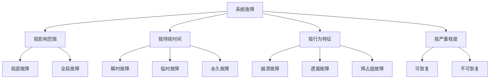
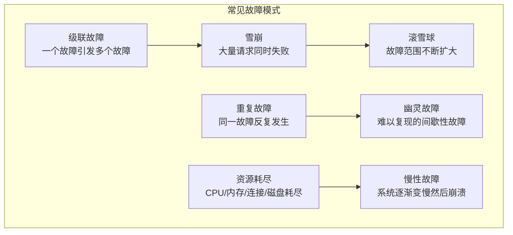

# 故障模型概述

故障不是随机的，每种故障都有其特定的成因、传播方式和影响范围。理解故障模型，是设计容错机制的前提。

在分布式系统中，故障是常态而非异常。你无法避免故障发生，但你可以做到：

1. **识别故障类型**：知道「这是哪种故障」
2. **理解故障传播**：知道「这个故障会如何影响其他组件」
3. **设计防护手段**：知道「面对这种故障应该怎么办」

## 故障分类体系

故障可以从多个维度分类：



### 按影响范围

| 类型 | 说明 | 示例 |
| --- | --- | --- |
| **局部故障** | 单个节点或服务故障 | 某个实例宕机 |
| **全局故障** | 影响整个系统 | 数据中心断电 |

### 按持续时间

| 类型 | 说明 | 应对策略 |
| --- | --- | --- |
| **瞬时故障** | 持续几秒到几分钟 | 重试 |
| **临时故障** | 持续几分钟到几小时 | 降级 + 等待 |
| **永久故障** | 持续到人工干预 | 故障转移 + 修复 |

### 按行为特征（经典分类）

这是分布式系统领域最常用的分类方式：

| 类型 | 说明 | 典型场景 |
| --- | --- | --- |
| **崩溃故障（Crash）** | 节点完全停止响应 | 服务器宕机、进程崩溃 |
| **遗漏故障（Omission）** | 节点无法发送或接收消息 | 网络丢包、队列满 |
| **拜占庭故障（Byzantine）** | 节点产生任意错误响应 | 软件 Bug、恶意攻击 |

## 故障与可用性的关系

每种故障类型对可用性的影响不同：

```mermaid
flowchart LR
    subgraph 故障类型与可用性
        A["崩溃故障"] --> |"最易处理| B["冗余切换"]
        A --> |"MTTR 短| C["可用性易恢复"]

        D["遗漏故障"] --> |"间歇性| E["难以定位"]
        D --> |"可能长期存在| F["MTTR 中等"]

        G["拜占庭故障"] --> |"最难处理| H["难以检测"]
        G --> |"可能造成数据错误| I["MTTR 最长"]
    end

    style A fill:#ccffcc
    style D fill:#fff2cc
    style G fill:#ffcccc
```

## 故障模型的核心概念

### 故障假设（Failure Assumptions）

每个分布式协议都有一个故障假设：**协议在什么故障假设下是正确的？**

| 协议 | 故障假设 | 说明 |
| --- | --- | --- |
| Raft | 崩溃-停止 | 节点只可能崩溃后停止，不会产生错误响应 |
| PBFT | 拜占庭 | 节点可能产生任意错误响应，但不超过 1/3 |
| 2PC | 崩溃-停止 | 协调者可能崩溃，参与者可能卡住 |

### 故障检测

知道系统发生了故障，是处理故障的前提。故障检测有两种方式：

| 方式 | 说明 | 特点 |
| --- | --- | --- |
| **心跳检测** | 定期发送心跳包，检测对方是否存活 | 简单但可能有误判 |
| **主动探测** | 发送请求并等待响应 | 准确但增加负载 |

### 故障隔离

故障不应该在系统内传播。好的架构应该做到：


## 故障与 CAP 定理

不同的故障类型会影响 CAP 定理中的一致性和可用性：

| 故障类型 | 对 CAP 的影响 |
| --- | --- |
| **网络分区** | 触发 CAP 选择：选择 CP 还是 AP |
| **节点崩溃** | 副本机制保证可用性，但可能暂时不一致 |
| **拜占庭故障** | 最严重：可能导致数据损坏，无法保证任何性质 |

## 常见故障模式



### 级联故障（Cascading Failure）

最常见也最危险的故障模式。一个组件故障导致另一个组件过载，过载导致更多故障，以此类推。

**案例**：2019 年某电商平台，商品推荐服务超时 → 调用方线程池堆积 → 线程池耗尽 → 影响其他服务 → 全站宕机。

### 资源耗尽（Resource Exhaustion）

资源耗尽往往是慢性故障的开始：

| 资源 | 消耗原因 | 后果 |
| --- | --- | --- |
| 内存 | 内存泄漏、缓存膨胀 | OOM、GC 频繁 |
| CPU | 死循环、GC、计算密集 | 响应变慢 |
| 连接数 | 连接泄漏、长连接过多 | 无法建立新连接 |
| 磁盘 | 日志膨胀、临时文件 | 写入失败 |

## 本章总结

**核心要点**：

1. **故障分类是多维度的**：按影响范围、持续时间、行为特征、严重程度
2. **崩溃/遗漏/拜占庭是经典分类**：每种类型有不同的应对策略
3. **故障检测是第一步**：不知道故障发生，就无法处理
4. **故障隔离是关键**：防止故障传播是架构设计的核心
5. **级联故障最危险**：一个故障可能引发整个系统崩溃

理解了故障模型的基本框架，接下来我们将深入讲解每种具体的故障类型。先从崩溃故障开始。
