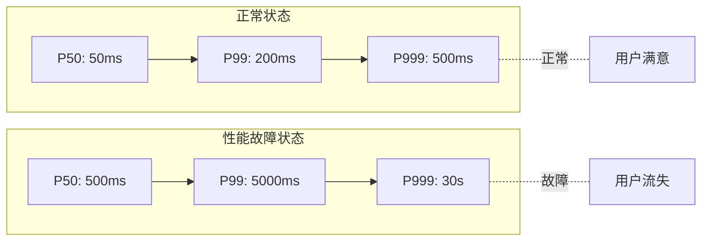
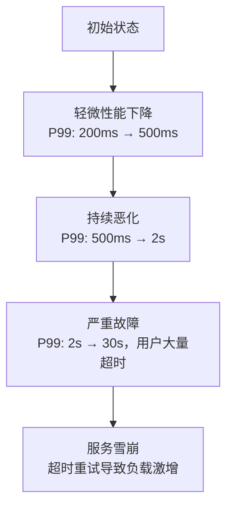
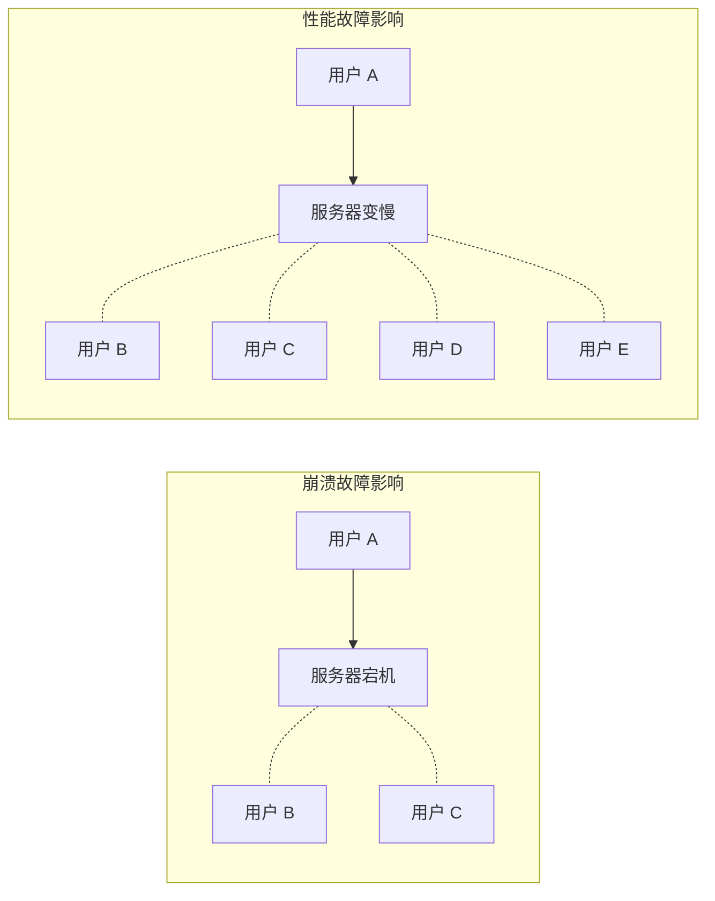
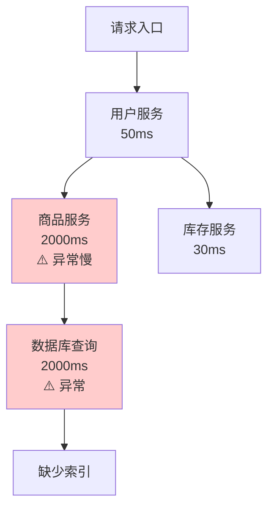

# 性能故障（Performance Failure）

系统没有宕机，错误率也很低，但它就是慢——慢到用户无法接受。

性能故障是一种特殊的故障：服务仍然在响应，但响应速度已经远远低于预期。用户感知到的不是「服务挂了」，而是「服务卡了」。

性能故障往往比崩溃故障更难诊断——崩溃故障有明确的错误日志，性能故障可能只是「慢了」，而「为什么慢」需要深入分析。

## 性能故障的定义

**性能故障**：系统响应时间显著高于正常水平，影响用户体验或业务功能。



## 性能故障的成因

### 资源类

| 资源 | 问题表现 | 典型原因 |
| --- | --- | --- |
| **CPU** | CPU 使用率 100%，请求排队 | 死循环、GC 频繁、计算密集 |
| **内存** | GC 频繁、响应波动大 | 内存泄漏、大对象分配 |
| **磁盘 I/O** | 读写延迟增加 | 磁盘满、I/O 争用 |
| **网络** | 吞吐量下降、延迟增加 | 网卡瓶颈、网络拥塞 |
| **数据库** | 大量慢查询 | 缺少索引、锁等待 |

### 应用类

| 问题 | 说明 | 典型原因 |
| --- | --- | --- |
| **连接池耗尽** | 新请求无法获取连接 | 连接泄漏、配置过小 |
| **线程池满** | 请求堆积 | 并发太高、阻塞操作 |
| **缓存失效** | 缓存击穿 | 热点 key 过期 |
| **锁竞争** | 线程阻塞 | 热点资源锁、粗粒度锁 |

### 外部依赖类

| 依赖 | 问题表现 |
| --- | --- |
| **下游服务慢** | 调用链上游全部受影响 |
| **数据库慢** | 所有依赖数据库的接口都慢 |
| **第三方 API 慢** | 集成点成为瓶颈 |

## 性能故障的特征

### 特征一：渐进式恶化

性能故障通常是逐渐恶化的，而不是突然发生：



### 特征二：与负载正相关

性能故障往往在高负载时更容易触发：

| 负载水平 | 正常响应 | 性能故障表现 |
| --- | --- | --- |
| 正常负载 | P99: 100ms | 正常 |
| 峰值负载 | P99: 150ms | 开始变慢 |
| 超预期负载 | P99: 500ms | 明显变慢 |
| 极限负载 | P99: 10s | 严重超时 |

### 特征三：影响范围大

性能故障往往影响大量用户，不像崩溃故障那样只影响部分用户：



## 性能故障的检测

### 延迟异常检测

```java title="LatencyAnomalyDetector.java"
@Service
public class LatencyAnomalyDetector {

    private final MovingAverage baseline;
    private final double threshold = 2.0; // 超过 baseline 2 倍视为异常

    public boolean isAnomaly(String operation, long latencyMs) {
        double baselineLatency = baseline.get(operation);

        if (baselineLatency <= 0) {
            return false; // 没有 baseline，暂不判定
        }

        double ratio = latencyMs / baselineLatency;
        if (ratio > threshold) {
            log.warn("性能异常: operation={}, latency={}ms, baseline={}ms, ratio={}",
                operation, latencyMs, baselineLatency, ratio);
            return true;
        }

        return false;
    }

    public void updateBaseline(String operation, long latencyMs) {
        baseline.add(operation, latencyMs);
    }
}
```

### Prometheus 告警规则

```yaml title="performance-alerts.yaml"
groups:
- name: performance-monitoring
  rules:
  # P99 延迟异常
  - alert: HighP99Latency
    expr: |
      histogram_quantile(0.99,
        sum(rate(http_request_duration_seconds_bucket[5m])) by (le)
      ) > 1  # P99 > 1 秒
    for: 5m
    labels:
      severity: warning
    annotations:
      summary: "P99 延迟超过 1 秒"

  # 延迟上升趋势
  - alert: LatencyIncreasing
    expr: |
      (
        histogram_quantile(0.99,
          sum(rate(http_request_duration_seconds_bucket[5m])) by (le)
        )
      )
      /
      (
        histogram_quantile(0.99,
          sum(rate(http_request_duration_seconds_bucket[1h])) by (le)
        )
      ) > 2  # 5 分钟 P99 比 1 小时 P99 高 2 倍
    for: 10m
    labels:
      severity: warning
    annotations:
      summary: "延迟呈上升趋势"
```

## 性能故障的处理

### 快速止血：限流 + 降级

```java title="PerformanceDegradation.java"
@Service
public class PerformanceDegradation {

    private final CircuitBreaker circuitBreaker;
    private final RateLimiter rateLimiter;

    public Response handleRequest(Request request) {
        // 1. 限流：超过容量的请求直接拒绝
        if (!rateLimiter.tryAcquire()) {
            return Response.degraded("系统繁忙，请稍后重试");
        }

        // 2. 超时快速失败：超过 5 秒直接超时
        try {
            return service.process(request, 5000);
        } catch (TimeoutException e) {
            // 3. 降级：返回降级数据
            return getDegradedResponse(request);
        }
    }

    private Response getDegradedResponse(Request request) {
        // 返回缓存数据或默认响应
        return Response.fromCache(request.getId());
    }
}
```

### 根因定位：APM 链路分析



## 性能故障的预防

### 容量规划

```yaml title="capacity-planning.yaml"
service_capacity:
  current_qps: 1000
  max_qps: 1500
  headroom: 500  # 预留 50% 余量

  scaling_triggers:
    cpu_usage: 70      # CPU 超过 70% 开始扩容
    latency_p99: 500   # P99 超过 500ms 开始扩容
    queue_depth: 100   # 队列超过 100 开始扩容

  autoscaling:
    enabled: true
    min_replicas: 3
    max_replicas: 20
    target_cpu: 60
    stabilization_window: 300  # 扩容后 5 分钟内不缩容
```

### 压力测试

定期进行压力测试，找出系统的性能瓶颈：

```bash
# 使用 wrk 进行 HTTP 压力测试
wrk -t4 -c100 -d30s --latency http://service/api/endpoint

# 结果示例：
# Latency Distribution
#      50%    95%    99%    99.9%   99.99%
#    45.23ms  123ms  245ms  1.2s    5.6s
```

## 性能故障 vs 崩溃故障

| 维度 | 性能故障 | 崩溃故障 |
| --- | --- | --- |
| **服务状态** | 仍在响应，但慢 | 完全无响应 |
| **错误率** | 可能正常 | 可能正常（超时不算错误） |
| **影响范围** | 影响所有请求 | 影响部分请求 |
| **诊断难度** | 高（原因多样） | 低（直接看是否可达） |
| **处理策略** | 限流 + 降级 + 扩容 | 故障转移 + 告警 |

## 本章总结

**核心要点**：

1. **性能故障是响应慢到影响业务**：系统没挂，但用户体验严重下降
2. **性能故障通常是渐进式的**：P50/P99 延迟逐渐上升是预警信号
3. **性能故障影响范围大**：所有用户都会感受到变慢
4. **限流 + 降级是快速止血手段**：同时需要排查根因
5. **容量规划和压力测试是预防关键**：知道系统上限才能从容应对

理解了各种故障类型，接下来我们看如何检测这些故障。
