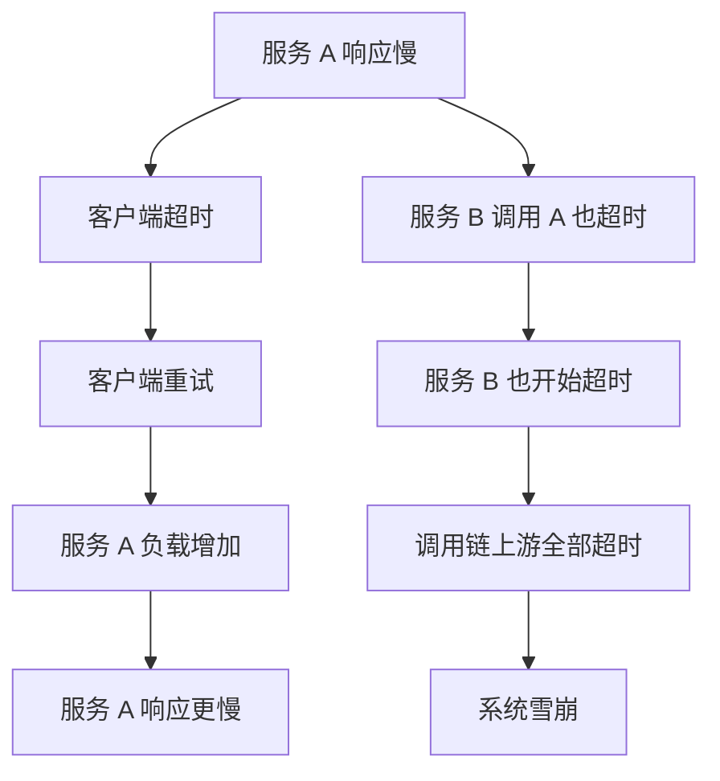

# 超时故障（Timeout Failure）

超时是分布式系统中最常见、也是最容易被误解的故障。

很多团队把超时当成「请求慢了点」，不加重视。但超时的背后可能藏着严重的性能问题、容量瓶颈，甚至是即将发生的级联故障。**超时的本质是：系统在规定时间内无法完成响应，这往往意味着某种形式的资源耗尽或系统过载。**

## 超时故障的定义

**超时故障**：请求在规定时间内未能得到响应，被迫中止。

```mermaid
sequenceDiagram
    participant C as 客户端
    participant S as 服务器

    C->>S: 请求
    Note over S: 处理中...

    C->>S: 超时！
    Note over S: 仍未完成

    S-->>C: 响应（延迟到达）
    Note over C: 已被超时丢弃

    alt 客户端已处理
        C: 认为请求失败
    else 客户端未处理
        C: 收到重复请求（服务端重试）
    end
```

## 超时故障的成因

| 成因 | 说明 | 典型场景 |
| --- | --- | --- |
| **处理时间过长** | 服务器处理请求的时间超过预期 | 数据库慢查询、复杂计算 |
| **队列等待** | 请求在队列中等待时间过长 | 突发流量、线程池满 |
| **网络延迟** | 网络传输时间超出预期 | 长距离网络、高负载网络 |
| **GC 停顿** | JVM GC 暂停处理请求 | Full GC、低内存 |
| **资源限流** | 请求被限流，未被处理 | 超过服务容量 |
| **死锁/阻塞** | 线程被阻塞无法完成处理 | 锁竞争、外部服务依赖 |

## 超时的类型

### 客户端超时

客户端主动放弃等待：

```java title="ClientTimeout.java"
@RestTemplate
public class RestTemplateClient {

    private final RestTemplate restTemplate;

    public ClientTimeout() {
        SimpleClientHttpRequestFactory factory = new SimpleClientHttpRequestFactory();
        factory.setConnectTimeout(3000);    // 建立连接超时：3 秒
        factory.setReadTimeout(5000);       // 读取数据超时：5 秒
        this.restTemplate = new RestTemplate(factory);
    }

    public Response call(String url) {
        try {
            return restTemplate.getForObject(url, Response.class);
        } catch (RestClientException e) {
            // 处理超时异常
            if (e.getCause() instanceof SocketTimeoutException) {
                log.warn("读取超时: {}", url);
                return Response.timeout();
            }
            throw e;
        }
    }
}
```

### 服务端超时

服务端处理时间超过 SLA：

```yaml title="服务端超时配置"
server:
  timeout:
    # 请求处理超时
    request_timeout: 30s

    # 读操作超时
    read_timeout: 10s

    # 写操作超时
    write_timeout: 10s

    # 空闲连接超时
    idle_timeout: 60s

    # 熔断器超时
    circuit_breaker:
      timeout: 5s
```

## 超时设置的原则

### 原则一：不要盲目设置默认值

默认超时往往是「技术上可行」的值，而不是「业务上合理」的值。

```python
# 常见的错误：所有服务用同一个超时
DEFAULT_TIMEOUT = 30  # 太长，好的请求等 30 秒才失败

# 应该根据业务场景设置
TIMEOUTS = {
    "login": 1,          # 用户等待登录反馈应该在 1 秒内
    "order": 5,         # 订单流程可以等 5 秒
    "notification": 30,  # 通知异步发送，可以等 30 秒
}
```

### 原则二：考虑调用链路

每个服务的超时设置要考虑它在整个调用链中的位置：

```mermaid
flowchart TD
    A["API 网关\n超时: 10s"] --> B["用户服务\n超时: 8s"]
    A --> C["商品服务\n超时: 8s"]

    B --> D["数据库\n超时: 5s"]

    subgraph 链路超时分配
        A --> |"2s 留给网络开销"| A
        B --> |"3s 留给下游"| B
    end

    Note over A: 10 = 2(网络) + 7(处理) + 1(缓冲)
```

**链路超时的经验公式**：

```
单服务超时 = 期望端到端延迟 / 服务数量 × 安全系数

例如：
- 端到端期望：10 秒
- 服务数量：5 个
- 安全系数：0.7（预留 30% 给网络和缓冲）
- 每个服务超时：10 / 5 × 0.7 = 1.4 秒
```

### 原则三：动态超时优于静态超时

```java title="DynamicTimeout.java"
@Service
public class DynamicTimeoutService {

    // 基于历史数据动态计算超时
    public long calculateTimeout(String serviceName) {
        // 获取最近 7 天的 TP99 延迟
        long p99Latency = latencyRepository.getP99(serviceName, Duration.ofDays(7));

        // 超时 = TP99 × 2，留出足够的缓冲空间
        long calculatedTimeout = p99Latency * 2;

        // 最多不超过 30 秒
        return Math.min(calculatedTimeout, 30_000);
    }

    // 定期更新超时配置
    @Scheduled(fixedRate = 60_000)
    public void updateTimeouts() {
        for (String service : allServices()) {
            long newTimeout = calculateTimeout(service);
            timeoutConfig.set(service, newTimeout);
            log.info("服务 {} 超时更新: {}ms", service, newTimeout);
        }
    }
}
```

## 超时故障的处理

### 降级处理

```java title="TimeoutDegradation.java"
@Service
public class TimeoutDegradationService {

    public Product getProduct(Long productId) {
        try {
            return productService.getProduct(productId);
        } catch (TimeoutException e) {
            // 超时降级：返回缓存数据
            Product cached = productCache.get(productId);
            if (cached != null) {
                log.warn("商品服务超时，返回缓存: productId={}", productId);
                return cached;
            }

            // 缓存也没有，返回默认数据
            log.error("商品服务超时，且无缓存: productId={}", productId);
            return Product.defaultProduct(productId);
        }
    }
}
```

### 重试处理

```java title="TimeoutRetry.java"
@Service
public class TimeoutRetryService {

    public Result callWithRetry(String serviceName, Callable<Result> action) {
        int maxRetries = 3;

        for (int attempt = 0; attempt < maxRetries; attempt++) {
            try {
                return action.call();
            } catch (TimeoutException e) {
                if (attempt == maxRetries - 1) {
                    throw e; // 最后一次也超时，不再重试
                }

                log.warn("第 {} 次尝试超时，重试: {}", attempt + 1, serviceName);

                // 指数退避 + 随机抖动
                long delay = (long) (100 * Math.pow(2, attempt) * (0.5 + Math.random()));
                Thread.sleep(delay);
            }
        }

        throw new RuntimeException("重试次数耗尽");
    }
}
```

## 超时与级联故障

超时往往是级联故障的导火索：



**如何防止超时引发的级联故障**：

1. **设置合理的超时**：不要太长也不要太短
2. **断路器**：快速熔断，防止重试风暴
3. **限流**：限制重试次数和并发
4. **降级**：超时时返回降级数据

## 超时监控与告警

```yaml title="超时监控规则"
groups:
- name: timeout-monitoring
  rules:
  # 超时率告警
  - alert: HighTimeoutRate
    expr: |
      sum(rate(http_requests_timeout_total[5m]))
      / sum(rate(http_requests_total[5m])) > 0.01
    for: 5m
    labels:
      severity: warning
    annotations:
      summary: "请求超时率超过 1%"

  # 超时延迟告警
  - alert: HighTimeoutLatency
    expr: |
      histogram_quantile(0.99,
        sum(rate(http_request_duration_seconds_bucket{
          le="+Inf"
        }[5m])) by (le)
      ) > 10
    for: 5m
    labels:
      severity: critical
    annotations:
      summary: "P99 延迟超过 10 秒"
```

## 本章总结

**核心要点**：

1. **超时的本质是资源耗尽**：请求等待时间过长往往意味着系统过载
2. **客户端超时和服务端超时都要考虑**：两端配合才能有效处理超时
3. **超时设置要考虑业务场景**：不是所有服务都用同一个超时值
4. **超时是级联故障的常见触发点**：需要配合断路器、限流、降级使用
5. **动态超时优于静态超时**：基于历史数据动态调整超时值

超时故障是性能问题的一种体现。接下来我们看另一种与性能相关的故障：性能故障。
