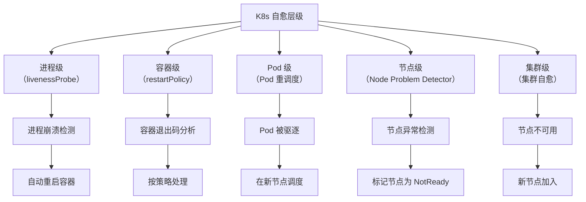
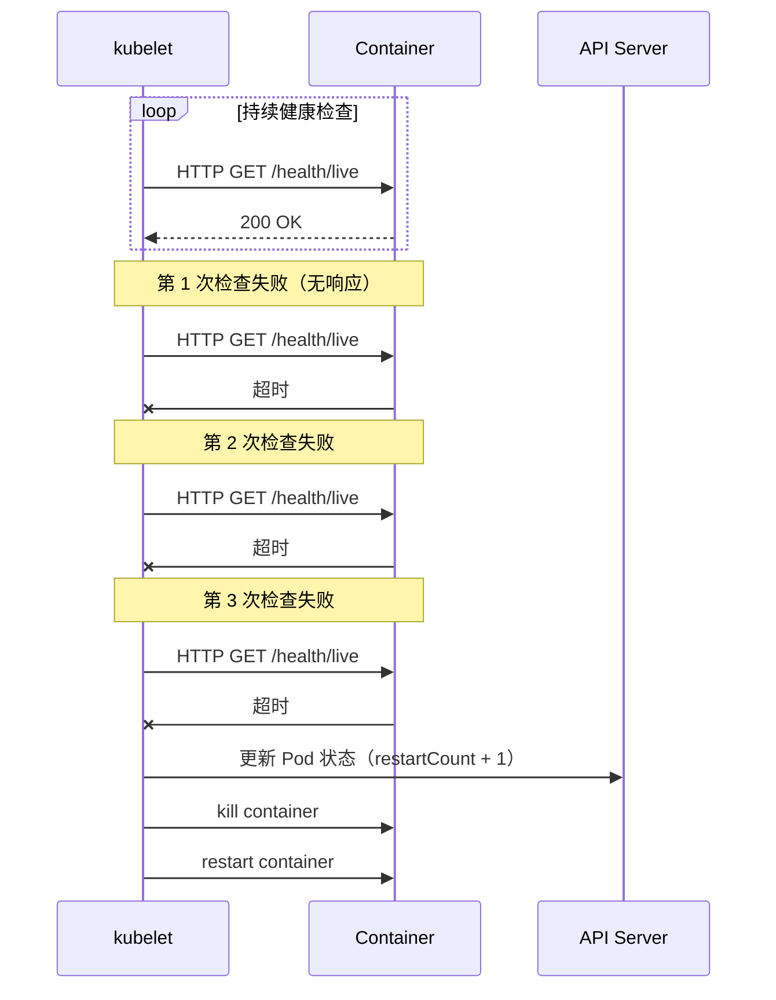
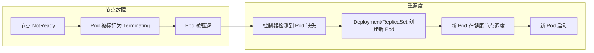

# 自动重启与重调度

当容器发生故障时，最基本的自愈手段就是**重启**。

Kubernetes 提供了多层次的自愈机制，从进程级到集群级，每一层都有对应的自动处理方案。本节详解 Kubernetes 的自动重启与重调度机制。

## Kubernetes 自愈层级



## 存活探针驱动的自动重启

存活探针（Liveness Probe）是最常用的自动重启机制：

```yaml title="liveness-probe-config.yaml"
apiVersion: v1
kind: Pod
spec:
  containers:
  - name: myapp
    image: myapp:v1
    livenessProbe:
      httpGet:
        path: /health/live
        port: 8080
      initialDelaySeconds: 30   # 启动后 30 秒开始检查
      periodSeconds: 10         # 每 10 秒检查一次
      timeoutSeconds: 5         # 超时 5 秒视为失败
      failureThreshold: 3       # 连续失败 3 次 → 重启
```

**存活探针触发的重启流程**：



## Pod 重启策略

### restartPolicy 配置

```yaml title="restart-policy.yaml"
spec:
  # restartPolicy 控制容器退出后的行为
  restartPolicy: Always  # Always | OnFailure | Never

  containers:
  - name: myapp
```

| 策略 | 适用场景 | 说明 |
| --- | --- | --- |
| **Always** | 有状态服务 | 容器退出后总是重启 |
| **OnFailure** | 一次性任务 | 容器非零退出码时才重启 |
| **Never** | 批处理任务 | 容器退出后不重启 |

### 重启行为示例

```bash
# restartPolicy: Always
# 退出码 0 → 重启 ✓
# 退出码 1 → 重启 ✓
# 退出码 137（OOMKilled）→ 重启 ✓

# restartPolicy: OnFailure
# 退出码 0 → 不重启（正常退出）
# 退出码 1 → 重启 ✓
# 退出码 137（OOMKilled）→ 重启 ✓

# restartPolicy: Never
# 退出码 0 → 不重启
# 退出码 1 → 不重启
# 退出码 137 → 不重启
```

## Pod 驱逐与重调度

当节点不可用时，Pod 会被驱逐并在其他节点重新调度：



### PodDisruptionBudget（PDB）

PDB 保证驱逐过程中最小可用数量：

```yaml title="pod-disruption-budget.yaml"
apiVersion: policy/v1
kind: PodDisruptionBudget
metadata:
  name: order-service-pdb
spec:
  # 最多有 1 个 Pod 不可用
  maxUnavailable: 1

  # 或最少保持 3 个 Pod 可用
  # minAvailable: 3

  selector:
    matchLabels:
      app: order-service
```

### 常见驱逐原因

| 原因 | 说明 | 处理 |
| --- | --- | --- |
| **节点 NotReady** | 节点心跳超时 | 自动重调度 |
| **资源不足** | OOMKilled | 增加资源限制 |
| **节点排空** | kubectl drain | 提前标记 PDB |
| **磁盘压力** | 磁盘空间不足 | 清理存储 |
| **内存压力** | 内存不足 | 优化内存使用 |

## Node Problem Detector（NPD）

NPD 监控节点级别的硬件和系统问题：

```yaml title="node-problem-detector.yaml"
apiVersion: apps/v1
kind: DaemonSet
metadata:
  name: node-problem-detector
spec:
  selector:
    matchLabels:
      app: node-problem-detector
  template:
    spec:
      containers:
      - name: node-problem-detector
        image: registry.k8s.io/node-problem-detector:v0.8.7
        env:
        - name: NODE_NAME
          valueFrom:
            fieldRef:
              fieldPath: spec.nodeName
```

**NPD 检测的问题类型**：

| 问题类型 | 示例 | 检测方式 |
| --- | --- | --- |
| **硬件问题** | 内存硬件错误、CPU 故障 | dmesg 解析 |
| **内核问题** | kernel panic、Bug | /var/log/messages |
| **容器运行时问题** | Docker 无响应 | API 检查 |
| **云平台问题** | AWS EC2 状态变化 | 云平台 API |

## 资源限制与重启

合理的资源限制能减少不必要的重启：

```yaml title="resource-limits.yaml"
spec:
  containers:
  - name: myapp
    resources:
      requests:
        memory: "256Mi"  # 保证分配
        cpu: "100m"
      limits:
        memory: "512Mi"  # 超过触发 OOM
        cpu: "500m"       # 超过限制 throttle

    # 防止 OOMKilled 的内存设置技巧
    # limits.memory = requests.memory × 1.2~1.5
```

**OOMKilled 问题的排查**：

```bash
# 查看 Pod 退出原因
kubectl describe pod <pod-name> | grep -A 5 "Last State"

# Last State: Terminated
#   Reason: OOMKilled
#   Exit Code: 137
```

## 自动重启监控

自动重启次数过多是系统异常的信号：

```yaml title="restart-monitor.yaml"
# Prometheus 告警规则
groups:
- name: restart-alerts
  rules:
  # Pod 重启次数过多
  - alert: HighPodRestartRate
    expr: |
      sum(rate(kube_pod_container_status_restarts_total[5m])) by (namespace, pod)
      > 0.1
    for: 5m
    labels:
      severity: warning
    annotations:
      summary: "Pod {{ $labels.pod }} 重启频率过高"
      description: "Pod 在 5 分钟内平均每分钟重启超过 0.1 次"

  # Deployment 下有 Pod 持续重启
  - alert: DeploymentPodRestarting
    expr: |
      sum(kube_pod_container_status_restarts_total) by (deployment)
      / count(kube_pod_container_status_restarts_total) by (deployment)
      > 0.2
    labels:
      severity: critical
```

## 质量判断标准

一篇「自动重启与重调度」的文章是否达标，要看它是否回答了：

1. ✅ K8s 有哪些层级的自愈机制？
2. ✅ 存活探针如何触发自动重启？
3. ✅ restartPolicy 的三种策略分别适用什么场景？
4. ✅ Pod 被驱逐后如何重调度？
5. ❌ 只有基本概念，没有配置示例和流程图——不达标

## 本章总结

**核心要点**：

1. **存活探针是最常用的自动重启机制**：连续失败 N 次后触发重启
2. **restartPolicy 控制重启策略**：Always/OnFailure/Never 根据场景选择
3. **PodDisruptionBudget 保证最小可用数**：防止驱逐时服务中断
4. **Node Problem Detector 检测节点级问题**：提前发现节点异常
5. **监控重启次数是关键**：频繁重启往往是更严重问题的信号
