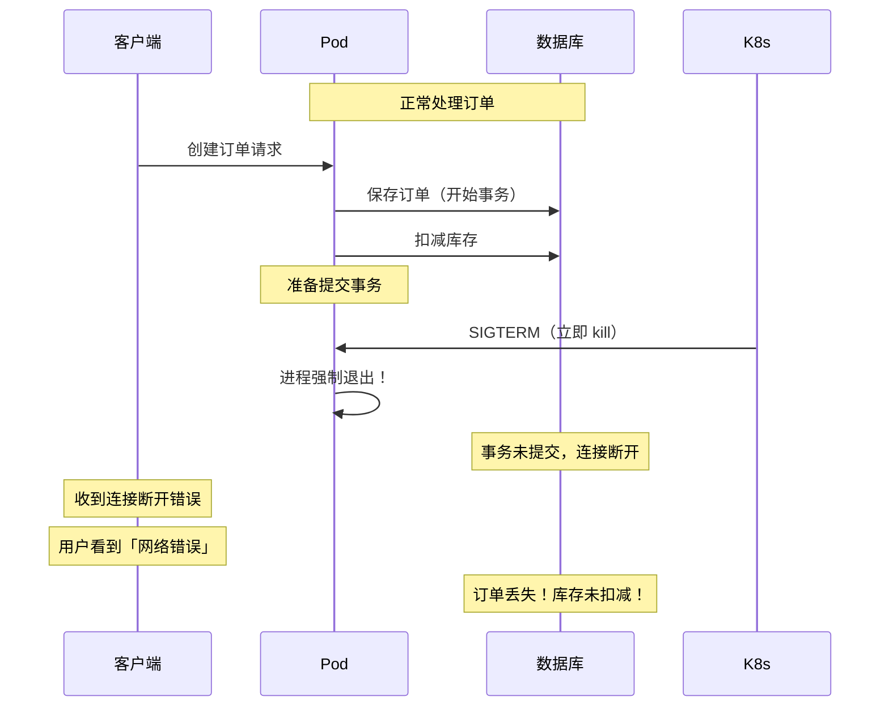
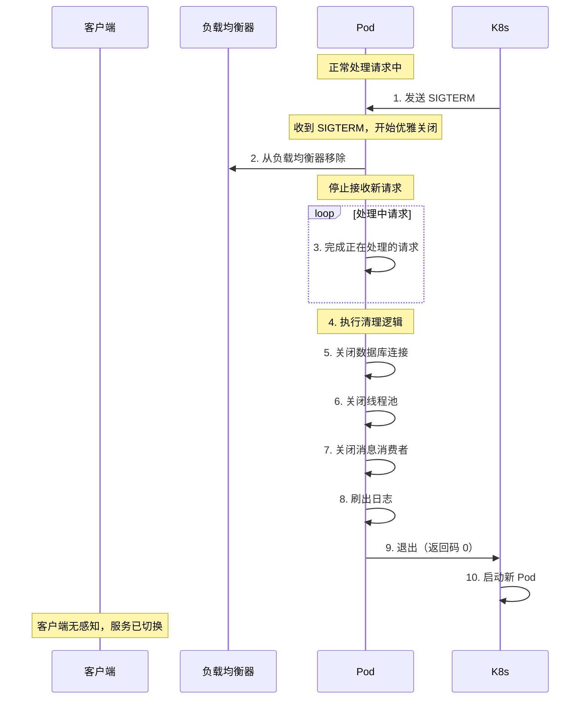
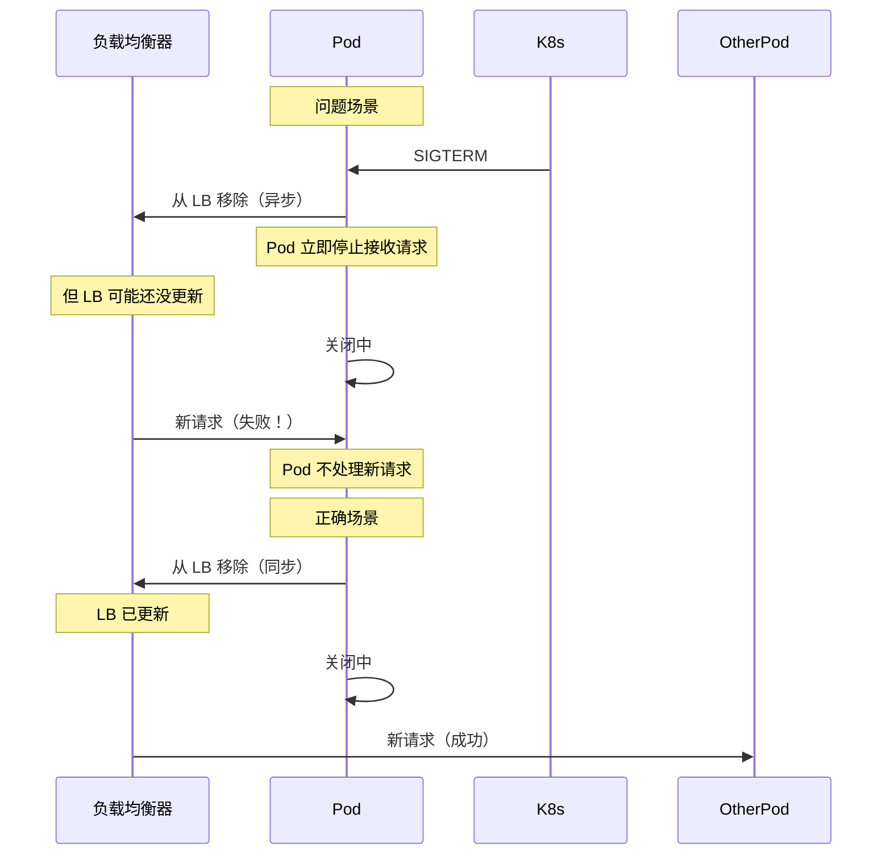

# 优雅关闭（Graceful Shutdown）

服务重启、发布、缩容时，如果没有优雅关闭机制，正在处理的请求会被强制中断，轻则返回错误，重则数据不一致。

你有没有注意到过这种情况：用户下单时页面突然报错，但后台订单其实已经创建成功了。这就是没有优雅关闭的典型症状——请求被强制中断，用户以为失败了，但实际上后端已经处理完成。

## 为什么需要优雅关闭

先看一个没有优雅关闭的问题场景：



**问题**：

- 事务未提交，订单丢失
- 库存已扣减但订单未创建，数据不一致
- 用户体验差，不知道请求是否成功

## 优雅关闭的流程



## Spring Boot 优雅关闭

### 基础配置

```yaml title="application.yml"
server:
  # 启用优雅关闭
  shutdown: graceful

spring:
  lifecycle:
    # 等待所有任务完成的超时时间
    timeout-per-shutdown-phase: 30s
```

### 配置含义

| 配置项 | 说明 | 建议值 |
| --- | --- | --- |
| `shutdown` | 关闭模式：`immediate`（立即）或 `graceful`（优雅） | `graceful` |
| `timeout-per-shutdown-phase` | 等待任务完成的最大时间 | 30s~60s |

### 代码层面配合

```java title="GracefulShutdownHandler.java"
@Component
@Slf4j
public class GracefulShutdownHandler implements ApplicationListener<ContextClosedEvent> {

    @Autowired
    private ExecutorService taskExecutor;

    @Autowired
    private OrderService orderService;

    @Autowired
    private KafkaConsumer consumer;

    @Override
    public void onApplicationEvent(ContextClosedEvent event) {
        log.info("开始优雅关闭...");

        // 1. 停止接收新请求（通过关闭入口）
        // Spring Boot 会自动停止新的 HTTP 请求

        // 2. 等待正在处理的任务完成
        log.info("等待任务完成...");
        taskExecutor.shutdown();
        try {
            if (!taskExecutor.awaitTermination(30, TimeUnit.SECONDS)) {
                log.warn("任务未能在 30 秒内完成，强制终止");
                taskExecutor.shutdownNow();
            }
        } catch (InterruptedException e) {
            taskExecutor.shutdownNow();
            Thread.currentThread().interrupt();
        }

        // 3. 提交清理任务
        log.info("执行清理任务...");

        // 4. 关闭 Kafka 消费者
        try {
            consumer.close();
            log.info("Kafka 消费者已关闭");
        } catch (Exception e) {
            log.error("关闭 Kafka 消费者失败", e);
        }

        // 5. 等待少量时间确保消息处理完成
        try {
            Thread.sleep(1000);
        } catch (InterruptedException e) {
            Thread.currentThread().interrupt();
        }

        log.info("优雅关闭完成");
    }
}
```

### Tomcat 特殊处理

Tomcat 的线程池处理请求时，需要特殊处理：

```java title="TomcatGracefulShutdown.java"
@Configuration
public class TomcatGracefulShutdown {

    @Bean
    public ConfigurableServletWebServerFactory webServerFactory() {
        TomcatServletWebServerFactory factory = new TomcatServletWebServerFactory();
        factory.addConnectorCustomizers(connector -> {
            // 禁用 NIO  acceptor 和 poller 线程的优雅关闭
            connector.setProperty("gracefulShutdownTimeout", "30000");
        });
        return factory;
    }
}
```

## Kubernetes 优雅关闭配置

### terminationGracePeriodSeconds

```yaml title="pod-graceful-shutdown.yaml"
apiVersion: v1
kind: Pod
spec:
  # 优雅关闭的总时间
  terminationGracePeriodSeconds: 60

  containers:
  - name: myapp
    image: myapp:v1
```

**流程**：

1. K8s 发送 SIGTERM（0 秒）
2. Pod 开始优雅关闭
3. 等待最多 `terminationGracePeriodSeconds` 秒
4. 如果还未退出，发送 SIGKILL

### preStop Hook

preStop Hook 在发送 SIGTERM 之前执行，常用于等待负载均衡器更新：

```yaml title="prestop-hook.yaml"
spec:
  terminationGracePeriodSeconds: 60

  containers:
  - name: myapp
    image: myapp:v1

    lifecycle:
      preStop:
        exec:
          # 等待 10 秒，让负载均衡器移除此 Pod
          command: ["/bin/sh", "-c", "sleep 10"]
```

**为什么需要 preStop Hook**？



**preStop Hook 的作用**：在发送 SIGTERM 之前，先等待负载均衡器更新。

### 完整配置示例

```yaml title="complete-graceful-shutdown.yaml"
apiVersion: v1
kind: Pod
metadata:
  name: order-service
spec:
  # 总的优雅关闭时间
  terminationGracePeriodSeconds: 90

  containers:
  - name: order-service
    image: order-service:v1

    # 优雅关闭配置
    lifecycle:
      preStop:
        # 第一步：等待负载均衡器更新
        exec:
          command: ["/bin/sh", "-c", "sleep 10"]

    # 健康检查配置
    readinessProbe:
      httpGet:
        path: /health/ready
        port: 8080
      initialDelaySeconds: 5
      periodSeconds: 5

    livenessProbe:
      httpGet:
        path: /health/live
        port: 8080
      initialDelaySeconds: 15
      periodSeconds: 10
```

### 关闭流程时序

```mermaid
sequenceDiagram
    participant K8s as K8s
    participant Pod as Pod
    participant LB as 负载均衡器
    participant App as 应用

    K8s->>Pod: 发送 preStop Hook
    Pod->>Pod: preStop 执行中（sleep 10s）
    Note over Pod: 应用仍在处理请求

    preStop 完成
    K8s->>Pod: 发送 SIGTERM
    Pod->>LB: 从负载均衡器移除
    LB-->>Pod: 移除完成
    Note over Pod: 不再接收新请求

    Pod->>App: 开始优雅关闭
    App->>App: 停止 HTTP 服务器
    App->>App: 等待处理中的请求完成（最多 60s）

    loop 处理中的请求
        Note over Pod: 继续处理
    end

    App->>App: 关闭数据库连接池
    App->>App: 关闭线程池
    App->>App: 刷出日志
    Pod->>K8s: 退出

    Note over K8s: 启动新 Pod
```

## 常见问题与解决

### 问题一：线程池任务无法取消

```java title="TaskCancellation.java"]
// 如果任务可以被中断，使用 Future.cancel(true)
Future<?> future = executor.submit(() -> {
    try {
        while (!Thread.currentThread().isInterrupted()) {
            process();
        }
    } catch (InterruptedException e) {
        // 正确处理中断
        Thread.currentThread().interrupt();
    }
});

// 取消任务
future.cancel(true);

// 如果任务不支持中断，使用带超时的任务
Future<?> futureWithTimeout = executor.submit(() -> {
    // 在任务内部检查超时
    long startTime = System.currentTimeMillis();
    while (System.currentTimeMillis() - startTime < MAX_DURATION) {
        processBatch();
    }
});
```

### 问题二：Kafka 消费者关闭

```java title="KafkaGracefulShutdown.java"]
@Bean
public KafkaListenerContainerFactory<?> kafkaListenerContainerFactory(
        ConcurrentKafkaListenerContainerFactory<String, String> factory) {
    // 设置并发为 1，方便关闭
    factory.setConcurrency(1);

    // 设置监听器类型
    factory.getContainerProperties().setAckMode(AckMode.RECORD);

    return factory;
}

// 关闭时等待消息处理完成
@PreDestroy
public void shutdown() {
    kafkaListener.stop();
    log.info("Kafka 消费者已停止");
}
```

### 问题三：数据库连接池关闭顺序

```java title="DatabaseGracefulShutdown.java"]
// 确保数据库连接池最后关闭
@PreDestroy
public void shutdown() {
    // 1. 先停止接收新请求
    server.shutdown();

    // 2. 等待处理中的请求完成
    executor.shutdown();
    try {
        executor.awaitTermination(30, TimeUnit.SECONDS);
    } catch (InterruptedException e) {
        executor.shutdownNow();
    }

    // 3. 最后关闭数据库连接池
    dataSource.close();
}
```

## 监控优雅关闭

```yaml title="graceful-shutdown-metrics.yaml"]
# Prometheus 指标
graceful_shutdown:
  - name: shutdown_initiated_total
    type: counter
    description: "优雅关闭总次数"

  - name: shutdown_duration_seconds
    type: histogram
    description: "优雅关闭耗时"

  - name: in_flight_requests
    type: gauge
    description: "关闭时的在处理请求数"

  - name: shutdown_timeout_total
    type: counter
    description: "优雅关闭超时次数"

# 告警规则
alerts:
  - name: GracefulShutdownTimeout
    condition: shutdown_timeout_total > 0
    severity: warning
    message: "优雅关闭超时，可能有请求被强制中断"

  - name: GracefulShutdownDuration
    condition: shutdown_duration_seconds > 50
    severity: warning
    message: "优雅关闭耗时过长，可能有任务卡住"
```

## 质量判断标准

一篇「优雅关闭」的文章是否达标，要看它是否回答了：

1. ✅ 为什么需要优雅关闭（没有优雅关闭会怎样）？
2. ✅ 完整的优雅关闭流程是什么？
3. ✅ Spring Boot 如何配置？
4. ✅ K8s 如何配置（terminationGracePeriodSeconds、preStop Hook）？
5. ✅ 常见问题如何处理（线程池、Kafka、数据库）？
6. ❌ 只有配置，没有时序图和问题分析——不达标

## 本章总结

**核心要点**：

1. **优雅关闭防止请求中断和数据不一致**：没有优雅关闭会导致事务未提交、订单丢失
2. **K8s 发送 SIGTERM 触发优雅关闭**：应用需要在收到后停止接收新请求并完成处理中的任务
3. **preStop Hook 等待负载均衡器更新**：防止新请求被路由到正在关闭的 Pod
4. **terminationGracePeriodSeconds 控制总时间**：超过后强制退出
5. **关闭顺序很重要**：先停入口，再停处理，最后停资源（数据库、消息队列）
