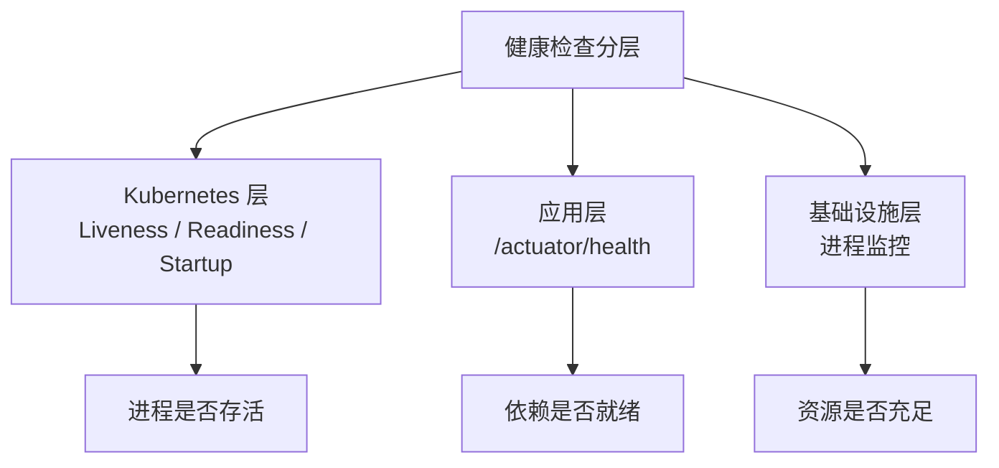
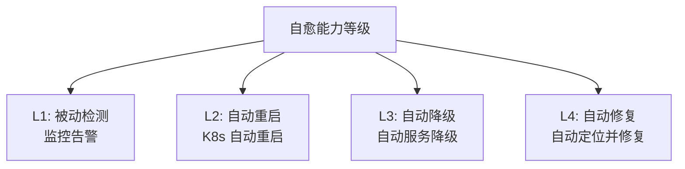

# 健康检查与自愈

故障不可避免，但可以让系统自己发现问题并恢复。

健康检查是系统感知自身状态的触角，自愈是系统在发现异常后自动采取的恢复动作。本模块详解 Kubernetes 健康检查机制、优雅关闭、流量预热和自动重启，帮助你构建具备自愈能力的系统。

## 模块结构

### 健康检查

| 文章 | 核心问题 |
| --- | --- |
| [健康检查概述](/resilience/health-check/overview) | 健康检查的完整体系 |
| [存活探针](/resilience/health-check/liveness) | 检测进程是否存活 |
| [就绪探针](/resilience/health-check/readiness) | 检测是否准备好接收流量 |
| [启动探针](/resilience/health-check/startup) | 给慢启动应用更多时间 |
| [探针最佳实践](/resilience/health-check/probe-best-practices) | 探针配置避坑指南 |
| [端点设计](/resilience/health-check/endpoint-design) | 健康检查接口设计 |
| [Spring Actuator](/resilience/health-check/spring-actuator) | Spring Boot 健康检查 |
| [K8s 探针配置](/resilience/health-check/k8s-probes) | K8s 探针详解 |

### 自愈机制

| 文章 | 核心问题 |
| --- | --- |
| [优雅关闭](/resilience/health-check/graceful-shutdown) | 关闭时保护在处理请求 |
| [优雅关闭实现](/resilience/health-check/graceful-shutdown-implementation) | 完整实现方案 |
| [流量预热](/resilience/health-check/warm-up) | 新 Pod 如何预热 |
| [自动重启](/resilience/health-check/auto-restart) | 故障后自动恢复 |
| [自愈机制](/resilience/health-check/self-healing) | 自愈的整体设计 |

## 健康检查分层

## 探针类型对比

| 探针类型 | 目的 | 失败时行为 | 使用场景 |
| --- | --- | --- | --- |
| **Liveness** | 进程是否存活 | 重启容器 | 进程崩溃 |
| **Readiness** | 是否准备好接收流量 | 从 Service 移除 | 依赖未就绪 |
| **Startup** | 是否启动完成 | 禁用 Liveness 和 Readiness | 慢启动应用 |

## 自愈能力等级

| 等级 | 能力 | 示例 |
| --- | --- | --- |
| **L1** | 检测并告警 | Prometheus + Alertmanager |
| **L2** | 自动重启 | K8s Liveness Probe |
| **L3** | 自动降级 | Hystrix/Sentinel 降级 |
| **L4** | 自动修复 | 高级自愈系统 |

准备好开始了吗？从[健康检查概述](/resilience/health-check/overview)开始。
