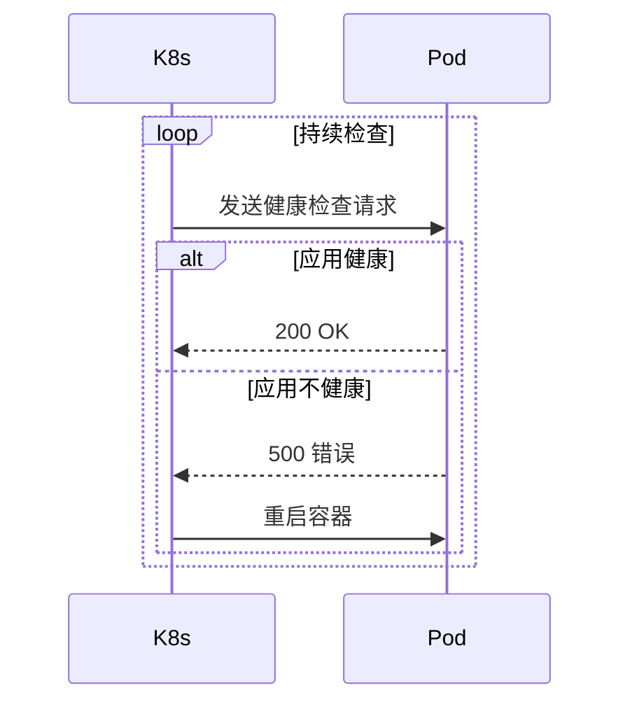

# 存活探针（Liveness Probe）

存活探针检查应用是否存活。如果应用不健康，K8s 会重启容器。

## 存活探针的工作原理



## 存活探针配置

```yaml title="liveness-probe.yaml"
apiVersion: v1
kind: Pod
spec:
  containers:
  - name: myapp
    image: myapp:v1
    livenessProbe:
      httpGet:
        path: /health/live
        port: 8080
      initialDelaySeconds: 30      # 启动后多久开始检查
      periodSeconds: 10           # 检查间隔
      timeoutSeconds: 5          # 超时时间
      failureThreshold: 3         # 连续失败 3 次则重启
      successThreshold: 1         # 成功 1 次即认为健康
```

## 常见问题

### 初始延迟设置

```yaml title="initial-delay-example.yaml"
# 如果应用启动需要 30 秒，initialDelaySeconds 至少设为 35
livenessProbe:
  httpGet:
    path: /health/live
    port: 8080
  initialDelaySeconds: 35
```

### 检查太频繁

```yaml title="probe-frequency.yaml"
# 检查太频繁会消耗资源
# 建议：periodSeconds = 10，failureThreshold = 3
livenessProbe:
  periodSeconds: 10
  failureThreshold: 3
  # 这样连续失败 30 秒才会重启
```

## 本章总结

**核心要点**：

1. **存活探针检查应用是否存活**：失败则重启容器
2. **initialDelaySeconds 要大于启动时间**：否则会误杀正常容器
3. **failureThreshold 要合理**：太短会误判，太长会延误恢复
