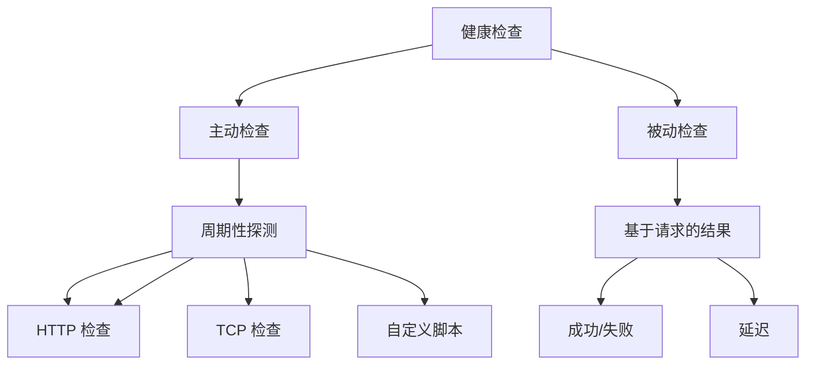
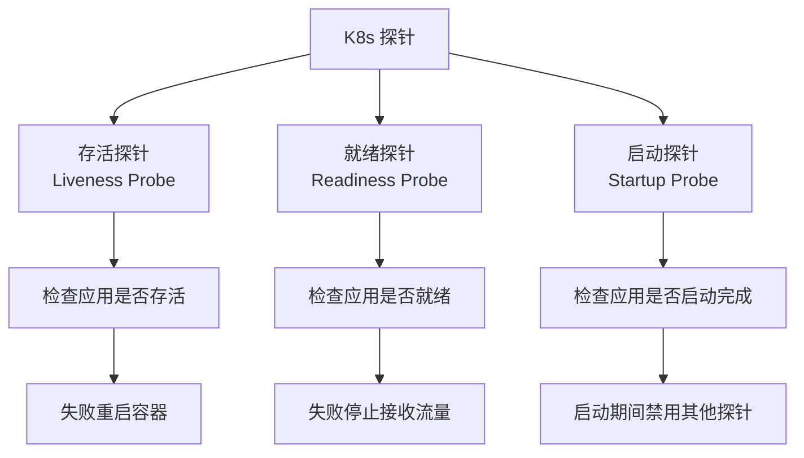

# 健康检查概述

健康检查是系统自愈能力的基础。

当一个服务实例发生故障时，负载均衡器或服务网格需要知道哪些实例是健康的，才能将流量路由到健康的实例。健康检查就是让系统能够「感知」自身状态的能力。

## 健康检查的分类

## 健康检查的层级

| 层级 | 检查内容 | 示例 |
| --- | --- | --- |
| **进程检查** | 进程是否存活 | PID 文件存在 |
| **端口检查** | 端口是否监听 | TCP 连接成功 |
| **应用检查** | 应用是否正常 | HTTP 200 返回 |
| **依赖检查** | 依赖服务是否可用 | 数据库连接 |

## K8s 健康检查类型

## 健康检查的设计原则

1. **轻量**：健康检查本身不应该消耗太多资源
2. **快速**：检查应该快速完成
3. **准确**：检查结果应该准确反映应用状态
4. **可配置**：超时、重试等参数可配置

## 本章总结

**核心要点**：

1. **健康检查是自愈的基础**：让系统能够感知自身状态
2. **健康检查分为多个层级**：进程、端口、应用、依赖
3. **K8s 有三种探针**：存活、就绪、启动
4. **健康检查要轻量快速**：不应成为系统负担
