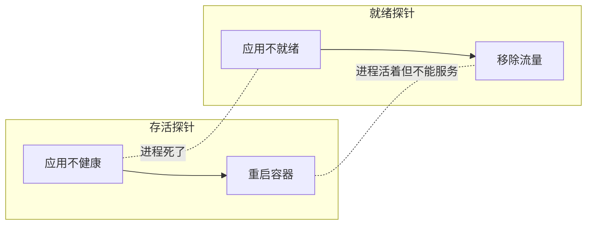

# 就绪探针（Readiness Probe）

就绪探针检查应用是否准备好接收流量。如果应用未就绪，从负载均衡器中移除。

## 存活 vs 就绪



| 场景 | 存活探针 | 就绪探针 |
| --- | --- | --- |
| 应用启动中 | 失败（不应重启） | 失败（不接收流量） |
| 应用正忙 | 通过 | 失败 |
| 应用崩溃 | 失败（重启） | 失败（移除流量） |

## 就绪探针配置

```yaml title="readiness-probe.yaml"
apiVersion: v1
kind: Pod
spec:
  containers:
  - name: myapp
    image: myapp:v1
    readinessProbe:
      httpGet:
        path: /health/ready
        port: 8080
      initialDelaySeconds: 5
      periodSeconds: 5
      timeoutSeconds: 3
      failureThreshold: 3
      successThreshold: 1
```

## 就绪探针的检查内容

```java title="ReadinessHealthCheck.java"
@RestController
@RequestMapping("/health")
public class HealthController {

    @GetMapping("/ready")
    public ResponseEntity<HealthStatus> readiness() {
        HealthStatus status = new HealthStatus();

        // 检查数据库连接
        status.setDatabase(checkDatabase());

        // 检查缓存连接
        status.setCache(checkCache());

        // 检查依赖服务
        status.setDependencies(checkDependencies());

        if (status.isHealthy()) {
            return ResponseEntity.ok(status);
        } else {
            return ResponseEntity.status(503).body(status);
        }
    }

    private boolean checkDatabase() {
        try {
            jdbcTemplate.execute("SELECT 1");
            return true;
        } catch (Exception e) {
            return false;
        }
    }

    private boolean checkCache() {
        try {
            redisTemplate.opsForValue().get("health-check");
            return true;
        } catch (Exception e) {
            return false;
        }
    }
}
```

## 本章总结

**核心要点**：

1. **就绪探针检查应用是否准备好接收流量**：失败则移除流量
2. **就绪探针比存活探针更敏感**：应用忙时可能就绪探针失败
3. **就绪探针应检查依赖**：数据库、缓存等
