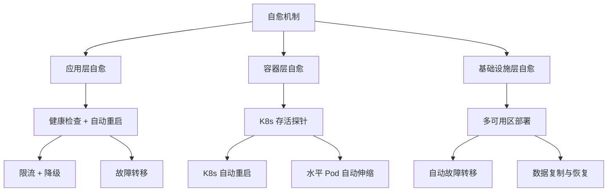

# 自愈机制设计

自愈是系统在检测到故障后，自动修复自己的能力。

## 自愈的层次



## 自愈机制设计

### 1. 健康检查 + 自动重启

```yaml title="liveness-auto-restart.yaml"
livenessProbe:
  httpGet:
    path: /health/live
    port: 8080
  failureThreshold: 3
  periodSeconds: 10
# 连续失败 3 次后重启，30 秒内检测到故障
```

### 2. 资源限制 + 水平扩展

```yaml title="hpa-autoscaling.yaml"
apiVersion: autoscaling/v2
kind: HorizontalPodAutoscaler
spec:
  scaleTargetRef:
    apiVersion: apps/v1
    kind: Deployment
    name: myapp
  minReplicas: 3
  maxReplicas: 10
  metrics:
  - type: Resource
    resource:
      name: cpu
      target:
        type: Utilization
        averageUtilization: 70
```

## 本章总结

**核心要点**：

1. **自愈是分层的**：应用层、容器层、基础设施层
2. **健康检查是自愈的基础**：检测故障
3. **自动重启是最基本的自愈**：K8s 存活探针
