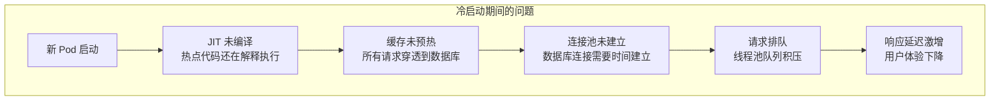

# 流量预热与冷启动

新启动的实例和扩容后的 Pod，在接收流量的瞬间，性能往往是最差的。

你有没有注意过这种现象：每次发布后，前几个请求总是特别慢？或者 K8s 扩容后，新增的 Pod TP99 延迟是正常实例的 5 倍？这些现象的根源，就是**冷启动**（Cold Start）。

## 冷启动的本质



冷启动不是单一问题，而是一系列连锁反应。

## 冷启动的性能影响

下面是一个典型的冷启动性能曲线：

```python
# 模拟冷启动延迟变化
import matplotlib.pyplot as plt

# 模拟数据：请求延迟随请求数变化
requests = list(range(1, 101))
latencies = []

for i in requests:
    if i < 10:
        # 前 10 个请求：JIT 预热中
        latencies.append(500 - i * 40)
    elif i < 30:
        # 10-30 个请求：缓存预热
        latencies.append(100 - (i - 10) * 3)
    else:
        # 30+ 个请求：完全预热
        latencies.append(50 + (i % 10) * 5)

# 绘制图表
plt.plot(requests, latencies)
plt.axvline(x=10, color='r', linestyle='--', label='JIT 预热完成')
plt.axvline(x=30, color='g', linestyle='--', label='缓存预热完成')
plt.xlabel('请求序号')
plt.ylabel('延迟 (ms)')
plt.title('冷启动延迟曲线')
```

| 阶段 | 请求数 | 延迟特征 | 原因 |
| --- | --- | --- | --- |
| JIT 编译期 | 1~10 | TP99 `>` 500ms | 解释执行，热代码未编译 |
| 缓存预热期 | 10~30 | TP99 100~500ms | 缓存逐步加载，命中率上升 |
| 完全预热期 | 30+ | TP99 `~` 50ms | 所有资源就绪 |

## JVM 冷启动问题

JVM 应用冷启动最慢，因为 JIT 编译器需要「预热」：

```mermaid
flowchart LR
    subgraph JIT 编译阶段
        A["解释执行"] --> |"请求积累"| B["C1 编译\n（简单编译）"]
        B --> |"更多请求"| C["C2 编译\n（深度优化）"]
    end

    subgraph 预热时间
        D["0-5 分钟"] --> |"C1 编译| E["基础性能"]
        E --> |"5-15 分钟"| F["C2 编译完成"]
        F --> |"15+ 分钟"| G["最佳性能"]
    end
```

**JVM 预热时间的经验数据**：

| 应用类型 | 预热到 80% 性能 | 预热到 100% 性能 |
| --- | --- | --- |
| 小型应用（< 100 类） | 1~2 分钟 | 5~10 分钟 |
| 中型应用（100~500 类） | 5~10 分钟 | 15~30 分钟 |
| 大型应用（> 500 类） | 15~30 分钟 | 1~2 小时 |

## 预热策略

### 策略一：预热流量

在 Pod 就绪前，先发送预热流量：

```java title="Warmup流量注入.java"
@Service
public class WarmupService {

    private final RestTemplate restTemplate;
    private final boolean isWarmupEnabled;

    @PostConstruct
    public void warmup() {
        if (!isWarmupEnabled) {
            return;
        }

        log.info("开始预热...");

        // 模拟真实请求
        for (int i = 0; i < 100; i++) {
            // 先预热热点接口
            warmupEndpoint("/api/products");
            warmupEndpoint("/api/categories");
            warmupEndpoint("/api/user/profile");
        }

        log.info("预热完成");
    }

    private void warmupEndpoint(String path) {
        try {
            restTemplate.getForObject(baseUrl + path, String.class);
        } catch (Exception e) {
            // 忽略预热失败
            log.debug("预热失败: {}", path);
        }
    }
}
```

### 策略二：渐进式流量切换

不要一次性把流量切到新 Pod，而是逐步增加：

```yaml title="渐进式流量切换.yaml"
# Istio 渐进式流量配置
apiVersion: networking.istio.io/v1alpha3
kind: VirtualService
metadata:
  name: order-service
spec:
  http:
  - route:
    - destination:
        host: order-service
        subset: v1
      weight: 90
    - destination:
        host: order-service
        subset: v2
      weight: 10   # 新版本只接收 10% 流量
---
# 30 分钟后增加到 50%
# 60 分钟后增加到 100%
```

### 策略三：K8s Startup Probe + 延迟就绪

利用 Startup Probe 延迟就绪：

```yaml title="startup-probe-warmup.yaml"
apiVersion: v1
kind: Pod
spec:
  containers:
  - name: myapp
    image: myapp:v1

    # Startup Probe：给予最多 5 分钟启动
    startupProbe:
      httpGet:
        path: /health/started
        port: 8080
      failureThreshold: 60  # 5s × 60 = 5 分钟
      periodSeconds: 5

    # 就绪探针延迟生效
    # 只有 Startup Probe 成功后，就绪探针才开始
    readinessProbe:
      httpGet:
        path: /health/ready
        port: 8080
      initialDelaySeconds: 30  # 额外等待 30 秒预热
      periodSeconds: 5
```

### 策略四：本地预缓存

在 Pod 启动时加载热点数据到本地缓存：

```java title="本地缓存预热.java"
@Service
public class CacheWarmupService {

    @Autowired
    private CacheManager cacheManager;

    @PostConstruct
    public void warmupCache() {
        // 加载热点商品
        List<Product> hotProducts = productRepository.findHotProducts();
        for (Product product : hotProducts) {
            cacheManager.getCache("products")
                .put(product.getId(), product);
        }

        // 加载热点分类
        List<Category> categories = categoryRepository.findAll();
        for (Category category : categories) {
            cacheManager.getCache("categories")
                .put(category.getId(), category);
        }

        log.info("缓存预热完成：{} 个商品，{} 个分类",
            hotProducts.size(), categories.size());
    }
}
```

## 冷启动优化技术

### GraalVM Native Image

GraalVM Native Image 编译后的应用，冷启动时间可以减少 90%：

```bash
# 构建 Native Image
native-image -jar myapp.jar -o myapp-native

# 启动时间对比
# JVM 应用：5~30 秒
# Native Image：50ms~200ms
```

### CRaC（Coordinated Restore at Checkpoint）

CRaC 在应用运行时创建检查点（checkpoint），然后在重启时恢复到这个检查点：

```java title="CRaC 示例.java"
@CRaCCheckpoint
public void checkpoint() {
    // 保存应用状态到检查点
    log.info("创建检查点...");
}

@CRaCRestore
public void restore() {
    // 从检查点恢复
    log.info("从检查点恢复，应用已预热");
}
```

## 质量判断标准

一篇「流量预热与冷启动」的文章是否达标，要看它是否回答了：

1. ✅ 什么是冷启动，为什么会发生？
2. ✅ 冷启动的性能影响具体是多少？
3. ✅ 有哪些预热策略，具体怎么实现？
4. ✅ 有什么技术可以减少冷启动时间？
5. ❌ 只有概念，没有量化数据——不达标

## 本章总结

**核心要点**：

1. **冷启动是 JVM/框架类应用的普遍问题**：JIT 未编译、缓存未预热、连接池未建立
2. **冷启动对用户体验影响大**：新 Pod 的 TP99 延迟可能是正常 Pod 的 5~10 倍
3. **预热策略是关键**：预热流量、渐进流量切换、本地缓存预加载
4. **K8s Startup Probe 配合就绪探针**：给予足够预热时间
5. **新技术减少冷启动**：GraalVM Native Image、CRaC
