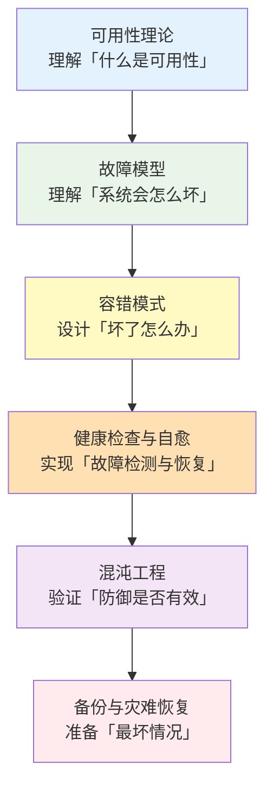
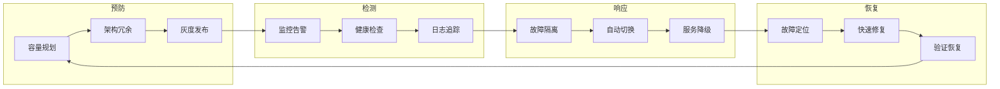

# 高可用与容错

系统总会故障，这是分布式系统的不变真理。区别不在于「会不会坏」，而在于「坏了怎么办」。

高可用与容错模块聚焦一个核心问题：**当故障不可避免地发生时，如何让系统依然保持服务能力？** 这不是一道有标准答案的技术题，而是一套需要在成本、复杂度、用户体验之间反复权衡的系统工程。

## 模块结构

本模块按主题分为 6 个子模块：

| 子模块 | 核心问题 | 典型场景 |
| --- | --- | --- |
| **可用性理论** | 如何量化、设定和衡量可用性目标 | SLA 谈判、错误预算管理 |
| **故障模型** | 系统会以哪些方式失效 | 崩溃、遗漏、拜占庭、网络分区 |
| **容错模式** | 针对不同故障如何设计防护手段 | 熔断、限流、降级、重试、超时、隔离 |
| **健康检查与自愈** | 如何检测故障并自动恢复 | K8s 探针、优雅关闭、流量预热 |
| **混沌工程** | 如何主动发现系统脆弱点 | 故障注入、爆炸半径控制、稳态假设 |
| **备份与灾难恢复** | 如何在灾难后快速恢复服务 | RPO/RTO、多活、单元化架构 |

## 核心演进路径

## 从故障到恢复的完整链路

高可用不是单一技术的堆砌，而是一套完整的体系：

**预防胜于治疗，但治疗方案也必须事先准备好。**

## 学习建议

1. **从理论入手**：先理解「可用性」的定义和度量方法，这是后续所有内容的基石
2. **理解故障类型**：不同的故障类型需要不同的应对策略，先分类再治理
3. **组合学习**：容错模式不是孤立的，熔断 + 限流 + 降级 + 重试 + 超时需要组合使用
4. **实践验证**：混沌工程是检验容错设计是否有效的唯一方法，只「设计」是不够的
5. **场景驱动**：不是每个系统都需要五个 9，了解自己的业务需求更重要

## 与其他模块的关系

高可用与容错不是孤立的，它需要以下模块的支撑：

- **分布式理论**：CAP 定理告诉我们为什么高可用和一致性难以兼得
- **可观测性**：没有监控和告警，容错机制是盲目的
- **云原生**：K8s 提供了健康检查、自愈、滚动发布等基础设施
- **性能与 JVM**：GC 停顿、线程阻塞都是导致可用性问题的常见原因

> 很多团队在故障发生后才意识到容错机制的重要性——但那时已经晚了。真正的高可用，是在故障发生之前就把防御做好。

准备好开始了吗？让我们从「可用性」的定义开始，理解这个看似简单、实则复杂的概念。
