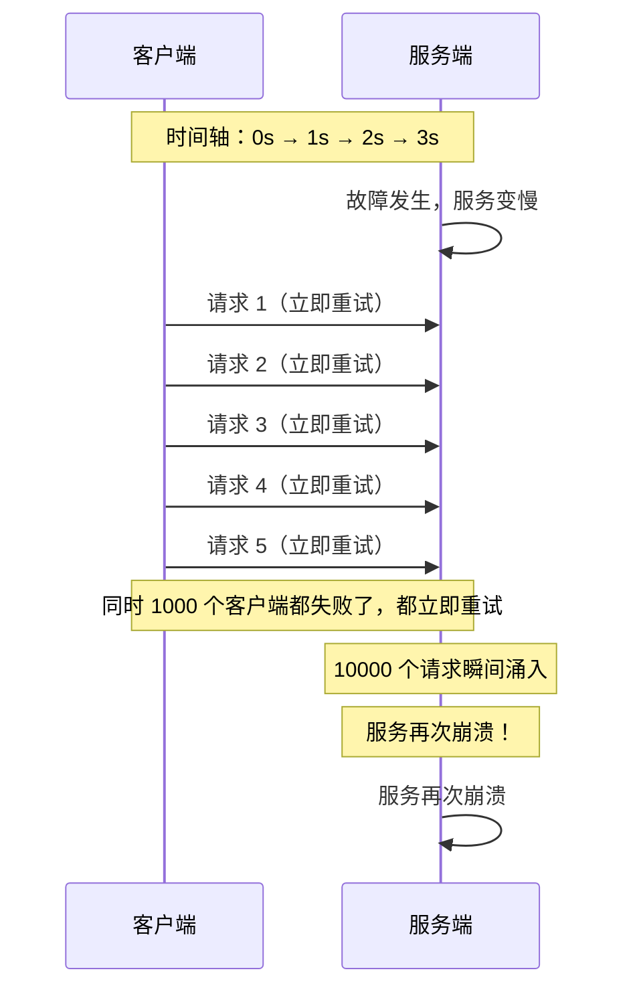

# 退避策略（Exponential Backoff）

重试是处理瞬时故障的利器，但无节制的重试会把系统拖入深渊。

当系统发生故障时，如果所有失败的客户端立即同时重试，会在恢复的瞬间再次压垮系统，形成「重试风暴」。指数退避（Exponential Backoff）通过让重试间隔随失败次数指数增长，给系统足够的时间恢复。

## 为什么需要退避策略

先看一个没有退避的灾难场景：



**这就是「惊群效应」**——大量请求在同一时刻重试，瞬间流量放大 N 倍。

## 指数退避的数学原理

退避间隔的计算公式：

```
退避间隔 = min(最大延迟, 基础延迟 × 2^尝试次数) + 随机抖动
```

| 尝试次数 | 基础间隔 | 基础 × 2^n | 带最大上限（30s） |
| --- | --- | --- | --- |
| 1 | 1s | 1 × 2^0 = 1s | 1s |
| 2 | 1s | 1 × 2^1 = 2s | 2s |
| 3 | 1s | 1 × 2^2 = 4s | 4s |
| 4 | 1s | 1 × 2^3 = 8s | 8s |
| 5 | 1s | 1 × 2^4 = 16s | 16s |
| 6 | 1s | 1 × 2^5 = 32s | 30s（上限） |

```python
# 退避间隔计算示例
def calculate_backoff(attempt, base_delay=1.0, max_delay=30.0, jitter=True):
    """
    计算退避间隔

    参数:
        attempt: 当前尝试次数（从 1 开始）
        base_delay: 基础延迟（秒）
        max_delay: 最大延迟（秒）
        jitter: 是否添加随机抖动
    """
    # 指数增长
    exponential_delay = base_delay * (2 ** (attempt - 1))

    # 截断到最大值
    capped_delay = min(exponential_delay, max_delay)

    # 添加随机抖动
    if jitter:
        capped_delay *= (0.5 + random.random() * 0.5)  # 50%~100%

    return capped_delay

# 示例输出
for i in range(1, 7):
    print(f"第 {i} 次重试，等待 {calculate_backoff(i):.2f}s")
```

## 抖动（Jitter）——消除同步化

指数退避解决了重试风暴问题，但引入了新问题：如果所有客户端的基础延迟相同，重试时刻仍然会同步：

```
客户端 A：第 2 次重试，等待 2s → 2s 后同时重试
客户端 B：第 2 次重试，等待 2s → 2s 后同时重试
客户端 C：第 2 次重试，等待 2s → 2s 后同时重试
```

添加随机抖动（Random Jitter）可以解决这个问题：

```mermaid
flowchart LR
    subgraph 无抖动（会同步）
        A1["A: 0~2s"]
        B1["B: 0~2s"]
        C1["C: 0~2s"]
        Note over A1,C1: 都在 2s 时重试 → 同步
    end

    subgraph 有抖动（分散）
        A2["A: 1~2s"]
        B2["B: 1.3~1.8s"]
        C2["C: 0.8~1.5s"]
        Note over A2,C2: 重试时间分散 → 无同步
    end
```

### Full Jitter vs Equal Jitter

| 抖动类型 | 公式 | 特点 |
| --- | --- | --- |
| **Full Jitter** | `delay × random(0, 1)` | 分散性最好，但早期可能等待很短 |
| **Equal Jitter** | `delay × (0.5 + random(0, 0.5))` | 分散性适中，保证至少 50% 的退避时间 |

```java title="JitterComparison.java"
public class JitterComparison {

    // Full Jitter：0 ~ delay
    public long fullJitter(long delay, Random random) {
        return (long) (random.nextDouble() * delay);
    }

    // Equal Jitter：0.5 × delay ~ delay
    public long equalJitter(long delay, Random random) {
        return (long) (delay * (0.5 + random.nextDouble() * 0.5));
    }

    // Decorrelated Jitter：基于上次的延迟值
    public long decorrelatedJitter(long prevDelay, long baseDelay, long maxDelay, Random random) {
        long newDelay = prevDelay * 3;
        if (newDelay > maxDelay) {
            newDelay = maxDelay;
        }
        return (long) (newDelay * (0.5 + random.nextDouble() * 0.5));
    }
}
```

## 完整的退避策略实现

```java title="BackoffStrategy.java"
public class BackoffStrategy {

    private final long baseDelayMs;
    private final long maxDelayMs;
    private final double multiplier;
    private final JitterType jitterType;
    private final Random random;
    private long lastDelay = 0;

    public enum JitterType {
        NONE,
        FULL,
        EQUAL,
        DECORRELATED
    }

    public BackoffStrategy(long baseDelayMs, long maxDelayMs, JitterType jitterType) {
        this.baseDelayMs = baseDelayMs;
        this.maxDelayMs = maxDelayMs;
        this.multiplier = 2.0;
        this.jitterType = jitterType;
        this.random = new Random();
    }

    /**
     * 计算下一次退避间隔
     * @param attempt 当前重试次数（从 1 开始）
     */
    public long calculateDelay(int attempt) {
        // 计算指数退避基础值
        long exponentialDelay = (long) (baseDelayMs * Math.pow(multiplier, attempt - 1));
        long cappedDelay = Math.min(exponentialDelay, maxDelayMs);

        // 添加抖动
        long finalDelay = applyJitter(cappedDelay);

        // Decorrelated 抖动需要记录上次延迟
        if (jitterType == JitterType.DECORRELATED) {
            lastDelay = finalDelay;
        }

        return finalDelay;
    }

    private long applyJitter(long delay) {
        switch (jitterType) {
            case NONE:
                return delay;

            case FULL:
                // [0, delay]
                return (long) (random.nextDouble() * delay);

            case EQUAL:
                // [0.5×delay, delay]
                return (long) (delay * (0.5 + random.nextDouble() * 0.5));

            case DECORRELATED:
                // 基于上次延迟的 decorrelated 抖动
                if (lastDelay == 0) {
                    return delay;
                }
                long decorrelated = Math.min(lastDelay * 3, delay);
                return (long) (decorrelated * (0.5 + random.nextDouble() * 0.5));

            default:
                return delay;
        }
    }

    /**
     * 带退避的重试
     */
    public <T> T retryWithBackoff(Callable<T> action, int maxAttempts) throws Exception {
        Exception lastException = null;

        for (int attempt = 1; attempt <= maxAttempts; attempt++) {
            try {
                return action.call();
            } catch (Exception e) {
                lastException = e;

                if (attempt < maxAttempts) {
                    long delay = calculateDelay(attempt);
                    Thread.sleep(delay);
                }
            }
        }

        throw lastException;
    }
}
```

## 退避策略的配置建议

不同场景有不同的配置策略：

| 场景 | baseDelay | maxDelay | jitter | 说明 |
| --- | --- | --- | --- | --- |
| **API 调用** | 100~500ms | 30s | FULL | 快速失败，快速恢复 |
| **数据库连接** | 500ms | 30s | EQUAL | 连接建立较慢 |
| **消息队列消费** | 1s | 60s | FULL | 可以稍慢 |
| **定时任务** | 1s | 300s | DECORRELATED | 任务间隔离 |

## 本章总结

**核心要点**：

1. **指数退避让重试间隔指数增长**：给系统恢复时间，避免惊群效应
2. **抖动消除重试同步化**：所有客户端在同一时刻重试会造成二次故障
3. **Full Jitter 分散性最好**：但可能过早重试
4. **Equal Jitter 平衡性更好**：保证至少 50% 退避时间
5. **最大延迟防止无限等待**：设置合理的上限值
