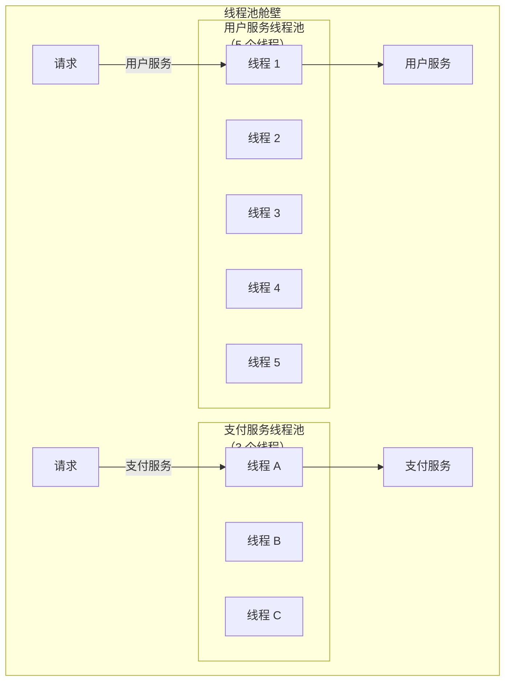
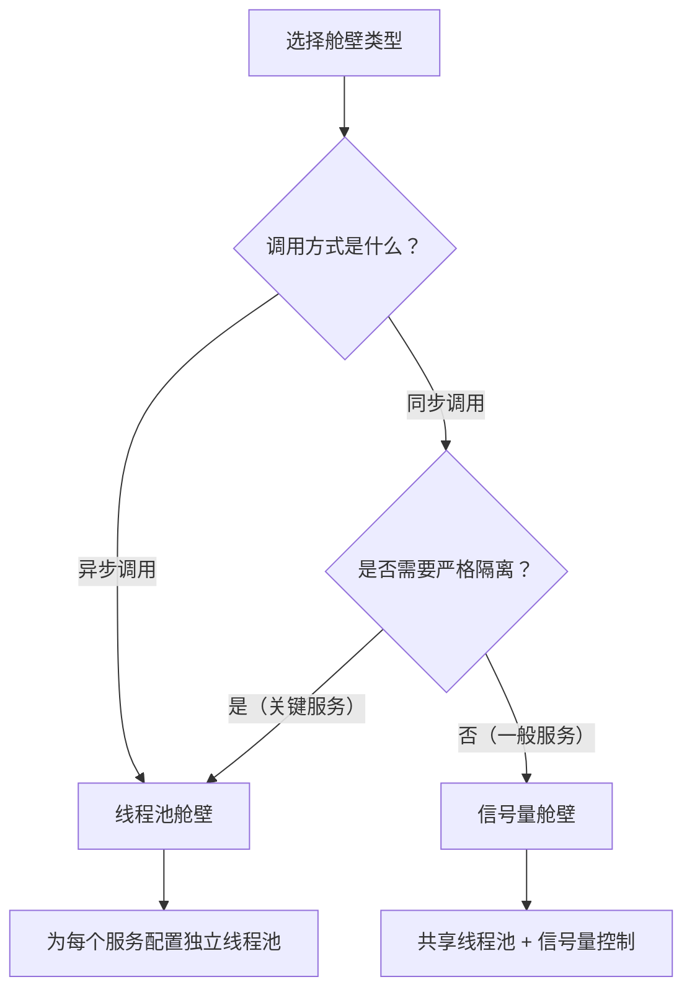

# 线程池舱壁 vs 信号量舱壁

舱壁隔离有两种实现方式，各有优劣，选择哪种取决于具体场景。

上一节我们讲了舱壁隔离的原理：当一个依赖服务故障时，通过限制对该服务的调用并发数，防止耗尽所有资源。本节深入分析两种实现方式——线程池舱壁和信号量舱壁——的核心差异和使用场景。

## 核心差异

| 特性 | 线程池舱壁 | 信号量舱壁 |
| --- | --- | --- |
| **实现原理** | 每个依赖有独立线程池 | 共享线程池 + 信号量控制并发 |
| **线程隔离** | 完全隔离 | 共享线程 |
| **资源消耗** | 每个线程占用栈内存 | 仅计数器，无额外线程 |
| **适用场景** | 异步调用 | 同步调用 |
| **超时控制** | 可控 | 需要额外实现 |
| **优先级控制** | 天然支持 | 需要额外实现 |

## 线程池舱壁详解

### 工作原理



每个依赖服务有独立的线程池，线程池之间的资源完全隔离。

### 代码实现

```java title="ThreadPoolBulkheadService.java"
@Service
public class ThreadPoolBulkheadService {

    // 为每个依赖服务创建独立线程池
    private final ExecutorService userServicePool;
    private final ExecutorService paymentServicePool;
    private final ExecutorService recommendationServicePool;

    public ThreadPoolBulkheadService() {
        // 用户服务：需要快速响应，线程池稍大
        this.userServicePool = new ThreadPoolExecutor(
            5, 10,
            60L, TimeUnit.SECONDS,
            new LinkedBlockingQueue<>(50),
            new ThreadFactoryBuilder()
                .setNameFormat("user-pool-%d")
                .build(),
            new ThreadPoolExecutor.CallerRunsPolicy()
        );

        // 支付服务：关键服务，线程池适中
        this.paymentServicePool = new ThreadPoolExecutor(
            3, 5,
            60L, TimeUnit.SECONDS,
            new LinkedBlockingQueue<>(20),
            new ThreadFactoryBuilder()
                .setNameFormat("payment-pool-%d")
                .build(),
            new ThreadPoolExecutor.AbortPolicy()
        );

        // 推荐服务：非关键，可以限制更多
        this.recommendationServicePool = new ThreadPoolExecutor(
            2, 3,
            30L, TimeUnit.SECONDS,
            new LinkedBlockingQueue<>(10),
            new ThreadFactoryBuilder()
                .setNameFormat("rec-pool-%d")
                .build(),
            new ThreadPoolExecutor.CallerRunsPolicy()
        );
    }

    // 用户服务调用
    public CompletableFuture<User> getUserAsync(Long userId) {
        return CompletableFuture.supplyAsync(
            () -> userFeignClient.getUser(userId),
            userServicePool  // 使用独立线程池
        );
    }

    // 支付服务调用
    public CompletableFuture<PaymentResult> payAsync(PaymentRequest request) {
        return CompletableFuture.supplyAsync(
            () -> paymentClient.process(request),
            paymentServicePool  // 使用独立线程池
        );
    }
}
```

### 线程池舱壁的特点

**优点**：

1. **完全隔离**：每个依赖的线程池独立，互不影响
2. **超时可控**：可以单独设置每个线程池的存活时间
3. **优先级支持**：关键服务可以用更大的线程池

**缺点**：

1. **资源开销**：每个线程占用 1MB 左右栈内存
2. **线程切换开销**：线程上下文切换有性能损耗
3. **配置复杂**：每个服务需要单独配置线程池参数

## 信号量舱壁详解

### 工作原理

```mermaid
flowchart TB
    subgraph SemaphoreBulkhead["信号量舱壁"]
        subgraph SharedThreadPool["共享线程池\n（20 个线程）"]
            T1["线程 1"]
            T2["线程 2"]
            T3["线程 3"]
            T4["线程 4"]
            T5["线程 5"]
            T6["..."]
        end

        subgraph Semaphores["信号量"]
            S1["用户服务\n许可数：10"]
            S2["支付服务\n许可数：5"]
            S3["推荐服务\n许可数：3"]
        end

        Request1["请求"] --> S1 --> |"获得许可"| T1 --> User["用户服务"]
        Request2["请求"] --> S2 --> |"获得许可"| T2 --> Payment["支付服务"]

        Note over SharedThreadPool: 所有调用共享一个线程池
        Note over Semaphores: 信号量控制每种调用的并发数
    end
```

所有调用共享一个线程池，信号量控制每种调用的最大并发数。

### 代码实现

```java title="SemaphoreBulkheadService.java"
@Service
public class SemaphoreBulkheadService {

    // 为每个依赖创建信号量
    private final Semaphore userServiceSemaphore = new Semaphore(10);
    private final Semaphore paymentServiceSemaphore = new Semaphore(5);
    private final Semaphore recommendationServiceSemaphore = new Semaphore(3);

    // 共享线程池
    private final ExecutorService sharedPool = Executors.newFixedThreadPool(20);

    // 用户服务调用
    public User getUser(Long userId) {
        if (!userServiceSemaphore.tryAcquire(100, TimeUnit.MILLISECONDS)) {
            throw new BulkheadFullException("用户服务并发超限");
        }

        try {
            return userFeignClient.getUser(userId);
        } finally {
            userServiceSemaphore.release();
        }
    }

    // 支付服务调用
    public PaymentResult pay(PaymentRequest request) {
        if (!paymentServiceSemaphore.tryAcquire(100, TimeUnit.MILLISECONDS)) {
            throw new BulkheadFullException("支付服务并发超限");
        }

        try {
            return paymentClient.process(request);
        } finally {
            paymentServiceSemaphore.release();
        }
    }
}
```

### Resilience4j 信号量舱壁

Resilience4j 提供了开箱即用的信号量舱壁：

```java title="Resilience4jSemaphoreBulkhead.java"
@Service
public class Resilience4jSemaphoreBulkhead {

    private final BulkheadRegistry registry;

    public Resilience4jSemaphoreBulkhead() {
        // 创建信号量舱壁注册表
        BulkheadConfig defaultConfig = BulkheadConfig.custom()
            .maxConcurrentCalls(10)           // 最大并发调用数
            .maxWaitDuration(Duration.ofMillis(100))  // 等待超时
            .build();

        this.registry = BulkheadRegistry.of(defaultConfig);
    }

    public Result callUserService() {
        Bulkhead bulkhead = registry.bulkhead("userService");

        return Decorators.ofSupplier(() -> userService.getUser())
            .withBulkhead(bulkhead)
            .withFallback(List.of(BulkheadFullException.class),
                e -> Result.degraded("用户服务并发超限"))
            .decorate()
            .get();
    }
}
```

### 信号量舱壁的特点

**优点**：

1. **资源开销小**：只需计数器，无需额外线程
2. **实现简单**：代码量少，配置简单
3. **精确控制**：可以精确控制每种调用的并发数

**缺点**：

1. **线程不隔离**：所有调用共享线程池，一个服务慢会影响其他服务
2. **超时需要额外实现**：不像线程池有天然的存活时间
3. **优先级难实现**：无法区分不同服务的线程优先级

## 线程池 vs 信号量：选择指南



| 场景 | 推荐方案 | 原因 |
| --- | --- | --- |
| 异步 HTTP/RPC 调用 | 线程池舱壁 | 线程生命周期可控 |
| 同步 JDBC 调用 | 线程池舱壁 | 数据库连接需要独立线程 |
| 同步 HTTP 调用 | 信号量舱壁 | 共享连接池，线程可复用 |
| 微服务间的 RestTemplate 调用 | 信号量舱壁 | 连接复用，线程不隔离也可接受 |
| 关键支付服务 | 线程池舱壁 | 需要严格的资源隔离 |
| 非关键推荐服务 | 信号量舱壁 | 资源开销小即可 |

## 两种舱壁的对比示例

```java title="BulkheadComparison.java"
@Service
public class BulkheadComparison {

    // 线程池舱壁：独立线程池
    private final ExecutorService userPool = new ThreadPoolExecutor(5, 5, ...);
    private final ExecutorService paymentPool = new ThreadPoolExecutor(3, 3, ...);

    // 信号量舱壁：共享线程池
    private final ExecutorService sharedPool = Executors.newFixedThreadPool(20);
    private final Semaphore userSem = new Semaphore(10);
    private final Semaphore paymentSem = new Semaphore(5);

    // 线程池方案
    public CompletableFuture<User> getUserAsync(Long id) {
        return CompletableFuture.supplyAsync(
            () -> userFeignClient.getUser(id),
            userPool  // 独立线程池
        );
    }

    // 信号量方案
    public User getUser(Long id) {
        userSem.acquire();
        try {
            return sharedPool.submit(
                () -> userFeignClient.getUser(id)
            ).get(3, TimeUnit.SECONDS);
        } finally {
            userSem.release();
        }
    }
}
```

## 质量判断标准

一篇「线程池舱壁 vs 信号量舱壁」的文章是否达标，要看它是否回答了：

1. ✅ 两种方案的核心差异是什么？
2. ✅ 各自的工作原理（配流程图）？
3. ✅ 各自的代码实现示例？
4. ✅ 各自的优缺点是什么？
5. ✅ 不同场景下如何选择？
6. ❌ 只放表格，没有代码和原理——不达标

## 本章总结

**核心要点**：

1. **线程池舱壁提供完全隔离**：每个依赖有独立线程池，适合异步调用
2. **信号量舱壁资源开销小**：共享线程池 + 信号量控制，适合同步调用
3. **选择取决于调用方式**：异步优先线程池，同步优先信号量
4. **关键服务用线程池**：严格隔离保证关键路径稳定
5. **两种方案可以组合使用**：关键服务用线程池，一般服务用信号量
