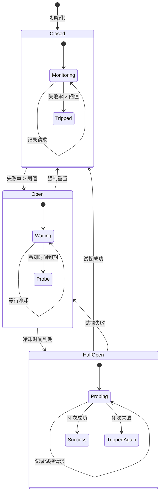

# 熔断器状态机与实现

熔断器的核心是一个状态机。理解状态机的设计，是深入掌握熔断器模式的关键。

上一节我们了解了熔断器的三种状态和基本原理，本节将深入讲解状态转换的细节，以及如何手写一个熔断器实现。

## 熔断器状态机详解

### 状态定义

```java title="CircuitBreakerState.java"
public enum CircuitBreakerState {
    CLOSED,    // 关闭状态：正常通行
    OPEN,      // 打开状态：拒绝请求
    HALF_OPEN  // 半开状态：试探恢复
}
```

### 状态转换事件

```java title="CircuitBreakerEvent.java"
public enum CircuitBreakerEvent {
    REQUEST_SUCCESS,      // 请求成功
    REQUEST_FAILURE,      // 请求失败
    TIMEOUT_EXCEEDED,     // 请求超时
    SLOW_CALL,            // 慢调用
    STATE_TRANSITION,     // 状态转换
    FAILURE_RATE_EXCEEDED // 失败率超标
}
```

### 完整状态转换图



## 熔断器参数详解

### 滑动窗口类型

| 类型 | 说明 | 适用场景 |
| --- | --- | --- |
| **COUNT_BASED** | 记录最近 N 次请求的结果 | 请求量稳定的场景 |
| **TIME_BASED** | 记录最近 N 秒内的请求结果 | 请求量波动的场景 |

### 核心参数

```java title="CircuitBreakerConfig.java"
public class CircuitBreakerConfig {

    // 滑动窗口大小
    // COUNT_BASED: 最近 N 次请求
    // TIME_BASED: 最近 N 秒
    private final int slidingWindowSize = 10;

    // 滑动窗口类型
    private final SlidingWindowType slidingWindowType = SlidingWindowType.COUNT_BASED;

    // 失败率阈值（百分比）
    // 超过此比例则跳闸
    private final float failureRateThreshold = 50;

    // 最少请求数
    // 窗口内请求数少于此值时，不计算失败率
    private final int minimumNumberOfCalls = 5;

    // 慢调用阈值（毫秒）
    // 超过此时间的调用视为慢调用
    private final long slowCallDurationThreshold = 2000;

    // 慢调用失败率阈值
    // 慢调用比例超过此值则跳闸
    private final float slowCallRateThreshold = 80;

    // 熔断器打开后的等待时间
    private final Duration waitDurationInOpenState = Duration.ofSeconds(60);

    // 半开状态允许的请求数
    private final int permittedNumberOfCallsInHalfOpenState = 3;

    // 半开状态成功阈值
    // 成功次数达到此值则关闭熔断器
    private final int successThreshold = 2;
}
```

## 熔断器实现

### 核心实现类

```java title="CircuitBreaker.java"
public class CircuitBreaker {

    private final String name;
    private final CircuitBreakerConfig config;

    // 当前状态
    private volatile CircuitBreakerState state = CircuitBreakerState.CLOSED;

    // 状态转换器
    private final StateTransitions stateTransitions;

    // 指标记录器
    private final Metrics metrics;

    // 状态转换监听器
    private final List<StateTransitionListener> listeners = new CopyOnWriteArrayList<>();

    public CircuitBreaker(String name, CircuitBreakerConfig config) {
        this.name = name;
        this.config = config;
        this.stateTransitions = new StateTransitions(config);
        this.metrics = new Metrics(config.getSlidingWindowSize(), config.getSlidingWindowType());
    }

    // 核心方法：判断请求是否允许通过
    public boolean allowRequest() {
        switch (state) {
            case CLOSED:
                return true;
            case OPEN:
                // 检查冷却时间是否到期
                if (stateTransitions.isCoolingTimeExpired()) {
                    transitionToHalfOpen();
                    return true;
                }
                return false;
            case HALF_OPEN:
                // 半开状态允许有限请求通过
                return metrics.getHalfOpenCalls() < config.getPermittedNumberOfCallsInHalfOpenState();
            default:
                return false;
        }
    }

    // 记录请求结果
    public void recordSuccess() {
        metrics.recordSuccess();
        if (state == CircuitBreakerState.HALF_OPEN) {
            if (metrics.getHalfOpenSuccesses() >= config.getSuccessThreshold()) {
                transitionToClosed();
            }
        }
        checkFailureRate();
    }

    public void recordFailure() {
        metrics.recordFailure();
        if (state == CircuitBreakerState.HALF_OPEN) {
            if (metrics.getHalfOpenFailures() >= config.getPermittedNumberOfCallsInHalfOpenState()) {
                transitionToOpen();
            }
        }
        checkFailureRate();
    }

    private void checkFailureRate() {
        if (state == CircuitBreakerState.CLOSED) {
            if (metrics.getFailureRate() >= config.getFailureRateThreshold()) {
                if (metrics.getTotalCalls() >= config.getMinimumNumberOfCalls()) {
                    transitionToOpen();
                }
            }
        }
    }

    private void transitionToOpen() {
        state = CircuitBreakerState.OPEN;
        stateTransitions.onOpen();
        notifyListeners(CircuitBreakerState.OPEN);
        log.info("熔断器 [{}] 打开", name);
    }

    private void transitionToHalfOpen() {
        state = CircuitBreakerState.HALF_OPEN;
        metrics.resetHalfOpenCounters();
        stateTransitions.onHalfOpen();
        notifyListeners(CircuitBreakerState.HALF_OPEN);
        log.info("熔断器 [{}] 进入半开状态", name);
    }

    private void transitionToClosed() {
        state = CircuitBreakerState.CLOSED;
        metrics.reset();
        stateTransitions.onClosed();
        notifyListeners(CircuitBreakerState.CLOSED);
        log.info("熔断器 [{}] 关闭", name);
    }

    private void notifyListeners(CircuitBreakerState newState) {
        for (StateTransitionListener listener : listeners) {
            listener.onStateTransition(state, newState);
        }
    }
}
```

### 指标记录器实现

```java title="Metrics.java"
public class Metrics {

    private final int windowSize;
    private final SlidingWindowType windowType;

    // 环形缓冲区存储请求结果
    private final AtomicReferenceArray<Boolean> calls;
    private final AtomicInteger callIndex = new AtomicInteger(0);

    // 半开状态计数器
    private final AtomicInteger halfOpenCalls = new AtomicInteger(0);
    private final AtomicInteger halfOpenSuccesses = new AtomicInteger(0);
    private final AtomicInteger halfOpenFailures = new AtomicInteger(0);

    public Metrics(int windowSize, SlidingWindowType windowType) {
        this.windowSize = windowSize;
        this.windowType = windowType;
        this.calls = new AtomicReferenceArray<>(windowSize);
    }

    public void recordSuccess() {
        int index = callIndex.getAndIncrement() % windowSize;
        calls.set(index, true);
    }

    public void recordFailure() {
        int index = callIndex.getAndIncrement() % windowSize;
        calls.set(index, false);
    }

    public float getFailureRate() {
        int total = 0;
        int failures = 0;

        for (int i = 0; i < windowSize; i++) {
            Boolean result = calls.get(i);
            if (result != null) {
                total++;
                if (!result) {
                    failures++;
                }
            }
        }

        if (total == 0) {
            return 0f;
        }
        return (float) failures / total * 100;
    }

    public int getTotalCalls() {
        int count = 0;
        for (int i = 0; i < windowSize; i++) {
            if (calls.get(i) != null) {
                count++;
            }
        }
        return count;
    }

    public void reset() {
        for (int i = 0; i < windowSize; i++) {
            calls.set(i, null);
        }
        callIndex.set(0);
        resetHalfOpenCounters();
    }

    public void resetHalfOpenCounters() {
        halfOpenCalls.set(0);
        halfOpenSuccesses.set(0);
        halfOpenFailures.set(0);
    }

    // Getters for half-open state
    public int getHalfOpenCalls() { return halfOpenCalls.get(); }
    public int getHalfOpenSuccesses() { return halfOpenSuccesses.get(); }
    public int getHalfOpenFailures() { return halfOpenFailures.get(); }
}
```

## 状态转换器

```java title="StateTransitions.java"
public class StateTransitions {

    private final Duration waitDurationInOpenState;

    private volatile long openedAt;
    private volatile long halfOpenedAt;

    public StateTransitions(CircuitBreakerConfig config) {
        this.waitDurationInOpenState = config.getWaitDurationInOpenState();
    }

    public void onOpen() {
        openedAt = System.currentTimeMillis();
    }

    public void onHalfOpen() {
        halfOpenedAt = System.currentTimeMillis();
    }

    public void onClosed() {
        openedAt = 0;
        halfOpenedAt = 0;
    }

    public boolean isCoolingTimeExpired() {
        if (openedAt == 0) {
            return true;
        }
        return System.currentTimeMillis() - openedAt >= waitDurationInOpenState.toMillis();
    }
}
```

## 使用示例

```java title="UsageExample.java"
public class UsageExample {

    private final CircuitBreaker circuitBreaker;

    public UsageExample() {
        CircuitBreakerConfig config = CircuitBreakerConfig.custom()
            .slidingWindowSize(10)
            .failureRateThreshold(50)
            .waitDurationInOpenState(Duration.ofSeconds(60))
            .permittedNumberOfCallsInHalfOpenState(3)
            .build();

        this.circuitBreaker = new CircuitBreaker("payment-service", config);

        // 添加状态转换监听器
        circuitBreaker.addStateTransitionListener((from, to) ->
            log.info("熔断器状态变化: {} -> {}", from, to));
    }

    public Result callPaymentService(PaymentRequest request) {
        if (!circuitBreaker.allowRequest()) {
            // 熔断器打开，直接返回降级结果
            log.warn("熔断器打开，拒绝请求");
            return Result.degraded("服务暂时不可用，请稍后重试");
        }

        try {
            Result result = paymentClient.process(request);
            circuitBreaker.recordSuccess();
            return result;
        } catch (Exception e) {
            circuitBreaker.recordFailure();
            return Result.error(e.getMessage());
        }
    }
}
```

## 监控指标

```yaml title="熔断器监控指标"
# Prometheus 指标
circuitbreaker:
  - name: circuitbreaker_state
    type: gauge
    labels: [name]
    description: "熔断器状态 (0=CLOSED, 1=OPEN, 2=HALF_OPEN)"

  - name: circuitbreaker_calls_total
    type: counter
    labels: [name, result]
    description: "熔断器记录的总请求数 (success/failure/rejected)"

  - name: circuitbreaker_failure_rate
    type: gauge
    labels: [name]
    description: "当前滑动窗口内的失败率"

  - name: circuitbreaker_state_transitions_total
    type: counter
    labels: [name, from_state, to_state]
    description: "熔断器状态转换次数"
```

## 本章总结

**核心要点**：

1. **熔断器是状态机**：CLOSED → OPEN → HALF_OPEN → CLOSED 形成完整闭环
2. **滑动窗口决定失败率计算**：COUNT_BASED 和 TIME_BASED 各有适用场景
3. **半开状态是恢复试探**：验证后端服务是否真的恢复了
4. **状态转换监听很重要**：用于监控和告警
5. **指标是熔断器的大脑**：没有准确的指标统计，熔断器就无法正确工作
