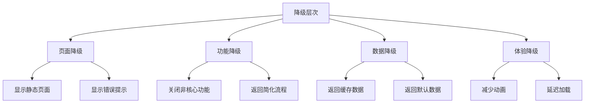

# 降级模式（Degradation）

降级是系统在面对故障时的最后一道防线。

当熔断器打开、重试失败、或者依赖服务完全不可用时，系统不能简单地返回 500 错误——这对用户来说是完全无法接受的结果。降级模式的核心思想是：**在系统承压或故障时，返回一个有损但可用的响应，保证核心功能继续工作。**

## 降级的层次



## 降级策略

| 策略 | 说明 | 用户感知 |
| --- | --- | --- |
| **返回默认值** | 返回一个合理的默认结果 | 功能基本可用 |
| **返回缓存数据** | 返回之前缓存的数据 | 数据可能稍旧 |
| **返回静态内容** | 显示静态页面或内容 | 基本可读 |
| **关闭非核心功能** | 只保留核心功能 | 功能减少但核心可用 |
| **显示友好错误** | 返回友好的错误提示 | 知道发生了什么 |

## 降级实现

### 基础降级模式

```java title="DegradationPattern.java"
@Service
public class DegradationPattern {

    // 缓存，用于返回旧数据
    private final Map<String, Object> cache = new ConcurrentHashMap<>();

    // 推荐服务降级
    public RecommendationResult getRecommendation(Long userId) {
        try {
            RecommendationResult result = recommendationService.getRecommendation(userId);
            // 成功时更新缓存
            cache.put("recommendation:" + userId, result);
            return result;
        } catch (Exception e) {
            // 降级：返回缓存数据
            RecommendationResult cached = (RecommendationResult) cache.get("recommendation:" + userId);
            if (cached != null) {
                log.warn("推荐服务降级，返回缓存数据: userId={}", userId);
                return cached;
            }

            // 缓存也没有，返回默认推荐
            log.error("推荐服务降级，无缓存数据: userId={}", userId);
            return getDefaultRecommendation();
        }
    }

    private RecommendationResult getDefaultRecommendation() {
        // 返回热门商品作为默认推荐
        return new RecommendationResult(
            List.of(
                new Product(1L, "热门商品 A"),
                new Product(2L, "热门商品 B"),
                new Product(3L, "热门商品 C")
            )
        );
    }
}
```

### Spring Cloud OpenFeign 降级

```java title="FeignDegradation.java"
@FeignClient(name = "user-service",
    fallback = UserServiceFallback.class)
public interface UserFeignClient {

    @GetMapping("/user/{id}")
    User getUser(@PathVariable("id") Long id);
}

@Component
@Slf4j
public class UserServiceFallback implements UserFeignClient {

    @Override
    public User getUser(Long id) {
        log.warn("UserService 降级，返回默认用户: userId={}", id);
        // 返回默认用户
        return User.builder()
            .id(id)
            .name("Guest User")
            .level(UserLevel.NORMAL)
            .build();
    }
}
```

### Resilience4j 降级

```java title="Resilience4jDegradation.java"
@Service
public class Resilience4jDegradation {

    private final CircuitBreakerRegistry registry;

    public Product getProduct(Long productId) {
        CircuitBreaker circuitBreaker = registry.circuitBreaker("productService");

        Supplier<Product> supplier = () -> productService.getProduct(productId);
        Function<Throwable, Product> fallback = e -> {
            log.warn("ProductService 降级: productId={}, error={}",
                productId, e.getMessage());
            return getDefaultProduct(productId);
        };

        return Decorators.ofSupplier(supplier)
            .withCircuitBreaker(circuitBreaker)
            .withFallback(List.of(Exception.class), fallback)
            .decorate()
            .get();
    }

    private Product getDefaultProduct(Long productId) {
        // 返回占位商品
        return Product.builder()
            .id(productId)
            .name("商品信息加载中...")
            .price(BigDecimal.ZERO)
            .status(ProductStatus.UNAVAILABLE)
            .build();
    }
}
```

## 功能降级策略

### 非核心功能降级

```yaml title="功能降级配置"
degradation:
  rules:
    - name: "推荐服务降级"
      resource: "recommendation-service"
      trigger:
        type: "circuit_breaker"
        state: "open"
      action:
        - type: "disable_feature"
          feature: "personalized_recommendation"
        - type: "enable_fallback"
          fallback: "hot_products"

    - name: "评论服务降级"
      resource: "comment-service"
      trigger:
        type: "timeout"
        duration: "3s"
      action:
        - type: "hide_feature"
          feature: "comment_section"
```

### 分层降级

```java title="LayeredDegradation.java"
public class LayeredDegradation {

    public Response handleRequest(Request request) {
        // 第一层：正常服务
        try {
            return primaryService.process(request);
        } catch (ServiceUnavailableException e) {
            // 第二层：缓存数据
            try {
                return cacheService.get(request);
            } catch (CacheMissException ex) {
                // 第三层：默认数据
                return defaultResponse(request);
            }
        }
    }
}
```

## 降级的最佳实践

### 实践一：降级要提前设计

降级不能临时抱佛脚，要在系统设计时就规划好：

```java title="DegradationDesign.java"
@Service
public class OrderService {

    // 核心功能（不可降级）
    private final List<String> CORE_FEATURES = List.of(
        "create_order",
        "cancel_order",
        "payment"
    );

    // 重要功能（可降级）
    private final List<String> IMPORTANT_FEATURES = List.of(
        "inventory_check",
        "promotion_check"
    );

    // 非核心功能（优先降级）
    private final List<String> NON_CORE_FEATURES = List.of(
        "recommendation",
        "comment",
        "rating"
    );

    public boolean shouldDegrade(String feature) {
        if (CORE_FEATURES.contains(feature)) {
            return false; // 核心功能不降级
        }
        if (IMPORTANT_FEATURES.contains(feature)) {
            return checkSystemLoad() > 0.8; // 高负载时降级
        }
        return true; // 非核心功能随时可降级
    }
}
```

### 实践二：降级要有兜底

```java title="FallbackStrategy.java"
public class FallbackStrategy {

    public Object getFallback(String resource, Exception e) {
        switch (resource) {
            case "user-service":
                return getDefaultUser();

            case "product-service":
                return getDefaultProduct();

            case "recommendation-service":
                return getHotProducts();

            case "inventory-service":
                return getUnlimitedInventory();

            default:
                return getGenericFallback();
        }
    }

    private User getDefaultUser() {
        return User.builder()
            .id(0L)
            .name("Guest")
            .level(UserLevel.GUEST)
            .build();
    }

    private Product getDefaultProduct() {
        return Product.builder()
            .id(0L)
            .name("Default Product")
            .status(ProductStatus.AVAILABLE)
            .build();
    }

    private List<Product> getHotProducts() {
        // 返回硬编码的热门商品
        return hotProductRepository.getCachedHotProducts();
    }
}
```

### 实践三：降级要可监控

```java title="DegradationMonitor.java"
@Service
public class DegradationMonitor {

    private final Map<String, AtomicLong> degradationCounter = new ConcurrentHashMap<>();

    public void recordDegradation(String resource, String reason) {
        degradationCounter.computeIfAbsent(resource, k -> new AtomicLong())
            .incrementAndGet();

        // 发送指标到监控系统
        metrics.record("degradation_total",
            Map.of("resource", resource, "reason", reason));
    }

    public DegradationStatus getStatus() {
        return DegradationStatus.builder()
            .totalDegradation(degradationCounter.values().stream()
                .mapToLong(AtomicLong::get)
                .sum())
            .byResource(degradationCounter.entrySet().stream()
                .collect(Collectors.toMap(
                    Map.Entry::getKey,
                    e -> e.getValue().get()
                )))
            .build();
    }
}
```

## 降级与用户体验

降级不仅要保证功能可用，还要尽量减少对用户的影响：

```yaml title="降级用户体验策略"
user_experience:
  # 降级时显示友好提示
  friendly_message:
    - "数据加载中，请稍后..."
    - "服务繁忙，部分功能暂时不可用"
    - "推荐服务暂时无法个性化，请查看热门商品"

  # 降级时保持页面可用
  page_available:
    - "核心功能正常"
    - "非核心功能稍后恢复"

  # 降级时提供替代方案
  alternative:
    - "您可以查看热门商品"
    - "您可以稍后再试"
```

## 本章总结

**核心要点**：

1. **降级是系统的最后防线**：在所有容错手段都失效时，降级保证核心功能可用
2. **降级策略要提前设计**：不能临时抱佛脚
3. **降级要有层次**：缓存 → 默认值 → 静态内容
4. **降级要可监控**：知道什么时候降级了，降级了多少次
5. **降级要关注用户体验**：降级不等于「返回错误」
