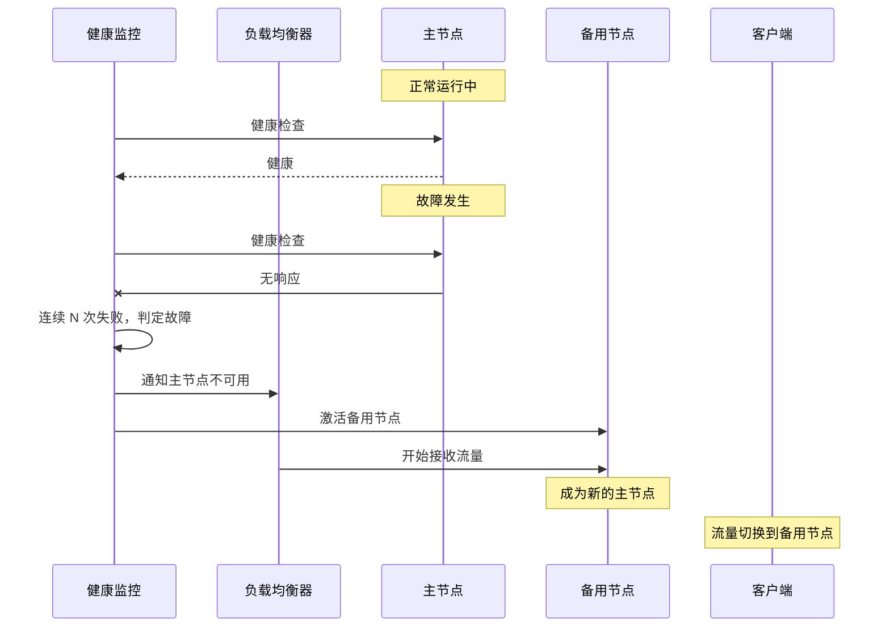

# 故障切换（Failover）

当主节点不可用时，自动切换到备用节点，保证服务连续性。

故障切换（Failover）是高可用架构的核心机制之一。无论是数据库主从、服务多实例，还是 DNS 负载均衡，都离不开故障切换。本节深入讲解故障切换的原理、类型和实现。

## 故障切换的完整流程



## 故障切换的三种类型

| 类型 | 说明 | 适用场景 | RTO |
| --- | --- | --- | --- |
| **主动-被动（Active-Passive）** | 主节点工作，备节点待机 | 数据库、关键服务 | 分钟级 |
| **主动-主动（Active-Active）** | 多节点同时工作，流量均衡 | 无状态服务 | 秒级 |
| **主从切换（Primary-Backup）** | 从节点晋升为主节点 | 复制集、集群 | 秒级~分钟级 |

## 主动-被动故障切换

主节点处理所有请求，备节点待机。主节点故障时，流量切换到备节点。

### 数据库主从切换

```java title="DatabaseFailover.java"
@Service
public class DatabaseFailoverService {

    private final DataSource primary;
    private final DataSource standby;
    private final AtomicReference<DataSource> currentMaster = new AtomicReference<>();

    @PostConstruct
    public void init() {
        currentMaster.set(primary);
    }

    @Scheduled(fixedRate = 5000)
    public void healthCheck() {
        DataSource current = currentMaster.get();

        if (isHealthy(current)) {
            return;
        }

        log.warn("主数据库不可用，开始故障切换");
        failover();
    }

    private boolean isHealthy(DataSource ds) {
        try (Connection conn = ds.getConnection()) {
            return conn.isValid(3);
        } catch (SQLException e) {
            return false;
        }
    }

    private void failover() {
        DataSource oldMaster = currentMaster.getAndSet(standby);
        log.info("故障切换完成：从 {} 切换到 {}", oldMaster, standby);

        // 通知应用程序刷新连接池
        applicationEventPublisher.publishEvent(
            new DatabaseFailoverEvent(this, oldMaster, standby)
        );
    }

    // 所有数据库操作通过此方法路由
    public <T> T execute(ConnectionCallback<T> callback) throws SQLException {
        DataSource ds = currentMaster.get();
        try (Connection conn = ds.getConnection()) {
            return callback.doInConnection(conn);
        }
    }
}
```

### Redis Sentinel 故障切换

```yaml title="redis-sentinel-config.yaml"
# Redis Sentinel 配置
sentinel:
  monitor:
    mymaster:
      host: 192.168.1.10:6379
      quorum: 2      # 2 个 Sentinel 同意才切换
      failover_timeout: 180000  # 故障切换超时时间

  down_afterMilliseconds: 30000  # 30 秒无响应判定为 down
  parallel_syncs: 1              # 一次只同步一个从节点
```

```java title="RedisSentinelFailover.java"
@Service
public class RedisSentinelFailover {

    @Autowired
    private RedisSentinelConfiguration sentinelConfig;

    private final AtomicReference<String> currentMaster = new AtomicReference<>();

    @PostConstruct
    public void init() {
        // 启动时获取主节点
        currentMaster.set(getCurrentMaster());

        // 订阅 Sentinel 故障切换事件
        subscribeFailoverEvents();
    }

    private void subscribeFailoverEvents() {
        sentinelConfig.getSentinelConnections().forEach(conn -> {
            conn.addListener((channel, message) -> {
                if (message.contains("+switch-master")) {
                    String newMaster = extractNewMaster(message);
                    currentMaster.set(newMaster);
                    log.info("Sentinel 故障切换: 新的主节点 = {}", newMaster);
                }
            });
        });
    }
}
```

## 主动-主动故障切换

多个节点同时工作，负载均衡器将流量分发到所有健康节点。

```yaml title="active-active-lb.yaml"
# Nginx 主动-主动配置
upstream backend {
    server 192.168.1.10:8080;
    server 192.168.1.11:8080;
    server 192.168.1.12:8080;

    # 健康检查配置
    check interval=3000 rise=2 fall=3 timeout=1000 type=http;
    check_http_send "GET /health HTTP/1.0\r\n\r\n";
    check_http_expect_alive "200 204";
}

server {
    listen 80;
    location / {
        proxy_pass http://backend;
    }
}
```

## DNS 故障切换

DNS 故障切换通过修改 DNS 记录实现：

```java title="DnsFailover.java"
@Service
public class DnsFailoverService {

    private final Route53Client route53Client;

    public void updateDnsRecord(String recordName, String newIp) {
        // 获取当前 DNS 记录
        List<ResourceRecordSet> currentRecords =
            route53Client.listResourceRecordSets(
                ListResourceRecordSetsRequest.builder()
                    .hostedZoneId(hostedZoneId)
                    .startRecordName(recordName)
                    .build()
            );

        // 更新 DNS 记录
        Change change = Change.builder()
            .action(ChangeAction.UPSERT)
            .resourceRecordSet(
                ResourceRecordSet.builder()
                    .name(recordName)
                    .type(Route53Type.A)
                    .ttl(60L)  # 短 TTL 加快切换
                    .records(ResourceRecord.builder()
                        .value(newIp)
                        .build())
                    .build()
            )
            .build();

        route53Client.changeResourceRecordSets(ChangeResourceRecordSetsRequest.builder()
            .hostedZoneId(hostedZoneId)
            .changeBatch(ChangeBatch.builder()
                .changes(change)
                .build())
            .build());

        log.info("DNS 记录已更新: {} -> {}", recordName, newIp);
    }
}
```

## 故障切换的注意事项

### 1. 脑裂问题（Split-Brain）

当网络分区导致主备节点互相认为对方挂了时，会出现脑裂——两个节点都认为自己主节点：

```mermaid
flowchart LR
    subgraph 分区 A
        A_Master["节点 A（自认为主）"]
        A_Service["服务 A"]
    end

    subgraph 分区 B
        B_Master["节点 B（自认为主）"]
        B_Service["服务 B"]
    end

    Note over A_Master,B_Master: 分区期间，两个节点都工作
    Note over A_Service,B_Service: 造成数据不一致！
```

**解决方案**：使用仲裁节点（如 Zookeeper）或法定人数（Quorum）。

### 2. 数据同步问题

切换前必须确保数据已同步：

```java title="SyncCheckFailover.java"
public boolean canFailover() {
    // 检查主从同步延迟
    long lag = replicationLag.get();

    // 检查未同步的事务数
    long pendingTx = pendingTransactionCount.get();

    // 如果延迟超过阈值，不允许切换
    if (lag > MAX_ALLOWED_LAG || pendingTx > MAX_ALLOWED_PENDING_TX) {
        log.warn("数据同步未完成，禁止故障切换: lag={}, pending={}",
            lag, pendingTx);
        return false;
    }

    return true;
}
```

### 3. IP 漂移问题

虚拟 IP（VIP）漂移可以实现快速切换：

```bash
# Keepalived 配置
vrrp_instance VI_1 {
    state MASTER              # 主节点
    interface eth0
    virtual_router_id 51
    priority 100             # 主节点优先级高
    virtual_ipaddress {
        192.168.1.100     # 虚拟 IP
    }
    track_interface {
        eth0
    }
}
```

## 故障切换监控指标

```yaml title="failover-metrics.yaml"
# 故障切换监控指标
metrics:
  - name: failover_total
    type: counter
    description: "故障切换总次数"

  - name: failover_duration_seconds
    type: histogram
    description: "故障切换耗时"

  - name: failover_reason
    type: counter
    labels: [reason]
    description: "故障切换原因统计"

  - name: failover_data_loss_bytes
    type: gauge
    description: "切换时的数据丢失量"

# 告警规则
alerts:
  - name: FrequentFailover
    condition: failover_total > 3
    window: 1h
    message: "1 小时内发生了超过 3 次故障切换"
```

## 质量判断标准

一篇「故障切换」的文章是否达标，要看它是否回答了：

1. ✅ 故障切换的完整流程是什么？
2. ✅ 主动-被动、主动-主动有什么区别？
3. ✅ 有哪些典型实现（数据库、Redis、DNS）？
4. ✅ 故障切换有哪些坑（脑裂、数据同步、IP漂移）？
5. ❌ 只讲概念，没有代码和实现——不达标

## 本章总结

**核心要点**：

1. **故障切换保证服务连续性**：主节点不可用时，备用节点接管
2. **主动-被动适合关键服务**：RTO 较长但成本低
3. **主动-主动适合无状态服务**：RTO 短但成本高
4. **脑裂是最大风险**：需要仲裁机制或法定人数
5. **切换前必须验证数据同步**：避免数据丢失
