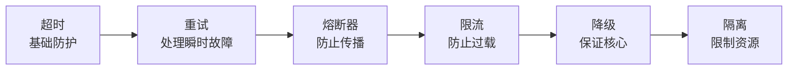

# 容错模式

设计「坏了怎么办」，而不是假设「不会坏」。

容错模式是针对特定故障类型的防护手段：超时防止无限等待、重试处理瞬时故障、熔断器防止故障传播、限流防止过载、降级保证核心功能、隔离防止资源耗尽。理解每种模式的原理和使用场景，是设计高可用架构的核心能力。

## 模块结构

本模块分为三个部分：

### 基础模式

| 文章 | 核心问题 |
| --- | --- |
| [容错模式概述](/resilience/patterns/overview) | 容错模式的完整体系 |
| [超时模式](/resilience/patterns/timeout) | 防止无限等待 |
| [超时配置最佳实践](/resilience/patterns/timeout-config) | 如何设置合理的超时 |
| [重试模式](/resilience/patterns/retry) | 处理瞬时故障 |
| [退避策略](/resilience/patterns/backoff) | 避免重试风暴 |
| [重试风暴](/resilience/patterns/retry-storm) | 如何防止重试放大故障 |

### 防护模式

| 文章 | 核心问题 |
| --- | --- |
| [熔断器](/resilience/patterns/circuit-breaker) | 防止故障传播 |
| [熔断器状态机](/resilience/patterns/circuit-breaker-state) | 状态转换原理 |
| [Resilience4j 实战](/resilience/patterns/resilience4j) | Java 生态最佳实践 |
| [限流概述](/resilience/patterns/rate-limiting) | 限流的原理与场景 |
| [令牌桶](/resilience/patterns/token-bucket) | 支持突发的限流算法 |
| [漏桶](/resilience/patterns/leaky-bucket) | 平滑输出的限流算法 |
| [滑动窗口](/resilience/patterns/sliding-window) | 精确的限流算法 |
| [分布式限流](/resilience/patterns/distributed-rate-limit) | Redis + Lua 实现 |
| [Sentinel 实战](/resilience/patterns/sentinel) | 阿里限流降级方案 |
| [降级模式](/resilience/patterns/degradation) | 保证核心功能可用 |
| [降级策略](/resilience/patterns/degradation-strategies) | 不同场景的降级策略 |
| [舱壁隔离](/resilience/patterns/bulkhead) | 防止资源耗尽 |
| [舱壁类型](/resilience/patterns/bulkhead-types) | 线程池 vs 信号量 |
| [舱壁实现](/resilience/patterns/bulkhead-implementation) | 完整实现代码 |

### 组合与最佳实践

| 文章 | 核心问题 |
| --- | --- |
| [故障切换](/resilience/patterns/failover) | 主备自动切换 |
| [快速失败](/resilience/patterns/fail-fast) | 尽早暴露问题 |
| [静默失败](/resilience/patterns/fail-silent) | 非核心功能的容错 |
| [模式组合](/resilience/patterns/composition) | 如何组合使用多种模式 |
| [配置最佳实践](/resilience/patterns/best-practices) | 容错配置检查清单 |

## 核心演进路径



## 容错模式组合示例

```
请求入口
  ↓
限流（防止过载）
  ↓
超时（防止无限等待）
  ↓
重试（处理瞬时故障）
  ↓
熔断器（防止故障传播）
  ↓
舱壁隔离（限制资源消耗）
  ↓
降级（返回兜底数据）
```

## 选型决策树

```mermaid
flowchart TD
    A["需要哪种容错？"] --> B{"是瞬时故障吗？"}
    B -->|"是| C["重试 + 退避"]
    B -->|"否| D{"需要防止故障传播？"}
    D -->|"是| E["熔断器"]
    D -->|"否| F{"需要防止过载？"}
    F -->|"是| G["限流"]
    F -->|"否| H{"需要保证核心功能？"}
    H -->|"是| I["降级"]
```

准备好开始了吗？从[容错模式概述](/resilience/patterns/overview)开始。
