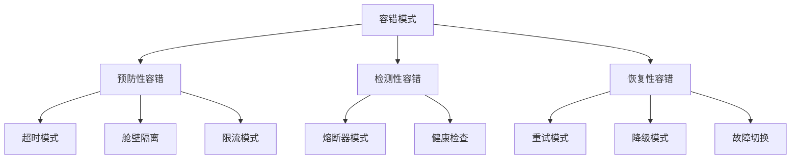
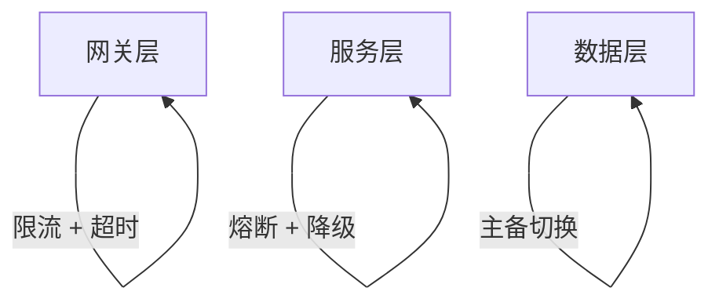
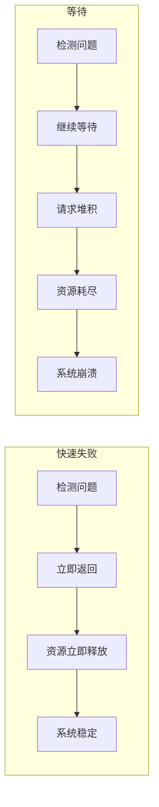

# 容错模式全景

容错不是银弹，但离了容错寸步难行。

分布式系统就像一个精密的生态系统，故障是常态而非例外。一次网络抖动、一个数据库慢查询、一段 GC 停顿——这些看似微小的问题，在复杂的调用链中会被放大，最终演变成一场全站故障。

容错模式是应对这些问题的系统性方法论。不是靠「多加服务器」来硬扛，而是通过设计让系统在面对局部故障时依然保持整体可用。

## 容错模式的完整图谱



### 三大类容错模式

| 类型 | 核心思想 | 代表模式 |
| --- | --- | --- |
| **预防性容错** | 在故障发生前做好准备 | 超时、舱壁隔离、限流 |
| **检测性容错** | 快速检测故障并隔离 | 熔断器、健康检查 |
| **恢复性容错** | 故障发生后快速恢复 | 重试、降级、故障切换 |

## 容错模式组合使用

单一容错模式往往不够，需要组合使用才能应对复杂的故障场景：

```mermaid
flowchart LR
    subgraph 完整容错链路
        A["请求进入"] --> B["限流\n防止过载"]
        B --> C["超时\n防止无限等待"]
        C --> D["熔断器\n防止故障传播"]
        D --> E["重试\n处理瞬时故障"]
        E --> F{"成功？"}
        F -->|"失败| G["降级\n返回兜底数据"]
        F -->|"成功| H["返回结果"]
    end
```

**为什么需要组合使用？**

- **限流**：保护系统不被突发流量冲垮
- **超时**：防止请求无限等待
- **熔断**：当故障持续时快速失败，不再调用
- **重试**：处理瞬时故障
- **降级**：故障发生时返回有损但可用的结果

## 模式之间的关系

```mermaid
flowchart TD
    A["超时模式"] --> |"超时后的选择| B["重试 or 降级"]
    B --> C["重试失败多次"]
    C --> D["触发熔断器"]
    D --> E["熔断期间降级"]

    F["限流"] --> |"被限流| G["降级"]
    G --> D

    H["舱壁隔离"] --> |"隔离某个依赖| I["限制影响范围"]
    I --> D
```

## 容错模式的选型指南

| 场景 | 推荐模式 | 原因 |
| --- | --- | --- |
| 调用外部 API | 超时 + 重试 + 熔断 | 网络不稳定，需要多重保护 |
| 数据库访问 | 超时 + 连接池隔离 | 数据库是核心依赖，需要保护 |
| 高并发入口 | 限流 + 降级 | 防止系统被冲垮 |
| 多依赖调用 | 舱壁隔离 + 熔断 | 防止一个依赖拖垮所有 |
| 非核心功能 | 降级 | 非核心功能故障不应影响主流程 |

## 容错设计的原则

### 原则一：分层设计

每一层都需要自己的容错机制：



### 原则二：快速失败优于等待

当系统已经出现问题时，继续等待只会让情况更糟：



### 原则三：降级要优雅

降级不是「返回空」或「抛异常」，而是返回「尽可能有用的部分功能」：

| 降级方式 | 效果 | 适用场景 |
| --- | --- | --- |
| 返回缓存数据 | 用户拿到旧数据 | 读多写少场景 |
| 返回默认值 | 用户能继续操作 | 配置类数据 |
| 返回静态内容 | 基本功能可用 | 内容展示类 |
| 关闭非核心功能 | 核心功能优先 | 功能组合场景 |

## 容错模式的常见误区

### 误区一：只加模式，不加监控

容错机制生效时，团队可能完全不知道——直到用户投诉。

**正确做法**：监控容错机制本身，包括熔断器状态、重试次数、限流触发次数。

### 误区二：重试次数过多

重试是把双刃剑，太多重试会放大故障。

**正确做法**：限制重试次数，使用指数退避。

### 误区三：降级逻辑太简单

降级返回 `null` 或空对象，可能导致下游代码空指针异常。

**正确做法**：设计有意义的降级响应，而非简单返回空。

## 本章总结

**核心要点**：

1. **容错模式分为三类**：预防性、检测性、恢复性，各有分工
2. **容错模式需要组合使用**：限流 + 超时 + 熔断 + 重试 + 降级形成完整链路
3. **快速失败优于等待**：让问题快速暴露，而非堆积后崩溃
4. **降级要优雅**：返回有意义的兜底数据，而非简单返回空
5. **监控容错机制本身**：知道什么时候降级了、什么时候熔断了

接下来我们将深入讲解每个具体的容错模式，从最核心的熔断器模式开始。
