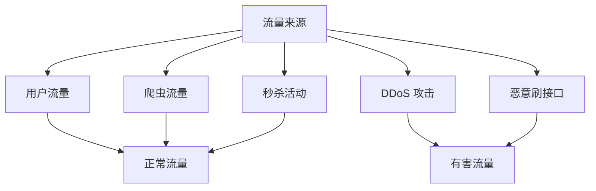
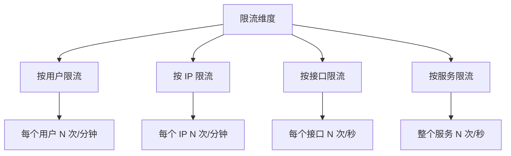
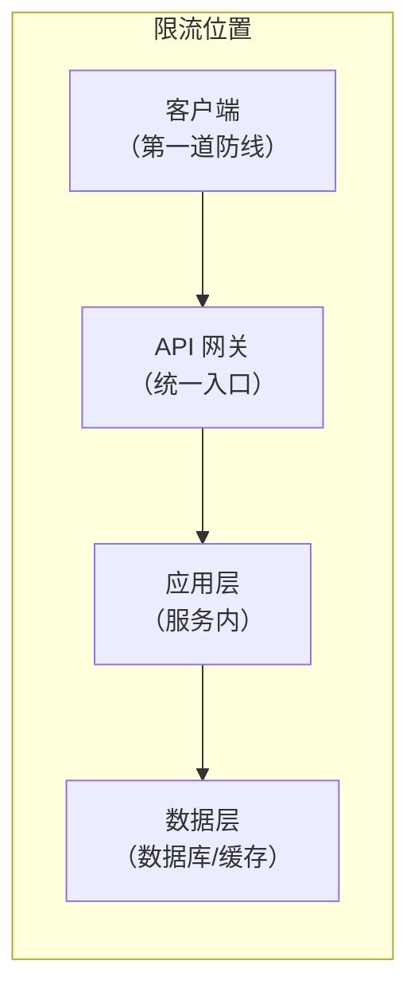

# 限流模式（Rate Limiting）

流量就是水，系统就是堤坝。当水量超过堤坝的承载能力，堤坝就会决堤。

限流是系统在面对突发流量时的自我保护机制。当请求速率超过系统的处理能力时，限流器会主动拒绝部分请求，保护系统不被冲垮。没有限流的系统，就像没有溢洪道的水库——要么等待溃坝，要么被动崩溃。

## 为什么需要限流

### 流量来源



### 限流的作用

| 作用 | 说明 | 示例 |
| --- | --- | --- |
| **保护系统** | 防止被突发流量冲垮 | 秒杀时拒绝过量请求 |
| **保证公平** | 防止少数用户占用全部资源 | API 接口按用户限流 |
| **成本控制** | 控制资源使用，节省成本 | 云服务按请求量计费 |
| **服务降级** | 有策略地放弃部分请求 | 优先保证核心功能 |

## 限流维度

限流可以从多个维度进行：



| 维度 | 优点 | 缺点 |
| --- | --- | --- |
| **按用户** | 公平，保证每个用户都能得到服务 | 需要用户认证 |
| **按 IP** | 实现简单 | 多人共用 IP 或 NAT 环境下不准确 |
| **按接口** | 精细控制，保护重点接口 | 配置复杂 |
| **按服务** | 简单直接 | 过于粗粒度 |

## 限流位置

限流可以在不同层次进行：



| 位置 | 说明 | 优点 | 缺点 |
| --- | --- | --- | --- |
| **客户端** | 前端/SDK 限流 | 节省网络资源 | 可被绕过 |
| **API 网关** | 统一入口限流 | 集中管理，配置简单 | 无法感知业务 |
| **应用层** | 服务内限流 | 精确控制，可结合业务 | 实现复杂 |
| **数据层** | 数据库/Redis 限流 | 精确，全局唯一 | 增加数据库压力 |

## 限流算法

| 算法 | 说明 | 优点 | 缺点 | 适用场景 |
| --- | --- | --- | --- | --- |
| **固定窗口** | 固定时间窗口内限流 | 简单 | 边界可能有突发 | 简单场景 |
| **滑动窗口** | 滑动时间窗口 | 平滑 | 实现复杂 | 精细控制 |
| **令牌桶** | 按固定速率放入令牌 | 支持突发 | - | 需要突发能力 |
| **漏桶** | 固定速率消费 | 平滑 | 不支持突发 | 需要平滑输出 |

## 限流策略

### 拒绝策略

| 策略 | 说明 | HTTP 状态码 |
| --- | --- | --- |
| **直接拒绝** | 返回 429 Too Many Requests | 429 |
| **排队等待** | 进入队列等待处理 | 200（但延迟增加） |
| **服务降级** | 返回降级内容 | 200 |
| **重定向** | 引导到其他服务 | 302/307 |

### 限流响应头

标准限流响应头：

```yaml
# HTTP 响应头
X-RateLimit-Limit: 100          # 限流阈值
X-RateLimit-Remaining: 95       # 剩余请求数
X-RateLimit-Reset: 1640995200   # 限流窗口重置时间（Unix 时间戳）
Retry-After: 30                 # 距离重试的秒数
```

### 降级策略

```yaml title="降级策略配置"
degradation:
  enabled: true

  strategies:
    - name: "非核心接口降级"
      condition: "qps > 1000"
      actions:
        - "关闭推荐服务"
        - "关闭评论功能"
        - "返回静态推荐数据"

    - name: "核心接口优先"
      condition: "qps > 2000"
      actions:
        - "关闭所有非核心功能"
        - "只保留下单和支付"
```

## 限流配置示例

### API 网关层（Nginx）

```nginx title="nginx.conf"
# 按 IP 限流
limit_req_zone $binary_remote_addr zone=ip_limit:10m rate=10r/s;

# 按服务器限流
limit_req_zone $server_name zone=server_limit:10m rate=1000r/s;

server {
    location /api/ {
        # 限流规则：burst=20 表示允许突发 20 个请求
        # nodelay 表示不延迟处理突发请求
        limit_req zone=ip_limit burst=20 nodelay;

        # 返回 503 而不是 429
        limit_req_status 503;

        proxy_pass http://backend;
    }
}
```

### 应用层（Guava RateLimiter）

```java title="RateLimiterExample.java"
public class RateLimiterExample {

    // 每秒允许 100 个请求，支持最多 50 个突发
    private final RateLimiter rateLimiter = RateLimiter.create(100, 50);

    public void handleRequest(Request request) {
        // 获取令牌，最多等待 1 秒
        boolean acquired = rateLimiter.tryAcquire(1, 1, TimeUnit.SECONDS);

        if (!acquired) {
            // 限流
            throw new RateLimitException("请求过于频繁，请稍后重试");
        }

        // 处理请求
        doProcess(request);
    }
}
```

### 分布式限流（Redis + Lua）

```lua title="rate_limit.lua"
-- 限流 Lua 脚本
-- KEYS[1] = 限流 key
-- ARGV[1] = 限流阈值
-- ARGV[2] = 窗口大小（秒）

local key = KEYS[1]
local limit = tonumber(ARGV[1])
local window = tonumber(ARGV[2])

local current = redis.call('GET', key)
if current and tonumber(current) >= limit then
    return 0  -- 拒绝
end

local count = redis.call('INCR', key)
if count == 1 then
    redis.call('EXPIRE', key, window)
end

return 1  -- 通过
```

```java title="RedisRateLimiter.java"
public class RedisRateLimiter {

    private final RedisTemplate<String, String> redisTemplate;
    private final String luaScript;

    public RedisRateLimiter(RedisTemplate<String, String> redisTemplate) {
        this.redisTemplate = redisTemplate;
        this.luaScript = loadScript("rate_limit.lua");
    }

    public boolean isAllowed(String key, int limit, int windowSeconds) {
        Long result = redisTemplate.execute(
            new DefaultRedisScript<>(luaScript, Long.class),
            List.of(key),
            limit, windowSeconds
        );
        return result != null && result == 1;
    }
}
```

## 限流监控

```yaml title="限流监控指标"
# Prometheus 指标
rate_limiter:
  - name: requests_total
    type: counter
    labels: [result]
    description: "总请求数 (allowed/rejected)"

  - name: current_limit
    type: gauge
    description: "当前限流阈值"

  - name: queue_depth
    type: gauge
    description: "当前排队请求数"

  # 告警规则
  - alert: HighRejectionRate
    expr: |
      sum(rate(rate_limiter_requests_total{result="rejected"}[5m]))
      / sum(rate(rate_limiter_requests_total[5m])) > 0.1
    for: 5m
    labels:
      severity: warning
    annotations:
      summary: "限流拒绝率超过 10%"
```

## 限流最佳实践

1. **多层次限流**：客户端 + 网关 + 应用层，层层防护
2. **差异化限流**：核心接口限流宽松，非核心接口限流严格
3. **柔性可用**：限流时返回友好提示，而非直接拒绝
4. **监控告警**：限流触发时及时告警
5. **动态调整**：根据系统负载动态调整限流阈值

## 本章总结

**核心要点**：

1. **限流是系统的自我保护**：防止突发流量冲垮系统
2. **限流维度要多样化**：用户、IP、接口、服务多个维度
3. **多层次限流更安全**：客户端、网关、应用层层层防护
4. **限流策略要灵活**：拒绝、排队、降级多种选择
5. **监控是限流的必要配套**：知道什么时候触发了限流
