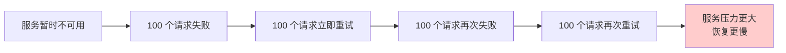

# 重试风暴与防范

重试是处理瞬时故障的好方法，但不当的重试可能让情况变得更糟。

当系统发生故障时，大量请求同时失败、同时重试，会对系统造成更大的压力。这就是「重试风暴」。一个本来只需要 30 秒就能恢复的系统，可能因为重试风暴需要 5 分钟才能恢复。

## 重试风暴的形成



## 重试风暴的特征

| 特征 | 说明 |
| --- | --- |
| **流量放大** | 重试次数 = 原始流量 × 重试次数 |
| **集中爆发** | 所有失败的请求在同一时间重试 |
| **恢复延长** | 过大的流量延缓系统恢复 |

## 防范策略

### 1. 抖动（Jitter）

让重试时间随机分散：

```java title="JitteredRetry.java"
public long calculateDelayWithJitter(int attempt) {
    long baseDelay = (long) (BASE_DELAY_MS * Math.pow(2, attempt - 1));
    long jitter = (long) (Math.random() * baseDelay);
    return jitter;
}
```

### 2. 熔断器保护

连续失败时停止重试：

```java title="CircuitBreakerRetry.java"
public Result callWithRetry(String requestId) {
    // 检查熔断器
    if (circuitBreaker.isOpen()) {
        throw new RetryRejectedException("Circuit breaker open");
    }

    // 重试逻辑
    // ...
}
```

### 3. 限流保护

重试也要限流：

```java title="RateLimitedRetry.java"
public Result callWithLimitedRetry(String requestId) {
    if (!rateLimiter.tryAcquire()) {
        throw new RetryRejectedException("Rate limit exceeded");
    }

    // 重试逻辑
    // ...
}
```

## 本章总结

**核心要点**：

1. **重试风暴会让故障延长**：大量请求集中重试
2. **抖动是最简单的防范措施**：让重试时间分散
3. **配合熔断器和限流**：多层次保护
