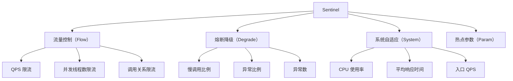

# Sentinel 限流降级实战

Sentinel 是阿里巴巴开源的流量控制组件，是分布式系统的流量控制和熔断降级的利器。

与 Resilience4j 相比，Sentinel 提供了更丰富的流量控制策略、更完善的管理控制台，以及与 Dubbo、Spring Cloud 等生态的深度集成。

## Sentinel 核心概念



## Sentinel 与 Spring Boot 集成

### Maven 依赖

```xml title="pom.xml"
<dependency>
    <groupId>com.alibaba.csp</groupId>
    <artifactId>sentinel-core</artifactId>
    <version>1.8.6</version>
</dependency>

<dependency>
    <groupId>com.alibaba.csp</groupId>
    <artifactId>sentinel-spring-boot-starter</artifactId>
    <version>1.8.6</version>
</dependency>

<!-- Dubbo 集成 -->
<dependency>
    <groupId>com.alibaba.csp</groupId>
    <artifactId>sentinel-dubbo-adapter</artifactId>
    <version>1.8.6</version>
</dependency>

<!-- 控制台 -->
<dependency>
    <groupId>com.alibaba.csp</groupId>
    <artifactId>sentinel-transport-simple-http</artifactId>
    <version>1.8.6</version>
</dependency>
```

### 配置

```yaml title="application.yml"
spring:
  application:
    name: order-service

csp:
  # Sentinel 控制台地址
  sentinel:
    dashboard: localhost:8080
  # 日志文件位置
  log:
    dir: /tmp/sentinel/logs
  # 单机数据源配置
  data:
    url: localhost:8848
    type: nacos
```

## 流量控制

### 基础使用

```java title="SentinelFlowControl.java"
public class SentinelFlowControl {

    public void handleRequest(String resource) {
        Entry entry = null;
        try {
            // 埋点：定义资源
            entry = SphU.entry(resource);

            // 业务逻辑
            doProcess(resource);

        } catch (BlockException e) {
            // 被限流了
            handleBlock(e);
        } finally {
            if (entry != null) {
                entry.exit();
            }
        }
    }

    private void handleBlock(BlockException e) {
        if (e instanceof FlowException) {
            // 流量控制触发
            throw new RateLimitException("请求过于频繁，请稍后重试");
        } else if (e instanceof DegradeException) {
            // 熔断降级触发
            throw new DegradeException("服务暂时不可用");
        }
    }
}
```

### 注解方式

```java title="SentinelAnnotation.java"
@Service
public class SentinelAnnotationService {

    // 限流处理
    @SentinelResource(value = "getProduct",
        blockHandler = "getProductBlockHandler",
        fallback = "getProductFallback")
    public Product getProduct(Long productId) {
        return productService.getProduct(productId);
    }

    // 限流时的处理
    public Product getProductBlockHandler(Long productId, BlockException e) {
        log.warn("商品接口被限流: productId={}", productId);
        return Product.defaultProduct(productId);
    }

    // 异常时的降级处理
    public Product getProductFallback(Long productId, Throwable t) {
        log.error("商品接口异常: productId={}", productId, t);
        return Product.defaultProduct(productId);
    }
}
```

### 动态规则配置

```java title="DynamicFlowRule.java"
public class DynamicFlowRule {

    @PostConstruct
    public void init() {
        // 加载规则
        List<FlowRule> rules = loadRules();

        // 转换为 FlowRule 对象
        List<FlowRule> flowRules = rules.stream()
            .map(this::toFlowRule)
            .collect(Collectors.toList());

        // 推送规则
        FlowRuleManager.loadRules(flowRules);
    }

    private FlowRule toFlowRule(RuleConfig config) {
        FlowRule rule = new FlowRule();
        rule.setResource(config.getResource());
        rule.setCount(config.getCount());  // QPS 阈值
        rule.setGrade(RuleConstant.FLOW_GRADE_QPS);  // 按 QPS 限流
        rule.setControlBehavior(RuleConstant.CONTROL_BEHAVIOR_DEFAULT);  // 直接拒绝

        // 其他策略
        // CONTROL_BEHAVIOR_WARM_UP: 冷启动
        // CONTROL_BEHAVIOR_QUEUE: 排队等待

        return rule;
    }

    // 动态更新规则
    public void updateRule(String resource, double count) {
        FlowRule rule = FlowRuleManager.getRules().stream()
            .filter(r -> r.getResource().equals(resource))
            .findFirst()
            .orElse(new FlowRule());

        rule.setResource(resource);
        rule.setCount(count);

        FlowRuleManager.loadRules(List.of(rule));
    }
}
```

## 熔断降级

### 慢调用比例熔断

```java title="SlowRatioDegrade.java"
public class SlowRatioDegrade {

    @PostConstruct
    public void initDegradeRules() {
        List<DegradeRule> rules = new ArrayList<>();

        DegradeRule rule = new DegradeRule("order-service")
            // 按慢调用比例熔断
            .setGrade(CircuitBreakerStrategy.SLOW_REQUEST_RATIO.getType())
            // 慢调用阈值：2 秒
            .setCount(2.0)
            // 最小请求数：5
            .setMinRequestAmount(5)
            // 统计时长：10 秒
            .setStatIntervalMs(10000)
            // 熔断恢复时长：30 秒
            .setTimeWindow(30);

        rules.add(rule);
        DegradeRuleManager.loadRules(rules);
    }
}
```

### 异常比例熔断

```java title="ErrorRatioDegrade.java"
public class ErrorRatioDegrade {

    public void initErrorRatioRules() {
        DegradeRule rule = new DegradeRule("payment-service")
            // 按异常比例熔断
            .setGrade(CircuitBreakerStrategy.ERROR_RATIO.getType())
            // 异常比例阈值：50%
            .setCount(0.5)
            // 最小请求数：10
            .setMinRequestAmount(10)
            // 统计时长：60 秒
            .setStatIntervalMs(60000)
            // 熔断恢复时长：60 秒
            .setTimeWindow(60);

        DegradeRuleManager.loadRules(List.of(rule));
    }
}
```

## 系统自适应

Sentinel 提供了系统自适应限流，根据系统的实时负载自动调整限流阈值：

```java title="SystemAdaptive.java"
public class SystemAdaptive {

    @PostConstruct
    public void initSystemRules() {
        List<SystemRule> rules = new ArrayList<>();

        SystemRule rule = new SystemRule()
            // CPU 使用率超过 80% 时触发限流
            .setHighestCpuUsage(0.8)
            // 平均响应时间超过 100ms 时触发限流
            .setHighestSystemLoad(100.0)
            // 入口 QPS 超过 1000 时触发限流
            .setHighestQps(1000)
            // 并发线程数超过 200 时触发限流
            .setHighestCpuUsage(200.0);

        rules.add(rule);
        SystemRuleManager.loadRules(rules);
    }
}
```

## Sentinel 控制台

Sentinel 控制台提供了可视化的监控和管理功能：

```bash
# 启动 Sentinel 控制台
java -jar sentinel-dashboard.jar \
    --server.port=8080 \
    --project.name=sentinel-dashboard
```

### 控制台功能

| 功能 | 说明 |
| --- | --- |
| **实时监控** | 查看每个资源的 QPS、响应时间、限流次数 |
| **规则配置** | 动态配置限流规则、熔断规则 |
| **机器列表** | 查看已接入的客户端 |
| **链路追踪** | 查看资源调用链路 |

### 规则推送模式

```yaml title="规则推送模式"
# 原始模式：客户端拉取
sentinel:
  datasource:
    file:
      refresh-interval: 3000  # 每 3 秒拉取一次

# Nacos 模式：配置中心推送
sentinel:
  datasource:
    nacos:
      server-addr: localhost:8848
      data-id: sentinel-rules
      group-id: SENTINEL_GROUP
```

## 与 Dubbo 集成

Sentinel 与 Dubbo 深度集成，自动为每个 Dubbo 接口提供限流和熔断：

```java title="DubboSentinelFilter.java"
@Configuration
public class DubboSentinelConfiguration {

    @Bean
    public Filter dubboSentinelFilter() {
        return new SentinelDubboFilter();
    }
}
```

```yaml title="dubbo-provider.yml"
dubbo:
  provider:
    filter: sentinelDubboFilter
```

```xml title="dubbo-provider.xml"
<dubbo:reference id="productService"
    interface="com.example.ProductService"
    timeout="3000"
    actives="100"  <!-- 并发线程数限流：最大 100 -->
    actives="-1"   <!-- 关闭内置限流，使用 Sentinel -->
/>
```

## 监控指标

```java title="SentinelMetrics.java"
public class SentinelMetrics {

    private final ClusterBuilder builder;

    @PostConstruct
    public void init() {
        // 配置指标收集
        Config config = new Config();
        config.setConsoleServerHost("localhost:8080");

        // 记录指标
        ClusterBuilder builder = ClusterBuilder.newBuilder()
            .withClusterName("order-cluster");

        StatisticSlotCallbackHandler.addClusterBuilder(builder);
    }

    // 获取实时指标
    public Map<String, Long> getMetrics(String resource) {
        ClusterNode node = ClusterBuilderSlot.getClusterNode(resource);
        if (node == null) {
            return Collections.emptyMap();
        }

        Map<String, Long> metrics = new HashMap<>();
        metrics.put("passQps", node.totalPass());
        metrics.put("blockQps", node.totalBlock());
        metrics.put("successQps", node.totalSuccess());
        metrics.put("exceptionQps", node.totalException());
        metrics.put("avgRt", node.avgRt());

        return metrics;
    }
}
```

## 本章总结

**核心要点**：

1. **Sentinel 提供了完整的流量控制方案**：限流、熔断、系统自适应、热点参数
2. **注解方式使用最方便**：`@SentinelResource` 自动埋点
3. **动态规则配置支持多种数据源**：文件、Nacos、Apollo
4. **控制台提供了可视化监控和管理**：实时查看限流和熔断状态
5. **与 Dubbo/Spring Cloud 深度集成**：开箱即用
