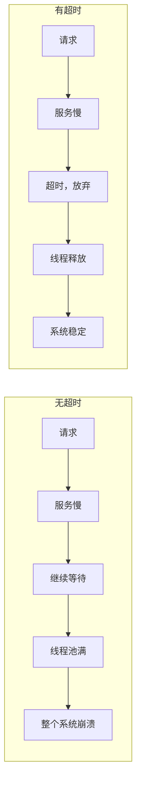

# 超时模式（Timeout）

超时是分布式系统中最基础也最重要的容错机制。

超时意味着「不等了」。当一个请求超过预期时间没有返回响应时，系统主动放弃等待，而不是无限期地等待下去。没有超时机制的系统，就像一辆没有刹车的汽车——要么到达目的地，要么撞上障碍物。

## 为什么要设置超时



## 超时配置原则

### 原则一：不要使用默认超时

很多 HTTP 客户端的默认超时是无限的，这是灾难的开始：

```java title="TimeoutConfiguration.java"
@Configuration
public class TimeoutConfiguration {

    @Bean
    public RestTemplate restTemplate() {
        SimpleClientHttpRequestFactory factory = new SimpleClientHttpRequestFactory();
        factory.setConnectTimeout(3000);    // 建立连接超时：3 秒
        factory.setReadTimeout(5000);      // 读取超时：5 秒
        return new RestTemplate(factory);
    }

    @Bean
    public OkHttpClient okHttpClient() {
        return new OkHttpClient.Builder()
            .connectTimeout(3, TimeUnit.SECONDS)
            .readTimeout(5, TimeUnit.SECONDS)
            .writeTimeout(5, TimeUnit.SECONDS)
            .build();
    }
}
```

### 原则二：超时应该基于业务

超时不应该基于技术实现，而应该基于用户体验：

```yaml
# 根据用户体验设定超时
timeout_standards:
  user_perception:
    immediate: "100ms"       # 用户感觉不到延迟
    acceptable: "1s"         # 用户可以接受的延迟
    maximum: "10s"           # 用户愿意等待的上限

  business_requirements:
    critical: "500ms"        # 核心业务：下单、支付
    important: "2s"           # 重要业务：商品查询
    normal: "5s"             # 普通业务：评论、推荐
    background: "30s"        # 后台任务：数据同步
```

### 原则三：超时要有层次

```mermaid
flowchart TD
    A["API 网关\n超时：5s"] --> B["业务服务\n超时：3s"]
    B --> C["下游服务\n超时：2s"]
    C --> D["数据库\n超时：1s"]

    Note over A: 最外层超时最长
    Note over D: 最内层超时最短
```

## 超时配置实践

### Feign 超时配置

```yaml title="application.yml"
feign:
  client:
    config:
      default:
        connectTimeout: 3000
        readTimeout: 5000
      user-service:
        connectTimeout: 5000
        readTimeout: 10000
      payment-service:
        connectTimeout: 3000
        readTimeout: 3000
```

### Ribbon 超时配置

```yaml title="application.yml"
ribbon:
  ConnectTimeout: 3000
  ReadTimeout: 5000
  MaxAutoRetries: 1
  MaxAutoRetriesNextServer: 2
  OkToRetryOnAllOperations: false
```

### 动态超时

```java title="DynamicTimeout.java"
@Service
public class DynamicTimeoutService {

    private final Map<String, TimeoutConfig> timeoutCache = new ConcurrentHashMap<>();

    public long getTimeout(String serviceName) {
        // 先尝试从缓存获取
        TimeoutConfig config = timeoutCache.get(serviceName);
        if (config != null) {
            return config.getTimeout();
        }

        // 从配置中心获取
        config = loadFromConfigCenter(serviceName);
        timeoutCache.put(serviceName, config);

        return config.getTimeout();
    }

    // 定期更新超时配置
    @Scheduled(fixedRate = 60000)
    public void refreshTimeoutConfig() {
        for (String service : getAllServices()) {
            TimeoutConfig config = loadFromConfigCenter(service);
            timeoutCache.put(service, config);
        }
    }
}
```

## 超时监控

```yaml title="超时监控"
# Prometheus 指标
timeout:
  - name: request_timeout_total
    type: counter
    labels: [service, type]
    description: "超时请求总数 (connect/read)"

  - name: timeout_rate
    type: gauge
    labels: [service]
    description: "超时率"

# 告警规则
alerts:
  - name: HighTimeoutRate
    condition: timeout_rate > 0.05
    severity: warning
    message: "服务 {} 超时率超过 5%"
```

## 本章总结

**核心要点**：

1. **超时是最基础的容错机制**：防止请求无限等待
2. **不要使用默认超时**：默认值往往是无限的
3. **超时要基于业务需求**：而不是技术实现
4. **超时要有层次**：外层长，内层短
5. **超时需要监控**：知道什么时候、什么服务超时了
