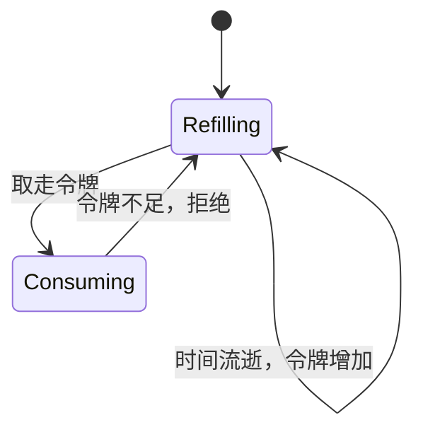

# 令牌桶算法实现

令牌桶是最常用的限流算法之一，也是 Guava RateLimiter 背后的核心算法。

令牌桶的核心思想很简单：**有一个固定容量的桶，桶里放令牌。每来一个请求，就从桶里取一个令牌。如果桶里没有令牌，请求就被拒绝。同时，令牌以固定速率往桶里放。**

## 令牌桶 vs 其他算法

| 算法 | 核心思想 | 突发能力 | 平滑程度 | 实现复杂度 |
| --- | --- | --- | --- | --- |
| **固定窗口** | 固定时间窗口内计数 | 有边界突发 | 差 | 简单 |
| **滑动窗口** | 滑动窗口内计数 | 有边界突发 | 中 | 中等 |
| **令牌桶** | 桶中有令牌才放行 | 支持突发 | 好 | 中等 |
| **漏桶** | 固定速率消费 | 不支持突发 | 最好 | 中等 |

```mermaid
flowchart LR
    subgraph 令牌桶
        A["请求"] --> B["有令牌？"]
        B -->|"有| C["取令牌"]
        C --> D["放行"]
        B -->|"无| E["拒绝"]

        F["定时器"] --> |"放令牌| G["令牌桶"]
        G --> |"容量 N| H["最多存 N 个"]
    end

    subgraph 漏桶
        A2["请求"] --> I["入队"]
        I --> |"队列| J["漏桶"]
        J --> |"固定速率| K["出队放行"]
        I --> |"队列满| L["拒绝"]
    end
```

**令牌桶和漏桶的关键区别**：

- **令牌桶**：请求来时取令牌，支持突发（桶满时可一次性取多个）
- **漏桶**：请求进入队列，以固定速率输出，不支持突发

## 令牌桶原理

### 核心变量

| 变量 | 说明 |
| --- | --- |
| `capacity` | 桶的容量（最多存放的令牌数） |
| `tokens` | 当前桶中的令牌数 |
| `refillRate` | 令牌补充速率（每秒补充多少令牌） |
| `lastRefillTime` | 上次补充令牌的时间 |

### 核心公式

```
桶中令牌数 = min(capacity, tokens + (now - lastRefillTime) × refillRate)
```

### 状态转换



## 令牌桶实现

### 基础实现

```java title="TokenBucket.java"
public class TokenBucket {

    private final long capacity;        // 桶容量
    private final double refillRate;    // 每秒补充的令牌数

    private volatile double tokens;     // 当前令牌数
    private volatile long lastRefillTime; // 上次补充时间

    public TokenBucket(long capacity, double refillRate) {
        this.capacity = capacity;
        this.refillRate = refillRate;
        this.tokens = capacity;        // 初始为满
        this.lastRefillTime = System.nanoTime();
    }

    // 尝试获取一个令牌
    public synchronized boolean tryAcquire() {
        refill();

        if (tokens >= 1) {
            tokens -= 1;
            return true;
        }
        return false;
    }

    // 尝试获取 N 个令牌
    public synchronized boolean tryAcquire(int permits) {
        refill();

        if (tokens >= permits) {
            tokens -= permits;
            return true;
        }
        return false;
    }

    // 获取令牌，可指定等待时间
    public synchronized boolean tryAcquire(long timeout, TimeUnit unit) throws InterruptedException {
        long timeoutNanos = unit.toNanos(timeout);
        long deadline = System.nanoTime() + timeoutNanos;

        while (true) {
            refill();

            if (tokens >= 1) {
                tokens -= 1;
                return true;
            }

            // 计算需要等待多久
            long waitNanos = (long) ((1 - tokens) / refillRate * 1_000_000_000);

            if (System.nanoTime() + waitNanos > deadline) {
                return false;
            }

            wait(Math.min(waitNanos, 100_000_000)); // 最多等 100ms
        }
    }

    // 补充令牌
    private void refill() {
        long now = System.nanoTime();
        long elapsed = now - lastRefillTime;

        if (elapsed > 0) {
            // 计算应该补充的令牌数
            double tokensToAdd = (elapsed / 1_000_000_000.0) * refillRate;
            tokens = Math.min(capacity, tokens + tokensToAdd);
            lastRefillTime = now;
        }
    }

    // 获取当前令牌数（用于监控）
    public double getAvailableTokens() {
        return tokens;
    }
}
```

### 线程安全实现

```java title="AtomicTokenBucket.java"
public class AtomicTokenBucket {

    private final long capacity;
    private final double refillRate;

    // 使用 AtomicLongFieldUpdater 优化性能
    private volatile long tokens;
    private volatile long lastRefillTime;

    private static final long UPDATE_THRESHOLD = 1_000_000; // 1ms 更新阈值

    public AtomicTokenBucket(long capacity, double refillRate) {
        this.capacity = capacity;
        this.refillRate = refillRate;
        this.tokens = capacity;
        this.lastRefillTime = System.nanoTime();
    }

    public boolean tryAcquire() {
        return tryAcquire(1);
    }

    public boolean tryAcquire(int permits) {
        long currentTokens;
        long newTokens;

        do {
            currentTokens = tokens;
            long now = System.nanoTime();
            long elapsed = now - lastRefillTime;

            // 计算当前令牌数
            double calculatedTokens = currentTokens;
            if (elapsed > UPDATE_THRESHOLD) {
                calculatedTokens = Math.min(capacity,
                    currentTokens + (elapsed / 1_000_000_000.0) * refillRate);
            }

            newTokens = (long) calculatedTokens;

            if (newTokens < permits) {
                return false;
            }

            newTokens -= permits;

        } while (!compareAndSet(currentTokens, newTokens));

        return true;
    }

    private boolean compareAndSet(long expect, long update) {
        return TOKEN_UPDATER.compareAndSet(this, expect, update);
    }

    private static final AtomicLongFieldUpdater<AtomicTokenBucket> TOKEN_UPDATER =
        AtomicLongFieldUpdater.newUpdater(AtomicTokenBucket.class, "tokens");
}
```

### Guava RateLimiter 使用

Guava 提供了成熟的令牌桶实现，直接使用即可：

```java title="GuavaRateLimiterExample.java"
public class GuavaRateLimiterExample {

    // 每秒 100 个令牌，最多突发 50 个
    private final RateLimiter rateLimiter = RateLimiter.create(100, 50);

    public void handleRequest(Request request) {
        // 获取令牌，阻塞等待（最多等 5 秒）
        double waitTime = rateLimiter.acquire(1);

        // do something with waitTime for logging/monitoring

        process(request);
    }

    public boolean handleRequestWithTimeout(Request request, long timeoutMs) {
        // 尝试获取令牌，最多等 timeoutMs
        boolean acquired = rateLimiter.tryAcquire(1, timeoutMs, TimeUnit.MILLISECONDS);

        if (!acquired) {
            return false; // 限流
        }

        process(request);
        return true;
    }
}
```

## 分布式令牌桶

单机令牌桶无法用于分布式场景，需要基于 Redis 实现：

### Redis 令牌桶实现

```lua title="token_bucket.lua"
-- Redis 令牌桶 Lua 脚本
-- KEYS[1]: 限流 key
-- ARGV[1]: 桶容量
-- ARGV[2]: 每秒补充速率
-- ARGV[3]: 当前时间戳（纳秒）
-- ARGV[4]: 请求的令牌数

local key = KEYS[1]
local capacity = tonumber(ARGV[1])
local refillRate = tonumber(ARGV[2])
local now = tonumber(ARGV[3])
local requested = tonumber(ARGV[4])

-- 获取当前状态
local bucket = redis.call('HMGET', key, 'tokens', 'lastRefillTime')
local tokens = tonumber(bucket[1])
local lastRefillTime = tonumber(bucket[2])

-- 如果是首次，初始化
if tokens == nil then
    tokens = capacity
    lastRefillTime = now
end

-- 计算应该补充的令牌数
local elapsed = (now - lastRefillTime) / 1_000_000_000  -- 转换为秒
local tokensToAdd = elapsed * refillRate
tokens = math.min(capacity, tokens + tokensToAdd)

-- 检查是否足够
if tokens >= requested then
    tokens = tokens - requested
    redis.call('HMSET', key, 'tokens', tokens, 'lastRefillTime', now)
    redis.call('EXPIRE', key, 60)  -- 1 分钟过期
    return 1  -- 成功
else
    redis.call('HMSET', key, 'tokens', tokens, 'lastRefillTime', now)
    redis.call('EXPIRE', key, 60)
    return 0  -- 失败
end
```

```java title="DistributedTokenBucket.java"
public class DistributedTokenBucket {

    private final RedisTemplate<String, String> redisTemplate;
    private final String luaScript;

    public DistributedTokenBucket(RedisTemplate<String, String> redisTemplate) {
        this.redisTemplate = redisTemplate;
        this.luaScript = loadScript("token_bucket.lua");
    }

    /**
     * 尝试获取令牌
     * @param key 限流 key
     * @param capacity 桶容量
     * @param refillRate 每秒补充速率
     * @param permits 请求的令牌数
     * @return 是否成功
     */
    public boolean tryAcquire(String key, long capacity, double refillRate, int permits) {
        Long result = redisTemplate.execute(
            new DefaultRedisScript<>(luaScript, Long.class),
            List.of(key),
            capacity,
            refillRate,
            System.nanoTime(),
            permits
        );
        return result != null && result == 1;
    }

    /**
     * 获取当前令牌数
     */
    public double getAvailableTokens(String key) {
        Map<Object, Object> bucket = redisTemplate.opsForHash().entries(key);
        if (bucket.isEmpty()) {
            return -1; // 不存在
        }
        return Double.parseDouble((String) bucket.get("tokens"));
    }
}
```

### Spring Boot 集成

```java title="DistributedRateLimiter.java"
@Service
@Slf4j
public class DistributedRateLimiter {

    private final DistributedTokenBucket tokenBucket;
    private final Map<String, LimiterConfig> configs;

    public DistributedRateLimiter(DistributedTokenBucket tokenBucket) {
        this.tokenBucket = tokenBucket;
        this.configs = new ConcurrentHashMap<>();
    }

    public void registerLimiter(String name, long capacity, double refillRate) {
        configs.put(name, new LimiterConfig(capacity, refillRate));
    }

    public boolean tryAcquire(String limiterName) {
        LimiterConfig config = configs.get(limiterName);
        if (config == null) {
            throw new IllegalArgumentException("Unknown limiter: " + limiterName);
        }

        return tokenBucket.tryAcquire(
            "ratelimit:" + limiterName,
            config.capacity,
            config.refillRate,
            1
        );
    }

    @Aspect
    @Component
    public static class RateLimitAspect {

        @Autowired
        private DistributedRateLimiter rateLimiter;

        @Around("@annotation(RateLimited)")
        public Object around(ProceedingJoinPoint joinPoint) throws Throwable {
            MethodSignature signature = (MethodSignature) joinPoint.getSignature();
            RateLimited annotation = signature.getMethod().getAnnotation(RateLimited.class);

            String limiterName = annotation.value();
            boolean acquired = rateLimiter.tryAcquire(limiterName);

            if (!acquired) {
                throw new RateLimitException("请求过于频繁，请稍后重试");
            }

            return joinPoint.proceed();
        }
    }
}
```

## 性能对比

| 实现 | TPS | 延迟 | 适用场景 |
| --- | --- | --- | --- |
| **单线程 TokenBucket** | `~500K` | `~2μs` | 单机简单场景 |
| **AtomicTokenBucket** | `~200K` | `~5μs` | 单机高并发 |
| **Guava RateLimiter** | `~150K` | `~7μs` | 单机，推荐使用 |
| **Redis TokenBucket** | `~50K` | `~500μs` | 分布式场景 |

## 本章总结

**核心要点**：

1. **令牌桶支持突发流量**：桶满时可一次性取多个令牌
2. **令牌以固定速率补充**：保证长期平均速率不超过阈值
3. **Guava RateLimiter 是生产级实现**：直接使用即可
4. **分布式场景需要 Redis 实现**：单机限流无法跨节点生效
5. **Lua 脚本保证原子性**：Redis 操作需要在 Lua 脚本中完成
