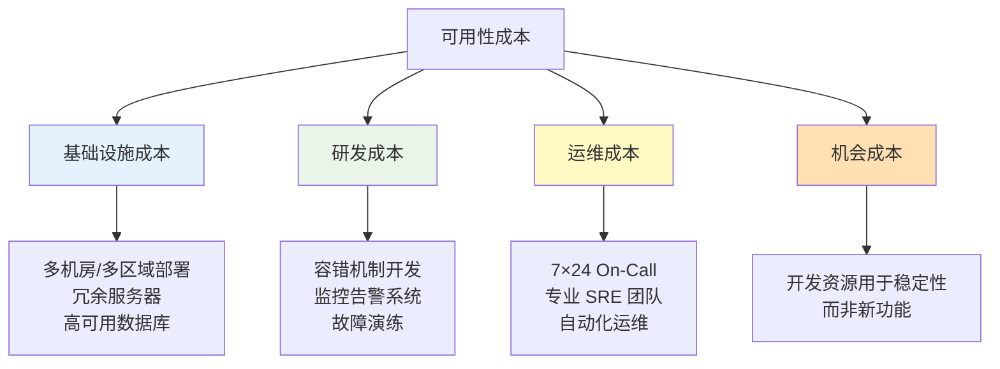

# 可用性目标与成本权衡

高可用不是免费的。

每个架构决策背后都有成本和收益的权衡。99% 的可用性和 99.99% 的可用性之间，不只是差了 0.009% 的数字——差了可能几十倍的研发投入、基础设施成本和运维复杂度。

真正成熟的架构师，不是追求「最高的可用性」，而是追求「最合理的可用性」——在成本、复杂度和业务需求之间找到最佳平衡点。

## 可用性成本的四层结构



### 第一层：基础设施成本

| 可用性等级 | 基础设施需求 | 成本倍数 |
| --- | --- | --- |
| 99%（2个9） | 单机 + 基础监控 | 1× |
| 99.9%（3个9） | 双机热备 + 负载均衡 | 1.5~2× |
| 99.99%（4个9） | 多机房 + 自动化切换 | 3~5× |
| 99.999%（5个9） | 多活 + 近乎零人工干预 | 10~20× |

### 第二层：研发成本

每提升一个可用性等级，都需要额外的工程投入：

- **容错机制**：熔断、重试、降级、超时、隔离
- **监控告警**：从基础监控到全链路追踪
- **故障自愈**：自动化检测 + 自动修复
- **混沌工程**：主动发现系统脆弱点

### 第三层：运维成本

| 维度 | 99% | 99.9% | 99.99% | 99.999% |
| --- | --- | --- | --- | --- |
| On-Call 响应 | 4 小时 | 1 小时 | 15 分钟 | 5 分钟 |
| 变更窗口 | 任意时间 | 非高峰期 | 变更窗口 | 冻结期 |
| 人工介入频率 | 常见 | 偶尔 | 罕见 | 几乎无 |
| 运维团队规模 | 1 人 | 2~3 人 | 3~5 人 SRE | 专职 SRE 团队 |

### 第四层：机会成本

这是最容易被忽视的成本：**把资源投入稳定性，还是投入新功能？**

一个 10 人团队：
- 如果 3 个人专职做高可用，其他 7 个人做业务 → 业务推进快
- 如果 7 个人专职做高可用，其他 3 个人做业务 → 稳定性极强，但业务停滞

## 权衡决策框架

### 框架一：业务价值法

**核心问题：这个可用性等级能为业务带来多少价值？**

```mermaid
flowchart TD
    A["业务影响分析"] --> B["每下降 0.1% 可用性\n损失多少收入？"]
    B --> C["目标可用性等级\n需要投入多少成本？"]
    C --> D["ROI 计算：\n投入产出比是否合理？"]
    D --> E{"ROI > 1？"}
    E -->|"是| F["投入"]
    E -->|"否| G["降低目标\n或找替代方案"]
```

### 框架二：分场景差异化

不是所有功能都值得高可用：

```yaml
sla_tiers:
  critical:
    description: "核心业务流程（登录、下单、支付）"
    availability: 99.99%
    latency_p99: 200ms
    justification: "故障直接导致收入损失，用户投诉极高"

  important:
    description: "重要功能（商品浏览、购物车）"
    availability: 99.9%
    latency_p99: 500ms
    justification: "影响用户体验，但不直接导致收入损失"

  auxiliary:
    description: "辅助功能（推荐、评论、统计）"
    availability: 99%
    latency_p99: 2000ms
    justification: "用户体验有影响，但故障可接受"
```

### 框架三：生命周期法

系统的不同阶段，可承受的可用性目标不同：

| 阶段 | 典型可用性 | 说明 |
| --- | --- | --- |
| **探索期**（0~1 年） | 90%~99% | 快速迭代，稳定性优先级低 |
| **成长期**（1~3 年） | 99%~99.9% | 用户增长，稳定性重要 |
| **成熟期**（3~5 年） | 99.9%~99.99% | 用户量大，稳定性是关键竞争力 |
| **衰退期**（5 年+） | 保持现状 | 降低运维成本 |

## 成本优化策略

### 策略一：用 MTTR 换 MTBF

与其拼命提升 MTBF（减少故障），不如提升 MTTR 优化（加快恢复）。

```mermaid
flowchart LR
    A["方案 A：提高 MTBF"] --> |"多机房| B["成本 × 3"]
    A --> |"换高端硬件| C["成本 × 2"]

    D["方案 B：降低 MTTR"] --> |"自动化监控| E["成本 × 0.5"]
    D --> |"自愈机制| F["MTTR 降低 80%"]

    B & C -.->|"昂贵| G["ROI 低"]
    E & F -.->|"划算| H["ROI 高"]
```

**实际数据**：在大多数场景下，花 1 元钱提升 MTTR 的效果，相当于花 3~5 元钱提升 MTBF。

### 策略二：降级换取可用性

当系统承压时，优雅降级比全量不可用好得多：

| 降级策略 | 成本 | 效果 |
| --- | --- | --- |
| 关闭非核心功能 | 低 | 核心功能可用性显著提升 |
| 返回缓存数据 | 中 | 读取可用，写入受限 |
| 返回静态内容 | 低 | 展示可用，交互受限 |
| 限流而非宕机 | 低 | 保持部分服务能力 |

### 策略三：分层容灾

不是所有组件都需要同等的可用性：

```mermaid
flowchart TD
    subgraph 高可用层（99.999%）
        A["支付核心"]
        B["登录认证"]
    end

    subgraph 标准层（99.9%）
        C["商品查询"]
        D["订单处理"]
    end

    subgraph 尽力而为层（99%）
        E["推荐系统"]
        F["数据分析"]
        G["用户画像"]
    end

    style A fill:#ffcccc
    style B fill:#ffcccc
    style C fill:#fff2cc
    style D fill:#fff2cc
    style E fill:#ccffcc
    style F fill:#ccffcc
    style G fill:#ccffcc
```

## 真实案例：成本权衡分析

### 案例：某电商平台的 SLA 决策

**背景**：某中型电商平台，年 GMV 5000 万，用户 50 万。

**分析过程**：

```python
# 业务影响分析
annual_gmv = 5000_0000  # 5000 万
downtime_per_nine = {
    "99%": 3.65 * 24,     # 87.6 小时/年
    "99.9%": 8.76,        # 8.76 小时/年
    "99.99%": 0.88,       # 52.6 分钟/年
}

# 假设：每停机 1 小时损失 5 万 GMV
loss_per_hour = 50000

print("各可用性等级下的潜在损失：")
for nine, hours in downtime_per_nine.items():
    loss = hours * loss_per_hour
    print(f"{nine}: 预计损失 {loss/10000:.1f} 万元/年")
```

**决策**：

| 方案 | 可用性目标 | 额外投入 | 预计损失减少 | ROI |
| --- | --- | --- | --- | --- |
| 方案 A | 维持 99% | 0 | 0 | - |
| 方案 B | 提升到 99.9% | 30 万/年 | 39 万/年 | 1.3 |
| 方案 C | 提升到 99.99% | 100 万/年 | 42 万/年 | 0.42 |

**结论**：方案 B 的 ROI 最高，方案 C 虽然可用性更高，但成本投入产出比反而下降了。

## 常见误区

### 误区一：追求过高的可用性

很多创业公司在早期就追求「五个 9」，结果投入大量资源在稳定性上，业务却因为没人开发而停滞。

**正确做法**：根据业务阶段和规模，合理设定可用性目标。

### 误区二：所有服务同一可用性目标

把推荐系统和支付系统设为同一个可用性目标，要么支付系统的目标太宽松（风险大），要么推荐系统的目标太严格（成本高）。

**正确做法**：核心功能高可用，边缘功能适度可用。

### 误区三：只算直接成本

只算服务器成本，不算研发成本、运维成本和机会成本。

**正确做法**：全面计算 TCO（总拥有成本），包括人员、工具、培训等隐性成本。

## 本章总结

**核心要点**：

1. **可用性成本有四层**：基础设施、研发、运维、机会成本，机会成本最容易被忽视
2. **越往上成本增速越快**：99.9% 到 99.99% 的成本可能是 99% 到 99.9% 的 3 倍
3. **MTTR 优化比 MTBF 提升更划算**：花 1 元钱加快恢复，相当于花 3~5 元钱减少故障
4. **分层容灾**：不是所有组件都需要同等的可用性，核心功能高可用，边缘功能适度可用
5. **ROI 是决策核心**：每个可用性等级都要问「投入这么多值不值」

理解了可用性目标与成本权衡，下一节我们将总结高可用设计的核心原则，帮助你在架构设计中做出更好的决策。
