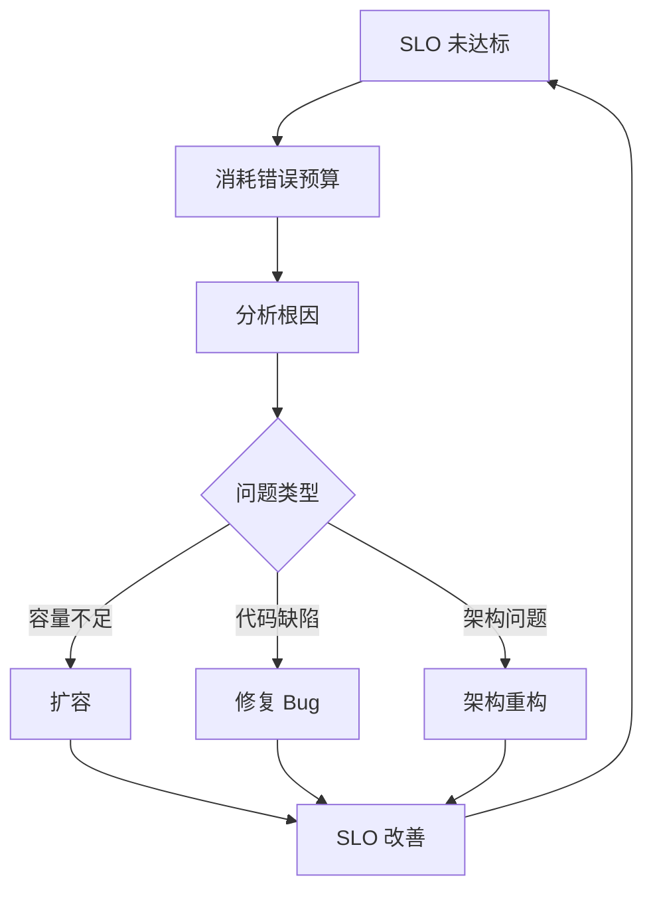

# 错误预算（Error Budget）管理

错误预算让「可用性」从抽象的数字变成了可操作的管理工具。

很多团队设置了 SLO，但 SLO 只是「达标线」——超过了还好，没超过怎么办？错误预算给出了答案：**当 SLO 未达标时，消耗的就是错误预算。错误预算是 SLO 的「另一半」，是真正用来做决策的工具。**

## 什么是错误预算

**错误预算 = 100% - SLO 目标**

以 SLO 99.9%（三个 9）为例：

| 时间周期 | 错误预算 |
| --- | --- |
| 每天 | 1.44 分钟 |
| 每周 | 10.08 分钟 |
| 每月 | 43.83 分钟 |
| 每年 | 8.76 小时 |

这意味着：每月有 43.83 分钟的「故障时间额度」可以消耗。消耗完了，SLO 就未达标。

```mermaid
flowchart LR
    A["SLO = 99.9%"] --> B["错误预算 = 0.1%"]
    B --> C["每月 43.83 分钟"]
    C --> D["全年 8.76 小时"]
    D --> E{"错误预算\n耗尽了吗？"}
    E -->|"否| F["正常发布"]
    E -->|"快耗尽| G["谨慎发布"]
    E -->|"已耗尽| H["冻结发布\n专注稳定性"]
```

## 错误预算的消耗模型

### Burn Rate（燃烧速率）

Burn Rate 描述错误预算的消耗速度：

```
Burn Rate = 当前错误率 ÷ SLO 允许的错误率

例如：
- SLO 目标：99.9%（允许 0.1% 错误率）
- 当前错误率：0.5%
- Burn Rate = 0.5% ÷ 0.1% = 5

含义：以当前速度，错误预算会在 1/5 的周期内耗尽
```

### 多窗口 Burn Rate 告警

单一窗口的 Burn Rate 容易受噪声干扰，通常使用双窗口告警：

| 窗口 | 含义 | 告警阈值 | 严重程度 |
| --- | --- | --- | --- |
| **短期（1 小时）** | 快速燃烧，突发故障 | Burn Rate `>` 14.4 | Critical |
| **长期（6 小时）** | 持续燃烧，慢速故障 | Burn Rate `>` 6 | Warning |
| **长期（1 天）** | 持续燃烧，长期趋势 | Burn Rate `>` 3 | Warning |

```yaml title="error-budget-alerts.yaml"
groups:
- name: error-budget
  rules:
  # 短期高速燃烧：1 小时内耗尽当月预算
  - alert: ErrorBudgetBurnFast
    expr: |
      sum(rate(http_requests_total{status=~"5.."}[1h]))
      / sum(rate(http_requests_total[1h]))
      > 0.001 * 14.4
    for: 0m
    labels:
      severity: critical
    annotations:
      summary: "错误预算高速消耗"
      description: "1 小时内将耗尽当月错误预算"

  # 长期中速燃烧：6 小时内耗尽当月预算
  - alert: ErrorBudgetBurnMedium
    expr: |
      sum(rate(http_requests_total{status=~"5.."}[6h]))
      / sum(rate(http_requests_total[6h]))
      > 0.001 * 6
    for: 5m
    labels:
      severity: warning
    annotations:
      summary: "错误预算中速消耗"
      description: "6 小时内将耗尽当月错误预算"
```

### Burn Rate 的数学推导

为什么短期告警阈值是 14.4，长期是 6？

```
假设：月度 SLO = 99.9%，月度错误预算 = 0.1%

短期窗口（1 小时 = 1/730 月）：
  如果 1 小时内消耗了 1/730 的月度预算
  Burn Rate = 730
  这意味着：如果持续这个速度，1 小时就耗尽全部月度预算

  但实际上我们允许一些消耗：
  14.4 × (1/730) = 1.97% 的月度错误预算
  即 1 小时消耗约 2% 月度预算 = 快速告警阈值

长期窗口（6 小时）：
  6 × (1/730) = 0.82% 的月度错误预算
  即 6 小时消耗约 0.82% 月度预算 = 中速告警阈值
```

## 错误预算策略

### 策略一：发布冻结

当错误预算消耗到一定程度，冻结发布新功能，专注修复问题：

```mermaid
gantt
    title 错误预算消耗与发布策略
    dateFormat  YYYY-MM-DD
    section 错误预算
    充足期: 0, 23d
    警戒期: 23, 28d
    冻结期: 28, 31d

    section 策略
    正常发布: 0, 23d
    谨慎发布: 23, 28d
    冻结发布: 28, 31d
```

| 错误预算剩余 | 策略 | 说明 |
| --- | --- | --- |
| `>` 75% | 正常发布 | 按正常节奏发布新功能 |
| 50%~75% | 谨慎发布 | 减少发布频率，加强监控 |
| 25%~50% | 限制发布 | 仅发布紧急修复，小范围验证 |
| `<` 25% | 冻结发布 | 暂停发布，专注稳定性 |

### 策略二：错误预算驱动的 On-Call

当错误预算消耗过快时，提高告警响应优先级：

```python
# 错误预算告警响应优先级
def get_oncall_priority(error_budget_consumed_percent: float) -> str:
    if error_budget_consumed_percent > 75:
        return "P0 - 最高优先级，立即响应"
    elif error_budget_consumed_percent > 50:
        return "P1 - 高优先级，15 分钟内响应"
    elif error_budget_consumed_percent > 25:
        return "P2 - 中优先级，1 小时内响应"
    else:
        return "P3 - 正常响应"
```

### 策略三：错误预算与性能改进挂钩

错误预算不仅是管理工具，也是推动持续改进的动力：



## 错误预算管理的常见误区

### 误区一：把 SLO 当目标，把错误预算当摆设

很多团队设了 SLO 但从不看错误预算——SLO 只是一个数字，没有转化为实际行动。

**正确做法**：错误预算告警应该和 SLO 达标告警一样重要，纳入团队的日常管理流程。

### 误区二：错误预算只用于发布决策

错误预算的价值不仅限于发布决策，还应该用于：

- On-Call 响应优先级
- 技术债务偿还计划
- 架构改进投资决策
- 团队绩效考核

### 误区三：错误预算归零才行动

等到错误预算完全耗尽才采取行动，往往已经太晚了。应该在错误预算消耗到 50%~75% 时就开始谨慎。

**正确做法**：设置多级告警，提前预警，留出足够的响应时间。

### 误区四：所有服务用同一个错误预算策略

核心服务（支付、登录）和边缘服务（推荐、统计）的错误预算策略应该不同：

| 服务类型 | SLO 目标 | 策略 |
| --- | --- | --- |
| 核心服务 | 99.99% | 错误预算消耗超过 25% 即冻结发布 |
| 重要服务 | 99.9% | 错误预算消耗超过 50% 即谨慎发布 |
| 边缘服务 | 99% | 错误预算消耗超过 75% 才需要关注 |

## 错误预算报告

每个周期（月度/季度）应该生成错误预算报告：

```yaml title="error-budget-report.yaml"
error_budget_report:
  period: "2024-01"
  slo:
    name: "order-service-availability"
    target: 0.9995

  budget:
    total_minutes: 21.9      # 99.95% SLO 对应每月允许 21.9 分钟
    consumed_minutes: 8.5   # 本月已消耗 8.5 分钟
    remaining_minutes: 13.4 # 剩余 13.4 分钟
    consumed_percent: 38.8  # 已消耗 38.8%

  burn_rate:
    current: 1.8             # 当前燃烧速率
    trend: "increasing"      # 趋势：上升
    projection: "2024-02-15" # 预计何时耗尽（如果不改善）

  incidents:
    count: 2
    total_downtime_minutes: 8.5
    root_causes:
      - "数据库连接池耗尽"
      - "依赖服务超时"

  recommendations:
    - "优化数据库连接池配置"
    - "对 payment-gateway 增加熔断保护"
    - "本月剩余时间谨慎发布"
```

## 本章总结

**核心要点**：

1. **错误预算 = 100% - SLO**，是 SLO 的另一半，是真正可操作的决策工具
2. **Burn Rate 描述消耗速度**，短期高速燃烧和长期中速燃烧需要不同阈值的告警
3. **错误预算驱动发布决策**：剩余多正常发布，剩余少冻结发布
4. **多级告警**：不要等到预算耗尽才行动，50%~75% 就应该开始谨慎
5. **分层管理**：核心服务和边缘服务用不同的 SLO 和错误预算策略

MTBF 和 MTTR 是可用性体系中的两个关键运营指标，下一节我们将讲解如何通过这两个指标理解和改善系统可靠性。
