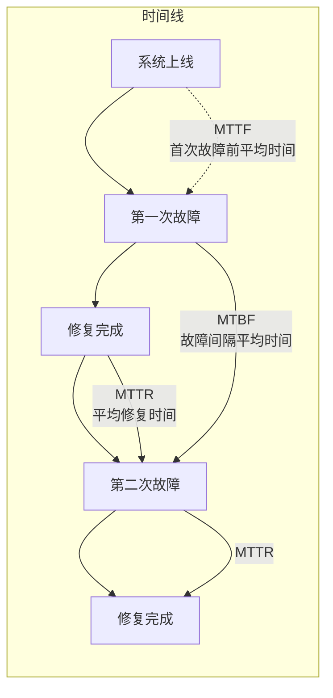
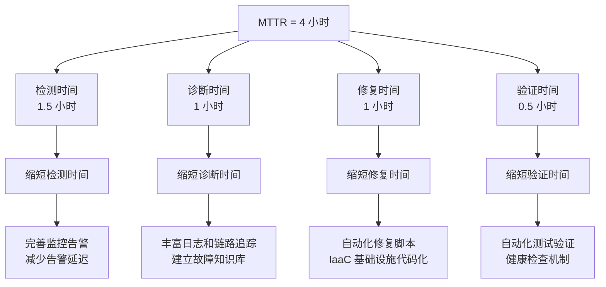
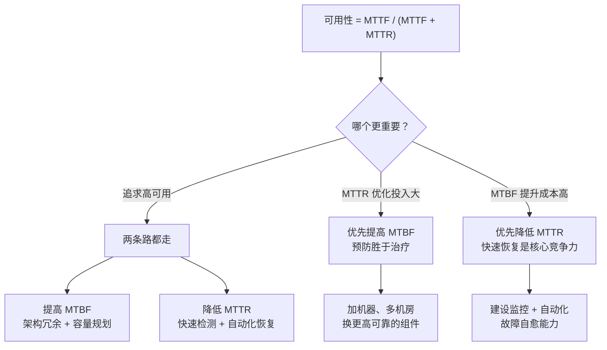

# MTBF/MTTR/MTTF 指标

可用性不只关乎「系统正常运行的时间」，还关乎「系统故障后多久能恢复」。

MTBF 和 MTTR 是两个从运维角度衡量系统可靠性的核心指标。它们把「可用性」这个抽象数字，拆解成了两个可操作的管理目标：**少出故障（MTBF）+ 快修故障（MTTR）**。

## 三个关键指标的定义



### MTTF（Mean Time To Failure）

**平均故障前时间**。衡量一个新系统（或修复后的系统）在发生故障前的平均运行时间。

```
MTTF = 系统总运行时间 ÷ 故障次数

例如：一个系统运行 8760 小时（一年），期间发生了 3 次故障
MTTF = 8760 ÷ 3 = 2920 小时（约 122 天）
```

### MTBF（Mean Time Between Failures）

**平均故障间隔时间**。衡量系统在两次故障之间的平均运行时间。

```
MTBF = 总运行时间 ÷ 总故障次数

注意：MTBF 通常包含 MTTR（修复时间）
MTBF = MTTF + MTTR（当系统可修复时）
```

### MTTR（Mean Time To Repair / Recovery）

**平均修复/恢复时间**。衡量从故障发生到服务恢复正常所需的平均时间。

```
MTTR = 总修复时间 ÷ 修复次数

MTTR 分解：
MTTR = 检测时间 + 诊断时间 + 修复时间 + 验证时间

- 检测时间：从故障发生到告警触发
- 诊断时间：从告警到找到根因
- 修复时间：从找到根因到问题修复
- 验证时间：从修复到服务恢复正常
```

## 可用性的新视角

传统公式：

```
可用性 = MTTF ÷ (MTTF + MTTR)
```

这个公式揭示了一个关键洞察：**提升可用性有两个方向——要么让故障更少（提高 MTTF），要么让修复更快（降低 MTTR）。**

```mermaid
flowchart TD
    A["可用性 = MTTF / (MTTF + MTTR)"] --> B["两个提升方向"]

    subgraph 方向一：减少故障
        B --> C["提高 MTTF"]
        C --> D["架构冗余\n多活部署\n容量规划"]
    end

    subgraph 方向二：加快修复
        B --> E["降低 MTTR"]
        E --> F["快速检测\n自动化恢复\n故障转移"]
    end

    style D fill:#e3f2fd
    style F fill:#ccffcc
```

## 不同场景下的指标侧重

### MTTF vs MTBF 的选择

| 场景 | 适用指标 | 说明 |
| --- | --- | --- |
| **不可修复系统**（一次性设备） | MTTF | 坏了就换，不修 |
| **可修复系统**（服务器、应用） | MTBF | 修复后继续使用 |
| **对比选型** | MTTF | 哪个系统更可靠 |

> 大多数生产系统都是可修复系统，使用 MTBF 更准确。但 MTTF 常用于硬件可靠性比较。

### 不同规模系统的合理 MTTR

| 系统规模 | 典型 MTTR | 说明 |
| --- | --- | --- |
| 小型系统（单机房） | 30 分钟 ~ 2 小时 | 手动排查，简单架构 |
| 中型系统（多实例） | 10 ~ 30 分钟 | 自动化程度较高 |
| 大型系统（多活架构） | 1 ~ 10 分钟 | 自动化故障转移 |
| 顶级系统（金融级） | `<` 1 分钟 | 全自动化，零人工干预 |

## MTTR 分解与优化

MTTR 不是单一数字，它的每个组成部分都可以单独优化：



### 检测时间优化

```yaml
# 检测时间优化实践
monitoring_improvements:
  目标: "将检测时间从 1.5 小时降至 5 分钟"

  措施:
    - "覆盖率：所有核心指标都有监控，无监控死角"
    - "告警延迟：端到端告警延迟 < 1 分钟"
    - "告警质量：减少误报，降低告警疲劳"
    - "主动探测：定期模拟用户请求，提前发现问题"
```

### 诊断时间优化

诊断时间通常占 MTTR 的最大比例。优化方向：

1. **完善日志链路**：从请求入口到数据库查询，每一步都有日志
2. **链路追踪**：分布式请求的完整调用链可追溯
3. **故障知识库**：积累常见故障的处理手册
4. **On-Call 指南**：故障发生时，明确第一步做什么、第二步做什么

### 修复时间优化

```python
# 自动化修复脚本示例
def attempt_auto_recovery(failure_type: str) -> bool:
    recovery_actions = {
        "high_cpu": restart_high_cpu_process,
        "oom": restart_and_increase_memory,
        "disk_full": cleanup_old_logs,
        "db_connection_exhausted": reset_connections,
        "service_unresponsive": restart_service,
    }

    if failure_type in recovery_actions:
        action = recovery_actions[failure_type]
        success = action()
        log_recovery_attempt(failure_type, success)
        return success

    return False
```

### 验证时间优化

- 自动化冒烟测试
- 流量自动切换验证
- 关键功能健康检查自动化

## MTBF 与 MTTR 的权衡



**关键洞察**：在 MTTR 上的投入往往比在 MTBF 上的投入更划算。

- 要把 MTBF 从 1000 小时提升到 2000 小时，可能需要翻倍的基础设施成本
- 要把 MTTR 从 60 分钟降到 15 分钟，通常只需要改进监控和自动化流程

## 真实案例：Netflix 的 MTTR 优化

Netflix 在 2012 年公开的数据显示，他们通过以下方式将 MTTR 从小时级降到分钟级：

1. **全面监控**：每个服务的每个操作都有指标
2. **自动化故障转移**：检测到故障后自动切换到健康实例
3. **Chaos Engineering**：主动注入故障，验证恢复能力
4. **故障知识库**：每次故障都有详细复盘文档

## 本章总结

**核心要点**：

1. **MTTF** 是「平均故障前时间」，衡量系统能无故障运行多久
2. **MTBF** 是「平均故障间隔」，MTTF + MTTR = MTBF
3. **MTTR** 是「平均修复时间」，可分解为检测 + 诊断 + 修复 + 验证
4. **提升可用性有两个方向**：提高 MTBF（减少故障）和降低 MTTR（加快修复）
5. **MTTR 优化通常比 MTBF 优化更划算**：自动化恢复能力的投入产出比更高

理解了可用性的度量方法，下一节我们将讲解如何用「N 个 9」量化可用性等级，以及不同等级背后的成本差异。
