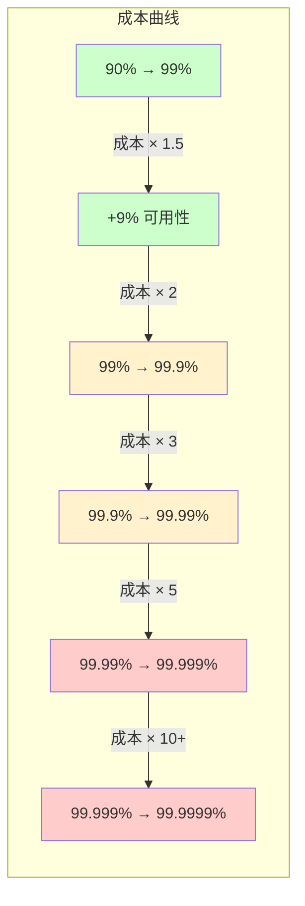
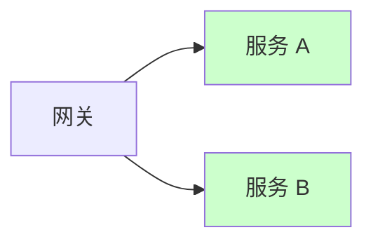

# 可用性等级（N个9）计算

「五个 9」「四个 9」——这些数字在架构设计中代表什么？不同等级之间的差距是线还是指数？

很多团队随口说出「我们要做到四个 9」，但很少有人真正算过：为了这多出来的 0.009% 可用性，需要付出多少成本？

## N 个 9 的数学含义

### 基本公式

```
可用性 = 正常运行时间 ÷ (正常运行时间 + 不可用时间)

不可用时间 = (1 - 可用性) × 总时间
```

### 不同等级的计算

| 可用性 | 年不可用时间 | 月不可用时间 | 周不可用时间 | 天不可用时间 |
| --- | --- | --- | --- | --- |
| **90%（1个9）** | 36 天 12 小时 | 3 天 | 16.8 小时 | 2.4 小时 |
| **99%（2个9）** | 3 天 15 小时 | 7.3 小时 | 1.68 小时 | 14.4 分钟 |
| **99.9%（3个9）** | 8 小时 45 分钟 | 43.8 分钟 | 10.1 分钟 | 1.44 分钟 |
| **99.99%（4个9）** | 52 分钟 35 秒 | 4.38 分钟 | 1.01 分钟 | 8.6 秒 |
| **99.999%（5个9）** | 5 分钟 15 秒 | 26.3 秒 | 6.05 秒 | 0.86 秒 |
| **99.9999%（6个9）** | 31.5 秒 | 2.63 秒 | 0.6 秒 | 0.086 秒 |

```python
# 计算脚本
def calculate_downtime(availability: float, period: str) -> str:
    """
    计算给定可用性等级下，指定周期的最大不可用时间
    """
    periods = {
        "year": 365 * 24 * 60,
        "month": 30 * 24 * 60,
        "week": 7 * 24 * 60,
        "day": 24 * 60
    }

    downtime_minutes = (1 - availability) * periods[period]

    if downtime_minutes >= 60:
        hours = int(downtime_minutes // 60)
        minutes = int(downtime_minutes % 60)
        return f"{hours} 小时 {minutes} 分钟"
    elif downtime_minutes >= 1:
        return f"{downtime_minutes:.1f} 分钟"
    else:
        seconds = downtime_minutes * 60
        return f"{seconds:.1f} 秒"

# 验证
print(calculate_downtime(0.999, "month"))    # 7.3 小时
print(calculate_downtime(0.9999, "month"))  # 4.38 分钟
print(calculate_downtime(0.99999, "month"))  # 26.3 秒
```

## 等级之间的差距有多大

从 99% 到 99.9%，年不可用时间从 3.65 天降到了 8.76 小时——差了 **10 倍**。

但这还不够直观。让我换一种方式：

| 升级路径 | 年不可用时间减少 | 减少比例 |
| --- | --- | --- |
| 99% → 99.9% | 3.65 天 → 8.76 小时 | **节省 3.4 天** |
| 99.9% → 99.99% | 8.76 小时 → 52.6 分钟 | **节省 8.2 小时** |
| 99.99% → 99.999% | 52.6 分钟 → 5.26 分钟 | **节省 47 分钟** |
| 99.999% → 99.9999% | 5.26 分钟 → 31.5 秒 | **节省 4.7 分钟** |

> **关键洞察**：每提升一个 9，从 90% 到 99% 的收益最大（节省了 30+ 天），越往后收益递减。但成本往往是递增的——越往上走，每提升一点都需要更大的投入。

## 服务级别与可用性等级对照

```mermaid
flowchart TD
    A["服务类型"] --> B["目标可用性"]
    A --> C["典型架构"]

    B1["99%（2个9）"] --> B
    B2["99.9%（3个9）"] --> B
    B3["99.99%（4个9）"] --> B
    B4["99.999%（5个9）"] --> B

    B1 -.->|"内部工具| C1["单机部署"]
    B2 -.->|"普通互联网| C2["主备切换"]
    B3 -.->|"高可用系统| C3["多活架构"]
    B4 -.->|"金融/生命线| C4["多活 + 自动切换"]
```

| 服务等级 | 可用性目标 | 典型服务 | 年不可用时间 |
| --- | --- | --- | --- |
| **L1** | 99.9999% | 心脏起搏器、飞机控制系统 | 31.5 秒 |
| **L2** | 99.999% | 金融交易系统、医疗设备 | 5.26 分钟 |
| **L3** | 99.99% | 支付系统、电信计费 | 52.6 分钟 |
| **L4** | 99.9% | 主流电商、在线服务 | 8.76 小时 |
| **L5** | 99% | 普通后台服务 | 3.65 天 |
| **L6** | 90% | 内部工具、测试环境 | 36.5 天 |

## 成本与可用性的非线性关系

这是最重要的部分：**可用性每提升一点，成本往往不是线性增长，而是指数增长。**



### 成本分布

| 可用性提升 | 主要成本来源 |
| --- | --- |
| 90% → 99% | 基础 HA（双机热备、简单监控） |
| 99% → 99.9% | 负载均衡、自动故障转移、中级监控 |
| 99.9% → 99.99% | 多机房部署、自动化运维、更完善的监控告警 |
| 99.99% → 99.999% | 全链路监控、故障自愈、混沌工程、专职 SRE |
| 99.999% → 99.9999% | 全面自动化、近乎零人工干预、极致测试 |

## 多服务系统的可用性计算

大多数系统由多个服务组成，整体可用性取决于所有服务的可用性。

### 串联系统


串联系统（任何一个环节故障则整体故障）：

```
整体可用性 = A × B × C × D

假设每个服务都是 99.9%：
整体可用性 = 0.999 × 0.999 × 0.999 × 0.999 = 0.996 ≈ 99.6%

即：4 个 99.9% 的服务串联后，整体可用性只有 99.6%
```

### 并联系统



并联系统（任一服务可用则整体可用）：

```
整体可用性 = 1 - (1 - A) × (1 - B)

假设每个服务都是 99.9%：
整体可用性 = 1 - (0.001)² = 1 - 0.000001 = 99.9999%

即：2 个 99.9% 的服务并联后，整体可用性提升到 99.9999%
```

### 混合系统

```python
# 混合系统可用性计算
def calculate_availability(components: list, topology: str) -> float:
    """
    计算混合系统的整体可用性
    components: 每个组件的可用性列表
    topology: "series", "parallel", 或 "mixed"
    """
    if topology == "series":
        # 串联：乘积
        result = 1.0
        for avail in components:
            result *= avail
        return result

    elif topology == "parallel":
        # 并联：1 - 所有组件同时故障的概率
        result = 1.0
        for avail in components:
            result *= (1 - avail)
        return 1 - result

    return result

# 示例：电商系统
# 网关(99.99%) → 用户服务(99.99%) → 订单服务(99.99%) → 支付服务(99.999%)
system_availability = (
    0.9999 *  # 网关
    0.9999 *  # 用户服务
    0.9999 *  # 订单服务（两个实例并联，每个 99.99%）
    (1 - (0.0001) ** 2) *  # 支付服务（两个实例并联）
    0.999999   # 数据库（主备，每个 99.999%）
)
print(f"系统整体可用性: {system_availability:.6f} ({system_availability*100:.4f}%)")
# 系统整体可用性: 0.99976 → 99.976%
```

## 实际计算：你的系统能达到几个 9

```python
def estimate_availability(
    mtbf_hours: float,
    mttr_hours: float,
    incidents_per_year: int
) -> float:
    """
    基于 MTBF 和 MTTR 估算可用性
    """
    total_hours = 365 * 24
    uptime_hours = total_hours - (incidents_per_year * mttr_hours)
    availability = uptime_hours / total_hours

    # 同时用 MTBF/MTTR 公式验证
    mtbf_availability = mtbf_hours / (mtbf_hours + mttr_hours)

    return availability, mtbf_availability

# 示例：普通互联网服务
# 年故障 4 次，每次 MTTR 2 小时
uptime, mtbf_avail = estimate_availability(
    mtbf_hours=2000,  # 平均 2000 小时出一次故障
    mttr_hours=2,      # 每次 2 小时修复
    incidents_per_year=4
)
print(f"基于运行数据: {uptime*100:.4f}%")
print(f"基于 MTBF/MTTR: {mtbf_avail*100:.4f}%")
```

## 本章总结

**核心要点**：

1. **每提升一个 9，年不可用时间约减少 10 倍**：但成本往往呈指数增长
2. **串联系统的可用性远低于任一组件**：减少串联依赖是提升整体可用性的关键
3. **并联系统可显著提升可用性**：关键服务做多实例部署
4. **整体可用性由木桶短板决定**：最薄弱环节决定了系统上限
5. **可用性目标要与业务价值匹配**：不是越高越好，够用就好

理解了可用性等级的计算，下一节我们将讨论：面对不同可用性等级的要求，如何做成本权衡。
