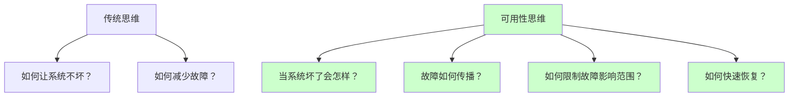
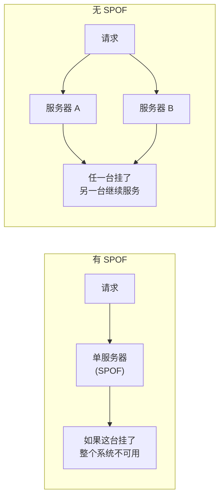
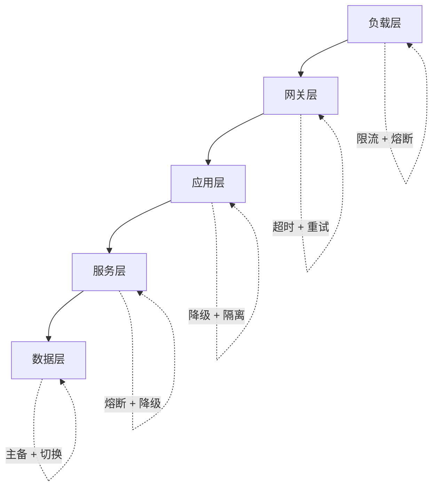
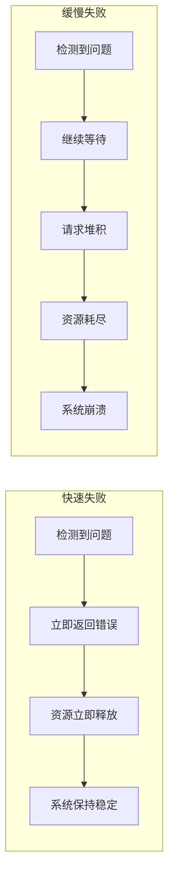
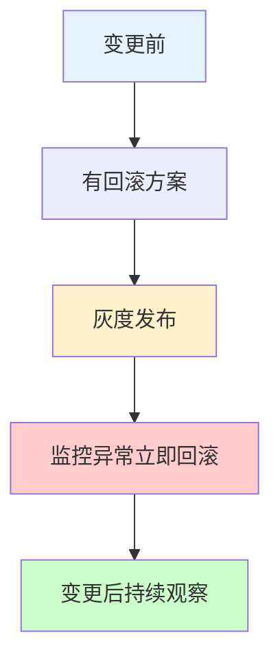
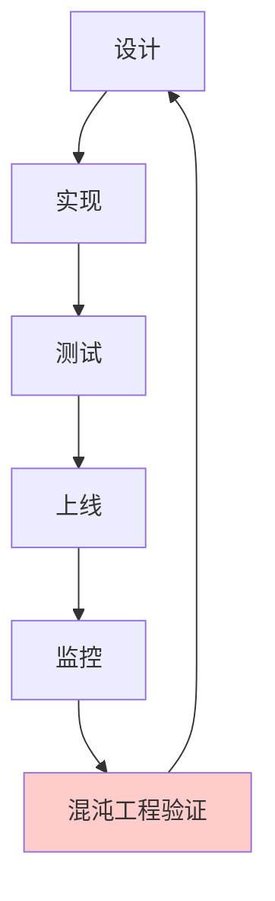

# 可用性设计原则

可用性不是靠「多加几台服务器」就能解决的，它是一套系统化的设计哲学。

在深入研究了无数可用性故障案例后，我发现：真正影响系统可用性的，不是某个单点故障，而是一系列系统性缺陷——架构设计中的隐患、监控体系中的盲区、应急响应中的混乱。

高可用设计不是「哪里坏了补哪里」，而是「从一开始就把稳定性的基因注入系统」。

## 十大可用性设计原则

### 原则一：设计要面向失败

**最核心的原则，也是最容易被忽视的。**

好的架构师不是在设计「如何让系统不坏」，而是在设计「当系统坏了会怎样」。



**实践方法**：

- 每次架构设计评审，问三个问题：单点故障在哪里？故障传播路径是什么？有没有降级方案？
- 做 Chaos Engineering，主动注入故障，验证防御是否有效

### 原则二：消除单点故障

单点故障（Single Point of Failure, SPOF）是可用性的天敌。



| 组件 | 单点故障风险 | 消除方案 |
| --- | --- | --- |
| 应用服务器 | 高 | 多实例 + 负载均衡 |
| 数据库 | 极高 | 主从复制 + 自动切换 |
| 缓存 | 中 | Redis Cluster / 主从 |
| 消息队列 | 高 | 镜像队列 / 集群模式 |
| 负载均衡器 | 极高 | 双机热备 / DNS 轮询 |

### 原则三：设计要有层次

系统的每个层次都需要独立的可用性设计：



每一层都需要问自己：**我的上一层挂了，我该怎么办？**

### 原则四：快速失败优于缓慢失败

当系统出现问题时，快速失败比让请求堆积然后崩溃要好得多。



**快速失败的具体实践**：

- 所有远程调用设置合理的超时时间
- 断路器检测到故障后快速熔断
- 队列满时立即拒绝新请求（而不是排队等待）

### 原则五：冗余要适度

冗余不是越多越好。超过必要的冗余会增加复杂度和运维成本：

| 组件 | 合理冗余度 | 说明 |
| --- | --- | --- |
| 无状态应用 | N+1 | 正常 N 个，备用 1 个 |
| 数据库 | 1 主 + 2 从 | 主写，从读，自动切换 |
| 缓存 | Redis Cluster | 分片 + 副本 |
| 消息队列 | 主备或集群 | 根据消息持久性要求 |

### 原则六：变更要可回滚

大多数可用性事故发生在变更时。

> 统计数据：约 70% 的生产故障来自变更（代码发布、配置变更、基础设施变更）。

**可回滚变更的核心要素**：



- **变更前**：有回滚方案，有回滚脚本，数据库变更要有向后兼容的 DDL
- **变更中**：灰度发布，逐步放量，随时准备回滚
- **变更后**：持续观察错误率和延迟，发现异常立即回滚

### 原则七：监控要全面且可操作

监控不是「能看到数据」就行，而是「能看到关键数据并在异常时及时告警」。

**监控三要素**：

1. **覆盖率**：核心指标全覆盖，无监控死角
2. **及时性**：告警延迟要短，故障发生到告警触发不超过 1 分钟
3. **可操作性**：每个告警都有明确的处理指引

```yaml
# 好的告警示例
alert:
  name: "HighErrorRate"
  condition: "5xx 错误率 > 1%"
  duration: "持续 5 分钟"
  action: "检查上游服务是否有故障，必要时降级"
  owner: "oncall-team"

# 不好的告警示例
alert:
  name: "CPUHigh"
  condition: "CPU > 80%"
  duration: "持续 1 分钟"
  action: "看情况"
  owner: "不知道找谁"
```

### 原则八：自动化优于人工干预

人工干预是可用性的敌人：

- 人工操作有延迟，故障响应慢
- 人工操作容易出错，尤其是在高压下
- 人工操作不可复制，经验难以积累

```mermaid
flowchart TD
    subgraph 自动化故障处理
        A["故障检测"] --> B["自动分析"]
        B --> C["自动执行修复"]
        C --> D["自动验证"]
        D --> E["通知相关人"]
    end

    A -.->|"秒级| F["人工排查"]
    F -.->|"分钟级| G["人工修复"]
    G -.->|"分钟级| H["人工验证"]
```

**可以自动化的场景**：

- 实例不健康时自动重启或替换
- 数据库主库故障时自动切换到从库
- 服务响应超时时自动降级
- 磁盘空间不足时自动清理旧数据

### 原则九：设计要简单

复杂性是可用性的敌人。

越复杂的系统，故障点越多，故障排查越困难，系统越难理解和维护。

**简化设计的原则**：

- 能用简单方案就不用复杂方案（KISS 原则）
- 每个组件只有一个职责（单一职责原则）
- 避免不必要的抽象层次
- 优先选择成熟的、被广泛验证的技术

### 原则十：定期验证

设计得再好，如果不去验证，也可能存在漏洞。

**验证方法**：



- **功能测试**：验证正常路径和异常路径
- **压力测试**：验证系统在极端负载下的表现
- **混沌工程**：主动注入故障，验证防御机制
- **故障演练**：模拟真实故障场景，检验应急响应

## 可用性设计检查清单

每次架构设计评审，用这个清单检查：

| 检查项 | 问题 |
| --- | --- |
| 单点故障 | 有没有单点故障？如何消除？ |
| 故障传播 | 一个服务挂了，会不会影响其他服务？ |
| 超时配置 | 所有远程调用都设置超时了吗？ |
| 降级方案 | 核心功能依赖的服务挂了怎么办？ |
| 监控覆盖 | 核心指标都有监控吗？告警及时吗？ |
| 变更管理 | 变更前有回滚方案吗？变更中有监控吗？ |
| 故障演练 | 多久做一次故障演练？ |
| 恢复能力 | 故障发生后，多久能恢复正常？ |

## 本章小结

**核心要点**：

1. **面向失败设计**：不追求「不坏」，而是设计「坏了怎么办」
2. **消除单点故障**：每个关键组件都要有冗余
3. **分层次设计**：每一层都要有独立的容错机制
4. **快速失败**：让问题快速暴露，而不是堆积后崩溃
5. **冗余要适度**：够用就好，过度冗余增加复杂度
6. **变更要可回滚**：大多数故障来自变更，必须可控
7. **监控要全面可操作**：看到关键数据，异常能及时告警
8. **自动化优于人工**：减少人工干预就是减少故障和延迟
9. **设计要简单**：复杂性是可用性的敌人
10. **定期验证**：通过混沌工程验证防御是否有效

可用性理论部分到此结束。接下来我们将进入「故障模型」模块，理解系统会以哪些方式失效——这是设计容错机制的前提。
