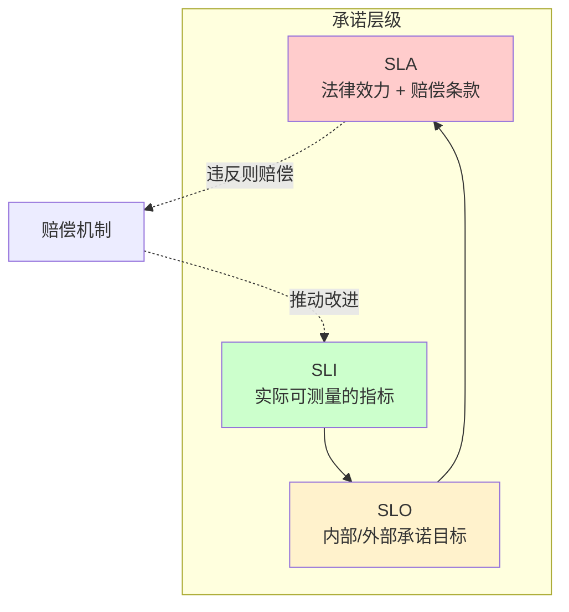
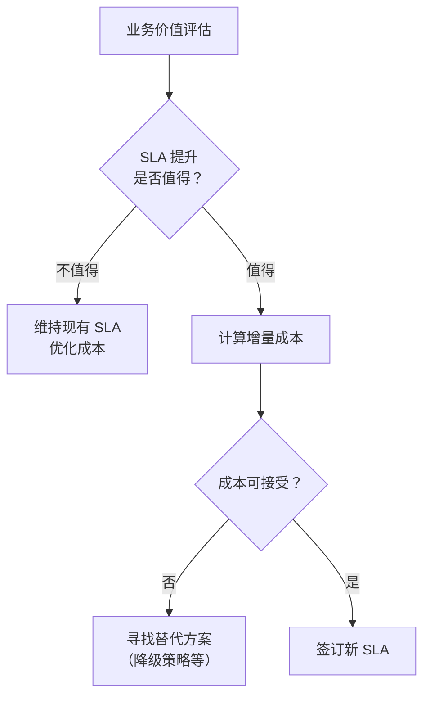

# SLA（服务等级协议）详解

SLA 不只是一行数字，而是一份合同。

很多团队以为 SLA 就是「承诺 99.9% 的可用性」，写进合同就完事了。但真正签过 SLA 的团队都知道，这份文件里的每一个数字背后，都对应着真实的赔偿金额、业务风险和技术投入。

SLA 的本质是：**用可量化的指标，定义服务方和客户方之间的权利与义务。**

## SLA 的三层结构



**SLI 是地基**：没有 SLI，SLO 就是空话，SLA 就是空头支票。

**SLO 是承诺**：团队对 SLA 目标的内部分解，通常比 SLA 目标略高，留出缓冲空间。

**SLA 是合同**：对客户的正式承诺，通常附有赔偿条款，法律效力最强。

## SLA 的核心要素

一份完整的 SLA 至少包含以下要素：

### 1. 服务范围（Scope）

SLA 首先必须明确：**这份协议涵盖哪些服务，哪些不包括在内？**

| 场景 | 典型描述 |
| --- | --- |
| **全服务覆盖** | 所有 API 端点、所有功能 |
| **核心服务覆盖** | 只包含核心业务流程（如下单、支付），不计边缘功能（如积分、推荐） |
| **分层 SLA** | 不同服务等级对应不同的 SLA，核心功能更高级 |

### 2. 可用性指标

可用性指标必须具体、可测量：

```yaml
# 典型 SLA 指标定义
service_level_agreement:
  scope: "所有面向用户的 HTTP API"

  availability:
    target: 99.9%
    measurement: "successful_requests / total_requests"
    window: "monthly"

  latency:
    target: "TP99 < 200ms"
    measurement: "P99 response time over 5-minute windows"
    window: "monthly"
    percentile: 99

  error_rate:
    target: "< 0.1%"
    measurement: "5xx responses / total responses"
    window: "monthly"
```

### 3. 测量窗口（Measurement Window）

可用性按照什么时间周期计算？

| 窗口类型 | 说明 | 适用场景 |
| --- | --- | --- |
| **自然月** | 每月 1 日至月末 | 大多数对外 SLA |
| **滚动窗口** | 过去 30 天连续滚动 | 内部 SLO 更常用 |
| **全年累计** | 每年 1 月 1 日至 12 月 31 日 | 年度 SLA |

> **关键细节**：计划内维护时间（发布窗口）是否计入不可用时间？大多数 SLA 会明确排除计划内维护，但需要双方事先协商。

### 4. 赔偿机制（Remedy）

这是 SLA 最「实在」的部分——违反承诺怎么办？

| 赔偿类型 | 说明 | 示例 |
| --- | --- | --- |
| **服务补偿** | 延长服务期或赠送服务时长 | 每超出 1 小时不可用，延长 1 天服务期 |
| **积分/代金券** | 返还部分费用 | 月费的 10% 作为下次消费的代金券 |
| **直接退款** | 直接退还部分费用 | 每超出 1% 的不可用时间，退还月费的 5% |
| **阶梯赔偿** | 不可用程度越高，赔偿越多 | 99%~95%：赔偿 10%；95%~90%：赔偿 25%；`<` 90%：赔偿 50% |

### 5. 例外条款（Exclusions）

SLA 必须明确列出**不在赔偿范围内的场景**：

- 计划内维护（提前通知并协商时间窗口）
- 客户自身原因导致的故障
- 不可抗力（自然灾害、大规模停电）
- 第三方服务故障（云厂商需界定清楚边界）
- 超过协议约定负载的请求（DDoS、流量突增）

## 不同角色的 SLA 视角

### 云厂商视角

主流云厂商的 SLA 通常有以下特点：

| 云厂商 | 计算服务可用性 SLA | 赔偿上限 |
| --- | --- | --- |
| AWS EC2 | 99.99% | 服务积分，不超过月度费用的 100% |
| Azure VM | 99.9% | 退款，最高不超过月度费用的 100% |
| GCP Compute Engine | 99.99% | 服务积分，不超过月度费用的 100% |

**注意**：云厂商 SLA 中的「计算服务可用性」通常指底层虚拟机的可用性，不包括应用层故障、网络配置问题等。

### 企业客户视角

企业客户签订 SLA 时，最关心的三个问题：

1. **赔偿够不够**：赔偿是否能覆盖业务损失？
2. **举证难不难**：谁来证明 SLA 未达标，举证成本有多高？
3. **修复快不快**：SLA 达标了但系统已经坏了，快速恢复能力如何？

### 内部 SLA vs 外部 SLA

内部 SLA（团队之间的协议）和外部 SLA（对客户的承诺）有本质区别：

| 维度 | 内部 SLA | 外部 SLA |
| --- | --- | --- |
| **法律效力** | 通常无 | 通常有 |
| **赔偿机制** | 通常无明确赔偿 | 有明确赔偿条款 |
| **灵活性** | 可随时调整 | 需双方协商 |
| **监控要求** | 相对宽松 | 严格，需可审计 |
| **优先级** | 相对较低 | 最高优先级 |

## SLA 制定的最佳实践

### 实践一：从历史数据出发

不要拍脑袋定 SLA。先分析过去 3~6 个月的实际表现：

```python
# 分析历史数据，确定合理的 SLA 目标
import statistics

# 假设这是过去 30 天的每日可用性数据
daily_availability = [
    0.9995, 0.9998, 0.9992, 0.9999, 0.9997,
    0.9996, 0.9991, 0.9998, 0.9994, 0.9997,
    0.9995, 0.9999, 0.9993, 0.9996, 0.9998,
    0.9997, 0.9994, 0.9999, 0.9992, 0.9998,
    0.9995, 0.9996, 0.9997, 0.9993, 0.9998,
    0.9999, 0.9994, 0.9996, 0.9997, 0.9995
]

avg = statistics.mean(daily_availability)
min_val = min(daily_availability)
p95 = statistics.quantiles(daily_availability, n=20)[18]  # 95th percentile

print(f"平均值: {avg:.4f} ({avg*100:.2f}%)")
print(f"最低值: {min_val:.4f} ({min_val*100:.2f}%)")
print(f"P95:    {p95:.4f} ({p95*100:.2f}%)")

# 推荐 SLA 策略：取平均值略低，作为承诺目标
recommended_sla = avg * 0.999  # 留 0.1% 缓冲
print(f"推荐 SLA 目标: {recommended_sla:.4f} ({recommended_sla*100:.2f}%)")
```

### 实践二：分层 SLA

不是所有服务都同等重要。给核心服务和边缘服务设定不同的 SLA：

```yaml
# 分层 SLA 示例
sla_tiers:
  gold:
    description: "核心业务流程"
    availability: 99.99%
    latency_p99: 100ms
    services:
      - 用户登录
      - 订单创建
      - 支付接口

  silver:
    description: "重要业务功能"
    availability: 99.9%
    latency_p99: 500ms
    services:
      - 商品查询
      - 购物车
      - 物流查询

  bronze:
    description: "辅助功能"
    availability: 99%
    latency_p99: 2000ms
    services:
      - 商品推荐
      - 用户画像
      - 数据统计
```

### 实践三：SLA 与成本挂钩

每提升 0.1% 的可用性，成本可能增加 20%~50%。SLA 必须与业务价值匹配：



## SLA 谈判中的常见误区

### 误区一：盲目承诺高 SLA

「客户要求 99.99%，我们就签 99.99%」——签完才发现现有架构根本达不到，或者达到需要投入天价成本。

**正确做法**：先评估现有能力，给出能达到的 SLA，谈判时用技术数据说话。

### 误区二：SLA 数字越高越好

对客户来说，高 SLA 意味着高保障，但也意味着高价格。对服务提供方来说，承诺超过自己能力的 SLA，等于签了一张随时可能赔钱的合同。

**正确做法**：SLA 的目标不是越高越好，而是「合理且可持续」。

### 误区三：只谈可用性，忽略延迟和数据

SLA 不只包含可用性，延迟、数据一致性、数据持久性同样重要。一个 99.99% 可用但 TP99 延迟 10 秒的系统，用户体验可能比一个 99.5% 可用但 TP99 延迟 100ms 的系统更差。

**正确做法**：全面定义 SLA 指标，覆盖可用性、延迟、错误率等维度。

## 本章总结

**核心要点**：

1. **SLA = 服务范围 + 可用性指标 + 测量窗口 + 赔偿机制 + 例外条款**，缺一不可
2. **分层 SLA 是最佳实践**：核心服务高 SLA，边缘服务适度 SLA
3. **SLA 承诺要从历史数据出发**：不要拍脑袋，避免承诺自己达不到的目标
4. **赔偿机制要明确**：模糊的赔偿条款在争议时毫无用处
5. **SLA 不只是数字**：延迟、错误率、数据持久性同样重要

SLA 是对外的承诺，而 SLO 是内部用来保证 SLA 达标的「内部目标」。下一节我们将讲解如何制定有效的 SLO。
