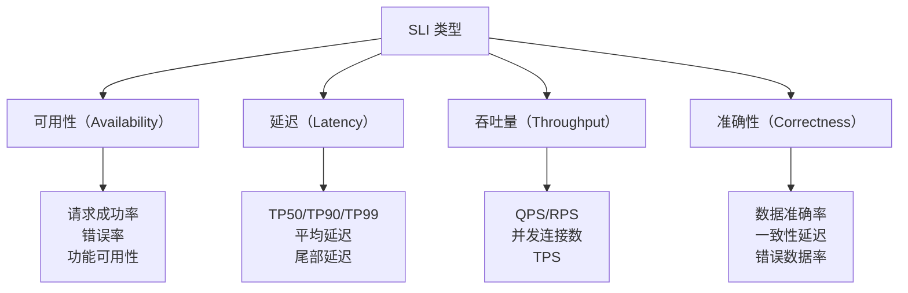
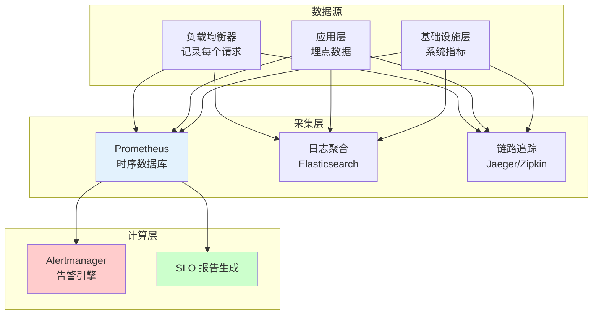

# SLI（服务等级指标）选择

SLI 是所有可用性管理的基石。没有好的 SLI，SLO 就是空中楼阁，SLA 就是一纸空文。

很多人以为 SLI 就是「监控指标」，把 CPU、内存、网络流量都往 SLI 列表里塞。导致 SLI 列表越来越长，但真正反映用户体验的指标反而淹没在噪音里。

SLI 的核心原则只有一条：**只选那些用户能感知到的指标。**

## SLI 的四大类型



### 1. 可用性类 SLI

**定义**：请求能否成功完成。

| SLI | 公式 | 说明 |
| --- | --- | --- |
| 请求成功率 | `成功请求 / 总请求` | 最直接的可用性指标 |
| 错误率 | `失败请求 / 总请求` | 通常关注 5xx 错误，4xx 不计入 |
| 功能可用性 | `功能点可用 / 功能点总数` | 适合评估多功能系统 |

```yaml
# 可用性 SLI 示例：PromQL
# 请求成功率
sum(rate(http_requests_total{
  service="api-gateway",
  status!~"5.."
}[5m]))
/
sum(rate(http_requests_total{
  service="api-gateway"
}[5m]))

# 5xx 错误率（取反即为可用性）
sum(rate(http_requests_total{
  service="api-gateway",
  status=~"5.."
}[5m]))
/
sum(rate(http_requests_total{
  service="api-gateway"
}[5m]))
```

### 2. 延迟类 SLI

**定义**：请求的响应速度是否在用户可接受范围内。

| SLI | 说明 | 适用场景 |
| --- | --- | --- |
| **TP50（Median）** | 50% 请求的延迟 | 反映典型用户体验 |
| **TP90** | 90% 请求的延迟 | 反映大多数用户体验 |
| **TP99/TP999** | 99%/99.9% 请求的延迟 | 反映尾部用户体验 |
| **平均延迟** | 所有请求延迟的平均值 | 易理解，但易被异常值拉偏 |
| **超过阈值的请求比例** | 延迟 > Xms 的请求占比 | 最贴近用户体验 |

```yaml
# 延迟 SLI 示例：PromQL
# TP99 延迟（秒）
histogram_quantile(0.99,
  sum(rate(http_request_duration_seconds_bucket{
    service="order-service"
  }[5m])) by (le)
)

# 延迟超过 500ms 的请求比例
sum(rate(http_request_duration_seconds_count{
  service="order-service",
  le="0.5"
}[5m]))
/
sum(rate(http_request_duration_seconds_count{
  service="order-service"
}[5m]))
```

> **延迟 SLI 的陷阱**：TP99 是最常被引用的指标，但也是最容易被误解的。TP99 延迟好不等于所有用户都体验良好——那剩下的 1% 用户可能正经历着灾难性的慢响应。

### 3. 吞吐量类 SLI

**定义**：系统在单位时间内能处理多少请求。

| SLI | 说明 | 重要性 |
| --- | --- | --- |
| **QPS/RPS** | 每秒请求数 | 衡量系统容量的基础 |
| **并发连接数** | 同时活跃的连接数 | 防止资源耗尽 |
| **TPS** | 每秒事务数 | 业务层面的吞吐量 |

```yaml
# 吞吐量 SLI 示例：PromQL
# QPS
sum(rate(http_requests_total{
  service="payment-service"
}[5m]))

# 峰值 QPS
max_over_time(
  sum(rate(http_requests_total{
    service="payment-service"
  }[5m]))[1h:]
)
```

### 4. 准确性类 SLI

**定义**：系统返回的数据是否正确。

| SLI | 说明 | 适用场景 |
| --- | --- | --- |
| **数据准确率** | 正确数据 / 总数据 | 数据查询服务 |
| **一致性延迟** | 数据写入到可读取的时间差 | 分布式数据库、缓存 |
| **错误数据率** | 返回错误数据 / 总请求 | 搜索服务、推荐系统 |

## 不同服务类型的 SLI 选择

### 面向用户的 HTTP API

```yaml
sli:
  primary:
    - name: "请求成功率"
      query: |
        sum(rate(http_requests_total{status!~"5.."})) /
        sum(rate(http_requests_total))
      target: 0.9995

    - name: "TP99 延迟"
      query: |
        histogram_quantile(0.99,
          sum(rate(http_request_duration_seconds_bucket{}) by (le))
        )
      target: 0.2  # 200ms

    - name: "TP95 延迟"
      query: |
        histogram_quantile(0.95,
          sum(rate(http_request_duration_seconds_bucket{}) by (le))
        )
      target: 0.1  # 100ms
```

### 后台数据处理服务

```yaml
sli:
  primary:
    - name: "任务完成率"
      query: |
        sum(rate(background_tasks_completed_total)) /
        sum(rate(background_tasks_total))
      target: 0.999

    - name: "数据处理延迟"
      query: |
        histogram_quantile(0.99,
          sum(rate(task_processing_duration_seconds_bucket{})) by (le)
        )
      target: 60  # 60秒内处理完成

    - name: "积压任务数"
      query: |
        sum(background_tasks_pending)
      target: 1000  # 最大积压不超过 1000
```

### 数据存储服务

```yaml
sli:
  primary:
    - name: "读写成功率"
      query: |
        sum(rate(storage_ops_success_total)) /
        sum(rate(storage_ops_total))
      target: 0.99999

    - name: "数据一致性"
      query: |
        sum(rate(storage_consistency_violations_total)) /
        sum(rate(storage_ops_total))
      target: 0.0001  # 0.01%

    - name: "持久性"
      query: |
        # 写入后数据丢失的比率
        1 - (lost_data_after_write / total_writes)
      target: 0.9999999  # 六个9
```

## SLI 选择中的常见错误

### 错误一：SLI 列表过长

**问题**：监控了几十个指标，但没有一个能真正回答「用户能用吗？」

**正确做法**：SLI 列表越短越好。通常一个服务 3~5 个 SLI 就足够了。问自己：「如果只能监控 3 个指标，我会选哪 3 个？」

### 错误二：用技术指标代替用户体验指标

**问题**：监控 JVM 堆内存、GC 次数、线程池大小——这些数字对用户毫无意义。

**正确做法**：用户只关心「请求成功了吗？够快吗？」，把技术指标转化为用户体验指标。

### 错误三：忽略测量误差

**问题**：监控数据采集本身有延迟和误差，如果 SLI 设定接近监控精度，就无法准确判断 SLO 是否达标。

**正确做法**：在 SLI 测量值上留出合理的置信区间，不要把 SLO 设定在监控精度的边界上。

## SLI 测量架构



## 本章总结

**核心要点**：

1. **SLI 要选择用户能感知的指标**：CPU、内存不是 SLI，请求成功率、延迟才是
2. **四大 SLI 类型**：可用性、延迟、吞吐量、准确性，根据业务场景选择
3. **SLI 越少越好**：一个服务 3~5 个核心 SLI，远好过几十个技术指标
4. **SLI 要可测量**：选择有明确计算公式、能被监控工具采集的指标
5. **定期 review SLI**：业务变化后，旧的 SLI 可能不再适用

有了 SLI 和 SLO，错误预算就是把这些数字变成可操作决策的关键工具。下一节我们将讲解如何用错误预算管理发布节奏和团队行为。
