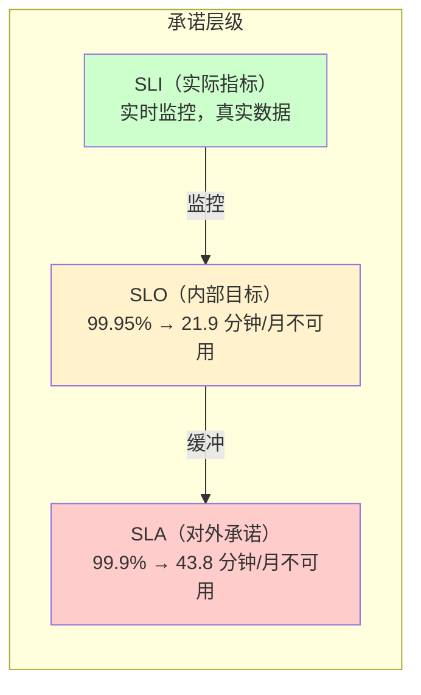
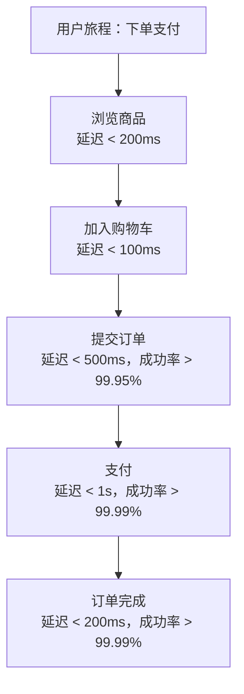

# SLO（服务等级目标）设定

SLO 是团队内部对服务的「自我要求」。

如果 SLA 是对外的合同，SLO 就是内部的达标线。SLO 的目标不是「刚好不违约」，而是「让违约风险降到可接受的范围」。

很多团队把 SLO 和 SLA 混为一谈——SLA 承诺 99.9%，SLO 也定 99.9%。这是错误的。SLO 应该比 SLA 略高，留出缓冲空间，应对监控误差、测量波动和未预见的问题。

## SLO 与 SLA 的关系



**为什么 SLO 要比 SLA 高？**

假设 SLA 承诺 99.9%，SLO 也定 99.9%。如果监控本身有 0.05% 的误差，加上业务高峰期自然波动，你可能每个月都会「意外违约」。

通常建议 SLO 比 SLA 高 0.05%~0.1%：

| SLA 承诺 | SLO 内部目标 | 缓冲空间 |
| --- | --- | --- |
| 99.9% | 99.95% | 21.9 分钟/月 |
| 99.99% | 99.995% | 2.2 分钟/月 |
| 99.999% | 99.9995% | 13 秒/月 |

## SLO 设定的核心原则

### 原则一：SLO 应该基于用户感知

SLO 不是技术指标的堆砌，而是**用户真正关心什么**。

用户不关心「数据库连接池利用率」「JVM 堆使用率」，用户关心：

- 请求能不能成功？
- 响应够不够快？
- 数据是不是正确的？

所以 SLO 应该围绕用户可感知的行为来定义。

### 原则二：选择正确的 SLI

SLO 是「基于 SLI 设定的目标」。SLI 的选择决定了 SLO 的有效性：

| 场景 | 推荐 SLI | 不推荐的 SLI |
| --- | --- | --- |
| 对外 API | 请求成功率、TP99 延迟 | 数据库 CPU 使用率 |
| 数据服务 | 数据新鲜度、查询成功率 | 磁盘 I/O |
| 文件存储 | 上传/下载成功率、持久性 | NFS 连接数 |

### 原则三：SLO 窗口要与业务节奏匹配

```mermaid
flowchart TD
    subgraph 滚动窗口 vs 自然窗口
        A["滚动窗口（Rolling）\n过去 28/30 天连续计算"]
        B["自然月窗口（Calendar）\n每月 1 日至月末"]
    end

    A --> |"更平滑| C["适合内部 SLO"]
    B --> |"更易理解| D["适合对外 SLA"]
```

**滚动窗口的优点**：不受月初月末切换的影响，能反映真实的持续表现。

**自然月窗口的优点**：与财务周期对齐，便于计算和报告。

## SLO 设定的实战方法

### 方法一：用户旅程法

从用户使用产品的核心旅程出发，逐一定义 SLO：



针对每一步定义 SLO，最后综合得出整个旅程的成功率：

```python
# 假设每一步的成功率和延迟独立
journey_success_rate = (
    0.9999 *  # 浏览商品
    0.9998 *  # 加入购物车
    0.9995 *  # 提交订单
    0.9999 *  # 支付
    0.9999    # 订单完成
)
print(f"完整旅程成功率: {journey_success_rate:.6f}")
# 完整旅程成功率: 0.99820 → 99.82%
```

这个数字告诉我们：**即使每一步都很优秀，完整旅程的成功率也会因为步骤多而显著下降。**

### 方法二：历史基线法

分析过去 30~90 天的数据，找到合理的 SLO 基准：

```python
# 基于历史数据设定 SLO 的示例
historical_data = {
    "availability": {
        "mean": 0.9992,
        "p50": 0.9993,
        "p95": 0.9988,
        "p99": 0.9985,
        "min": 0.9975
    },
    "latency_p99_ms": {
        "mean": 150,
        "p95": 180,
        "p99": 250,
        "max": 500
    }
}

# 推荐 SLO 策略：
# 可用性：取 P95 基线，留 0.05% 缓冲
slo_availability = min(historical_data["availability"]["p95"], 0.999) * 0.9995
print(f"推荐可用性 SLO: {slo_availability:.4f}")

# 延迟：取 P95 基线，留 20% 缓冲
slo_latency = historical_data["latency_p99_ms"]["p95"] * 1.2
print(f"推荐延迟 SLO: {slo_latency:.0f} ms")
```

### 方法三：竞品对标法

参考行业标杆或竞品的公开 SLO：

| 服务类型 | 典型 SLO 参考 |
| --- | --- |
| 大型云厂商 API | 99.99% 可用性 + TP99 `<` 100ms |
| 主流电商核心功能 | 99.95% 可用性 + TP99 `<` 500ms |
| SaaS 通用平台 | 99.9% 可用性 + TP99 `<` 1s |
| 创业公司/非核心服务 | 99% 可用性 + TP99 `<` 2s |

## SLO 文档化

每个 SLO 都应该有完整的文档：

```yaml title="slo-document.yaml"
slo:
  name: "order-service-availability"
  description: "订单服务核心 API 可用性"

  sli:
    type: "request_success_rate"
    method: |
      sum(rate(http_requests_total{
        service="order-service",
        status!~"5.."
      }[5m]))
      /
      sum(rate(http_requests_total{
        service="order-service"
      }[5m]))

  target: 0.9995          # 目标 99.95%
  window: "rolling_30d"    # 30 天滚动窗口
  measurement: "request_based"  # 基于请求数计算

  burn_rate_alerts:
    fast:
      threshold: 0.01       # 错误率 > 1% 立即告警
      window: 1h
      severity: critical
    slow:
      threshold: 0.01       # 持续错误率 > 1%
      window: 6h
      severity: warning

  metadata:
    owner: "order-team"
    tier: "gold"
    last_reviewed: "2024-01-15"
```

## 常见问题

### 问题一：SLO 太多，不知道从何下手

**建议**：先从最核心的用户路径开始，通常不超过 5~10 个 SLO。每个 SLO 应该对应一个明确的业务价值。

### 问题二：SLO 设得太高，永远达不到

**诊断**：如果历史数据显示系统从未达到过某个水平，这个 SLO 就是不切实际的。先把 SLO 设到历史平均值的 99.5%，逐步提高。

### 问题三：SLO 和业务指标脱节

**建议**：每个 SLO 都要回答一个问题：「如果这个 SLO 未达标，用户会感受到什么？」如果回答不上来，这个 SLO 可能设置得不对。

## 本章总结

**核心要点**：

1. **SLO 是内部目标，比 SLA 略高**，留出缓冲空间应对监控误差和业务波动
2. **SLO 要基于用户感知定义**，从用户旅程出发，而非技术指标
3. **SLI 选择决定了 SLO 的有效性**，选错 SLI 会导致 SLO 与用户体验脱节
4. **SLO 文档化是必要的**，每个 SLO 都应该有明确的定义、测量方法和告警规则
5. **SLO 要定期 review**，随着系统演进和业务变化适时调整

SLO 是团队内部的管理工具，而错误预算则是用 SLO 驱动实际决策的核心机制。下一节我们将讲解 SLI 的选择，以及如何用错误预算管理发布节奏。
