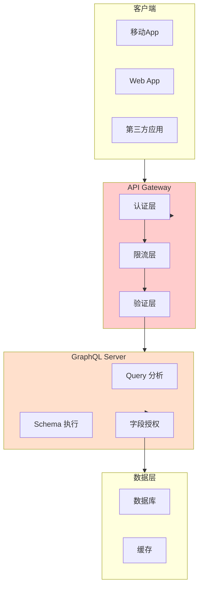

REST API 的安全问题是「端点太多，攻击面太大」。GraphQL 的安全问题恰好相反——**只有一个端点，但这个端点可以做任何事情**。攻击者不再需要找到隐藏的管理接口，只需要构造一个巧妙的查询，就能获取整个数据库。

2018 年，GitHub 的 GraphQL API 被发现存在无限递归查询漏洞，攻击者可以通过构造嵌套查询耗尽服务器资源。GraphQL 的灵活性既是它的优势，也是它最大的安全挑战。

## GraphQL 的安全风险与 REST 的差异

| 维度 | REST API | GraphQL |
| --- | --- | --- |
| **端点数量** | 多个端点 | 通常单一端点 |
| **数据获取** | 服务端决定返回哪些字段 | 客户端决定需要哪些字段 |
| **查询复杂度** | 容易评估 | 难以预测 |
| **嵌套深度** | 通常 1-2 层 | 可能多层嵌套 |
| **批量操作** | 需要多次请求 | 单次请求可包含多个操作 |
| **授权控制** | 在端点层做 | 在字段层做 |

GraphQL 的安全问题可以分为两类：**数据访问问题**（过度暴露）和**资源消耗问题**（DoS）。

## GraphQL 特有的攻击面

### 1. 深度嵌套查询（DoS）

GraphQL 允许客户端自由定义查询深度，攻击者可以构造极深的嵌套查询：

```graphql
# 正常查询
query {
  user(id: "1") {
    name
    email
  }
}

# 恶意查询：无限递归
query {
  user(id: "1") {
    friends {
      friends {
        friends {
          friends {
            ... 无限递归 ...
          }
        }
      }
    }
  }
}
```

```graphql
# 利用自引用字段
type User {
  friends: [User!]!
  followers: [User!]!
}

query {
  user(id: "1") {
    friends {
      friends {
        friends {
          friends {
            friends {
              friends {
                friends {
                  friends {
                    friends {
                      friends {
                        # 每次查询获取所有字段
                        friends {
                          # 继续嵌套...
                        }
                      }
                    }
                  }
                }
              }
            }
          }
        }
      }
    }
  }
}
```

```java title="DepthLimitInterceptor.java"
public class DepthLimitInterceptor {
    
    private final int maxDepth;
    private final Map<String, Set<String>> fragments = new HashMap<>();
    
    public ValidationResult validate(Query query) {
        int depth = calculateDepth(query.getSelections(), 0);
        
        if (depth > maxDepth) {
            return ValidationResult.rejected(
                "Query depth exceeds maximum allowed: " + maxDepth);
        }
        
        return ValidationResult.accepted();
    }
    
    private int calculateDepth(List<Selection> selections, int currentDepth) {
        if (selections.isEmpty()) {
            return currentDepth;
        }
        
        int maxChildDepth = currentDepth;
        
        for (Selection selection : selections) {
            if (selection instanceof Field) {
                Field field = (Field) selection;
                
                // 检查是否有 @include 或 @skip 指令
                if (shouldSkip(field)) {
                    continue;
                }
                
                int childDepth = calculateDepth(
                    field.getSelectionSet().getSelections(),
                    currentDepth + 1
                );
                
                maxChildDepth = Math.max(maxChildDepth, childDepth);
            }
        }
        
        return maxChildDepth;
    }
    
    // 配置允许的最大深度
    public DepthLimitInterceptor(int maxDepth) {
        this.maxDepth = maxDepth;
    }
}
```

### 2. 批量查询攻击（N+1 问题放大）

GraphQL 允许单次请求包含多个操作，攻击者可以批量获取大量数据：

```graphql
# 单次请求包含 1000 个查询
query {
  user1: user(id: "1") { email }
  user2: user(id: "2") { email }
  user3: user(id: "3") { email }
  # ... 1000 次
}
```

```graphql
# 或者利用列表查询
query {
  users(first: 1000) {
    edges {
      node {
        email
        phone
        address
        creditCard
      }
    }
  }
}
```

```java title="QueryComplexityAnalyzer.java"
public class QueryComplexityAnalyzer {
    
    private final ComplexityCalculator calculator;
    private final int maxComplexity;
    
    public ValidationResult analyze(Query query) {
        int complexity = calculator.calculate(query);
        
        if (complexity > maxComplexity) {
            return ValidationResult.rejected(
                "Query complexity " + complexity + " exceeds maximum " + maxComplexity);
        }
        
        return ValidationResult.accepted();
    }
}

public class ComplexityCalculator {
    
    // 为每个字段定义复杂度权重
    private static final Map<String, Integer> FIELD_WEIGHTS = Map.of(
        "id", 1,
        "name", 1,
        "email", 2,
        "phone", 2,
        "posts", 5,        // 关联查询，复杂度高
        "friends", 3,
        "messages", 4,
        "creditCard", 10   // 敏感字段，高权重
    );
    
    public int calculate(Query query) {
        return calculateSelections(query.getSelections(), 1);
    }
    
    private int calculateSelections(List<Selection> selections, int depth) {
        int totalComplexity = 0;
        
        for (Selection selection : selections) {
            if (selection instanceof Field) {
                Field field = (Field) selection;
                
                // 获取字段权重
                int weight = FIELD_WEIGHTS.getOrDefault(
                    field.getName(), 1);
                
                // 深度因子
                int depthMultiplier = depth;
                
                // 列表查询需要乘以列表大小
                int listMultiplier = 1;
                if (hasArgument(field, "first") || hasArgument(field, "last")) {
                    listMultiplier = getArgumentValue(field, "first", "last", 10);
                    listMultiplier = Math.min(listMultiplier, 100); // 上限
                }
                
                totalComplexity += weight * depthMultiplier * listMultiplier;
                
                // 递归计算子查询
                if (field.hasSelectionSet()) {
                    totalComplexity += calculateSelections(
                        field.getSelectionSet().getSelections(),
                        depth + 1
                    );
                }
            }
        }
        
        return totalComplexity;
    }
}
```

### 3. 字段过度获取

GraphQL 让客户端决定返回哪些字段，攻击者可以只查询敏感字段：

```graphql
# 只查询管理员相关字段
query {
  users(first: 100) {
    edges {
      node {
        role
        permissions
        accessTokens
      }
    }
  }
}
```

### 4. 内省查询滥用

GraphQL 的内省系统允许查询者了解整个 Schema：

```graphql
# 查询所有类型
query {
  __schema {
    types {
      name
      fields {
        name
        type {
          name
          kind
        }
      }
    }
  }
}

# 查询特定类型的字段
query {
  __type(name: "User") {
    fields {
      name
      type {
        name
      }
      args {
        name
        type {
          name
        }
      }
    }
  }
}
```

```java title="IntrospectionSecurityConfig.java"
public class IntrospectionSecurityConfig {
    
    // 根据客户端角色决定是否允许内省
    public boolean isIntrospectionAllowed(Context context) {
        // 开发环境允许内省
        if (isDevelopment()) {
            return true;
        }
        
        // 认证用户允许基本内省
        if (context.isAuthenticated()) {
            return true;
        }
        
        // 未认证用户不允许内省
        return false;
    }
    
    // 限制内省查询的范围
    public Set<String> getAllowedIntrospectionTypes(Context context) {
        if (context.hasRole("ADMIN")) {
            // 管理员可以看到所有类型
            return null; // null 表示不限制
        }
        
        if (context.isAuthenticated()) {
            // 普通认证用户看不到敏感类型
            return Set.of(
                "Query",
                "User", "Post", "Comment",
                "Product", "Order"
            );
        }
        
        // 未认证用户只能看到公开类型
        return Set.of("Query", "Product");
    }
}
```

## 查询复杂度分析与限制

### 基于复杂度的限流

```java title="ComplexityBasedRateLimiter.java"
public class ComplexityBasedRateLimiter {
    
    private final ComplexityCalculator calculator;
    private final Map<String, TokenBucket> clientBuckets = new ConcurrentHashMap<>();
    
    // 每分钟允许的总复杂度
    private static final int COMPLEXITY_PER_MINUTE = 10000;
    private static final int COMPLEXITY_PER_QUERY = 1000;
    
    public RateLimitResult checkRateLimit(Context context, Query query) {
        String clientId = context.getClientId();
        
        // 获取或创建客户端的桶
        TokenBucket bucket = clientBuckets.computeIfAbsent(
            clientId,
            k -> new TokenBucket(COMPLEXITY_PER_MINUTE, COMPLEXITY_PER_MINUTE)
        );
        
        // 计算查询复杂度
        int complexity = calculator.calculate(query);
        
        // 检查单次查询限制
        if (complexity > COMPLEXITY_PER_QUERY) {
            return RateLimitResult.rejected(
                "Query complexity " + complexity + " exceeds limit " + COMPLEXITY_PER_QUERY);
        }
        
        // 检查总体限制
        if (!bucket.tryConsume(complexity)) {
            return RateLimitResult.rejected(
                "Complexity quota exceeded. Try again later.");
        }
        
        return RateLimitResult.accepted(complexity, bucket.getAvailable());
    }
}
```

### 基于列表大小的限制

```java title="ListSizeLimitRule.java"
public class ListSizeLimitRule implements ValidationRule {
    
    private static final Map<String, Integer> MAX_LIST_SIZES = Map.of(
        "users", 100,
        "posts", 50,
        "comments", 100,
        "products", 50,
        "orders", 20
    );
    
    @Override
    public Result validate(Field field, Variables variables) {
        if (!field.hasArgument("first") && !field.hasArgument("last")) {
            return Result.ok();
        }
        
        int requestedSize = getListSize(field, variables);
        int maxSize = MAX_LIST_SIZES.getOrDefault(field.getName(), 20);
        
        if (requestedSize > maxSize) {
            return Result.error(
                "List size for '" + field.getName() + 
                "' exceeds maximum of " + maxSize);
        }
        
        return Result.ok();
    }
}
```

## 认证与授权在 GraphQL 中的实现

### 认证

GraphQL 的认证通常在入口层处理：

```java title="GraphQLAuthentication.java"
public class GraphQLAuthenticationFilter {
    
    private final JwtValidator jwtValidator;
    
    public GraphQLContext createContext(GraphQLRequest request) {
        String authHeader = request.getHeader("Authorization");
        
        if (authHeader == null || !authHeader.startsWith("Bearer ")) {
            return GraphQLContext.anonymous();
        }
        
        String token = authHeader.substring(7);
        
        try {
            Claims claims = jwtValidator.verify(token);
            return GraphQLContext.authenticated(
                claims.getSubject(),
                extractRoles(claims)
            );
        } catch (TokenException e) {
            throw new AuthenticationException("Invalid token");
        }
    }
}
```

### 授权

GraphQL 的授权可以在多个层次实现：

```java title="FieldLevelAuthorization.java"
public class FieldLevelAuthorization implements DataFetcherExceptionHandler {
    
    private final AuthorizationService authorizationService;
    
    @Override
    public DataFetcherResult handleException(DataFetcherExceptionHandlerParameters params) {
        DataFetcher<?> dataFetcher = params.getDataFetcher();
        GraphQLFieldType field = params.getFieldInfo().getField();
        GraphQLContext context = params.getContext();
        
        // 检查字段级权限
        FieldAuth auth = field.getAnnotation(FieldAuth.class);
        if (auth != null) {
            if (!authorizationService.hasPermission(context, auth.required())) {
                return DataFetcherResult.newResult()
                    .error(GraphqlErrorBuilder.newError()
                        .message("Access denied to field: " + field.getName())
                        .build())
                    .build();
            }
        }
        
        return null; // 继续正常处理
    }
}

// 定义字段级权限
@Target(ElementType.METHOD)
@Retention(RetentionPolicy.RUNTIME)
public @interface FieldAuth {
    String[] required() default {};
}
```

```graphql
type User {
  # 所有认证用户可见
  name: String!
  email: String
  
  # 只有管理员可见
  role: String @auth(requires: ["ADMIN"])
  
  # 只有本人可见
  accessTokens: [String] @auth(requires: ["SELF", "ADMIN"])
  
  # 只有本人或管理员可见
  phone: String @auth(requires: ["SELF", "ADMIN"])
}
```

### 基于 Schema 的权限

```java title="SchemaBasedSecurity.java"
public class SchemaBasedSecurity {
    
    private final PermissionRegistry permissionRegistry;
    
    // 根据 Schema 定义自动生成安全配置
    public GraphQLSchema enhanceSchema(GraphQLSchema originalSchema) {
        RuntimeWiring.Builder builder = RuntimeWiring.newRuntimeWiring();
        
        // 为每个有 @auth 注解的字段添加安全 DataFetcher
        for (GraphQLObjectType type : originalSchema.getAllTypesAsList()) {
            if (type instanceof GraphQLFieldsContainer) {
                builder.type(type.getName(), builder -> {
                    builder.dataFetchers(createSecureDataFetchers(type));
                    return builder;
                });
            }
        }
        
        return makeExecutableSchema(originalSchema, builder.build());
    }
    
    private Map<String, DataFetcher<?>> createSecureDataFetchers(
            GraphQLFieldsContainer type) {
        
        Map<String, DataFetcher<?>> fetchers = new HashMap<>();
        
        for (GraphQLFieldDefinition field : type.getFields()) {
            FieldAuth auth = field.getAnnotation(FieldAuth.class);
            if (auth != null) {
                fetchers.put(field.getName(), createAuthDataFetcher(field, auth));
            }
        }
        
        return fetchers;
    }
    
    private DataFetcher<?> createAuthDataFetcher(
            GraphQLFieldDefinition field,
            FieldAuth auth) {
        
        return environment -> {
            GraphQLContext context = environment.getContext();
            
            // 检查权限
            if (!permissionRegistry.hasAnyPermission(context.getRoles(), 
                    Arrays.asList(auth.requires()))) {
                // 返回 null 或抛出异常
                return null;
            }
            
            // 获取原始值
            DataFetcher<?> originalFetcher = field.getDataFetcher();
            return originalFetcher.get(environment);
        };
    }
}
```

## GraphQL 的安全响应头

```java title="GraphQLSecurityHeaders.java"
public class GraphQLSecurityHeaders {
    
    @Bean
    public FilterRegistrationBean<CorsSecurityFilter> corsFilter() {
        return new FilterRegistrationBean<>(new CorsSecurityFilter());
    }
}

public class CorsSecurityFilter implements Filter {
    
    @Override
    public void doFilter(ServletRequest request, ServletResponse response, 
                        FilterChain chain) throws IOException, ServletException {
        HttpServletResponse httpResponse = (HttpServletResponse) response;
        
        // 允许的来源
        httpResponse.setHeader("Access-Control-Allow-Origin", 
            config.getAllowedOrigins());
        
        // 允许的方法
        httpResponse.setHeader("Access-Control-Allow-Methods", 
            "POST, OPTIONS");
        
        // 允许的头部
        httpResponse.setHeader("Access-Control-Allow-Headers", 
            "Authorization, Content-Type");
        
        // 安全响应头
        httpResponse.setHeader("X-Content-Type-Options", "nosniff");
        httpResponse.setHeader("X-Frame-Options", "DENY");
        httpResponse.setHeader("Content-Security-Policy", 
            "default-src 'none'; frame-ancestors 'none'");
        
        chain.doFilter(request, response);
    }
}
```

## GraphQL 与 REST 的安全对比

| 安全问题 | REST | GraphQL | 建议 |
| --- | --- | --- | --- |
| **端点暴露** | 多个端点，难以全面防护 | 单一端点，集中防护 | GraphQL 更易控制 |
| **数据过度获取** | 服务端决定，安全 | 客户端决定，可能暴露敏感字段 | GraphQL 需要字段级权限 |
| **查询复杂度** | 容易评估 | 难以预测 | GraphQL 需要复杂度分析 |
| **批量操作** | 需要多次请求 | 单次多操作 | GraphQL 需要操作数限制 |
| **内省** | 无 | Schema 完全暴露 | GraphQL 需要禁用或限制内省 |
| **授权粒度** | 端点级 | 字段级 | GraphQL 更灵活但更复杂 |

## 最佳实践清单

:::tip GraphQL 安全最佳实践
- 限制查询深度（建议 5-10 层）
- 限制查询复杂度（设置阈值）
- 限制列表查询大小
- 限制单次请求的操作数
- 禁用或限制内省（生产环境）
- 实现字段级权限控制
- 实施基于复杂度的限流
- 添加请求超时
- 监控异常查询模式
- 记录所有 GraphQL 操作
:::

## 思考题

**问题 1**：GraphQL 的「单一端点」特性在安全上有哪些优势和劣势？

<details>
<summary>参考答案</summary>

**优势**：

1. **集中防护**：只需要保护一个入口，便于统一实施安全策略
2. **简化 WAF 规则**：不需要为每个端点配置规则
3. **更容易审计**：所有请求都经过同一个入口，便于日志记录
4. **统一的认证授权**：不需要在每个端点重复实现

**劣势**：

1. **攻击集中**：攻击者知道所有请求都经过这一个端点
2. **难以按端点限流**：只能用查询复杂度限流，无法按端点限流
3. **更难检测异常行为**：不像 REST 可以按端点分析，GraphQL 的查询模式更多样
4. **内省系统泄露 Schema**：单一端点 + 内省 = 攻击者完全了解 API 结构

**缓解措施**：
- 深度防御：不依赖单一安全措施
- 严格的内省控制
- 基于复杂度的资源限制
- 字段级权限控制
</details>

**问题 2**：如何防止 GraphQL 的 N+1 查询问题，同时不影响安全性？

<details>
<summary>参考答案</summary>

**N+1 问题的安全性隐患**：

N+1 问题会导致大量数据库查询，攻击者可以通过构造列表查询触发大量查询，耗尽数据库资源。

**解决方案：DataLoader + 批量加载**：

```java title="SecureDataLoader.java"
public class UserDataLoader extends DataLoader<Long, User> {
    
    private final UserRepository userRepository;
    
    public UserDataLoader(UserRepository userRepository) {
        super(options -> CompletableFuture.supplyAsync(() -> 
            batchLoad(options)));
        this.userRepository = userRepository;
    }
    
    @Override
    public CompletableFuture<List<User>> batchLoad(List<Long> ids) {
        // 一次查询获取所有用户
        return CompletableFuture.supplyAsync(() -> 
            userRepository.findByIds(ids)
        );
    }
}

// 在字段解析器中使用
public class UserResolver {
    
    private final UserDataLoader userDataLoader;
    
    public DataFetcher<CompletableFuture<User>> getFriend() {
        return environment -> {
            User user = environment.getSource();
            // 使用 DataLoader 批量加载
            return userDataLoader.load(user.getFriendId());
        };
    }
}
```

**安全性考虑**：

1. **DataLoader 本身不限制查询数量**：需要配合列表大小限制
2. **批量加载可能被滥用**：攻击者可以请求大量 ID 触发批量查询
3. **需要设置批量大小上限**

```java
public class SecureDataLoader<T> extends DataLoader<Long, T> {
    
    private static final int MAX_BATCH_SIZE = 100;
    
    public SecureDataLoader(DataLoaderOptions options) {
        super(keys -> {
            // 限制批量大小
            List<Long> limitedKeys = keys.size() > MAX_BATCH_SIZE
                ? keys.subList(0, MAX_BATCH_SIZE)
                : keys;
            return batchLoad(limitedKeys);
        });
    }
}
```
</details>

**问题 3**：如何设计一个安全的 GraphQL 公共 API（如开放平台）？

<details>
<summary>参考答案</summary>

**开放平台 GraphQL 安全架构**：



**关键安全措施**：

1. **API Key 认证**：
```graphql
# 每个应用使用独立的 API Key
query {
  products(first: 20) @apikey(key: "client-xxx") {
    id
    name
    price
  }
}
```

2. **Scope 限制**：
```java
// 根据 API Key 的 Scope 限制可用字段
public class ScopeBasedFieldVisibility implements DataFetcher {
    
    private final Set<String> allowedScopes;
    
    public Object get(environment) {
        if (!hasRequiredScope(allowedScopes)) {
            return null; // 字段不可见
        }
        return originalFetcher.get(environment);
    }
}
```

3. **基于 Token 的操作限制**：
```graphql
# 不同 Token 有不同的操作限额
mutation CreateOrder @ratelimit(limit: 100, window: "1h") {
  createOrder(input: {...}) {
    id
  }
}
```

4. **使用量计费**：
```java
public class UsageTrackingDataFetcher implements DataFetcher {
    
    private final UsageTracker tracker;
    
    @Override
    public Object get(DataFetchingEnvironment env) {
        OperationContext ctx = env.getContext();
        String apiKey = ctx.getApiKey();
        String fieldName = env.getField().getName();
        
        // 记录使用量
        tracker.recordFieldAccess(apiKey, fieldName);
        
        // 检查配额
        if (!tracker.hasQuota(apiKey, fieldName)) {
            throw new QuotaExceededException();
        }
        
        return originalFetcher.get(env);
    }
}
```
</details>
