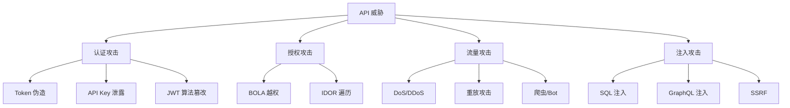

API 是现代应用的数据入口，也是攻击者的首要目标。根据 OWASP 的统计，API 安全事件在过去三年增长了超过 300%。与 Web 应用不同，API 的攻击面更加复杂：认证绕过的对象是 API 接口而非页面，参数注入可以直接操纵后端数据，批量请求可以绕过前端限制直接对后端施加压力。

本专题覆盖 API 安全的完整知识体系：从 API 认证的最佳实践，到限流、防重放、签名等保护机制，再到图灵盾反爬、GraphQL 安全和 OWASP API Security Top 10，帮助你构建纵深防御的 API 安全体系。

## 核心内容

### 认证与授权

- [API 安全概述](/security/api/overview) — API 安全的威胁模型与整体策略
- [API 认证最佳实践](/security/api/authentication) — API Key、Bearer Token、HMAC 签名的对比
- [API Key 与 Token 管理](/security/api/api-key) — Key 生成、存储、生命周期管理
- [JWT 安全使用指南](/security/api/jwt-security) — JWT 的安全风险与最佳实践

### 流量保护

- [API 限流设计](/security/api/rate-limiting) — 令牌桶、滑动窗口算法的实现
- [防重放攻击](/security/api/anti-replay) — Nonce + Timestamp 的组合防护
- [Nonce 与 Timestamp 机制](/security/api/nonce-timestamp) — 一次性随机数与时间窗口的管理
- [签名机制设计](/security/api/signature) — HMAC/RSA 签名防篡改

### 威胁防护

- [图灵盾与反爬](/security/api/turing-shield) — Bot 识别、行为验证码、设备指纹
- [API 注入攻击防护](/security/api/injection) — SQL 注入、NoSQL 注入的命令防护
- [GraphQL 安全](/security/api/graphql-security) — 查询深度限制、字段白名单
- [REST API 安全清单](/security/api/rest-security-checklist) — 认证、输入、加密、日志清单

### 测试与监控

- [API 安全测试](/security/api/security-testing) — Fuzzing、渗透测试、CI/CD 集成
- [OWASP API Security Top 10](/security/api/owasp-top10) — API1-API10 风险详解
- [API 安全监控与告警](/security/api/monitoring) — 结构化日志、SIEM、异常检测

## 威胁全景图

## 思考题

**问题 1**：在限流设计中，令牌桶算法和滑动窗口算法各有什么优缺点？在高并发场景下，分布式限流如何保证计数器的一致性？

参考答案

令牌桶允许一定程度的突发流量（桶内 token 储备），但平均速率受限；滑动窗口提供更平滑的限流曲线，但实现更复杂，内存占用更高。

分布式限流的计数器一致性是核心挑战。方案包括：Redis 单节点计数（简单但存在单点故障）、Redis Cluster 分片（性能好但一致性弱）、Redis + Lua 原子操作（平衡一致性与性能）、基于漏桶的本地限流 + Redis 补偿（高性能但实现复杂）。实际选型需要根据业务对一致性的要求和 QPS 量级来决定。

**问题 2**：JWT 的「none」算法漏洞是如何被利用的？为什么 RS256 比 HS256 更适合多客户端场景？

参考答案

「none」算法漏洞利用了 JWT 库对算法不验证的缺陷。攻击者将 JWT Header 中的 alg 设置为 `none`，并将 Signature 部分设为空字符串，伪造出有效 Token。RS256（RSA + SHA256）使用非对称算法，服务端用私钥签名，客户端用公钥验证——不同客户端可以持有不同的公钥，无法伪造其他客户端的 Token。HS256 使用对称算法，签名密钥在服务端和客户端之间共享，如果某个客户端泄露密钥，攻击者可以伪造任意用户的 Token。

