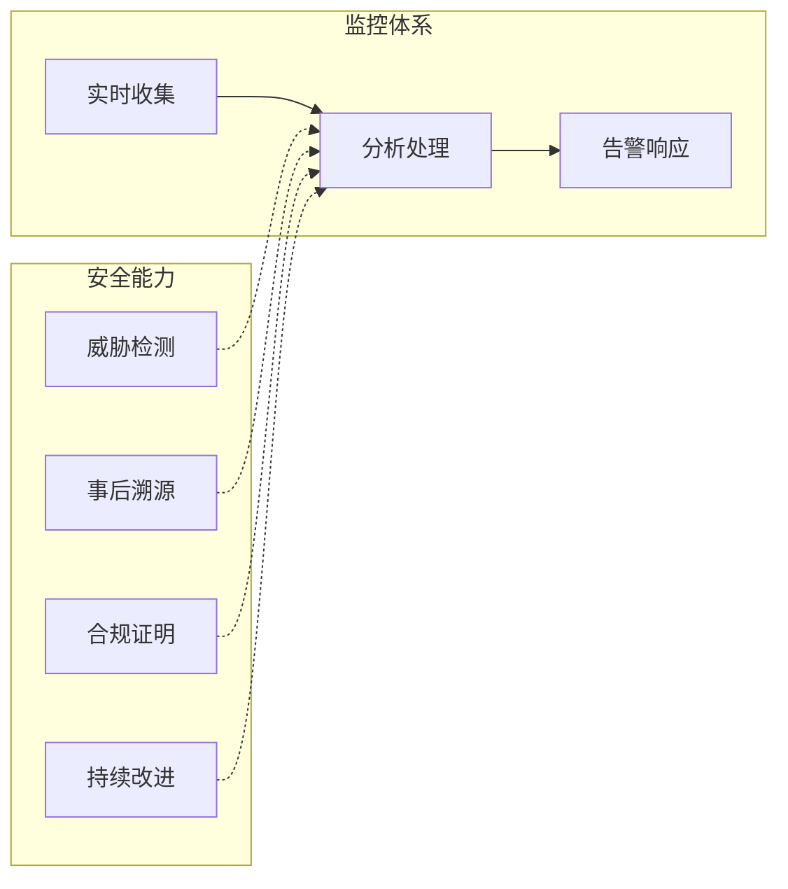
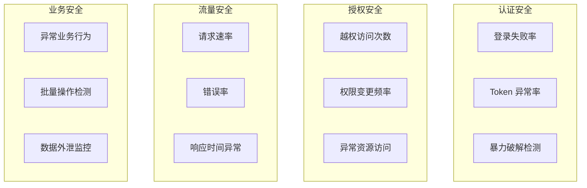
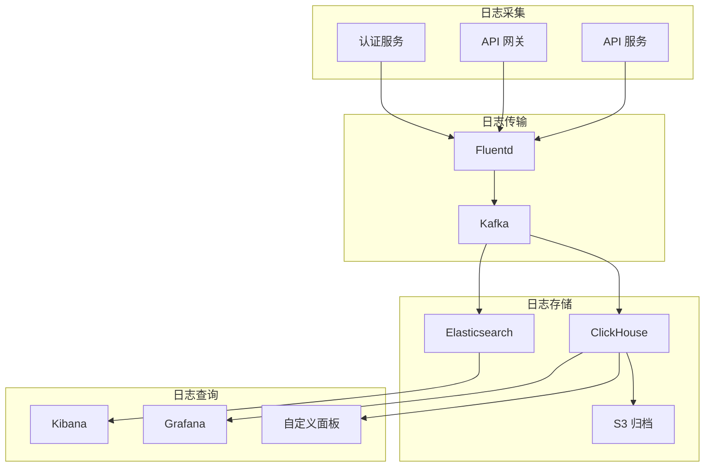
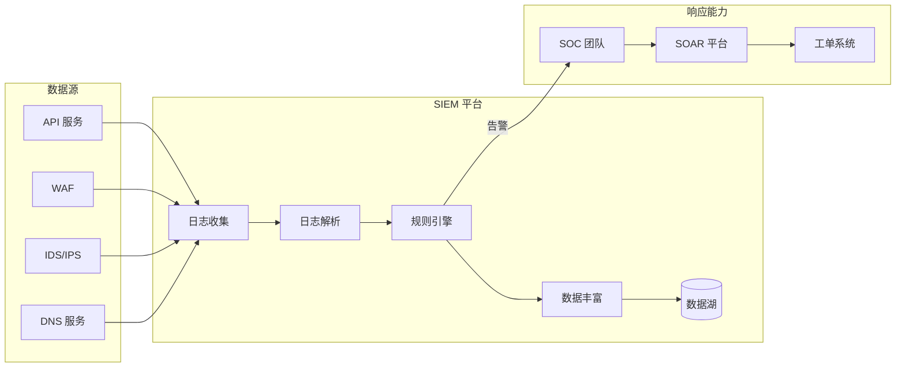
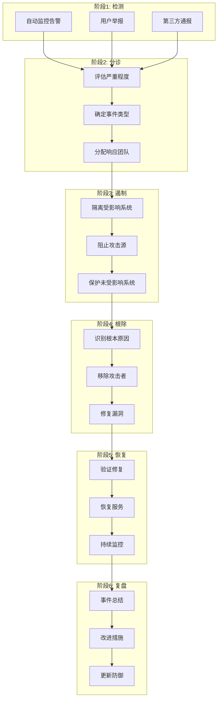

2019 年，某酒店集团发生了影响全球 5 亿客户的数据泄露事件。事后调查发现，攻击者在泄露发生前已经进行过多次试探性访问，包括尝试访问未授权的预订记录。但这些异常访问都被淹没在海量正常请求中，安全团队直到泄露被公开报道后才知情。

这个案例揭示了一个残酷的事实：**没有监控的安全，就像没有仪表盘的飞机**。你知道自己在飞，但不知道高度、速度、油量，直到撞上山才发现问题。

## 一、API 安全监控的必要性

安全监控不是「出了问题之后才看的东西」，而是实时保护系统安全的关键能力。

### 安全监控的核心价值



| 能力 | 说明 | 业务价值 |
| --- | --- | --- |
| 威胁检测 | 实时发现攻击行为 | 缩短攻击窗口 |
| 事后溯源 | 还原攻击路径 | 明确影响范围 |
| 合规证明 | 提供审计证据 | 满足监管要求 |
| 持续改进 | 发现安全短板 | 优化安全策略 |

### 「检测-响应」时间窗口

安全监控的核心目标是缩短从攻击发生到被发现的「检测时间窗口」：

| 指标 | 说明 | 目标 |
| --- | --- | --- |
| MTTD | 平均检测时间 | `<` 1 分钟 |
| MTTR | 平均响应时间 | `<` 15 分钟 |
| 攻击窗口 | 攻击发生到被发现 | `<` 5 分钟 |

## 二、核心监控指标

### 安全指标体系



### 认证安全指标

```java title="认证安全指标采集"
@Service
public class AuthenticationMetricsCollector {
    
    private final MeterRegistry meterRegistry;
    private final Counter loginSuccessCounter;
    private final Counter loginFailureCounter;
    private final Counter tokenValidationFailureCounter;
    
    public AuthenticationMetricsCollector(MeterRegistry meterRegistry) {
        this.meterRegistry = meterRegistry;
        
        // 登录成功计数
        this.loginSuccessCounter = Counter.builder("auth.login.success")
            .description("登录成功次数")
            .tag("service", "auth")
            .register(meterRegistry);
        
        // 登录失败计数
        this.loginFailureCounter = Counter.builder("auth.login.failure")
            .description("登录失败次数")
            .tag("service", "auth")
            .register(meterRegistry);
        
        // Token 验证失败
        this.tokenValidationFailureCounter = Counter.builder("auth.token.validation.failure")
            .description("Token 验证失败次数")
            .tag("service", "auth")
            .register(meterRegistry);
    }
    
    /**
     * 记录登录事件
     */
    public void recordLogin(String username, String sourceIp, boolean success, 
                          String failureReason) {
        if (success) {
            loginSuccessCounter.increment();
        } else {
            loginFailureCounter.increment();
            
            // 记录失败原因分布
            Counter.builder("auth.login.failure.reason")
                .tag("reason", failureReason)
                .register(meterRegistry)
                .increment();
            
            // 记录来源 IP 分布
            Counter.builder("auth.login.failure.ip")
                .tag("ip_prefix", extractIpPrefix(sourceIp))
                .register(meterRegistry)
                .increment();
        }
    }
    
    /**
     * 计算关键指标
     */
    public AuthenticationSecurityMetrics calculateMetrics(Duration window) {
        AuthenticationSecurityMetrics metrics = new AuthenticationSecurityMetrics();
        
        // 登录失败率
        double totalLogins = loginSuccessCounter.count() + loginFailureCounter.count();
        if (totalLogins > 0) {
            metrics.setLoginFailureRate(loginFailureCounter.count() / totalLogins);
        }
        
        // 暴力破解风险评分
        metrics.setBruteForceRiskScore(calculateBruteForceRisk(window));
        
        // 异常 IP 风险评分
        metrics.setSuspiciousIpRiskScore(calculateSuspiciousIpRisk(window));
        
        return metrics;
    }
    
    /**
     * 暴力破解风险评估
     */
    private double calculateBruteForceRisk(Duration window) {
        // 统计同一 IP 在时间窗口内的失败次数
        long recentFailures = loginFailureRepository
            .countBySourceIpAndTimestampAfter(
                extractIpPrefix(lastFailedIp), 
                Instant.now().minus(window)
            );
        
        // 统计涉及的账户数量（密码喷洒特征）
        long targetedAccounts = loginFailureRepository
            .countDistinctUsernameBySourceIpAndTimestampAfter(
                extractIpPrefix(lastFailedIp),
                Instant.now().minus(window)
            );
        
        // 风险评分：失败次数多 + 目标账户多 = 高风险
        double failureScore = Math.min(recentFailures / 100.0, 1.0);
        double sprayScore = Math.min(targetedAccounts / 10.0, 1.0);
        
        return (failureScore * 0.7) + (sprayScore * 0.3);
    }
}
```

### 授权安全指标

```java title="授权安全指标"
@Service
public class AuthorizationMetricsCollector {
    
    private final MeterRegistry meterRegistry;
    private final AlertingService alertService;
    
    /**
     * 记录越权访问
     */
    public void recordUnauthorizedAccess(String userId, String resource, 
                                        String action, String reason) {
        // 记录指标
        Counter.builder("authz.unauthorized")
            .tag("resource", resource)
            .tag("action", action)
            .tag("reason", reason)
            .register(meterRegistry)
            .increment();
        
        // 检查是否需要告警
        checkAndAlert(userId, resource, action, reason);
    }
    
    /**
     * 异常资源访问检测
     */
    public void recordResourceAccess(String userId, String resourceId) {
        // 维护用户访问历史
        UserAccessHistory history = accessHistoryService.getOrCreate(userId);
        history.addAccess(resourceId);
        
        // 检测异常模式
        AccessAnomaly anomaly = detectAccessAnomaly(history);
        if (anomaly.isAnomalous()) {
            alertService.sendAlert(AnomalyAlert.builder()
                .type(AlertType.ABNORMAL_RESOURCE_ACCESS)
                .userId(userId)
                .resourceId(resourceId)
                .anomalyType(anomaly.getType())
                .severity(anomaly.getSeverity())
                .description(anomaly.getDescription())
                .build());
        }
    }
    
    /**
     * 批量越权检测
     */
    public void recordBulkAccess(String userId, List<String> resourceIds) {
        if (resourceIds.size() > BULK_ACCESS_THRESHOLD) {
            // 记录批量操作
            Counter.builder("authz.bulk_access")
                .tag("user", userId)
                .tag("count", String.valueOf(resourceIds.size()))
                .register(meterRegistry)
                .increment();
            
            // 检查是否授权
            if (!isBulkAccessAuthorized(userId, resourceIds)) {
                alertService.sendAlert(AnomalyAlert.builder()
                    .type(AlertType.UNAUTHORIZED_BULK_ACCESS)
                    .userId(userId)
                    .resourceCount(resourceIds.size())
                    .severity(Severity.HIGH)
                    .build());
            }
        }
    }
}
```

### 关键告警阈值

| 指标 | 警告阈值 | 严重阈值 | 告警级别 |
| --- | --- | --- | --- |
| 登录失败率 | `>` 10% | `>` 30% | 警告 / 严重 |
| 单 IP 失败次数/分钟 | `>` 10 | `>` 50 | 警告 / 严重 |
| Token 验证失败率 | `>` 5% | `>` 15% | 警告 / 严重 |
| 越权访问次数/分钟 | `>` 5 | `>` 20 | 警告 / 严重 |
| API 错误率 | `>` 1% | `>` 5% | 警告 / 严重 |
| 响应时间 p99 | `>` 2s | `>` 5s | 警告 / 严重 |

## 三、日志设计

### 结构化日志规范

```java title="安全日志结构定义"
public class SecurityAuditLog {
    
    // 事件标识
    private String eventId;           // UUID
    private String eventType;         // LOGIN, LOGOUT, ACCESS, CHANGE
    private Instant timestamp;         // UTC 时间戳
    
    // 主体信息
    private String userId;
    private String username;
    private String sessionId;
    private String tokenId;
    private Set<String> roles;
    
    // 请求上下文
    private String requestId;         // 链路追踪 ID
    private String sourceIp;
    private String sourceIpCountry;
    private String userAgent;
    private String clientId;           // API Key 或 OAuth Client ID
    
    // 资源信息
    private String resourceType;       // USER, ORDER, PRODUCT
    private String resourceId;
    private String action;             // READ, CREATE, UPDATE, DELETE
    private String outcome;            // SUCCESS, FAILURE, DENIED
    
    // 失败信息
    private String failureReason;
    private String attackPattern;     // BRUTE_FORCE, SQL_INJECTION, IDOR
    
    // 风险评估
    private Double riskScore;          // 0.0 - 1.0
    private List<String> riskFactors;
    
    // 元数据
    private Map<String, Object> metadata;
    
    // 序列化方法
    public String toJson() {
        return new ObjectMapper()
            .registerModule(new JavaTimeModule())
            .writeValueAsString(this);
    }
}
```

### 敏感信息脱敏

```java title="日志脱敏处理器"
@Service
public class SecurityLogSanitizer {
    
    private static final Set<String> SENSITIVE_FIELDS = Set.of(
        "password", "token", "secret", "apiKey", "authorization",
        "creditCard", "ssn", "passport", "accessToken", "refreshToken"
    );
    
    private static final Set<String> PARTIAL_MASK_FIELDS = Set.of(
        "email", "phone", "idNumber", "accountNumber"
    );
    
    /**
     * 脱敏处理
     */
    public SecurityAuditLog sanitize(SecurityAuditLog log) {
        SecurityAuditLog sanitized = log.clone();
        
        // 脱敏请求参数
        if (sanitized.getMetadata() != null) {
            Map<String, Object> sanitizedMetadata = new HashMap<>();
            sanitized.getMetadata().forEach((key, value) -> {
                sanitizedMetadata.put(key, sanitizeValue(key, value));
            });
            sanitized.setMetadata(sanitizedMetadata);
        }
        
        // IP 地址部分脱敏（保留地区信息）
        if (sanitized.getSourceIp() != null) {
            sanitized.setSourceIp(maskIp(sanitized.getSourceIp()));
        }
        
        return sanitized;
    }
    
    private Object sanitizeValue(String fieldName, Object value) {
        String lowerFieldName = fieldName.toLowerCase();
        
        if (SENSITIVE_FIELDS.stream().anyMatch(lowerFieldName::contains)) {
            return "[REDACTED]";
        }
        
        if (PARTIAL_MASK_FIELDS.stream().anyMatch(lowerFieldName::contains)) {
            return maskPartial(String.valueOf(value));
        }
        
        return value;
    }
    
    private String maskIp(String ip) {
        if (ip == null) return null;
        
        // IPv4：保留前两个八位组
        if (ip.contains(".")) {
            String[] parts = ip.split("\\.");
            if (parts.length >= 2) {
                return parts[0] + "." + parts[1] + ".*.*";
            }
        }
        
        // IPv6：保留前两组
        if (ip.contains(":")) {
            String[] parts = ip.split(":");
            if (parts.length >= 2) {
                return parts[0] + ":" + parts[1] + ":*:*:*:*";
            }
        }
        
        return ip;
    }
}
```

### 日志存储架构



## 四、SIEM 集成

### SIEM 架构设计



### SIEM 日志转发配置

```yaml title="日志转发配置"
# Fluentd 配置示例
<source>
  @type tail
  path /var/log/api/security.log
  pos_file /var/log/fluentd/security.log.pos
  tag security.api
  
  <parse>
    @type json
    time_key timestamp
    time_type string
    time_format "%Y-%m-%dT%H:%M:%S.%LZ"
  </parse>
</source>

<filter security.api>
  @type record_transformer
  
  <record>
    # 添加数据丰富
    service_name "api-gateway"
    environment "production"
    datacenter "us-east-1"
    
    # 添加告警关联字段
    alert_group "authentication"
    severity "high"
  </record>
</filter>

<match security.api>
  @type elasticsearch
  host elasticsearch.internal
  port 9200
  index_name security-logs-%Y.%m.%d
  
  # 缓冲配置
  <buffer>
    @type file
    path /var/log/fluentd/buffer/security
    flush_interval 5s
    flush_mode interval
  </buffer>
  
  # 死信队列
  <secondary>
    @type file
    path /var/log/fluentd/dlq/security-dlq
  </secondary>
</match>
```

### SIEM 检测规则

```yaml title="SIEM 检测规则示例"
rules:
  # 规则1：暴力破解检测
  - name: "Brute Force Attack Detection"
    severity: high
    tags: ["authentication", "brute-force"]
    
    condition: |
      event_type == "LOGIN_FAILED" 
      AND count_by_ip.last_5_minutes > 20 
      AND count_by_ip.last_1_minute > 10
    
    correlation:
      group_by: [source_ip]
      time_window: 5m
      
    actions:
      - alert
      - block_ip: 15m
      - create_incident: true
      
    metadata:
      MITRE: ["T1110"]
      false_positive_rate: 0.02

  # 规则2：异常数据访问
  - name: "Suspicious Data Exfiltration"
    severity: critical
    tags: ["data-access", "exfiltration"]
    
    condition: |
      event_type IN ["DATA_READ", "DATA_EXPORT"]
      AND resource_type IN ["USER_PII", "FINANCIAL"]
      AND count_by_user.last_10_min > 1000
      AND (
        source_ip != user.known_ips
        OR user.location_changed
      )
    
    actions:
      - alert: priority_high
      - notify_dlp: true
      - session_terminate: optional
      
  # 规则3：权限滥用
  - name: "Privilege Escalation Attempt"
    severity: critical
    tags: ["authorization", "privilege-escalation"]
    
    condition: |
      event_type == "ROLE_CHANGED"
      AND (new_role IN ["ADMIN", "SUPER_ADMIN"])
      AND not_from_approved_channel
      AND not_from_approved_ip
      
    actions:
      - alert: immediate
      - notify_security_team
      - auto_revert_change: true
      - create_incident: mandatory
```

## 五、实时告警策略

### 告警分级

```java title="告警分级处理"
@Service
public class AlertService {
    
    /**
     * 处理告警
     */
    public void handleAlert(Alert alert) {
        // 1. 根据告警级别采取不同措施
        switch (alert.getSeverity()) {
            case CRITICAL:
                handleCriticalAlert(alert);
                break;
            case HIGH:
                handleHighAlert(alert);
                break;
            case MEDIUM:
                handleMediumAlert(alert);
                break;
            case LOW:
                handleLowAlert(alert);
                break;
        }
    }
    
    private void handleCriticalAlert(Alert alert) {
        // P0 告警：立即通知
        // 1. 电话通知安全负责人
        notificationService.callSecurityOnCall(alert);
        
        // 2. 发送 Slack 告警
        notificationService.sendSlackAlert(alert, "#security-critical");
        
        // 3. 创建 PagerDuty 事件
        pagerDutyService.createIncident(alert);
        
        // 4. 自动响应（如果配置允许）
        if (autoResponseConfig.isEnabled(alert.getType())) {
            executeAutoResponse(alert);
        }
        
        // 5. 记录事件
        incidentRepository.save(Incident.fromAlert(alert));
    }
    
    private void executeAutoResponse(Alert alert) {
        switch (alert.getType()) {
            case BRUTE_FORCE:
                // 封禁攻击者 IP
                firewallService.blockIp(alert.getSourceIp(), Duration.ofMinutes(30));
                break;
                
            case UNAUTHORIZED_ACCESS:
                // 终止会话
                sessionService.terminate(alert.getSessionId());
                // 强制重置 Token
                tokenService.revokeAllUserTokens(alert.getUserId());
                break;
                
            case DATA_EXFILTRATION:
                // 暂停数据导出
                exportService.suspendExport(alert.getUserId());
                // 触发 DLP 告警
                dlpService.alert(alert);
                break;
        }
    }
}
```

### 告警去重与聚合

```java title="告警去重机制"
@Service
public class AlertDeduplicationService {
    
    private final Cache<String, AlertContext> recentAlerts;
    
    /**
     * 检查是否为重复告警
     */
    public DeduplicationResult checkDuplicate(Alert alert) {
        String key = generateAlertKey(alert);
        
        AlertContext existing = recentAlerts.getIfPresent(key);
        
        if (existing != null) {
            Duration age = Duration.between(existing.getTimestamp(), Instant.now());
            
            // 在去重窗口内
            if (age.compareTo(DEDUP_WINDOW) < 0) {
                existing.incrementCount();
                existing.setLastSeen(Instant.now());
                
                return DeduplicationResult.duplicate(
                    existing.getOriginalAlert(),
                    existing.getCount()
                );
            }
        }
        
        // 新告警或已超窗口
        recentAlerts.put(key, AlertContext.from(alert));
        return DeduplicationResult.newAlert(alert);
    }
    
    /**
     * 生成告警去重键
     */
    private String generateAlertKey(Alert alert) {
        // 同一类型 + 同一来源 + 同一目标 = 重复告警
        return String.format("%s:%s:%s:%s",
            alert.getType(),
            alert.getSourceIp(),
            alert.getTargetUserId(),
            alert.getResourceType()
        );
    }
    
    /**
     * 告警聚合：将相关告警合并为一个事件
     */
    public AlertAggregation aggregate(List<Alert> alerts) {
        if (alerts.isEmpty()) {
            return AlertAggregation.empty();
        }
        
        AlertAggregation aggregation = new AlertAggregation();
        aggregation.setPrimaryAlert(alerts.get(0));
        aggregation.setTotalCount(alerts.size());
        aggregation.setFirstSeen(alerts.get(0).getTimestamp());
        aggregation.setLastSeen(alerts.get(alerts.size() - 1).getTimestamp());
        aggregation.setAffectedUsers(extractAffectedUsers(alerts));
        aggregation.setAffectedResources(extractAffectedResources(alerts));
        
        // 计算影响评分
        aggregation.setImpactScore(calculateImpactScore(alerts));
        
        // 生成聚合告警描述
        aggregation.setSummary(generateSummary(alerts));
        
        return aggregation;
    }
}
```

### 告警冷却机制

```java title="告警冷却配置"
@Configuration
public class AlertCoolingConfig {
    
    private static final Map<String, Duration> COOLING_PERIODS = Map.of(
        "BRUTE_FORCE", Duration.ofMinutes(15),
        "IDOR_ATTEMPT", Duration.ofMinutes(30),
        "RATE_LIMIT_EXCEEDED", Duration.ofMinutes(5),
        "SUSPICIOUS_IP", Duration.ofMinutes(60)
    );
    
    private final Cache<String, Instant> lastAlertTime;
    
    /**
     * 检查是否在冷却期内
     */
    public boolean isInCoolingPeriod(String alertType, String key) {
        Duration coolingPeriod = COOLING_PERIODS.getOrDefault(
            alertType, 
            Duration.ofMinutes(10)
        );
        
        String coolingKey = alertType + ":" + key;
        Instant lastAlert = lastAlertTime.getIfPresent(coolingKey);
        
        if (lastAlert == null) {
            return false;
        }
        
        return Duration.between(lastAlert, Instant.now()).compareTo(coolingPeriod) < 0;
    }
    
    /**
     * 更新冷却时间
     */
    public void updateCoolingTime(String alertType, String key) {
        String coolingKey = alertType + ":" + key;
        lastAlertTime.put(coolingKey, Instant.now());
    }
}
```

## 六、异常检测

### 基于规则的检测

```java title="规则引擎异常检测"
@Service
public class RuleBasedAnomalyDetector {
    
    private final List<AnomalyRule> rules;
    
    /**
     * 检测异常
     */
    public List<AnomalyAlert> detect(SecurityEvent event) {
        List<AnomalyAlert> alerts = new ArrayList<>();
        
        for (AnomalyRule rule : rules) {
            if (rule.matches(event)) {
                AnomalyAlert alert = rule.evaluate(event);
                if (alert != null) {
                    alerts.add(alert);
                }
            }
        }
        
        return alerts;
    }
    
    /**
     * 定义检测规则
     */
    @Bean
    public List<AnomalyRule> anomalyRules() {
        return List.of(
            // 规则1：同一 IP 多次失败
            AnomalyRule.builder()
                .name("repeated_login_failure")
                .condition(e -> e.getEventType().equals("LOGIN_FAILED"))
                .window(Duration.ofMinutes(10))
                .threshold(10)
                .aggregation("source_ip")
                .severity(Severity.HIGH)
                .build(),
            
            // 规则2：非工作时段敏感操作
            AnomalyRule.builder()
                .name("off_hours_sensitive_access")
                .condition(e -> 
                    e.getEventType().equals("SENSITIVE_ACCESS") &&
                    !isWorkingHours(e.getTimestamp())
                )
                .severity(Severity.MEDIUM)
                .build(),
            
            // 规则3：新设备首次访问敏感资源
            AnomalyRule.builder()
                .name("new_device_sensitive_access")
                .condition(e -> 
                    e.getEventType().equals("SENSITIVE_ACCESS") &&
                    !isKnownDevice(e.getUserId(), e.getDeviceFingerprint())
                )
                .severity(Severity.MEDIUM)
                .build(),
            
            // 规则4：短时间内跨地域访问
            AnomalyRule.builder()
                .name("geo_impossible_travel")
                .condition(e -> {
                    Optional<AccessRecord> lastAccess = getLastAccess(e.getUserId());
                    if (lastAccess.isPresent()) {
                        Duration timeDiff = Duration.between(
                            lastAccess.get().getTimestamp(),
                            e.getTimestamp()
                        );
                        double distance = calculateDistance(
                            lastAccess.get().getLocation(),
                            e.getLocation()
                        );
                        // 如果 1 小时内跨越了物理上不可能的距离
                        return timeDiff.toMinutes() < 60 && 
                               distance > MAX_IMPOSSIBLE_SPEED_KM_PER_HOUR * 1.5;
                    }
                    return false;
                })
                .severity(Severity.HIGH)
                .build(),
            
            // 规则5：批量数据访问
            AnomalyRule.builder()
                .name("bulk_data_access")
                .condition(e -> e.getEventType().equals("DATA_ACCESS"))
                .window(Duration.ofMinutes(5))
                .threshold(500)
                .aggregation("user_id")
                .severity(Severity.MEDIUM)
                .build()
        );
    }
}
```

### 机器学习异常检测

```java title="机器学习异常检测")
@Service
public class MLAnomalyDetector {
    
    private final ModelServer modelServer;
    private final FeatureExtractor featureExtractor;
    
    /**
     * 提取用户行为特征
     */
    public UserBehaviorFeatures extractFeatures(String userId, Duration window) {
        List<SecurityEvent> events = eventRepository
            .findByUserIdAndTimestampAfter(userId, Instant.now().minus(window));
        
        return UserBehaviorFeatures.builder()
            // 统计特征
            .requestCount(events.size())
            .uniqueEndpointsAccessed(countUniqueEndpoints(events))
            .averageResponseTime(calculateAvgResponseTime(events))
            .errorRate(calculateErrorRate(events))
            
            // 时序特征
            .accessFrequencyPattern(extractFrequencyPattern(events))
            .accessTimePattern(extractTimePattern(events))
            
            // 风险特征
            .loginFailureRate(calculateLoginFailureRate(events))
            .unauthorizedAccessRate(calculateUnauthorizedRate(events))
            .newIpCount(countNewIps(events))
            .newDeviceCount(countNewDevices(events))
            
            // 地理位置特征
            .uniqueLocationsCount(countUniqueLocations(events))
            .impossibleTravelEvents(detectImpossibleTravel(events))
            
            .build();
    }
    
    /**
     * 预测异常分数
     */
    public AnomalyScore predictAnomaly(String userId) {
        UserBehaviorFeatures features = extractFeatures(userId, Duration.ofDays(7));
        
        // 调用 ML 模型
        AnomalyPrediction prediction = modelServer.predict(
            "anomaly_detection_model",
            features.toVector()
        );
        
        return AnomalyScore.builder()
            .userId(userId)
            .score(prediction.getScore())
            .riskLevel(classifyRisk(prediction.getScore()))
            .topFactors(prediction.getTopContributingFeatures())
            .confidence(prediction.getConfidence())
            .build();
    }
    
    /**
     * 检测漂移（用户行为模式发生显著变化）
     */
    public boolean detectBehaviorDrift(String userId) {
        // 当前 7 天行为
        UserBehaviorFeatures recent = extractFeatures(userId, Duration.ofDays(7));
        
        // 过去 30 天基准
        UserBehaviorFeatures baseline = extractFeatures(userId, Duration.ofDays(30));
        
        // 计算特征漂移
        Map<String, Double> drifts = new HashMap<>();
        drifts.put("request_pattern", cosineSimilarity(
            recent.getAccessFrequencyPattern(),
            baseline.getAccessFrequencyPattern()
        ));
        drifts.put("time_pattern", cosineSimilarity(
            recent.getAccessTimePattern(),
            baseline.getAccessTimePattern()
        ));
        drifts.put("location_pattern", cosineSimilarity(
            recent.getLocationPattern(),
            baseline.getLocationPattern()
        ));
        
        // 检测显著漂移
        double avgDrift = drifts.values().stream()
            .mapToDouble(d -> 1 - d)  // 转换为差异度
            .average().orElse(0);
        
        return avgDrift > DRIFT_THRESHOLD;
    }
}
```

## 七、安全事件响应流程

### 事件响应框架



### 事件响应执行

```java title="事件响应自动化"
@Service
public class IncidentResponseService {
    
    /**
     * 事件响应入口
     */
    @Transactional
    public Incident handleIncident(Alert alert) {
        // 1. 创建事件记录
        Incident incident = createIncident(alert);
        
        // 2. 分诊评估
        triageIncident(incident);
        
        // 3. 根据严重程度执行响应
        switch (incident.getSeverity()) {
            case CRITICAL:
                executeCriticalResponse(incident);
                break;
            case HIGH:
                executeHighResponse(incident);
                break;
            default:
                executeStandardResponse(incident);
        }
        
        // 4. 更新事件状态
        incident.setStatus(IncidentStatus.IN_PROGRESS);
        incidentRepository.save(incident);
        
        return incident;
    }
    
    private void executeCriticalResponse(Incident incident) {
        // 立即通知
        notificationService.notifySecurityTeam(incident);
        
        // 自动遏制
        if (incident.getAlert().getSourceIp() != null) {
            // 封禁攻击源 IP
            firewallService.blockIp(
                incident.getAlert().getSourceIp(), 
                Duration.ofHours(24)
            );
        }
        
        if (incident.getAlert().getUserId() != null) {
            // 暂停用户账户
            accountService.suspendAccount(incident.getAlert().getUserId());
            
            // 撤销所有活跃 Token
            tokenService.revokeAllTokens(incident.getAlert().getUserId());
        }
        
        // 创建紧急会议
        calendarService.createEmergencyMeeting(
            "安全事件响应 - " + incident.getId()
        );
    }
    
    /**
     * 事件遏制
     */
    public void containIncident(Incident incident) {
        Alert alert = incident.getAlert();
        
        List<ContainmentAction> actions = new ArrayList<>();
        
        // 1. 网络层面遏制
        if (alert.getSourceIp() != null) {
            actions.add(new ContainmentAction(
                "NETWORK_BLOCK",
                firewallService.blockIp(alert.getSourceIp(), Duration.ofHours(24))
            ));
        }
        
        // 2. 应用层面遏制
        if (alert.getSessionId() != null) {
            actions.add(new ContainmentAction(
                "SESSION_TERMINATE",
                sessionService.terminate(alert.getSessionId())
            ));
        }
        
        // 3. 账户层面遏制
        if (alert.getUserId() != null) {
            if (alert.getType().isAccountCompromise()) {
                actions.add(new ContainmentAction(
                    "ACCOUNT_LOCK",
                    accountService.lockAccount(alert.getUserId())
                ));
            }
        }
        
        // 4. API Key 撤销
        if (alert.getApiKey() != null) {
            actions.add(new ContainmentAction(
                "API_KEY_REVOKE",
                apiKeyService.revoke(alert.getApiKey())
            ));
        }
        
        // 记录所有遏制操作
        incident.setContainmentActions(actions);
        incidentRepository.save(incident);
    }
}
```

## 八、监控性能开销

### 性能影响评估

| 监控组件 | 延迟影响 | 资源开销 | 说明 |
| --- | --- | --- | --- |
| 日志采集 | `+1-5ms` | `+5-10% CPU` | 异步日志无阻塞 |
| 规则匹配 | `+0.5-2ms` | `+3-5% CPU` | 规则数量决定 |
| ML 推理 | `+5-20ms` | `+10-20% CPU` | 异步执行 |
| 告警发送 | `+0ms` | 极小 | 异步消息队列 |

### 优化策略

```java title="监控性能优化"
@Service
public class MonitoringOptimizationService {
    
    /**
     * 自适应采样率
     */
    public boolean shouldSample(String eventType, double currentLoad) {
        SamplingConfig config = getSamplingConfig(eventType);
        
        // 高负载时增加采样间隔
        if (currentLoad > HIGH_LOAD_THRESHOLD) {
            return Math.random() > config.getHighLoadSampleRate();
        }
        
        // 低风险事件可以采样
        if (config.getRiskLevel() == RiskLevel.LOW) {
            return Math.random() > config.getLowRiskSampleRate();
        }
        
        // 高风险事件必须记录
        return true;
    }
    
    /**
     * 异步处理非关键日志
     */
    @Async("securityLogExecutor")
    public void recordSecurityLogAsync(SecurityAuditLog log) {
        try {
            // 非关键日志异步写入
            securityLogRepository.save(log);
            
            // 触发告警规则评估（如果需要）
            if (shouldEvaluateRules(log)) {
                ruleEngine.evaluateAsync(log);
            }
        } catch (Exception e) {
            log.error("异步日志记录失败", e);
        }
    }
    
    /**
     * ML 模型降级策略
     */
    public AnomalyScore getAnomalyScoreWithFallback(String userId) {
        try {
            // 优先使用 ML 模型
            return mlDetector.predictAnomaly(userId);
        } catch (ModelUnavailableException e) {
            // 模型不可用时使用规则引擎兜底
            log.warn("ML 模型不可用，使用规则引擎兜底");
            return ruleBasedDetector.detectSimpleAnomaly(userId);
        } catch (ModelTimeoutException e) {
            // 超时时返回默认分数
            log.warn("ML 模型超时，返回默认分数");
            return AnomalyScore.defaultScore(userId);
        }
    }
}
```

## 九、合规审计日志要求

### 合规要求对照

| 法规 | 日志保留 | 实时监控 | 完整性要求 |
| --- | --- | --- | --- |
| PCI DSS | 1 年 | 要求 | 必须防篡改 |
| SOC 2 | 1 年 | 要求 | 必须防篡改 |
| GDPR | 视业务 | 推荐 | 推荐 |
| HIPAA | 6 年 | 要求 | 必须 |
| ISO 27001 | 3 年 | 要求 | 必须 |

### 合规审计报告

```java title="合规审计报告生成")
@Service
public class ComplianceAuditReportService {
    
    public ComplianceReport generateAuditReport(ComplianceStandard standard, 
                                                LocalDate startDate,
                                                LocalDate endDate) {
        ComplianceReport report = new ComplianceReport();
        report.setStandard(standard);
        report.setPeriod(startDate, endDate);
        
        // 1. 访问活动摘要
        report.setAccessSummary(generateAccessSummary(startDate, endDate));
        
        // 2. 认证事件统计
        report.setAuthenticationStats(generateAuthStats(startDate, endDate));
        
        // 3. 授权事件统计
        report.setAuthorizationStats(generateAuthzStats(startDate, endDate));
        
        // 4. 敏感数据访问记录
        report.setSensitiveDataAccess(generateSensitiveAccessReport(
            startDate, endDate
        ));
        
        // 5. 安全事件汇总
        report.setSecurityIncidents(generateIncidentSummary(
            startDate, endDate
        ));
        
        // 6. 合规检查结果
        report.setComplianceChecks(performComplianceChecks(
            standard, startDate, endDate
        ));
        
        // 7. 证明签名
        report.setSignature(generateReportSignature(report));
        
        return report;
    }
    
    private List<ComplianceCheckResult> performComplianceChecks(
            ComplianceStandard standard,
            LocalDate startDate,
            LocalDate endDate) {
        
        List<ComplianceCheckResult> results = new ArrayList<>();
        
        for (ComplianceRequirement req : standard.getRequirements()) {
            ComplianceCheckResult result = new ComplianceCheckResult();
            result.setRequirement(req);
            
            boolean passed = checkRequirement(req, startDate, endDate);
            result.setPassed(passed);
            
            if (!passed) {
                result.setEvidence(checkEvidence(req, startDate, endDate));
                result.setRecommendation(req.getRemediation());
            }
            
            results.add(result);
        }
        
        return results;
    }
}
```

## 思考题

**问题 1**：告警疲劳是安全运营中的常见问题——当告警过多时，安全团队会忽略真正的威胁。如何设计告警策略，既能确保重要威胁不被遗漏，又不会让安全团队被海量低价值告警淹没？

<details>
<summary>参考答案</summary>

**告警疲劳应对策略**：

1. **告警分级**：
   - P0（立即响应）：真正的安全事件，需要立即处理
   - P1（4小时内）：重要告警，当天处理
   - P2（1个工作日）：一般告警，需要审查
   - P3（批量报告）：低价值告警，汇总后报告

2. **智能聚合**：
   - 将同源攻击的多个告警聚合为一个
   - 统计受影响目标数量，形成聚合告警
   - 减少重复告警

3. **动态阈值**：
   - 根据基线自动调整告警阈值
   - 业务高峰期自动放宽阈值
   - 避免误报

4. **上下文丰富**：
   - 每个告警附带完整上下文
   - 帮助分析师快速判断真伪
   - 减少调查时间

5. **自动响应**：
   - 低风险告警自动执行简单响应
   - 如封禁 IP，自动处理后汇总报告
   - 减少人工干预

6. **持续优化**：
   - 定期审查告警质量
   - 分析误报原因，调整规则
   - 建立反馈机制
</details>

**问题 2**：在机器学习异常检测中，如何平衡「检测率」和「误报率」？如果一个模型的误报率达到 50%，意味着什么？应该如何优化？

<details>
<summary>参考答案</summary>

**检测率 vs 误报率平衡**：

50% 误报率意味着：**每收到 2 个告警，只有 1 个是真正的攻击**。这会造成：
- 安全团队对告警失去信任
- 真正攻击被忽略（狼来了效应）
- 大量人力浪费在误报处理上

**优化策略**：

1. **调整决策阈值**：
   - 提高触发阈值，只在高置信度时告警
   - 代价：可能漏掉一些真正的攻击

2. **多模型融合**：
   - 结合多个模型的结果
   - 只有多个模型同时告警才触发
   - 降低误报率

3. **上下文验证**：
   - ML 模型给出告警后，用规则进一步验证
   - 通过后才发送给分析师

4. **用户行为基线**：
   - 为每个用户建立个人基线
   - 检测偏离个人正常行为，而非全局异常
   - 降低误报率

5. **持续学习**：
   - 根据分析师反馈持续优化模型
   - 标记误报样本，重新训练

6. **分层检测**：
   - ML 用于初筛，给出风险分数
   - 高分样本再经过规则验证
   - 最终告警经过双重检查

**实际建议**：
- 初期可以容忍较高误报率（如 30%）
- 随着模型优化，逐步降低
- 最终目标：误报率 `<` 10%，检测率 `>` 90%
</details>
