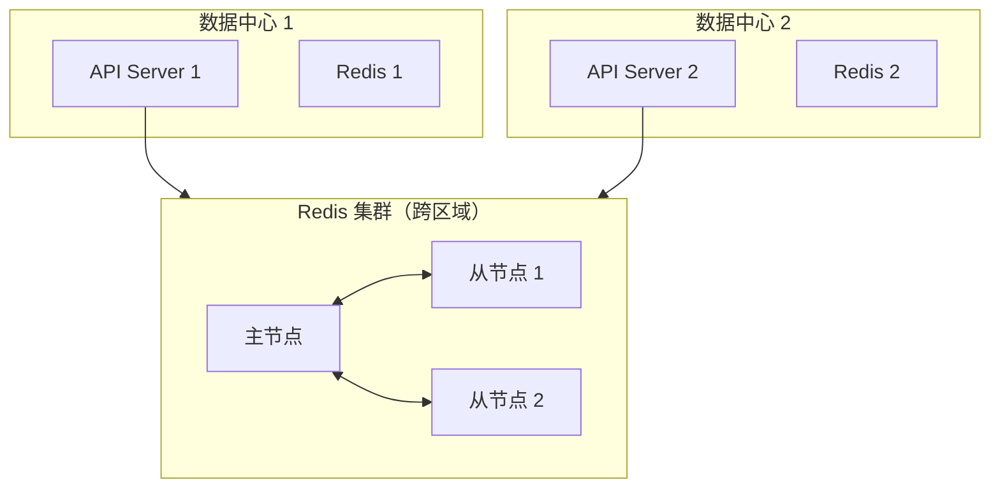

上一章讲到了防重放攻击的核心策略，其中 Timestamp + Nonce 是最常用的组合方案。但「知道要用」和「用对方式」之间，还有很长的距离。

很多开发者会这样实现 Nonce 验证：直接用 `UUID.randomUUID()` 生成，然后存到数据库里。这种做法存在几个问题：UUID 虽然不会重复，但没有任何业务意义；数据库存储在高频场景下会成为性能瓶颈；过期的 Nonce 堆积导致存储膨胀。

本章深入探讨 Nonce 和 Timestamp 的机制设计，让你在实际项目中正确使用这两个工具。

## Nonce 的核心作用

Nonce（Number used once）是防重放攻击的第一道防线。它的核心作用是**确保每个请求都是唯一的**。

### Nonce 必须满足的特性

1. **唯一性**：在足够长的时间窗口内，不能出现两个相同的 Nonce。
2. **不可预测性**：攻击者无法猜测出未来将使用的 Nonce。
3. **不可重负**：同一个 Nonce 不能被使用两次。

### Nonce 的生成策略

**方案一：UUID**

```java title="UuidNonceGenerator.java"
public class UuidNonceGenerator implements NonceGenerator {
    
    @Override
    public String generate() {
        return UUID.randomUUID().toString();
    }
}
```

**优点**：实现简单，几乎不会重复。**缺点**：纯随机，无业务含义，存储效率较低。

**方案二：时间戳 + 随机数组合**

```java title="TimestampNonceGenerator.java"
public class TimestampNonceGenerator implements NonceGenerator {
    
    private static final SecureRandom RANDOM = new SecureRandom();
    
    @Override
    public String generate() {
        long timestamp = System.currentTimeMillis();
        int random = RANDOM.nextInt(999999);
        return String.format("%d-%06d", timestamp, random);
    }
}
```

**优点**：包含时间戳信息，便于按时间分桶。**缺点**：需要确保时间戳部分不重复。

**方案三：带业务语义的 Nonce**

```java title="BusinessNonceGenerator.java"
public class BusinessNonceGenerator implements NonceGenerator {
    
    private final String clientId;
    private final AtomicLong sequence = new AtomicLong(0);
    
    public BusinessNonceGenerator(String clientId) {
        this.clientId = clientId;
    }
    
    @Override
    public String generate() {
        // 格式：clientId + 时间戳 + 序列号 + 校验位
        long timestamp = System.currentTimeMillis();
        long seq = sequence.incrementAndGet();
        
        String rawNonce = String.format("%s:%d:%d", clientId, timestamp, seq);
        String checksum = md5(rawNonce).substring(0, 4);
        
        return rawNonce + ":" + checksum;
    }
}
```

**优点**：包含业务信息，便于排查问题。**缺点**：实现复杂度较高。

### Nonce 的存储策略

#### 基于 Redis 的 Nonce 存储

Redis 是最常用的 Nonce 存储方案，其 `SET NX EX` 命令提供了原子性的「检查并设置」操作：

```lua title="redis_nonce.lua"
-- 存储 Nonce
-- KEYS[1]: Nonce Key
-- ARGV[1]: TTL (秒)

local result = redis.call('SET', KEYS[1], '1', 'NX', 'EX', ARGV[1])
if result then
    return 1  -- 新 Nonce
else
    return 0  -- 重复 Nonce
end
```

```java title="RedisNonceValidator.java"
public class RedisNonceValidator {
    
    private final RedisTemplate<String, String> redisTemplate;
    private final Duration defaultExpiry;
    
    public RedisNonceValidator(RedisTemplate<String, String> redisTemplate,
                              Duration defaultExpiry) {
        this.redisTemplate = redisTemplate;
        this.defaultExpiry = defaultExpiry;
    }
    
    public ValidationResult validate(String nonceKey, Duration expiry) {
        if (expiry == null) {
            expiry = defaultExpiry;
        }
        
        String cacheKey = buildCacheKey(nonceKey);
        
        // SET NX EX 原子操作
        Boolean isNew = redisTemplate.opsForValue()
            .setIfAbsent(cacheKey, "1", expiry);
        
        if (Boolean.TRUE.equals(isNew)) {
            return ValidationResult.accepted();
        } else {
            return ValidationResult.rejected("Nonce already used: " + nonceKey);
        }
    }
    
    private String buildCacheKey(String nonceKey) {
        // 格式：nonce:{category}:{nonce}
        return "nonce:" + nonceKey;
    }
}
```

#### 基于数据库的 Nonce 存储

对于需要长期审计或高可靠性的场景，可以使用数据库存储 Nonce：

```sql title="nonce_records.sql"
CREATE TABLE nonce_records (
    nonce VARCHAR(128) PRIMARY KEY,
    client_id VARCHAR(64) NOT NULL,
    created_at TIMESTAMP NOT NULL DEFAULT CURRENT_TIMESTAMP,
    expires_at TIMESTAMP NOT NULL,
    used_at TIMESTAMP,
    INDEX idx_client_created (client_id, created_at),
    INDEX idx_expires (expires_at)
) ENGINE=InnoDB;
```

```java title="DbNonceValidator.java"
public class DbNonceValidator {
    
    private final NonceRepository nonceRepository;
    
    public ValidationResult validate(String clientId, String nonce, 
                                    Duration expiry) {
        // 尝试插入 Nonce
        try {
            NonceRecord record = new NonceRecord();
            record.setNonce(nonce);
            record.setClientId(clientId);
            record.setExpiresAt(Instant.now().plus(expiry));
            
            nonceRepository.save(record);
            return ValidationResult.accepted();
            
        } catch (DataIntegrityViolationException e) {
            // 主键冲突，Nonce 已存在
            return ValidationResult.rejected("Nonce already used");
        }
    }
}
```

#### 混合存储策略

```java title="HybridNonceValidator.java"
public class HybridNonceValidator {
    
    private final CaffeineCache localCache;
    private final RedisTemplate<String, String> redisTemplate;
    private final DbNonceValidator dbValidator;
    
    public HybridNonceValidator(RedisTemplate<String, String> redisTemplate,
                               NonceRepository nonceRepository) {
        this.localCache = Caffeine.newBuilder()
            .maximumSize(100000)
            .expireAfterWrite(Duration.ofMinutes(1))
            .build();
        
        this.redisTemplate = redisTemplate;
        this.dbValidator = new DbNonceValidator(nonceRepository);
    }
    
    public ValidationResult validate(String clientId, String nonce) {
        String cacheKey = buildCacheKey(clientId, nonce);
        
        // L1: 检查本地缓存
        if (Boolean.TRUE.equals(localCache.getIfPresent(cacheKey))) {
            return ValidationResult.rejected("Nonce already used (local cache)");
        }
        
        // L2: 检查 Redis
        String redisKey = "nonce:" + cacheKey;
        Boolean inRedis = redisTemplate.hasKey(redisKey);
        if (Boolean.TRUE.equals(inRedis)) {
            localCache.put(cacheKey, true);
            return ValidationResult.rejected("Nonce already used (redis)");
        }
        
        // L3: 写入 Redis（原子操作）
        Boolean inserted = redisTemplate.opsForValue()
            .setIfAbsent(redisKey, "1", Duration.ofMinutes(5));
        
        if (Boolean.TRUE.equals(inserted)) {
            localCache.put(cacheKey, true);
            return ValidationResult.accepted();
        } else {
            // 并发写入
            localCache.put(cacheKey, true);
            return ValidationResult.rejected("Nonce already used (race)");
        }
    }
}
```

## Timestamp 的核心作用

Timestamp 用于确保请求在合理的时间范围内，防止「古老的重放请求」。

### Timestamp 窗口设计

Timestamp 验证的核心参数是**允许的时间窗口**。窗口太小会导致正常请求被误拒绝（时钟漂移），窗口太大则降低防重放效果。

```java title="TimestampValidator.java"
public class TimestampValidator {
    
    private final Duration maxDrift;
    private final Duration maxAge;
    
    public TimestampValidator(Duration maxDrift, Duration maxAge) {
        this.maxDrift = maxDrift;
        this.maxAge = maxAge;
    }
    
    public ValidationResult validate(long timestampSeconds) {
        Instant requestTime = Instant.ofEpochSecond(timestampSeconds);
        Instant now = Instant.now();
        
        // 1. 检查时钟漂移
        Duration drift = Duration.between(requestTime, now).abs();
        if (drift.compareTo(maxDrift) > 0) {
            return ValidationResult.rejected(
                "Clock drift too large: " + drift + ", max allowed: " + maxDrift);
        }
        
        // 2. 检查请求是否过期
        Duration age = Duration.between(requestTime, now);
        if (age.compareTo(maxAge) > 0) {
            return ValidationResult.rejected(
                "Request too old: " + age + ", max age: " + maxAge);
        }
        
        // 3. 检查请求是否在未来（允许少量漂移）
        if (requestTime.isAfter(now.plus(maxDrift))) {
            return ValidationResult.rejected("Request timestamp in the future");
        }
        
        return ValidationResult.accepted();
    }
}
```

### 推荐的时间窗口配置

| 场景 | maxDrift | maxAge | 说明 |
| --- | --- | --- | --- |
| **高精度场景** | 30 秒 | 60 秒 | 金融交易、支付 |
| **普通 API** | 5 分钟 | 5 分钟 | 通用业务 API |
| **移动端** | 5 分钟 | 10 分钟 | 网络不稳定，需要容忍延迟 |
| **IoT 设备** | 10 分钟 | 30 分钟 | 网络延迟大 |

### 时钟同步问题

时钟不同步是 Timestamp 验证的常见问题。需要多措并举：

```java title="ClockSyncHandler.java"
public class ClockSyncHandler {
    
    // NTP 服务器池
    private static final String[] NTP_SERVERS = {
        "time.google.com",
        "time.cloudflare.com",
        "pool.ntp.org"
    };
    
    private volatile Instant lastSyncedTime;
    private volatile Duration estimatedOffset = Duration.ZERO;
    
    public void syncClock() {
        for (String ntpServer : NTP_SERVERS) {
            try {
                Duration offset = queryNtpOffset(ntpServer);
                if (offset != null) {
                    this.estimatedOffset = offset;
                    this.lastSyncedTime = Instant.now();
                    logger.info("Clock synced with {}, offset: {}", ntpServer, offset);
                    return;
                }
            } catch (Exception e) {
                logger.warn("Failed to sync with {}: {}", ntpServer, e.getMessage());
            }
        }
        logger.warn("All NTP servers failed, using local clock");
    }
    
    public Instant adjustTimestamp(long timestampSeconds) {
        // 将客户端时间戳转换为服务端视角的时间
        return Instant.ofEpochSecond(timestampSeconds)
            .plus(estimatedOffset);
    }
    
    private Duration queryNtpOffset(String server) {
        // NTP 查询实现
        // ...
        return null;
    }
}
```

## Nonce + Timestamp 组合使用

单独使用 Nonce 或 Timestamp 都有局限性，组合使用才能达到最佳防重放效果：

```java title="CombinedAntiReplayValidator.java"
public class CombinedAntiReplayValidator {
    
    private final TimestampValidator timestampValidator;
    private final NonceValidator nonceValidator;
    
    public CombinedAntiReplayValidator(
            TimestampValidator timestampValidator,
            NonceValidator nonceValidator) {
        this.timestampValidator = timestampValidator;
        this.nonceValidator = nonceValidator;
    }
    
    public ValidationResult validate(AntiReplayRequest request) {
        // 步骤1：验证时间戳
        ValidationResult timestampResult = timestampValidator.validate(
            request.getTimestamp());
        
        if (!timestampResult.isAccepted()) {
            logger.warn("Timestamp validation failed: {}", timestampResult.getMessage());
            return timestampResult;
        }
        
        // 步骤2：验证 Nonce
        // Nonce Key 包含客户端标识和时间戳，确保唯一性
        String nonceKey = buildNonceKey(request);
        
        ValidationResult nonceResult = nonceValidator.validate(
            nonceKey,
            request.getNonce());
        
        if (!nonceResult.isAccepted()) {
            logger.warn("Nonce validation failed: {}", nonceResult.getMessage());
            return nonceResult;
        }
        
        return ValidationResult.accepted();
    }
    
    private String buildNonceKey(AntiReplayRequest request) {
        // 包含足够的信息确保 Nonce 的唯一性
        return String.format("%s:%s:%d:%s",
            request.getClientId(),
            request.getRequestPath(),
            request.getTimestamp(),
            request.getNonce());
    }
}
```

## 分布式环境下的 Nonce 同步

在分布式系统中，Nonce 存储需要考虑以下问题：

### 问题一：Redis 集群一致性

Redis Cluster 环境下，同一个 Key 可能分布在不同节点。使用 Hash Tag 确保 Nonce Key 固定在同一槽位：

```java title="ConsistentNonceKey.java"
public class ConsistentNonceKey {
    
    public String build(String clientId, String endpoint) {
        // Hash Tag: 使用大括号包裹的部分确定槽位
        // 所有包含相同 Hash Tag 的 Key 会在同一槽位
        return String.format("nonce:{%s}:%s", clientId, endpoint);
    }
}
```

### 问题二：Redis 主从复制延迟

在高可用 Redis 配置中，主从复制可能存在短暂延迟。如果客户端在主节点写入 Nonce 后立即发送请求，而请求被路由到从节点，可能导致 Nonce 验证失败。

**解决方案**：
1. 使用 Redis Cluster 或 Redis Sentinel 确保强一致性
2. 客户端先发送「验证预请求」，等待同步后再发送实际请求
3. 允许少量「假阳性」（Nonc 验证通过但实际重复），在业务层做幂等性保证

### 问题三：多数据中心部署

如果 API 服务部署在多个数据中心，需要考虑 Nonce 存储的跨区域同步问题：



**解决方案**：
1. **集中式存储**：所有 Nonce 写入同一个 Redis 集群
2. **本地预验证 + 集中确认**：本地先快速验证，集中存储做最终确认
3. **接受一致性延迟**：在高可用场景下，短暂的不一致是可以接受的

## 清理过期 Nonce

随着时间推移，已过期的 Nonce 会占据存储空间，需要定期清理。

### Redis 自动过期

```yaml
# Redis Keyspace Notifications
# 启用 Key 过期事件
notify-keyspace-events Ex
```

```java title="NonceExpiryListener.java"
public class NonceExpiryListener extends KeyExpirationEventMessageListener {
    
    @Override
    public void onMessage(Message message, byte[] pattern) {
        String expiredKey = message.toString();
        if (expiredKey.startsWith("nonce:")) {
            // 记录过期 Nonce 用于监控
            metrics.record("nonce.expired", 1);
        }
    }
}
```

### 数据库定期清理

```sql title="cleanup_expired_nonces.sql"
-- 清理超过 24 小时的过期 Nonce
DELETE FROM nonce_records
WHERE expires_at < DATE_SUB(NOW(), INTERVAL 1 DAY);

-- 清理超过 30 天的已使用 Nonce
DELETE FROM nonce_records
WHERE used_at IS NOT NULL
  AND used_at < DATE_SUB(NOW(), INTERVAL 30 DAY);
```

```java title="NonceCleanupJob.java"
@Scheduled(cron = "0 0 4 * * ?") // 每天凌晨4点执行
public void cleanupExpiredNonces() {
    log.info("Starting nonce cleanup job");
    
    long deletedCount = nonceRepository.deleteExpiredBefore(
        Instant.now().minus(Duration.ofDays(30)));
    
    log.info("Cleaned up {} expired nonce records", deletedCount);
}
```

### 基于 TTL 的自动清理策略

```java title="TtlBasedNonceStore.java"
public class TtlBasedNonceStore {
    
    private final RedisTemplate<String, String> redisTemplate;
    
    // 计算 Nonce Key 的过期时间
    public Duration calculateTtl(long timestampSeconds, Duration maxAge) {
        Instant requestTime = Instant.ofEpochSecond(timestampSeconds);
        Instant expiry = requestTime.plus(maxAge);
        
        // Nonce 需要保留到请求过期为止
        Duration ttl = Duration.between(Instant.now(), expiry);
        return ttl.isNegative() ? Duration.ZERO : ttl;
    }
    
    public void store(String nonceKey, long timestampSeconds, Duration maxAge) {
        Duration ttl = calculateTtl(timestampSeconds, maxAge);
        
        if (ttl.isZero() || ttl.isNegative()) {
            // 请求已经过期，不需要存储
            return;
        }
        
        redisTemplate.opsForValue().setIfAbsent(nonceKey, "1", ttl);
    }
}
```

## 最佳实践总结

```java title="AntiReplayBestPractices.java"
public class AntiReplayConfiguration {
    
    public AntiReplayValidator createValidator() {
        // 1. Timestamp 验证配置
        // 允许时钟漂移 30 秒，请求最大有效期 5 分钟
        TimestampValidator timestampValidator = new TimestampValidator(
            Duration.ofSeconds(30),
            Duration.ofMinutes(5)
        );
        
        // 2. Nonce 验证配置
        RedisNonceValidator nonceValidator = new RedisNonceValidator(
            redisTemplate,
            Duration.ofMinutes(6) // 比 maxAge 多 1 分钟，确保清理前能验证
        );
        
        // 3. 组合验证
        return new CombinedAntiReplayValidator(
            timestampValidator,
            nonceValidator
        );
    }
    
    public AntiReplayRequestInterceptor createInterceptor() {
        return new AntiReplayRequestInterceptor(
            createValidator(),
            // 哪些接口需要防重放
            Set.of("/api/v1/payment", "/api/v1/auth/login", "/api/v1/transfer")
        );
    }
}
```

:::tip 最佳实践清单
- Nonce 长度至少 16 字节（32 字符）
- Timestamp 使用 Unix 时间戳（秒或毫秒）
- 时间窗口根据业务场景调整
- Nonce 存储使用 Redis SET NX EX
- 定期清理过期的 Nonce 记录
- 监控 Nonce 验证失败率
- 在日志中记录 Nonce 验证失败，便于排查
:::

## 思考题

**问题 1**：为什么 Nonce 验证失败时不应该返回「Nonce 不存在」或「Nonce 已过期」这样的详细错误信息？

<details>
<summary>参考答案</summary>

**安全考虑**：

1. **防止信息泄露**：如果返回「Nonce 不存在」，攻击者可以判断出这个 Nonce 从未被使用过，推断出某些系统行为（如请求是否到达服务端）。

2. **防止时序攻击**：攻击者可以通过响应时间差异判断 Nonce 是否存在。即使使用恒定时间响应，实现细节也可能被分析。

3. **统一错误信息**：所有验证失败返回相同的错误信息（如「Anti-replay validation failed」），不泄露具体原因。

**最佳实践**：

```java
public ValidationResult validate(String nonce) {
    // 不区分「不存在」「已过期」「已使用」
    // 所有情况返回相同的错误
    try {
        redisTemplate.opsForValue().setIfAbsent(...);
        return ValidationResult.accepted();
    } catch (Exception e) {
        // 记录详细日志用于排查
        logger.warn("Nonce validation error: {}", e.getMessage());
        // 对外返回统一的错误
        return ValidationResult.rejected("Validation failed");
    }
}
```

**用户体验考虑**：
- 开发者通常不需要知道 Nonce 验证的具体原因
- 如果验证失败，客户端应该直接重试或重新获取 Token
- 详细的错误信息可以通过服务端日志获取
</details>

**问题 2**：在高并发场景下，如何避免 Nonce 验证成为性能瓶颈？

<details>
<summary>参考答案</summary>

**性能瓶颈分析**：

Nonce 验证需要访问存储（Redis/数据库），在 10 万 QPS 以上的高并发场景下，网络延迟和存储 IO 会成为瓶颈。

**优化策略**：

**1. 两级缓存策略**：

```java
// L1: 本地缓存（Guava/Caffeine）
// L2: Redis 分布式缓存
// 逻辑：先查 L1，未命中查 L2，L2 写入时回填 L1

Cache<String, Boolean> localCache = Caffeine.newBuilder()
    .maximumSize(100000)
    .expireAfterWrite(Duration.ofMinutes(1))
    .build();
```

**2. 批量预验证**：

```java
// 客户端在发送实际请求前，先批量获取一组 Nonce
// 实际请求携带预生成的 Nonce，减少验证延迟
POST /api/v1/nonce/batch
Response: {
  "nonces": ["nonce-1", "nonce-2", "nonce-3", ...],
  "valid_until": 1712563800
}
```

**3. 异步验证**：

```java
// 验证与业务处理并行执行
// 如果异步验证失败，记录事件并告警，但不影响正常请求处理
CompletableFuture<ValidationResult> validationFuture = 
    CompletableFuture.supplyAsync(() -> nonceValidator.validate(nonce));

// 业务处理先执行
Response response = businessProcessor.process(request);

// 等待验证结果
ValidationResult validation = validationFuture.join();
if (!validation.isAccepted()) {
    // 记录异常，但不回滚已完成的业务操作
    auditService.logValidationFailure(request, validation);
}
```

**4. 布隆过滤器预检查**：

```java
// 使用布隆过滤器做快速预检查
// 大部分重复请求在布隆过滤器阶段被拦截，减少 Redis 查询
BloomFilter<String> nonceFilter = BloomFilter.create(
    Funnels.stringFunnel(StandardCharsets.UTF_8),
    10_000_000,  // 预期大小
    0.001         // 误判率 0.1%
);
```

**5. 无存储 Nonce（基于哈希链）**：

```java
// 每个 Nonce = 上一个 Nonce 的哈希 + 随机数
// 验证方只需校验哈希关系，不需要存储
String generateChainedNonce(String previousNonce) {
    String random = UUID.randomUUID().toString();
    return sha256(previousNonce + random);
}
```

**权衡**：每种优化都有 trade-off。本地缓存增加内存开销；布隆过滤器有误判率；异步验证可能漏掉攻击。需要根据具体场景选择。
</details>

**问题 3**：如果需要同时支持多租户场景，Nonce 的设计需要注意什么？

<details>
<summary>参考答案</summary>

**多租户 Nonce 的设计要点**：

**1. Nonce Key 必须包含租户标识**：

```java
// 错误：不同租户可能使用相同的 Nonce
String nonceKey = "nonce:" + nonce;

// 正确：每个租户有独立的 Nonce 命名空间
String nonceKey = "nonce:" + tenantId + ":" + nonce;
```

**2. 租户隔离的存储策略**：

```java
public class TenantAwareNonceValidator {
    
    // 方式一：每个租户独立的 Redis Key 前缀
    public String buildKey(String tenantId, String nonce) {
        return String.format("nonce:{%s}:%s", tenantId, nonce);
    }
    
    // 方式二：使用 Redis ACL 隔离租户
    // 每个租户有独立的用户名和密码，只能访问自己的 Key
}
```

**3. 租户级别的限流和窗口配置**：

```java
public class TenantAwareTimestampValidator {
    
    private final Map<String, TimestampConfig> tenantConfigs;
    
    public ValidationResult validate(String tenantId, long timestamp) {
        TimestampConfig config = tenantConfigs.getOrDefault(
            tenantId, 
            DEFAULT_CONFIG
        );
        
        return new TimestampValidator(config.maxDrift, config.maxAge)
            .validate(timestamp);
    }
    
    // 高等级租户可以使用更大的时间窗口
    static class TimestampConfig {
        Duration maxDrift;
        Duration maxAge;
    }
}
```

**4. 跨租户的全局防重放检查**：

有些攻击者会尝试跨租户重放请求（如用 A 租户的合法请求去访问 B 租户）。需要：

```java
public ValidationResult validateMultiTenant(AntiReplayRequest request) {
    // 验证租户 ID 的一致性
    if (!request.getTenantId().equals(
            extractTenantIdFromToken(request.getToken()))) {
        return ValidationResult.rejected("Tenant mismatch");
    }
    
    // 正常的单租户验证
    return validate(request);
}
```

**5. 租户级别的 Nonce 清理策略**：

```java
// 不同租户可能有不同的数据保留策略
// 高等级租户保留更长的审计日志
Duration getRetentionPeriod(String tenantId) {
    Tier tier = getTenantTier(tenantId);
    return switch (tier) {
        case ENTERPRISE -> Duration.ofDays(90);
        case PROFESSIONAL -> Duration.ofDays(30);
        case BASIC -> Duration.ofDays(7);
    };
}
```

**6. 分布式环境下的租户隔离**：

在 Redis Cluster 环境下，确保同一租户的 Nonce 在同一槽位：

```java
// 使用 Hash Tag 固定槽位
String buildNonceKey(String tenantId, String requestId, String nonce) {
    return String.format(
        "nonce:{%s:%s}:%s",  // Hash Tag 固定在租户+请求级别
        tenantId,
        requestId,
        nonce
    );
}
```
</details>
