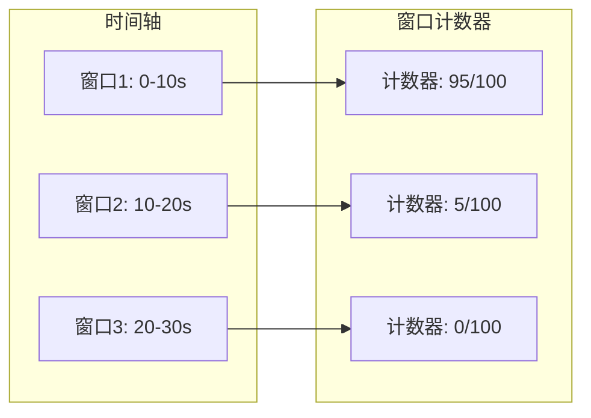
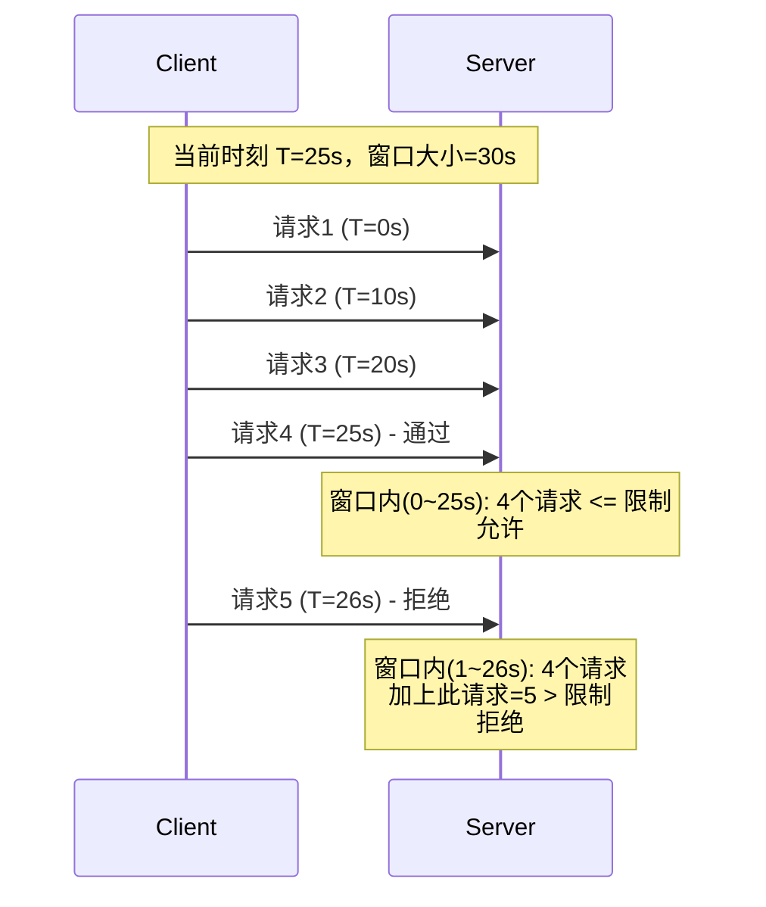
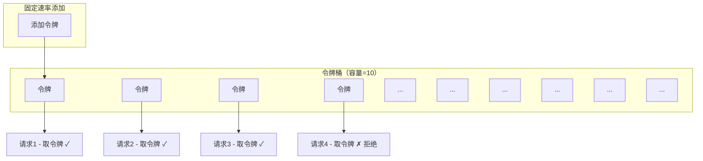
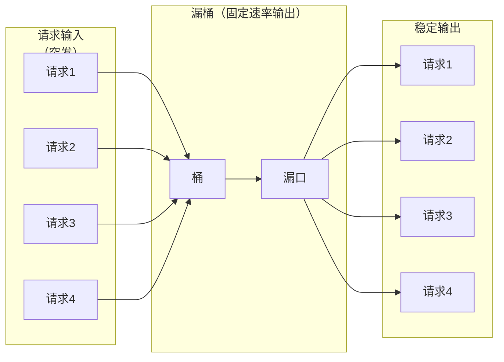

2019 年双十一，阿里巴巴的 API 网关处理了峰值 54.4 万次/秒的请求。如果没有任何限流机制，任何一个有流量的互联网服务都可能在流量高峰时被压垮。限流不是「限制用户」，而是「保护系统不被过载」——没有限流的系统，就像没有闸门的水电站，洪水来临时无法控制。

## 限流的必要性

限流是 API 保护的第一道防线，其核心价值体现在三个方面：

**1. 防止 DoS 攻击**

恶意用户可能通过大量请求耗尽系统资源。限流可以在网关层直接拒绝超出阈值的请求，保护后端服务。

**2. 保证服务公平性**

不同用户/应用对系统资源的消耗应该公平。如果没有限流，某个用户的批量操作可能影响其他用户的正常使用。

**3. 控制成本**

对于依赖外部服务（数据库、第三方 API）的系统，资源消耗直接与成本挂钩。限流是控制成本的重要手段。

## 限流算法全景

限流算法的核心问题是：**如何判断一个请求是否应该被允许**？不同的算法有不同的精度、资源消耗和实现复杂度。

### 1. 固定窗口算法（Fixed Window）

固定窗口算法将时间划分为固定长度的窗口，在每个窗口内计数请求：



**实现示例**：

```java title="FixedWindowRateLimiter.java"
public class FixedWindowRateLimiter {
    
    private final int maxRequests;
    private final Duration windowSize;
    private final Map<String, FixedWindow> windows = new ConcurrentHashMap<>();
    
    public FixedWindowRateLimiter(int maxRequests, Duration windowSize) {
        this.maxRequests = maxRequests;
        this.windowSize = windowSize;
    }
    
    public boolean isAllowed(String key) {
        long now = System.currentTimeMillis();
        long windowStart = now - (now % windowSize.toMillis());
        long windowEnd = windowStart + windowSize.toMillis();
        
        windows.compute(key, (k, existing) -> {
            if (existing == null || existing.windowStart != windowStart) {
                // 新窗口
                return new FixedWindow(windowStart, windowEnd, 1);
            }
            // 当前窗口计数 +1
            if (existing.count >= maxRequests) {
                return existing; // 超过限制，不增加计数
            }
            return new FixedWindow(existing.windowStart, existing.windowEnd, 
                                   existing.count + 1);
        });
        
        FixedWindow window = windows.get(key);
        return window.count <= maxRequests;
    }
    
    private static class FixedWindow {
        final long windowStart;
        final long windowEnd;
        final int count;
        
        FixedWindow(long windowStart, long windowEnd, int count) {
            this.windowStart = windowStart;
            this.windowEnd = windowEnd;
            this.count = count;
        }
    }
}
```

**优点**：实现简单，内存占用低。**缺点**：存在边界问题——两个相邻窗口的请求可能集中在边界时刻通过。

### 2. 滑动窗口算法（Sliding Window）

滑动窗口算法在固定窗口基础上改进，将窗口细化到更小的时间粒度：



**Redis 实现**：

```lua title="sliding_window.lua"
-- 滑动窗口限流 Redis 实现
-- Key: 用户标识
-- Window: 窗口大小（毫秒）
-- Limit: 窗口内最大请求数

local key = KEYS[1]
local window = tonumber(ARGV[1])
local limit = tonumber(ARGV[2])
local now = tonumber(ARGV[3])

-- 窗口起始时间
local window_start = now - window

-- 删除窗口外的记录
redis.call('ZREMRANGEBYSCORE', key, '-inf', window_start)

-- 统计窗口内请求数
local current = redis.call('ZCARD', key)

if current < limit then
    -- 添加当前请求
    redis.call('ZADD', key, now, now .. '-' .. math.random())
    redis.call('PEXPIRE', key, window)
    return 1  -- 允许
else
    return 0  -- 拒绝
end
```

```java title="SlidingWindowRateLimiter.java"
public class SlidingWindowRateLimiter {
    
    private final RedisTemplate<String, String> redisTemplate;
    private final String luaScript;
    
    public SlidingWindowRateLimiter(RedisTemplate<String, String> redisTemplate) {
        this.redisTemplate = redisTemplate;
        this.luaScript = loadScript("sliding_window.lua");
    }
    
    public boolean isAllowed(String key, long windowMs, int limit) {
        String result = redisTemplate.execute(
            new DefaultRedisScript<>(luaScript, Long.class),
            List.of(key),
            String.valueOf(windowMs),
            String.valueOf(limit),
            String.valueOf(System.currentTimeMillis())
        );
        return "1".equals(result);
    }
}
```

**优点**：精度高，解决了固定窗口的边界问题。**缺点**：实现复杂度较高，Redis 操作较多。

### 3. 令牌桶算法（Token Bucket）

令牌桶算法是实际应用中最广泛的限流算法。系统以固定速率向桶中添加令牌，桶有容量上限，每个请求消耗一个令牌：



**Java 实现**：

```java title="TokenBucketRateLimiter.java"
public class TokenBucketRateLimiter {
    
    private final Map<String, Bucket> buckets = new ConcurrentHashMap<>();
    private final int capacity;
    private final double refillRate; // 每秒添加的令牌数
    
    public TokenBucketRateLimiter(int capacity, double refillRate) {
        this.capacity = capacity;
        this.refillRate = refillRate;
    }
    
    public synchronized boolean isAllowed(String key) {
        Bucket bucket = buckets.computeIfAbsent(key, 
            k -> new Bucket(capacity, refillRate));
        return bucket.consume();
    }
    
    private static class Bucket {
        private int tokens;
        private double availableTokens;
        private long lastRefillTime;
        private final int capacity;
        private final double refillRate;
        
        Bucket(int capacity, double refillRate) {
            this.capacity = capacity;
            this.refillRate = refillRate;
            this.tokens = capacity;
            this.availableTokens = capacity;
            this.lastRefillTime = System.nanoTime();
        }
        
        boolean consume() {
            refill();
            if (availableTokens >= 1) {
                availableTokens -= 1;
                return true;
            }
            return false;
        }
        
        private void refill() {
            long now = System.nanoTime();
            long elapsed = now - lastRefillTime;
            double seconds = elapsed / 1_000_000_000.0;
            double newTokens = seconds * refillRate;
            
            availableTokens = Math.min(capacity, availableTokens + newTokens);
            lastRefillTime = now;
        }
    }
}
```

**优点**：允许突发流量（在桶满时），实现相对简单。**缺点**：需要同步机制。

### 4. 漏桶算法（Leaky Bucket）

漏桶算法的思想是：请求像水一样进入桶中，桶以固定速率「漏」出请求：



**特点**：输出速率恒定，不允许突发流量。适合对输出速率有严格要求的场景（如调用下游服务）。

## 算法对比与选型

| 维度 | 固定窗口 | 滑动窗口 | 令牌桶 | 漏桶 |
| --- | --- | --- | --- | --- |
| **精度** | 低（有边界问题） | 高 | 高 | 高 |
| **突发支持** | 支持 | 支持 | 支持 | 不支持 |
| **实现复杂度** | 低 | 中 | 中 | 中 |
| **内存消耗** | 低 | 中 | 低 | 低 |
| **适用场景** | 简单限流 | 精确限流 | 允许突发 | 稳定输出 |

**选型建议**：
- **API 限流**：推荐令牌桶，平衡了精度和突发支持
- **下游调用限流**：推荐漏桶，保证输出稳定
- **分布式限流**：滑动窗口 + Redis

## 限流粒度设计

限流可以在不同粒度进行，每种粒度解决不同问题：

| 粒度 | 说明 | 适用场景 |
| --- | --- | --- |
| **全局限流** | 整个系统的请求总量限制 | 保护数据库、基础设施 |
| **单机限流** | 单台服务器的请求限制 | 保护单实例 |
| **用户级限流** | 每个用户的请求限制 | 防止单用户滥用 |
| **IP 级限流** | 每个 IP 的请求限制 | 防止 IP 滥用/爬虫 |
| **接口级限流** | 每个 API 的请求限制 | 保护热点接口 |
| **参数级限流** | 特定参数组合的限制 | 防止查询滥用 |

```java title="MultiLayerRateLimiter.java"
public class MultiLayerRateLimiter {
    
    private final RateLimiter globalLimiter;
    private final RateLimiter userLimiter;
    private final RateLimiter ipLimiter;
    private final RateLimiter endpointLimiter;
    
    public MultiLayerRateLimiter() {
        // 全局限流：10000 QPS
        this.globalLimiter = new TokenBucketRateLimiter(10000, 10000);
        
        // 用户级限流：100 QPS
        this.userLimiter = new TokenBucketRateLimiter(100, 100);
        
        // IP 级限流：200 QPS
        this.ipLimiter = new TokenBucketRateLimiter(200, 200);
        
        // 端点级限流：热点接口 50 QPS
        this.endpointLimiter = new TokenBucketRateLimiter(50, 50);
    }
    
    public RateLimitResult checkRateLimit(RequestContext context) {
        // 多层检查，任一层超限则拒绝
        if (!globalLimiter.isAllowed("global")) {
            return RateLimitResult.REJECTED_GLOBAL;
        }
        
        if (!userLimiter.isAllowed(context.getUserId())) {
            return RateLimitResult.REJECTED_USER;
        }
        
        if (!ipLimiter.isAllowed(context.getClientIp())) {
            return RateLimitResult.REJECTED_IP;
        }
        
        if (!endpointLimiter.isAllowed(context.getEndpoint())) {
            return RateLimitResult.REJECTED_ENDPOINT;
        }
        
        return RateLimitResult.ALLOWED;
    }
}
```

## 限流响应处理

限流触发后，应该返回标准的 HTTP 响应：

```http
HTTP/1.1 429 Too Many Requests
Content-Type: application/json
Retry-After: 60
X-RateLimit-Limit: 100
X-RateLimit-Remaining: 0
X-RateLimit-Reset: 1712563800

{
  "error": "rate_limit_exceeded",
  "message": "请求频率超出限制，请稍后重试",
  "retry_after": 60
}
```

```java title="RateLimitExceptionHandler.java"
public class RateLimitExceptionHandler {
    
    public ResponseEntity<ErrorResponse> handleRateLimitExceeded(
            RateLimitResult result, String userId) {
        
        HttpHeaders headers = new HttpHeaders();
        headers.add("X-RateLimit-Limit", String.valueOf(result.getLimit()));
        headers.add("X-RateLimit-Remaining", "0");
        headers.add("X-RateLimit-Reset", String.valueOf(result.getResetTime()));
        headers.add("Retry-After", String.valueOf(result.getRetryAfterSeconds()));
        
        ErrorResponse error = new ErrorResponse(
            "rate_limit_exceeded",
            String.format("请求频率超出限制，请在 %d 秒后重试", 
                         result.getRetryAfterSeconds()),
            result.getRetryAfterSeconds()
        );
        
        return ResponseEntity
            .status(HttpStatus.TOO_MANY_REQUESTS)
            .headers(headers)
            .body(error);
    }
}
```

:::tip 建议添加的响应头
- `X-RateLimit-Limit`：总限制数
- `X-RateLimit-Remaining`：剩余可用次数
- `X-RateLimit-Reset`：限制重置时间（Unix 时间戳）
- `Retry-After`：建议的重试等待时间（秒）
:::

## 分布式限流的挑战

单机限流在分布式环境下存在根本问题：每个实例独立限流，无法感知全局流量。分布式限流需要解决计数器一致性问题。

### Redis + Lua 实现分布式限流

```lua title="distributed_rate_limit.lua"
-- 分布式令牌桶限流
-- Key: 限流对象标识
-- Capacity: 桶容量
-- RefillRate: 令牌添加速率（个/秒）
-- Requested: 请求的令牌数（通常为1）

local key = KEYS[1]
local capacity = tonumber(ARGV[1])
local refill_rate = tonumber(ARGV[2])
local requested = tonumber(ARGV[3])
local now = tonumber(ARGV[4])

-- 获取当前状态
local data = redis.call('HMGET', key, 'tokens', 'last_time')
local tokens = tonumber(data[1])
local last_time = tonumber(data[2])

-- 初始化
if tokens == nil then
    tokens = capacity
    last_time = now
end

-- 计算应该添加的令牌数
local elapsed = math.max(0, now - last_time)
local new_tokens = math.min(capacity, tokens + (elapsed * refill_rate / 1000))

-- 检查是否允许请求
if new_tokens >= requested then
    new_tokens = new_tokens - requested
    redis.call('HMSET', key, 'tokens', new_tokens, 'last_time', now)
    redis.call('EXPIRE', key, math.ceil(capacity / refill_rate) + 10)
    return {1, new_tokens, capacity}  -- 允许
else
    redis.call('HMSET', key, 'tokens', new_tokens, 'last_time', now)
    redis.call('EXPIRE', key, math.ceil(capacity / refill_rate) + 10)
    -- 返回需要等待的时间（秒）
    local wait_time = math.ceil((requested - new_tokens) / refill_rate)
    return {0, new_tokens, capacity, wait_time}  -- 拒绝
end
```

```java title="DistributedRateLimiter.java"
public class DistributedRateLimiter {
    
    private final RedisTemplate<String, String> redisTemplate;
    private final String luaScript;
    
    public DistributedRateLimiter(RedisTemplate<String, String> redisTemplate) {
        this.redisTemplate = redisTemplate;
        this.luaScript = loadScript("distributed_rate_limit.lua");
    }
    
    public RateLimitResult isAllowed(String key, int capacity, 
                                      double refillRate, int requested) {
        DefaultRedisScript<List> script = new DefaultRedisScript<>();
        script.setScriptText(luaScript);
        script.setResultType(List.class);
        
        List<Long> result = redisTemplate.execute(
            script,
            List.of(key),
            String.valueOf(capacity),
            String.valueOf(refillRate),
            String.valueOf(requested),
            String.valueOf(System.currentTimeMillis())
        );
        
        if (result.get(0) == 1) {
            return RateLimitResult.allowed(result.get(1), result.get(2));
        } else {
            return RateLimitResult.rejected(result.get(1), result.get(2), result.get(3));
        }
    }
}
```

### 分布式限流的一致性问题

Redis 限流面临两个核心问题：

**1. 计数器准确性问题**

多个限流请求同时到达 Redis 时，Lua 脚本的原子执行保证了准确性。但如果 Redis 主从切换或集群分片，一致性可能受影响。

**2. 跨节点协调问题**

在 Redis Cluster 环境下，同一个 Key 的限流可能分散在不同节点，需要用 Hash Slot 固定 Key 的位置。

```java title="ConsistentHashSlotRouter.java"
public class ConsistentHashSlotRouter {
    
    // 使用 Hash Tag 确保相关 Key 在同一槽位
    public String getRateLimitKey(String userId, String endpoint) {
        // Hash Tag: 使用大括号包裹的部分确定槽位
        return String.format("ratelimit:{%s}:%s", userId, endpoint);
    }
    
    // 示例：全局限流使用相同前缀
    public String getGlobalRateLimitKey() {
        return "ratelimit:global";
    }
}
```

## 思考题

**问题 1**：令牌桶算法允许「突发流量」，这对系统来说是好是坏？如何在支持突发的同时保护系统？

<details>
<summary>参考答案</summary>

**突发流量的两面性**：

**好处**：
- 用户体验更好：偶尔的大量操作不会立即被拒绝
- 适应真实场景：用户行为本身就是突发的（如秒杀、抢购）
- 允许短暂的资源利用峰值

**坏处**：
- 可能压垮下游服务（如数据库、第三方 API）
- 可能触发雪崩效应

**平衡策略**：

1. **分层限流**：全局限流（严格） + 单用户限流（宽松）
   - 全局限流：限制总流量，保护基础设施
   - 用户限流：允许突发，但有上限

2. **降级处理**：突发流量到来时，自动切换到降级模式（如返回缓存数据）

3. **预热机制**：新用户或新服务启动时，逐步增加限额，而不是一次性放满

4. **多级桶**：使用多个桶分别限制不同粒度的突发
</details>

**问题 2**：在分布式限流中，为什么使用 Redis Lua 脚本而不是多个 Redis 命令？

<details>
<summary>参考答案</summary>

**Redis 命令的非原子性问题**：

如果使用多个 Redis 命令：

```java
// 伪代码
long count = redis.incr(key);  // 步骤1：原子
if (count > limit) {
    redis.decr(key);  // 步骤2：可能失败
    return REJECTED;
}
return ALLOWED;
```

在步骤1和步骤2之间，如果另一个请求也执行了步骤1，就会出现计数错误。

**Lua 脚本的原子性保证**：

```lua
-- 整个脚本在 Redis 中原子执行
-- 不会出现中间状态被其他命令打断
local count = redis.call('INCR', key)
if count > tonumber(ARGV[1]) then
    return 0
end
return 1
```

**Lua 脚本的优势**：
1. 整个脚本原子执行，不会被其他命令插入
2. 减少网络往返，提高性能
3. 可以在脚本中实现复杂逻辑
4. 脚本结果可以批量返回给客户端

**注意事项**：
- Lua 脚本不能执行阻塞操作（如 BLPOP、BRPOP）
- 脚本执行时间不宜过长，否则阻塞 Redis
- 复杂计算应该预先处理好，只在 Redis 中做计数
</details>

**问题 3**：如何设计一个「动态限流」策略，根据系统负载自动调整限流阈值？

<details>
<summary>参考答案</summary>

**动态限流的核心思想**：

当系统健康时，放宽限流阈值；当系统压力大时，收紧限流阈值，保护系统不被压垮。

**实现方案**：

```java title="AdaptiveRateLimiter.java"
public class AdaptiveRateLimiter {
    
    private final MetricsCollector metrics;
    private final RateLimiter baseLimiter;
    
    // 系统负载指标
    private final Queue<Double> cpuHistory = new CircularQueue<>(60);
    private final Queue<Double> latencyHistory = new CircularQueue<>(60);
    private final Queue<Integer> errorRateHistory = new CircularQueue<>(60);
    
    public RateLimitDecision decide(String userId, RequestContext context) {
        // 收集当前负载指标
        double currentCpu = metrics.getCpuUsage();
        double currentLatency = metrics.getP99Latency();
        double currentErrorRate = metrics.getErrorRate();
        
        cpuHistory.add(currentCpu);
        latencyHistory.add(currentLatency);
        errorRateHistory.add(currentErrorRate);
        
        // 计算系统健康度（0-100）
        double healthScore = calculateHealthScore();
        
        // 根据健康度计算限流系数
        double rateLimitMultiplier = calculateMultiplier(healthScore);
        
        // 获取基础限流配置
        RateLimitConfig baseConfig = getBaseConfig(context.getEndpoint());
        
        // 计算动态限流阈值
        int dynamicLimit = (int) (baseConfig.getLimit() * rateLimitMultiplier);
        double dynamicRate = baseConfig.getRate() * rateLimitMultiplier;
        
        // 执行限流检查
        boolean allowed = checkLimit(userId, dynamicLimit, dynamicRate);
        
        return new RateLimitDecision(allowed, dynamicLimit, rateLimitMultiplier);
    }
    
    private double calculateHealthScore() {
        // CPU 使用率（权重 30%）
        double cpuScore = 100 - (cpuHistory.average() * 100);
        
        // P99 延迟（权重 40%）
        double latencyScore = latencyHistory.average() < 100 ? 100 : 
            Math.max(0, 100 - (latencyHistory.average() - 100) / 10);
        
        // 错误率（权重 30%）
        double errorScore = 100 - (errorRateHistory.average() * 1000);
        
        return cpuScore * 0.3 + latencyScore * 0.4 + errorScore * 0.3;
    }
    
    private double calculateMultiplier(double healthScore) {
        if (healthScore >= 80) return 1.0;  // 系统健康，100% 限额
        if (healthScore >= 60) return 0.7;  // 轻微压力，70% 限额
        if (healthScore >= 40) return 0.5;  // 中度压力，50% 限额
        return 0.3;  // 严重压力，30% 限额
    }
}
```

**动态限流的注意事项**：
- 需要预热期，刚启动时数据不足
- 要防止限流阈值剧烈波动（加入平滑因子）
- 需要监控动态限流的触发情况
- 应该有下线机制：动态限流失效时回退到静态限流
</details>
