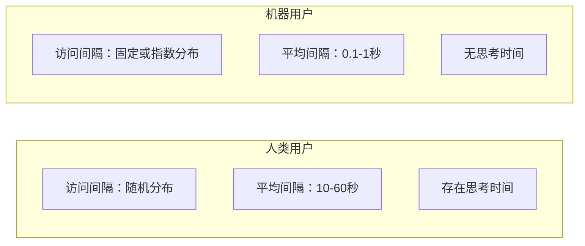
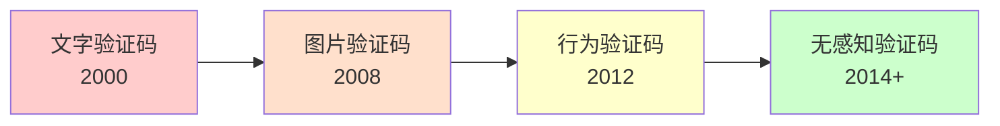
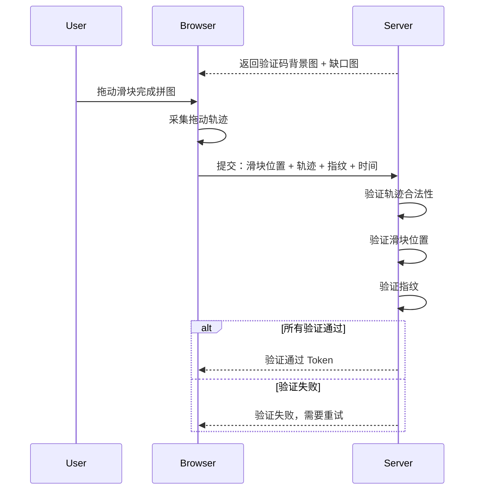
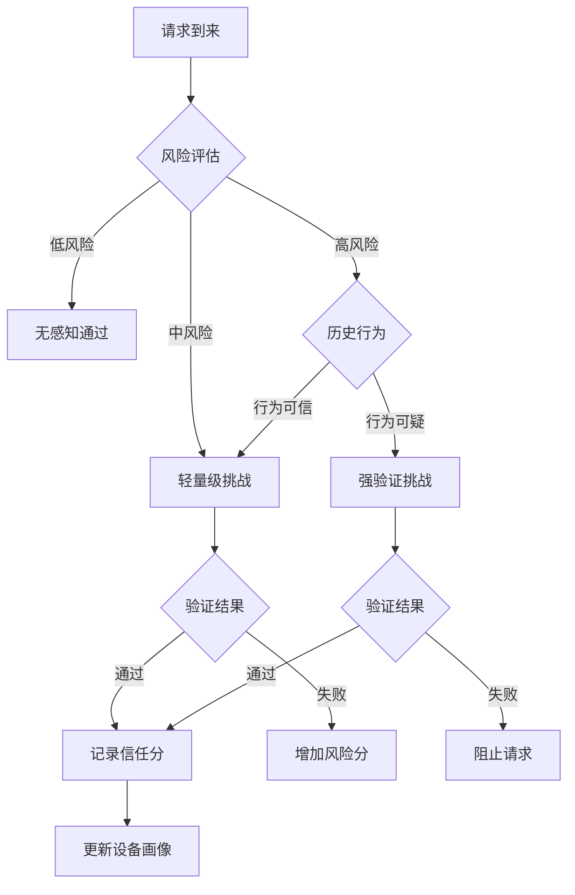
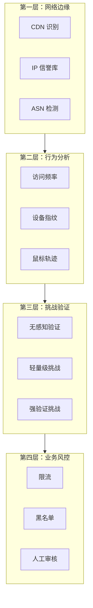

2016 年，某电商平台的促销活动中，83% 的流量是 Bot 而不是真实用户。这些 Bot 抢走了商品、占用了带宽、污染了数据。运营团队花了大量人力做反爬，却总是「道高一尺魔高一丈」——验证码越来越复杂，用户体验越来越差，但 Bot 依然能够绕过。

图灵盾（Turing Shield）的核心思想是：**让机器无法区分这是人还是机器**。不是通过复杂的题目难住 Bot，而是通过多维度的行为分析，让 Bot 在「看起来像人」这件事上付出足够高的代价。

## Bot 流量识别的重要性

Bot 流量分为「善意 Bot」和「恶意 Bot」：

| 类型 | 特点 | 处理方式 |
| --- | --- | --- |
| **搜索引擎爬虫** | 遵守 robots.txt，有明确的 User-Agent | 允许 |
| **监控服务** | 定期检查服务可用性 | 允许白名单 |
| **数据爬虫** | 批量抓取数据 | 限制或阻止 |
| **薅羊毛 Bot** | 抢购、刷单、薅优惠券 | 阻止 |
| **恶意扫描** | 探测漏洞、暴力破解 | 阻止 |
| **DDoS Bot** | 大量请求耗尽资源 | 阻止 |

**恶意 Bot 的危害**：
- **业务损失**：优惠券被 Bot 抢走、热门商品被囤积
- **数据泄露**：竞争对手抓取核心数据
- **带宽浪费**：无效请求占用服务器资源
- **价格歧视**：竞争对手监控价格并调整策略
- **账户安全**：暴力破解、撞库攻击

## 行为特征识别

Bot 和真实用户在行为上有显著差异。通过多维度行为分析，可以识别出 Bot 流量。

### 1. 访问频率分析

真实用户的访问频率呈现自然分布：



```java title="AccessFrequencyAnalyzer.java"
public class AccessFrequencyAnalyzer {
    
    private final SlidingWindowCounter counter;
    
    public FrequencyMetrics analyze(String clientId, RequestContext context) {
        String ip = context.getIp();
        String userId = context.getUserId();
        
        // 统计各种维度的访问频率
        long ipRequestCount = counter.getCount("ip:" + ip, Duration.ofMinutes(1));
        long userRequestCount = counter.getCount("user:" + userId, Duration.ofMinutes(1));
        long endpointRequestCount = counter.getCount(
            "endpoint:" + context.getPath(), Duration.ofMinutes(1));
        
        // 计算访问模式特征
        double ipRequestRate = ipRequestCount / 60.0;  // 每秒请求数
        double burstiness = calculateBurstiness(ip);   // 突发性
        double periodicity = calculatePeriodicity(ip); // 周期性
        
        return FrequencyMetrics.builder()
            .ipRequestRate(ipRequestRate)
            .userRequestRate(userRequestCount / 60.0)
            .endpointRequestRate(endpointRequestCount / 60.0)
            .burstiness(burstiness)
            .periodicity(periodicity)
            .build();
    }
    
    // 突发性：短时间内请求密度
    private double calculateBurstiness(String ip) {
        long currentSecond = counter.getCount("ip:" + ip, Duration.ofSeconds(1));
        long currentMinute = counter.getCount("ip:" + ip, Duration.ofMinutes(1));
        
        if (currentMinute == 0) return 0;
        // 突发比 = 秒级密度 / 分钟级密度
        return (currentSecond * 60.0) / currentMinute;
    }
    
    // 周期性：请求间隔的规律性（Bot 通常间隔固定）
    private double calculatePeriodicity(String ip) {
        List<Long> intervals = getRecentIntervals(ip, 100);
        if (intervals.size() < 10) return 0;
        
        // 计算间隔的标准差
        double mean = intervals.stream().mapToLong(Long::longValue).average().orElse(0);
        double variance = intervals.stream()
            .mapToDouble(i -> Math.pow(i - mean, 2))
            .average().orElse(0);
        double stdDev = Math.sqrt(variance);
        
        // 标准差越小，周期性越强（Bot 特征）
        // 归一化：标准差/均值，值越小说明越规律
        return mean > 0 ? stdDev / mean : 1;
    }
    
    public RiskLevel assessRisk(FrequencyMetrics metrics) {
        // 综合评分
        double score = 0;
        
        if (metrics.getIpRequestRate() > 10) score += 30;
        else if (metrics.getIpRequestRate() > 5) score += 15;
        
        if (metrics.getBurstiness() > 0.8) score += 20;
        
        if (metrics.getPeriodicity() < 0.2) score += 25; // 太规律
        
        if (metrics.getUserRequestRate() > 100) score += 25;
        
        if (score >= 70) return RiskLevel.HIGH;
        if (score >= 40) return RiskLevel.MEDIUM;
        return RiskLevel.LOW;
    }
}
```

### 2. 鼠标轨迹分析

真实用户的鼠标移动轨迹呈现自然的物理特征：

```java title="MouseTrajectoryAnalyzer.java"
public class MouseTrajectoryAnalyzer {
    
    public TrajectoryFeatures extract(List<MouseEvent> events) {
        if (events.size() < 10) {
            return TrajectoryFeatures.builder()
                .valid(false)
                .build();
        }
        
        // 1. 计算轨迹的总长度
        double totalDistance = calculateTotalDistance(events);
        
        // 2. 计算轨迹的直线距离（起点到终点）
        double directDistance = calculateDirectDistance(events);
        
        // 3. 计算效率比（直线距离/总长度）
        // 人类轨迹通常效率较低（有很多无效移动）
        double efficiency = directDistance / totalDistance;
        
        // 4. 计算速度变化
        double speedVariation = calculateSpeedVariation(events);
        
        // 5. 计算角度变化（方向改变的频率）
        double angleVariation = calculateAngleVariation(events);
        
        return TrajectoryFeatures.builder()
            .valid(true)
            .totalDistance(totalDistance)
            .directDistance(directDistance)
            .efficiency(efficiency)
            .speedVariation(speedVariation)
            .angleVariation(angleVariation)
            .build();
    }
    
    // Bot 特征：
    // - 效率过高（几乎是直线）
    // - 速度恒定
    // - 几乎没有角度变化
    public RiskLevel assessRisk(TrajectoryFeatures features) {
        if (!features.isValid()) {
            return RiskLevel.UNKNOWN;
        }
        
        double score = 0;
        
        // 效率过高（>0.9通常是 Bot）
        if (features.getEfficiency() > 0.9) score += 30;
        else if (features.getEfficiency() > 0.8) score += 15;
        
        // 速度过于恒定
        if (features.getSpeedVariation() < 0.1) score += 25;
        
        // 角度变化少
        if (features.getAngleVariation() < 0.2) score += 20;
        
        // 移动距离过短
        if (features.getTotalDistance() < 100) score += 25;
        
        if (score >= 60) return RiskLevel.HIGH;
        if (score >= 30) return RiskLevel.MEDIUM;
        return RiskLevel.LOW;
    }
}
```

### 3. 点击模式分析

```java title="ClickPatternAnalyzer.java"
public class ClickPatternAnalyzer {
    
    public ClickMetrics analyze(String userId, List<ClickEvent> clicks) {
        // 统计点击间隔
        List<Long> intervals = calculateIntervals(clicks);
        
        // 计算点击速度的一致性
        double speedConsistency = calculateConsistency(intervals);
        
        // 检测是否总是点击相同位置
        double positionVariance = calculatePositionVariance(clicks);
        
        // 检测是否按固定顺序点击
        double sequencePattern = calculateSequencePattern(clicks);
        
        return ClickMetrics.builder()
            .clickCount(clicks.size())
            .speedConsistency(speedConsistency)    // Bot 速度一致
            .positionVariance(positionVariance)    // Bot 位置固定
            .sequencePattern(sequencePattern)      // Bot 有固定顺序
            .build();
    }
    
    // 检测可疑的固定点击模式
    private double calculateSequencePattern(List<ClickEvent> clicks) {
        // 记录点击的 DOM 路径序列
        List<String> paths = clicks.stream()
            .map(ClickEvent::getDomPath)
            .toList();
        
        // 计算序列的熵
        // 熵越低，序列越规律（Bot 特征）
        return calculateEntropy(paths);
    }
}
```

### 4. 设备指纹

设备指纹是通过收集设备的多维度特征，生成唯一标识符：

```java title="DeviceFingerprintCollector.java"
public class DeviceFingerprint {
    
    public String generateFingerprint(HttpRequest request, 
                                    ClientScriptData scriptData) {
        List<String> components = new ArrayList<>();
        
        // 1. User-Agent
        components.add(request.getHeader("User-Agent"));
        
        // 2. Canvas 指纹
        components.add(scriptData.getCanvasHash());
        
        // 3. WebGL 渲染器指纹
        components.add(scriptData.getWebglRenderer());
        
        // 4. 屏幕分辨率
        components.add(scriptData.getScreenResolution());
        
        // 5. 时区
        components.add(scriptData.getTimezone());
        
        // 6. 语言设置
        components.add(request.getHeader("Accept-Language"));
        
        // 7. 平台信息
        components.add(scriptData.getPlatform());
        
        // 8. 插件列表
        components.add(scriptData.getPlugins());
        
        // 9. WebRTC 本地 IP（如果有）
        components.add(scriptData.getWebrtcLocalIp());
        
        // 计算组合指纹
        return sha256(String.join("|", components));
    }
    
    // 同一指纹的访问频率
    public boolean isSuspicious(String fingerprint, Duration window) {
        long count = cache.get("fp:" + fingerprint, window);
        return count > 10; // 超过10次可能是共享指纹或爬虫
    }
}
```

#### Canvas 指纹原理

```javascript title="canvas_fingerprint.js"
// Canvas 指纹：通过绘制特定图形获取不同设备的渲染差异
function getCanvasFingerprint() {
    const canvas = document.createElement('canvas');
    const ctx = canvas.getContext('2d');
    
    // 绘制包含文字和图形的复杂图像
    ctx.textBaseline = 'top';
    ctx.font = '14px Arial';
    ctx.fillStyle = '#f60';
    ctx.fillRect(125, 1, 62, 20);
    
    ctx.fillStyle = '#069';
    ctx.fillText('Turing Shield Test', 2, 15);
    
    ctx.fillStyle = 'rgba(102, 204, 0, 0.7)';
    ctx.fillText('Turing Shield Test', 4, 17);
    
    // 获取图像数据
    const dataUrl = canvas.toDataURL();
    
    // 对图像数据进行哈希
    return hashCode(dataUrl);
}
```

#### WebGL 指纹

```javascript title="webgl_fingerprint.js"
function getWebGLFingerprint() {
    const canvas = document.createElement('canvas');
    const gl = canvas.getContext('webgl');
    
    if (!gl) return null;
    
    // 获取 WebGL 渲染器信息
    const debugInfo = gl.getExtension('WEBGL_debug_renderer_info');
    
    const vendor = gl.getParameter(gl.VENDOR);
    const renderer = gl.getParameter(gl.RENDERER);
    const version = gl.getParameter(gl.VERSION);
    const shadingVersion = gl.getParameter(gl.SHADING_LANGUAGE_VERSION);
    
    return hashCode(`${vendor}|${renderer}|${version}|${shadingVersion}`);
}
```

## 验证码的演进

验证码（CAPTCHA）经历了多个阶段的演进：



### 1. 文字验证码

最早的验证码是基于扭曲文字的识别：

- 优点：实现简单
- 缺点：已被 OCR 破解，准确率 > 99%

### 2. 图片验证码

基于图片识别的验证码（如选择「所有包含红绿灯的图片」）：

- 优点：比文字验证码难破解
- 缺点：用户体验差、可用性问题（色盲用户）

### 3. 行为验证码

基于用户行为的验证码，典型代表是滑动验证码：



```java title="SlidingCaptchaService.java"
public class SlidingCaptchaService {
    
    private final FingerprintService fingerprintService;
    private final TrajectoryAnalyzer trajectoryAnalyzer;
    private final ImageProcessor imageProcessor;
    
    public CaptchaChallenge generateChallenge() {
        // 随机选择背景图和缺口位置
        String backgroundImage = imageLibrary.randomBackground();
        Point gapPosition = randomGapPosition();
        
        // 生成带缺口的图片
        String captchaImage = imageProcessor.addGap(
            backgroundImage, gapPosition);
        
        // 生成唯一挑战 ID
        String challengeId = UUID.randomUUID().toString();
        
        // 存储挑战信息（带过期时间）
        cache.put(challengeId, new CaptchaChallenge(
            backgroundImage, gapPosition, Instant.now().plusSeconds(300)
        ));
        
        return new CaptchaChallenge(
            challengeId, captchaImage, gapPosition
        );
    }
    
    public VerificationResult verify(String challengeId, 
                                     Point sliderPosition,
                                     List<Point> trajectory,
                                     ClientData clientData) {
        CaptchaChallenge challenge = cache.get(challengeId);
        if (challenge == null || challenge.isExpired()) {
            return VerificationResult.EXPIRED;
        }
        
        // 1. 验证滑块位置
        double positionDiff = calculateDistance(
            sliderPosition, challenge.getGapPosition());
        if (positionDiff > MAX_POSITION_TOLERANCE) {
            return VerificationResult.POSITION_MISMATCH;
        }
        
        // 2. 验证轨迹
        TrajectoryFeatures features = trajectoryAnalyzer.extract(trajectory);
        RiskLevel trajectoryRisk = trajectoryAnalyzer.assessRisk(features);
        
        if (trajectoryRisk == RiskLevel.HIGH) {
            return VerificationResult.SUSPICIOUS_TRAJECTORY;
        }
        
        // 3. 验证设备指纹
        String fingerprint = fingerprintService.generate(clientData);
        RiskLevel fingerprintRisk = fingerprintService.assessRisk(fingerprint);
        
        if (fingerprintRisk == RiskLevel.HIGH) {
            return VerificationResult.SUSPICIOUS_DEVICE;
        }
        
        // 4. 综合评分
        double totalScore = calculateTotalScore(
            positionDiff, features, fingerprintRisk);
        
        if (totalScore < PASS_THRESHOLD) {
            return VerificationResult.FAILED;
        }
        
        // 生成验证通过凭证
        String token = generateToken(challengeId, fingerprint);
        return VerificationResult.success(token);
    }
}
```

### 4. 无感知验证码

最先进的验证码方案，用户几乎感受不到验证过程：

```java title="RiskBasedCaptcha.java"
public class RiskBasedCaptchaService {
    
    private final BehaviorAnalyzer behaviorAnalyzer;
    private final CaptchaChallengeGenerator captchaGenerator;
    
    public CaptchaResponse evaluate(HttpRequest request, 
                                   ClientData clientData,
                                   UserContext userContext) {
        // 1. 计算基础风险分
        double baseRiskScore = calculateBaseRiskScore(
            request, clientData, userContext);
        
        // 2. 行为分析风险
        double behaviorRiskScore = behaviorAnalyzer.analyze(clientData);
        
        // 3. 综合评分
        double totalScore = baseRiskScore * 0.4 + behaviorRiskScore * 0.6;
        
        // 4. 根据风险等级决定行动
        if (totalScore < LOW_RISK_THRESHOLD) {
            // 无感知通过
            return CaptchaResponse.pass();
        }
        
        if (totalScore < MEDIUM_RISK_THRESHOLD) {
            // 中风险：轻量级验证
            CaptchaChallenge challenge = captchaGenerator.generateLightweight();
            return CaptchaResponse.challenge(challenge);
        }
        
        // 高风险：强验证
        CaptchaChallenge challenge = captchaGenerator.generateStrong();
        return CaptchaResponse.challenge(challenge);
    }
    
    private double calculateBaseRiskScore(HttpRequest request,
                                         ClientData clientData,
                                         UserContext userContext) {
        double score = 0;
        
        // IP 风险
        if (ipReputationService.isSuspicious(request.getClientIp())) {
            score += 30;
        }
        
        // 新设备
        if (!deviceRepository.isKnownDevice(clientData.getFingerprint())) {
            score += 20;
        }
        
        // 异地登录
        if (userContext.hasUnusualLocation()) {
            score += 25;
        }
        
        // 短时间内的验证失败
        if (hasRecentFailures(request.getClientIp())) {
            score += 30;
        }
        
        return Math.min(score, 100);
    }
}
```

## 风险评估与动态挑战

图灵盾的核心是基于多维度风险评估的动态挑战机制：



```java title="DynamicChallengeManager.java"
public class DynamicChallengeManager {
    
    private final RiskEvaluator riskEvaluator;
    private final ChallengeGenerator challengeGenerator;
    private final TrustScoreManager trustScoreManager;
    
    public ChallengeDecision decide(HttpRequest request, 
                                   ClientData clientData) {
        String fingerprint = clientData.getFingerprint();
        
        // 1. 获取设备信任分
        double trustScore = trustScoreManager.getTrustScore(fingerprint);
        
        // 2. 计算当前风险分
        double riskScore = riskEvaluator.evaluate(request, clientData);
        
        // 3. 动态调整阈值
        ChallengeThresholds thresholds = calculateThresholds(trustScore);
        
        // 4. 做出决策
        if (riskScore < thresholds.getLowRiskThreshold()) {
            return ChallengeDecision.pass();
        }
        
        if (riskScore < thresholds.getMediumRiskThreshold()) {
            Challenge challenge = challengeGenerator.generateLight(challenge);
            return ChallengeDecision.challenge(challenge);
        }
        
        Challenge challenge = challengeGenerator.generateStrong();
        return ChallengeDecision.challenge(challenge);
    }
    
    // 信任分高的设备，阈值更宽松
    private ChallengeThresholds calculateThresholds(double trustScore) {
        double lowThreshold = 30 - (trustScore * 0.1); // 信任分越高，阈值越低
        double mediumThreshold = 70 - (trustScore * 0.2);
        
        return new ChallengeThresholds(
            Math.max(10, lowThreshold),
            Math.max(40, mediumThreshold)
        );
    }
}
```

## 验证码绕过技术

知己知彼，了解 Bot 开发者常用的验证码绕过技术，才能更好地防御：

| 技术 | 原理 | 防御措施 |
| --- | --- | --- |
| **OCR 识别** | 使用机器学习识别文字验证码 | 使用复杂背景干扰 + 行为验证码 |
| **人工打码平台** | 真实人类帮助识别 | 增加行为分析，轻量级挑战 |
| **图像识别 API** | 使用第三方图像识别服务 | 动态图片库，定期更新 |
| **浏览器自动化** | 使用 Selenium/Puppeteer 模拟浏览器 | 检测自动化特征 |
| **代理池** | 大量 IP 轮流使用 | IP 行为分析，设备指纹 |
| **Cookie/Token 窃取** | 窃取真实用户的验证凭证 | 验证凭证与设备绑定 |
| **机器学习** | 训练模型模拟人类行为 | 多维度特征检测 |

```java title="AutomationDetector.java"
public class AutomationDetector {
    
    public AutomationFeatures detect(ClientData clientData) {
        List<String> indicators = new ArrayList<>();
        
        // 1. 检测自动化框架特征
        if (clientData.hasWebDriver()) {
            indicators.add("webdriver_detected");
        }
        
        // 2. 检测模拟浏览器特征
        if (clientData.isLikelyAutomated()) {
            indicators.add("automation_likely");
        }
        
        // 3. 检测不常见的浏览器属性
        List<String> uncommonProperties = detectUncommonProperties(clientData);
        if (!uncommonProperties.isEmpty()) {
            indicators.add("uncommon_properties:" + uncommonProperties);
        }
        
        // 4. 检测自动化相关事件
        if (clientData.hasAutomationEvents()) {
            indicators.add("automation_events");
        }
        
        return AutomationFeatures.builder()
            .indicators(indicators)
            .automationScore(calculateScore(indicators))
            .build();
    }
}
```

```javascript title="automation_detection.js"
// 浏览器自动化检测脚本
(function() {
    // 检测 WebDriver
    const hasWebDriver = navigator.webdriver === true;
    
    // 检测 Chrome 无头模式
    const isHeadless = window.chrome && 
        !window.chrome.runtime && 
        navigator.userAgent.includes('HeadlessChrome');
    
    // 检测 Selenium
    const hasSelenium = window.domAutomationController !== undefined ||
        window.webdriver !== undefined;
    
    // 检测自动化相关事件
    const automationEvents = [
        'webdriver',
        '__webdriver_evaluate',
        '__selenium_evaluate',
        '__webdriver_script_function',
        '__webdriver_script_func',
        '__webdriver_script_fn'
    ];
    
    const hasAutomationVariables = automationEvents.some(
        event => window[event] !== undefined
    );
    
    // 检测常见自动化工具的 User-Agent
    const userAgent = navigator.userAgent;
    const isKnownBotUA = [
        'phantomjs',
        'selenium',
        'puppeteer',
        'playwright'
    ].some(bot => userAgent.toLowerCase().includes(bot));
    
    return {
        webDriver: hasWebDriver,
        headless: isHeadless,
        selenium: hasSelenium,
        automationVars: hasAutomationVariables,
        knownBotUA: isKnownBotUA,
        score: calculateRiskScore(hasWebDriver, isHeadless, hasSelenium, isKnownBotUA)
    };
})();
```

## 平衡用户体验与安全性

反爬是一个持续对抗的过程。过于严格的验证会伤害用户体验，过于宽松则无法阻止 Bot。

### 分层防御策略



### 最佳实践

:::tip 反爬最佳实践
- 多维度检测，单一特征不能作为判断依据
- 渐进式挑战，低风险用户无感知，高风险用户强验证
- 动态调整策略，根据攻击者行为实时更新规则
- 保护用户体验，验证码应该在必要时才触发
- 定期更新验证图片库，防止图像识别攻击
- 监控 Bot 绕过尝试，及时发现新攻击手法
- 建立 Bot 情报共享，行业联动应对新型 Bot
:::

## 思考题

**问题 1**：为什么传统的图片验证码（如「请输入图中文字」）对 Bot 的防护效果越来越差？

<details>
<summary>参考答案</summary>

**技术层面的原因**：

1. **OCR 技术进步**：深度学习让文字识别准确率超过 99%，传统扭曲文字难以阻挡。

2. **打码平台产业链**：人工打码平台将验证码识别变成「劳动密集型产业」，成本极低。

3. **样本学习方法**：Bot 运营商可以收集大量验证码样本，训练专门的识别模型。

4. **图像识别 API 商业化**：第三方服务（如 2Captcha、Anti-Captcha）提供 API，Bot 开发者直接调用即可。

**产品层面的原因**：

1. **用户体验优先**：为了不过度影响用户体验，验证码不能做得太复杂。

2. **可访问性要求**：验证码需要支持视觉障碍用户，导致无法使用复杂的视觉干扰。

3. **多平台兼容**：验证码需要在各种设备上可用，限制了技术选择。

**应对思路**：

1. 从「验证码」转向「行为分析」，不依赖单次挑战判断
2. 使用无感知验证，让正常用户无感知
3. 风险分级，低风险用户直接通过，高风险用户再验证
4. 多维度验证结合，不依赖单一防线
</details>

**问题 2**：如何设计一个有效的设备指纹系统，平衡准确性和用户隐私？

<details>
<summary>参考答案</summary>

**准确性与隐私的平衡**：

**准确性要求**：
- 同一设备生成相同指纹
- 不同设备生成不同指纹
- 指纹不易被伪造或模拟

**隐私要求**：
- 不收集可识别个人身份的信息（PII）
- 指纹不可逆推用户身份
- 符合 GDPR 等隐私法规

**设计原则**：

1. **使用设备固有特征，而非用户信息**：
   - ✓ Canvas 渲染差异、WebGL 渲染器
   - ✗ 用户名、邮箱、身份证号

2. **哈希处理敏感特征**：
   - 对收集的特征进行哈希处理
   - 只存储哈希值，不存储原始值

3. **分层指纹策略**：

```java
// 第一层：基础指纹（不涉及隐私）
String basicFingerprint = hash(
    userAgent + screenResolution + timezone + language
);

// 第二层：设备指纹（需要同意）
String deviceFingerprint = hash(
    basicFingerprint + canvasHash + webglRenderer
);

// 第三层：行为指纹（实时分析）
String behaviorFingerprint = analyze(clickPattern, mouseTrajectory);
```

4. **用户同意机制**：
   - 在收集设备指纹前获取用户同意
   - 提供关闭指纹追踪的选项

5. **数据最小化**：
   - 只收集必要的信息
   - 定期清理历史数据
   - 不与第三方共享原始指纹数据
</details>

**问题 3**：在反爬对抗中，如何判断一个「高风险用户」是真正的 Bot 还是误判的正常用户？

<details>
<summary>参考答案</summary>

**误判的常见原因**：

1. **共享 IP**：公司网络、校园网络多人共用 IP，正常用户被误伤
2. **公共设备**：图书馆、网吧等公共设备，指纹特征相同
3. **网络代理**：正常用户使用 VPN/代理，被识别为可疑 IP
4. **开发者调试**：开发者频繁刷新页面，被识别为异常
5. **残障人士辅助工具**：屏幕阅读器等辅助工具模拟浏览器行为

**多维度验证策略**：

```java
public class FalsePositiveReducer {
    
    public RiskAssessment assessWithContext(String fingerprint, 
                                           RiskLevel initialRisk,
                                           RequestContext context) {
        // 1. IP 类型分析
        IpType ipType = analyzeIpType(context.getClientIp());
        
        if (ipType == IpType.ENTERPRISE_NETWORK && initialRisk == RiskLevel.HIGH) {
            // 企业网络可能是共享 IP，降低风险分
            initialRisk = RiskLevel.MEDIUM;
        }
        
        // 2. 历史通过率
        double historicalPassRate = getHistoricalPassRate(fingerprint);
        if (historicalPassRate > 0.9 && initialRisk == RiskLevel.HIGH) {
            // 历史表现良好，可能是误判
            initialRisk = RiskLevel.MEDIUM;
        }
        
        // 3. 设备共享度
        double deviceSharingRate = getDeviceSharingRate(fingerprint);
        if (deviceSharingRate > 0.5 && initialRisk == RiskLevel.HIGH) {
            // 可能是公共设备，降低风险
            initialRisk = RiskLevel.MEDIUM;
        }
        
        // 4. VPN/代理检测
        boolean isKnownVpn = vpnDatabase.isKnownVpn(context.getClientIp());
        if (isKnownVpn && initialRisk == RiskLevel.HIGH) {
            // 已知的合法 VPN，降低风险
            initialRisk = RiskLevel.MEDIUM;
        }
        
        // 5. 综合决策
        return new RiskAssessment(initialRisk, calculateConfidence(initialRisk));
    }
}
```

**人工复核机制**：

```java
// 高风险但高置信度 -> 阻止
// 高风险但低置信度 -> 进入人工复核队列
// 中风险 -> 触发轻量级验证
// 低风险 -> 无感知通过

public class ReviewQueueService {
    
    public void enqueueSuspiciousRequest(SuspiciousRequest request) {
        if (request.getConfidence() < CONFIDENCE_THRESHOLD) {
            reviewQueue.add(request);
            metrics.increment("manual_review_queued");
        }
    }
    
    public ReviewResult review(Reviewer reviewer, SuspiciousRequest request) {
        // 展示请求的关键信息
        ReviewContext context = buildReviewContext(request);
        
        // 审核结果
        return reviewer.decide(context);
    }
}
```
</details>
