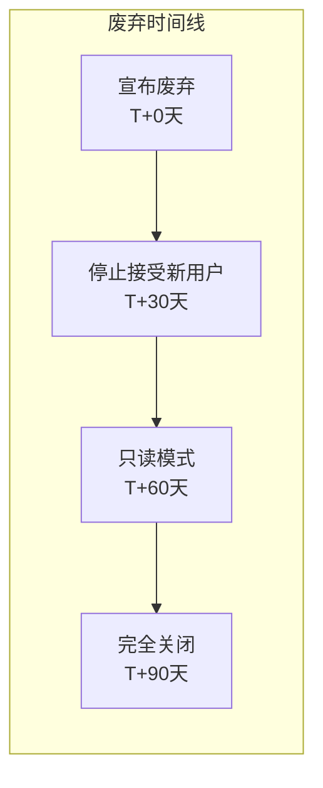
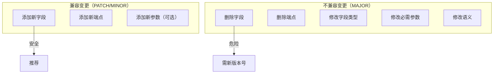
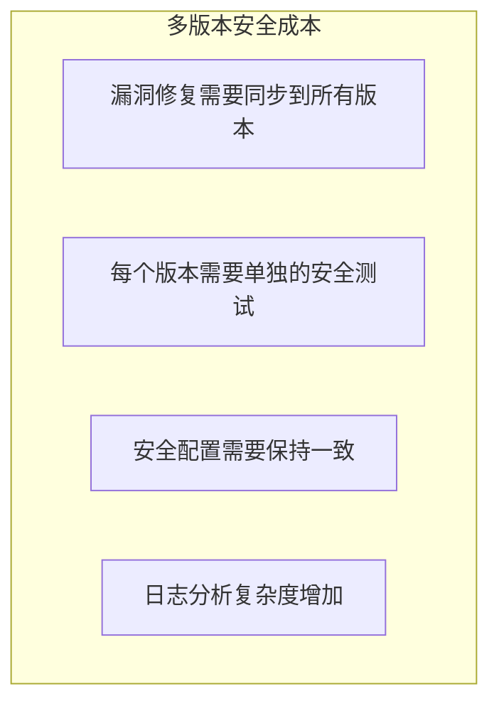
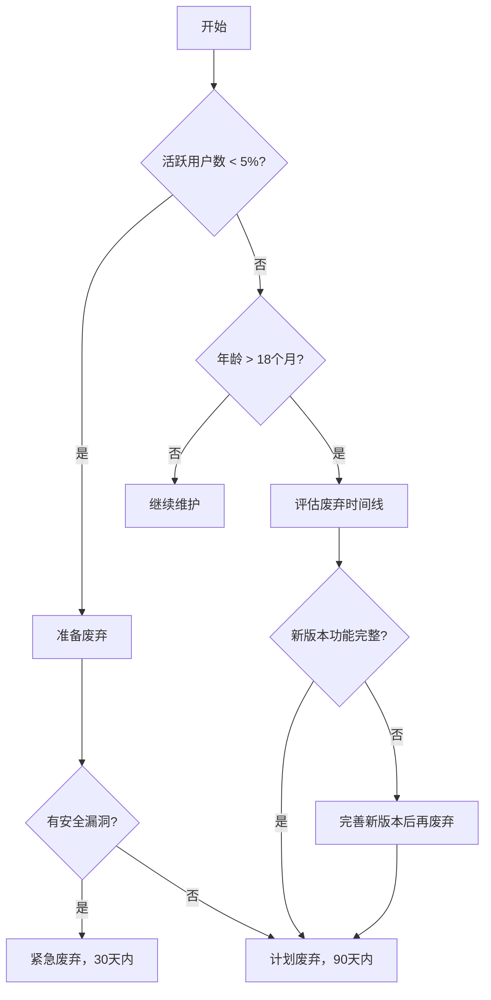

API 版本控制是 API 设计中最容易被忽视的环节之一。很多团队在 API 初期快速迭代，但随着时间推移，「旧版本」成了历史包袱——维护它需要成本，废弃它需要时间，而攻击者往往利用旧版本中未修复的漏洞发起攻击。

2019 年，某社交平台因旧版本 API 的认证漏洞导致数据泄露，受影响用户超过 5000 万。调查显示，该漏洞已在新版 API 中修复，但旧版本因为「还有一些老用户在用」一直没有更新。这个案例说明：**API 版本不仅是技术问题，更是安全问题**。

## API 版本控制策略

### 策略一：URL 路径版本（最常用）

将版本号直接放在 URL 路径中：

```http
GET /api/v1/users/123
GET /api/v2/users/123
```

**优点**：
- 版本信息一目了然
- 便于缓存
- 开发者易于理解和使用

**缺点**：
- 语义上不够「RESTful」（URL 应该表示资源，不是行为）
- 修改 URL 成本较高

### 策略二：Query 参数版本

将版本号作为查询参数传递：

```http
GET /api/users/123?version=1
GET /api/users/123?version=2
```

**优点**：
- 同一资源 URL 保持不变
- 便于 A/B 测试

**缺点**：
- 参数可能被忽略
- 不便于缓存
- 语义不够清晰

### 策略三：Header 版本

通过 HTTP Header 指定版本：

```http
GET /api/users/123
Accept: application/vnd.example.v1+json

GET /api/users/123
Accept: application/vnd.example.v2+json
```

**优点**：
- URL 保持简洁
- 符合内容协商（Content Negotiation）理念

**缺点**：
- 开发者体验较差（需要额外设置 Header）
- 调试困难
- 可能被中间层忽略

### 版本策略对比

| 策略 | 可见性 | 缓存友好 | 开发体验 | 推荐场景 |
| --- | --- | --- | --- | --- |
| URL 路径 | 高 | ✓ | 好 | 公开 API |
| Query 参数 | 中 | ✗ | 中 | 内部 API |
| Header | 低 | ✓ | 差 | 追求语义 |

**推荐**：公开 API 使用 URL 路径版本，内部 API 可根据团队偏好选择。

## 版本控制的安全考虑

### 旧版本的安全维护

当一个 API 版本被废弃后，**必须明确废弃时间线**：



```java title="ApiVersionController.java"
@RestController
@RequestMapping("/api/v1")
public class ApiV1Controller {
    
    private static final Logger logger = LoggerFactory.getLogger(ApiV1Controller.class);
    
    // 检查 API v1 是否已废弃
    @Value("${api.v1.deprecated:true}")
    private boolean isDeprecated;
    
    @Value("${api.v1.readonly:false}")
    private boolean isReadOnly;
    
    @Value("${api.v1.blocked:false}")
    private boolean isBlocked;
    
    @GetMapping("/users/{id}")
    public ResponseEntity<?> getUser(@PathVariable Long id) {
        // 检查是否已完全关闭
        if (isBlocked) {
            return ResponseEntity.status(HttpStatus.GONE)
                .body(ApiErrorResponse.builder()
                    .code("API_DEPRECATED")
                    .message("API v1 has been deprecated. Please upgrade to v2.")
                    .upgradeUrl("/api/v2/users/" + id)
                    .build());
        }
        
        // 检查是否只读
        if (isReadOnly && request.getMethod().equals("POST")) {
            return ResponseEntity.status(HttpStatus.METHOD_NOT_ALLOWED)
                .body(ApiErrorResponse.builder()
                    .code("READ_ONLY")
                    .message("API v1 is in read-only mode.")
                    .build());
        }
        
        // 记录废弃 API 访问
        if (isDeprecated) {
            logger.warn("Deprecated API v1 accessed: {} {}", 
                request.getMethod(), request.getRequestURI());
        }
        
        // 执行业务逻辑
        return userService.findById(id)
            .map(ResponseEntity::ok)
            .orElse(ResponseEntity.notFound().build());
    }
}
```

### 废弃通知机制

```java title="DeprecationNoticeService.java"
public class DeprecationNoticeService {
    
    private final EmailService emailService;
    private final ApiUsageRepository usageRepository;
    
    // 定期发送废弃通知
    @Scheduled(cron = "0 0 9 * * ?") // 每天上午9点
    public void sendDeprecationNotices() {
        List<ApiClient> affectedClients = usageRepository
            .findClientsUsingVersion("v1");
        
        for (ApiClient client : affectedClients) {
            long daysRemaining = calculateDaysRemaining(client);
            
            // 根据剩余时间调整通知强度
            if (daysRemaining <= 7) {
                sendUrgentNotice(client, daysRemaining);
            } else if (daysRemaining <= 30) {
                sendWarningNotice(client, daysRemaining);
            }
        }
    }
    
    private void sendUrgentNotice(ApiClient client, long daysRemaining) {
        EmailContent content = EmailContent.builder()
            .subject("[紧急] API v1 即将停用 - 剩余 " + daysRemaining + " 天")
            .body(buildUrgentBody(client, daysRemaining))
            .build();
        
        emailService.send(client.getContactEmail(), content);
    }
    
    private String buildUrgentBody(ApiClient client, long daysRemaining) {
        return String.format("""
            尊敬的 %s 用户：
            
            您的应用（App ID: %s）仍在使用即将废弃的 API v1。
            
            请注意：API v1 将在 %d 天后完全关闭。
            
            迁移指南：%s
            
            如有疑问，请联系：api-support@example.com
            """,
            client.getName(),
            client.getAppId(),
            daysRemaining,
            MIGRATION_GUIDE_URL
        );
    }
}
```

### 版本兼容性管理

主版本号变更通常意味着**不兼容的变更**，需要谨慎处理：



```java title="CompatibilityChecker.java"
public class CompatibilityChecker {
    
    // API 兼容性问题检测
    public List<CompatibilityIssue> checkCompatibility(
            ApiSpec oldSpec, ApiSpec newSpec) {
        
        List<CompatibilityIssue> issues = new ArrayList<>();
        
        // 检查字段变更
        for (Field field : newSpec.getFields()) {
            Field oldField = oldSpec.getField(field.getName());
            
            if (oldField == null) {
                // 新字段，兼容
                continue;
            }
            
            // 检查类型变更
            if (!field.getType().equals(oldField.getType())) {
                issues.add(CompatibilityIssue.builder()
                    .type(IssueType.TYPE_CHANGE)
                    .field(field.getName())
                    .oldType(oldField.getType())
                    .newType(field.getType())
                    .breaking(true)
                    .build());
            }
            
            // 检查必需性变更
            if (!field.isRequired() && oldField.isRequired()) {
                // 从必需变为可选，兼容
                continue;
            }
            if (field.isRequired() && !oldField.isRequired()) {
                issues.add(CompatibilityIssue.builder()
                    .type(IssueType.REQUIRED_CHANGE)
                    .field(field.getName())
                    .breaking(true)
                    .build());
            }
            
            // 检查删除
            if (field.isDeprecated() && !oldField.isDeprecated()) {
                issues.add(CompatibilityIssue.builder()
                    .type(IssueType.DEPRECATION)
                    .field(field.getName())
                    .breaking(false)
                    .build());
            }
        }
        
        // 检查删除的字段
        for (Field field : oldSpec.getFields()) {
            if (newSpec.getField(field.getName()) == null) {
                issues.add(CompatibilityIssue.builder()
                    .type(IssueType.FIELD_REMOVED)
                    .field(field.getName())
                    .breaking(true)
                    .build());
            }
        }
        
        return issues;
    }
}
```

### 版本间的认证差异处理

不同版本的 API 可能使用不同的认证方式，需要统一处理：

```java title="MultiVersionAuthFilter.java"
public class MultiVersionAuthFilter implements Filter {
    
    private final Map<String, Authenticator> authenticators = Map.of(
        "v1", new V1ApiKeyAuthenticator(),
        "v2", new V2JwtAuthenticator(),
        "v3", new V3OAuth2Authenticator()
    );
    
    @Override
    public void doFilter(ServletRequest request, ServletResponse response,
                        FilterChain chain) throws IOException, ServletException {
        
        HttpServletRequest httpRequest = (HttpServletRequest) request;
        String version = extractVersion(httpRequest.getRequestURI());
        
        if (version == null) {
            sendError(response, HttpServletResponse.SC_BAD_REQUEST, 
                "API version not specified");
            return;
        }
        
        Authenticator authenticator = authenticators.get(version);
        if (authenticator == null) {
            sendError(response, HttpServletResponse.SC_NOT_FOUND,
                "API version not supported: " + version);
            return;
        }
        
        // 使用对应版本的认证器
        AuthResult result = authenticator.authenticate(httpRequest);
        if (!result.isAuthenticated()) {
            sendError(response, HttpServletResponse.SC_UNAUTHORIZED,
                result.getErrorMessage());
            return;
        }
        
        // 将认证信息传递给后续处理
        request.setAttribute("authContext", result.getContext());
        chain.doFilter(request, response);
    }
}
```

### 灰度发布与版本路由

新版本 API 的发布通常采用灰度策略，逐步将流量从旧版本切换到新版本：

```java title="VersionRouter.java"
public class VersionRouter {
    
    private final PercentageBasedRouter router;
    private final Map<String, String> clientOverrides; // 客户端自定义路由
    
    public VersionRouter() {
        // 初始配置：90% 流量到 v2，10% 到 v3
        this.router = new PercentageBasedRouter(Map.of(
            "v2", 90,
            "v3", 10
        ));
        this.clientOverrides = new ConcurrentHashMap<>();
    }
    
    public String route(String clientId, String requestedVersion) {
        // 检查客户端自定义路由
        String override = clientOverrides.get(clientId);
        if (override != null) {
            return override;
        }
        
        // 检查请求的版本
        if (isVersionSupported(requestedVersion)) {
            // 白名单用户可以使用指定版本
            if (isWhitelisted(clientId)) {
                return requestedVersion;
            }
        }
        
        // 使用灰度路由
        return router.route(clientId);
    }
    
    // 调整灰度比例
    public void adjustWeights(Map<String, Integer> newWeights) {
        router.updateWeights(newWeights);
        logger.info("灰度路由比例已更新: {}", newWeights);
    }
}
```

```java title="GrayReleaseController.java"
@RestController
@RequestMapping("/admin/gray-release")
public class GrayReleaseController {
    
    @PutMapping("/weights")
    public ResponseEntity<?> updateWeights(
            @RequestBody GrayReleaseConfig config) {
        
        // 验证新配置
        validateWeights(config.getWeights());
        
        // 更新路由配置
        versionRouter.adjustWeights(config.getWeights());
        
        // 记录变更
        auditLogger.log("Gray release weights updated", 
            AuditDetails.builder()
                .action("WEIGHT_UPDATE")
                .oldWeights(currentWeights)
                .newWeights(config.getWeights())
                .operator(getCurrentUser())
                .build());
        
        return ResponseEntity.ok(Map.of(
            "status", "success",
            "new_weights", config.getWeights()
        ));
    }
}
```

## 多版本并存的安全成本

维护多个 API 版本不是免费的，每多维护一个版本，都意味着额外的成本：

### 安全维护成本



```java title="SecurityPatchSynchronizer.java"
public class SecurityPatchSynchronizer {
    
    private final ApiVersionRepository versionRepository;
    private final SecurityScanner securityScanner;
    private final AlertService alertService;
    
    // 发现安全漏洞后，同步到所有活跃版本
    public void syncSecurityPatch(SecurityPatch patch, String affectedVersion) {
        List<String> activeVersions = versionRepository
            .findActiveVersions();
        
        for (String version : activeVersions) {
            if (version.equals(affectedVersion)) {
                // 已在受影响版本中修复
                continue;
            }
            
            // 检查该版本是否也受影响
            if (isAffected(version, patch)) {
                logger.info("Applying security patch {} to version {}", 
                    patch.getId(), version);
                
                // 应用补丁
                applyPatch(version, patch);
                
                // 验证修复
                verifyPatch(version, patch);
                
                // 通知用户
                notifyUsers(version, patch);
            }
        }
    }
}
```

### 运营成本

```java title="VersionMaintenanceCostTracker.java"
public class VersionMaintenanceCostTracker {
    
    public VersionMaintenanceReport generateReport() {
        List<ApiVersion> versions = versionRepository.findAll();
        
        List<VersionCost> costs = versions.stream()
            .map(this::calculateCost)
            .sorted(Comparator.comparing(VersionCost::getTotalCost).reversed())
            .toList();
        
        return VersionMaintenanceReport.builder()
            .versionCosts(costs)
            .totalCost(costs.stream()
                .mapToDouble(VersionCost::getTotalCost)
                .sum())
            .recommendation(generateRecommendation(costs))
            .build();
    }
    
    private VersionCost calculateCost(ApiVersion version) {
        double infraCost = calculateInfraCost(version);
        double securityCost = calculateSecurityCost(version);
        double supportCost = calculateSupportCost(version);
        double opportunityCost = version.getActiveUsers() * 0.1; // 维护旧版本的研发成本
        
        return VersionCost.builder()
            .version(version.getName())
            .infraCost(infraCost)
            .securityCost(securityCost)
            .supportCost(supportCost)
            .opportunityCost(opportunityCost)
            .activeUsers(version.getActiveUsers())
            .recommendation(generateVersionRecommendation(version))
            .build();
    }
    
    private String generateVersionRecommendation(ApiVersion version) {
        if (version.getActiveUsers() < 100) {
            return "建议立即废弃";
        }
        if (version.getAgeInDays() > 365) {
            return "已过维护周期，建议废弃";
        }
        if (version.hasUnfixedVulnerabilities()) {
            return "存在未修复漏洞，必须升级";
        }
        return "继续维护";
    }
}
```

### 版本废弃决策树



## 版本控制与文档管理

### 版本化 API 文档

```java title="ApiDocumentGenerator.java"
public class ApiDocumentGenerator {
    
    public ApiDocumentation generate(String version) {
        ApiSpec spec = apiSpecRepository.findByVersion(version);
        
        return ApiDocumentation.builder()
            .version(version)
            .baseUrl(config.getBaseUrl(version))
            .authentication(spec.getAuthType().name())
            .endpoints(generateEndpointDocs(spec))
            .changelog(generateChangelog(version))
            .migrationGuide(generateMigrationGuide(version))
            .deprecationNotice(spec.getDeprecationInfo())
            .build();
    }
    
    private MigrationGuide generateMigrationGuide(String version) {
        String previousVersion = getPreviousVersion(version);
        if (previousVersion == null) {
            return null;
        }
        
        List<MigrationStep> steps = new ArrayList<>();
        
        // 分析兼容性差异
        CompatibilityDiff diff = compatibilityAnalyzer
            .compare(previousVersion, version);
        
        for (Field field : diff.getRemovedFields()) {
            steps.add(MigrationStep.builder()
                .type(REMOVED)
                .description("字段 " + field.getName() + " 已移除")
                .action("移除对该字段的引用")
                .breaking(true)
                .build());
        }
        
        for (Field field : diff.getChangedFields()) {
            steps.add(MigrationStep.builder()
                .type(CHANGED)
                .description("字段 " + field.getName() + " 类型变更")
                .oldType(field.getOldType())
                .newType(field.getNewType())
                .action(getMigrationAction(field))
                .breaking(true)
                .build());
        }
        
        return MigrationGuide.builder()
            .fromVersion(previousVersion)
            .toVersion(version)
            .steps(steps)
            .estimatedEffort(calculateEffort(steps))
            .build();
    }
}
```

## 思考题

**问题 1**：在 API 版本控制中，「URL 路径版本」和「Header 版本」各有什么安全优势和安全风险？

<details>
<summary>参考答案</summary>

**URL 路径版本**：

| 维度 | 分析 |
| --- | --- |
| **安全优势** | 版本一目了然，便于 WAF/网关统一配置安全规则 |
| **安全优势** | 便于日志分析和异常检测 |
| **安全风险** | 版本信息可能在 URL 中泄露（浏览器历史、服务器日志） |
| **安全风险** | 攻击者可以通过修改 URL 探索不同版本的漏洞 |

**Header 版本**：

| 维度 | 分析 |
| --- | --- |
| **安全优势** | 版本信息不在 URL 中，减少信息泄露 |
| **安全优势** | 便于隐藏内部版本号 |
| **安全风险** | 可能被中间层（代理、CDN）忽略或修改 |
| **安全风险** | 开发调试时容易被遗漏 |

**最佳实践**：根据场景选择
- **公开 API**：URL 路径版本，透明可见
- **内部 API**：Header 版本，减少信息泄露
- **混合方案**：URL 公开版本，Header 可指定精确版本
</details>

**问题 2**：如何设计一个「智能版本废弃」系统，根据用户行为自动调整废弃策略？

<details>
<summary>参考答案</summary>

**智能版本废弃系统设计**：

```java title="SmartDeprecationManager.java"
public class SmartDeprecationManager {
    
    private final UsageTracker usageTracker;
    private final MigrationAssistanceService migrationHelper;
    private final NotificationService notificationService;
    
    // 每日评估废弃策略
    @Scheduled(cron = "0 0 10 * * ?")
    public void evaluateDeprecationStrategy() {
        List<DeprecatedVersion> deprecatedVersions = versionRepository
            .findDeprecatedVersions();
        
        for (DeprecatedVersion version : deprecatedVersions) {
            VersionMetrics metrics = calculateMetrics(version);
            
            // 评估是否需要调整废弃时间线
            if (metrics.getActiveUsers() < 10) {
                // 活跃用户极少，加快废弃
                accelerateDeprecation(version, metrics);
            }
            
            if (metrics.getMigrationProgress() < 0.5 && 
                metrics.getDaysUntilShutdown() < 14) {
                // 迁移进度慢，延长废弃时间
                extendDeprecation(version, metrics);
            }
            
            // 为落后用户提供一对一帮助
            identifyStrugglingClients(version);
        }
    }
    
    private void identifyStrugglingClients(DeprecatedVersion version) {
        List<ClientMetrics> clients = usageTracker.getClients(version);
        
        for (ClientMetrics client : clients) {
            // 检测是否尝试迁移但遇到问题
            if (client.getMigrationAttempts() > 0 && 
                client.getMigrationSuccessRate() < 0.3) {
                
                // 发送一对一协助通知
                notificationService.sendPersonalizedAssistance(
                    client.getContactEmail(),
                    version,
                    migrationHelper.generatePersonalizedGuide(client)
                );
            }
        }
    }
}
```

**关键指标**：

1. **活跃用户趋势**：上升/下降/平稳
2. **迁移进度**：已完成迁移用户的百分比
3. **技术支持请求率**：遇到迁移问题的用户比例
4. **安全漏洞暴露时间**：未修复漏洞的版本用户数
</details>

**问题 3**：在微服务架构中，如何协调多个服务之间的 API 版本控制？

<details>
<summary>参考答案</summary>

**微服务版本的挑战**：

1. **服务间依赖**：服务 A 的 v1.0 可能依赖服务 B 的 v2.0
2. **版本矩阵爆炸**：N 个服务可能有 N×N 种兼容组合
3. **一致性要求**：一次请求可能涉及多个服务，版本必须协调

**解决方案：版本协商机制**：

```java title="ServiceVersionNegotiator.java"
public class ServiceVersionNegotiator {
    
    // 服务注册中心维护版本兼容性图
    private final Map<String, Map<String, CompatibilityInfo>> compatibilityGraph;
    
    // 请求入口时，确定这次请求使用的版本组合
    public VersionContext negotiateVersion(RequestContext request) {
        String callerService = request.getCallerService();
        String callerVersion = request.getCallerVersion();
        String targetService = request.getTargetService();
        
        // 查找兼容的目标版本
        String targetVersion = findCompatibleVersion(
            callerService, callerVersion, targetService);
        
        if (targetVersion == null) {
            throw new IncompatibleVersionException(
                "No compatible version found for " + 
                callerService + " v" + callerVersion + 
                " calling " + targetService);
        }
        
        // 返回版本上下文
        return VersionContext.builder()
            .callerService(callerService)
            .callerVersion(callerVersion)
            .targetService(targetService)
            .targetVersion(targetVersion)
            .build();
    }
    
    // 版本兼容性规则
    public boolean isCompatible(String fromService, String fromVersion,
                              String toService, String toVersion) {
        // 语义化版本兼容：PATCH 版本变化兼容
        // MINOR 版本变化向前兼容
        // MAJOR 版本变化不兼容
        
        return compatibilityGraph
            .getOrDefault(fromService + "->" + toService, Map.of())
            .getOrDefault(fromVersion, CompatibilityInfo.NONE)
            .supports(toVersion);
    }
}
```

**服务网格方案**：

使用 Istio/Linkerd 等服务网格，在基础设施层处理版本路由：

```yaml title="istio-virtual-service.yaml"
apiVersion: networking.istio.io/v1alpha3
kind: VirtualService
metadata:
  name: user-service
spec:
  hosts:
  - user-service
  http:
  - match:
    - headers:
        x-canary:
          exact: "true"
    route:
    - destination:
        host: user-service
        subset: v3  # 10% 灰度到 v3
      weight: 10
    - route:
      - destination:
          host: user-service
          subset: v2  # 90% 保持 v2
        weight: 90
```
</details>
