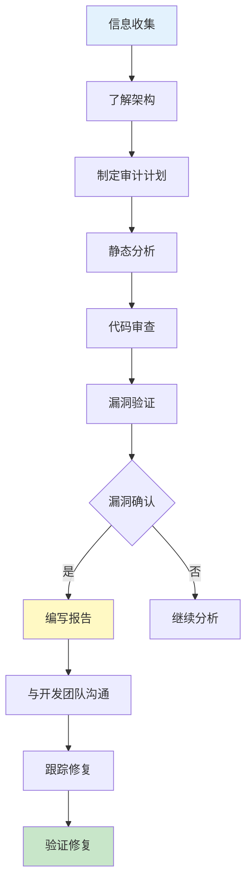

2018年，某互联网公司被曝出用户数据泄露事件。调查结果显示：泄露的根源不在于服务器被入侵，而在于代码中的一个 SQL 查询——某开发人员为了「快速解决问题」，直接拼接了用户输入。

这个漏洞被发现了无数次。OWASP Top 10 从 2013 年就把「注入」列为 Web 应用安全的第一威胁，2017 年、2021 年的版本依然如此。

但它依然在发生。

代码审计的价值正在于此：**不是发现一个漏洞就解决一个问题，而是通过系统性审查，让团队建立对安全编码的认知，让类似的问题不再重复出现**。

## 一、安全代码审计的目标与方法

### 1.1 审计目标

安全代码审计（Security Code Review）是通过对源代码进行系统性审查，发现并修复安全漏洞的过程：

| 目标 | 说明 |
|------|------|
| 发现漏洞 | 识别潜在的安全缺陷 |
| 评估风险 | 确定漏洞的严重程度和影响范围 |
| 指导修复 | 提供具体的修复建议 |
| 建立规范 | 识别团队的安全培训需求 |
| 合规要求 | 满足法规和行业标准的要求 |

### 1.2 审计方法对比

| 方法 | 人工审计 | 自动化工具 | 混合方法 |
|------|----------|------------|----------|
| 覆盖率 | 高（依赖经验） | 高（全量扫描） | 高 |
| 误报率 | 低 | 高 | 中 |
| 漏报率 | 中（依赖经验） | 低 | 低 |
| 效率 | 低 | 高 | 中 |
| 成本 | 高 | 低 | 中 |
| 发现逻辑漏洞 | 能 | 不能 | 能 |

**推荐方法**：以人工审计为主，工具扫描为辅。

### 1.3 审计流程



## 二、信息收集阶段

### 2.1 收集内容

| 信息类型 | 内容 | 用途 |
|----------|------|------|
| 代码仓库 | Git/SVN 地址、权限 | 获取源码 |
| 架构文档 | 系统架构图、技术栈 | 理解系统 |
| API 文档 | 接口定义、数据流 | 追踪数据 |
| 安全需求 | 安全功能需求文档 | 确定审计范围 |
| 历史漏洞 | 之前的漏洞报告 | 重点关注 |
| 测试用例 | 单元测试、集成测试 | 验证漏洞 |

### 2.2 审计范围确定

```java title="审计范围评估"
public class AuditScopeAssessment {
    
    public AuditScope determineScope(String projectType) {
        AuditScope scope = new AuditScope();
        
        // 高风险模块（必审）
        scope.mustAudit = Arrays.asList(
            "认证模块",           // 密码处理、Session 管理
            "授权模块",           // 权限校验、访问控制
            "支付模块",           // 资金处理、交易校验
            "用户数据模块",       // 个人信息、隐私数据
            "文件上传模块",       // 恶意文件上传
            "外部接口模块"       // 第三方集成
        );
        
        // 中风险模块（重点审）
        scope.shouldAudit = Arrays.asList(
            "搜索功能",           // SQL 注入、XSS
            "评论/发帖功能",      // XSS、敏感词
            "消息通知",           // 注入、敏感信息
            "文件导出",           // 路径遍历
            "报表功能"            // SQL 注入
        );
        
        // 低风险模块（抽查）
        scope.canAudit = Arrays.asList(
            "公开页面",
            "静态资源",
            "工具类",
            "配置类"
        );
        
        return scope;
    }
}
```

## 三、认证与授权审计要点

### 3.1 认证安全检查

```java title="认证模块审计清单"
public class AuthenticationAudit {
    
    // 检查点 1：密码存储
    public void auditPasswordStorage(String userDao) {
        // 检查是否使用了安全的哈希算法
        String unsafePattern = 
            "MessageDigest.getInstance(\"MD5\")";  // MD5 不安全
        String unsafePattern2 = 
            "MessageDigest.getInstance(\"SHA-1\")";  // SHA-1 不安全
        
        // 检查盐值
        boolean hasSalt = findCodeContain(userDao, "UUID.randomUUID()");
        boolean usesBcrypt = findCodeContain(userDao, "BCrypt.");
        boolean usesArgon2 = findCodeContain(userDao, "Argon2");
        
        if (!usesBcrypt && !usesArgon2) {
            addFinding("密码存储未使用 BCrypt 或 Argon2");
        }
    }
    
    // 检查点 2：密码强度
    public void auditPasswordPolicy(String registerMethod) {
        // 检查密码复杂度验证
        boolean hasMinLength = findCodeContain(registerMethod, "length() >= 8");
        boolean hasUpperCase = findCodeContain(registerMethod, "[A-Z]");
        boolean hasLowerCase = findCodeContain(registerMethod, "[a-z]");
        boolean hasDigit = findCodeContain(registerMethod, "[0-9]");
        boolean hasSpecial = findCodeContain(registerMethod, "[^a-zA-Z0-9]");
        
        if (!hasMinLength) {
            addFinding("未检查密码最小长度");
        }
    }
    
    // 检查点 3：认证失败处理
    public void auditFailedAuth(String loginMethod) {
        // 检查是否返回了过多信息
        boolean genericError = findCodeContain(loginMethod, 
            "\"用户名或密码错误\"");  // 好：通用错误
        
        // 检查是否锁定了账户
        boolean hasLockout = findCodeContain(loginMethod, "loginAttempts");
        boolean hasLockoutAction = findCodeContain(loginMethod, 
            "account.lock()");
        
        if (!hasLockout) {
            addFinding("未实现账户锁定机制");
        }
    }
    
    // 检查点 4：Session 管理
    public void auditSessionManagement(String sessionConfig) {
        // 检查 Session 超时
        boolean hasTimeout = findCodeContain(sessionConfig, 
            "setMaxInactiveInterval");
        
        // 检查 HttpOnly 标志
        boolean hasHttpOnly = findCodeContain(sessionConfig, "HttpOnly");
        
        // 检查 Secure 标志
        boolean hasSecure = findCodeContain(sessionConfig, "Secure");
        
        // 检查 Session 固定防护
        boolean hasRegeneration = findCodeContain(sessionConfig, 
            "invalidate()", "getSession(true)");
    }
}
```

### 3.2 授权安全检查

```java title="授权模块审计清单"
public class AuthorizationAudit {
    
    // 检查点 1：访问控制是否完整
    public void auditAccessControl(String controller) {
        // 检查每个接口是否有权限注解
        List<String> methods = extractMethods(controller);
        for (String method : methods) {
            boolean hasAuth = hasSecurityAnnotation(method);
            boolean isPublic = isPublicMethod(method);
            
            if (isPublic && !hasAuth) {
                addFinding("方法 " + method + " 缺少权限注解");
            }
        }
    }
    
    // 检查点 2：参数校验
    public void auditParameterValidation(String method) {
        // 检查是否验证了用户输入
        boolean validatesId = findCodeContain(method, 
            "userId", "id") && hasValidation(method);
        
        // 检查水平越权风险
        boolean checksOwnership = findCodeContain(method, 
            "userId == currentUser.getId()");
        
        if (!checksOwnership) {
            addFinding("可能存在水平越权风险");
        }
    }
    
    // 检查点 3：间接对象引用
    public void auditIndirectReferences(String method) {
        // 检查是否使用了直接的对象 ID
        // 攻击者可以遍历 ID 访问其他用户资源
        boolean usesDirectId = findCodeContain(method, 
            "request.getParameter(\"id\")");
        boolean hasMapping = findCodeContain(method, 
            "getResourceById");  // 服务器端映射
        
        if (usesDirectId && !hasMapping) {
            addFinding("可能存在 IDOR 漏洞（不安全的直接对象引用）");
        }
    }
}
```

### 3.3 常见认证授权漏洞

| 漏洞类型 | 风险等级 | 典型代码 | 修复方案 |
|----------|----------|----------|----------|
| 弱密码哈希 | 高 | `MD5(password)` | BCrypt/Argon2 |
| 硬编码密码 | 严重 | `"admin:123456"` | 环境变量/密钥管理 |
| 暴力破解无限制 | 高 | 无登录失败限制 | 账户锁定/验证码 |
| 敏感信息明文传输 | 高 | HTTP 传输密码 | HTTPS |
| Session 不超时 | 中 | 无 Session 失效 | 合理超时时间 |
| 垂直越权 | 高 | 无角色校验 | 基于角色的访问控制 |
| 水平越权 | 高 | 无资源所有权校验 | 资源所有权验证 |

## 四、输入验证与输出编码审计要点

### 4.1 输入验证检查

```java title="输入验证审计清单"
public class InputValidationAudit {
    
    // 检查点 1：是否验证所有输入源
    public void auditInputSources(String className) {
        // 检查所有可能的输入源
        String[] inputSources = {
            "getParameter(",      // HTTP 参数
            "getHeader(",         // HTTP 头
            "getInputStream()",   // 请求体
            "getCookies()",       // Cookie
            "@RequestBody",       // REST 请求体
            "PathVariable",        // URL 路径参数
            "@RequestParam"       // 查询参数
        };
        
        for (String source : inputSources) {
            if (findCodeContain(className, source)) {
                // 找到输入源，检查是否有验证
                String methodName = findMethodWithInput(className, source);
                boolean hasValidation = checkValidation(methodName);
                
                if (!hasValidation) {
                    addFinding("输入源 " + source + " 缺少验证");
                }
            }
        }
    }
    
    // 检查点 2：验证是否完整
    public void auditValidationCompleteness(String method) {
        // 白名单验证优于黑名单验证
        boolean usesBlacklist = findCodeContain(method, 
            "replace(\"<\", \"\")");  // 黑名单
        boolean usesWhitelist = findCodeContain(method, 
            "matches(\"[a-zA-Z0-9]+\")");  // 白名单
        
        if (usesBlacklist) {
            addFinding("使用黑名单验证，建议改用白名单");
        }
    }
    
    // 检查点 3：长度校验
    public void auditLengthValidation(String method) {
        boolean hasLengthCheck = findCodeContain(method, 
            "length()", "size()");
        boolean hasMaxLength = findCodeContain(method, 
            "<=", "MAX_");
        
        if (!hasLengthCheck) {
            addFinding("缺少长度校验，可能导致缓冲区溢出");
        }
    }
}
```

### 4.2 输出编码检查

```java title="输出编码审计清单"
public class OutputEncodingAudit {
    
    // 检查点 1：SQL 编码
    public void auditSqlEncoding(String method) {
        // 检查是否使用预编译
        boolean usesPreparedStatement = findCodeContain(method, 
            "PreparedStatement");
        
        // 检查 MyBatis 用法
        boolean usesSafeMybatis = findCodeContain(method, "#{");
        boolean usesUnsafeMybatis = findCodeContain(method, "${");
        
        // 检查 Hibernate 用法
        boolean usesHibernateParam = findCodeContain(method, ":");
        
        if (usesUnsafeMybatis) {
            addFinding("MyBatis 使用了不安全的 ${} 语法");
        }
        
        if (!usesPreparedStatement && !usesSafeMybatis && !usesHibernateParam) {
            addFinding("存在 SQL 注入风险，应使用参数化查询");
        }
    }
    
    // 检查点 2：HTML/JS 编码
    public void auditHtmlEncoding(String method) {
        // 检查是否进行了 HTML 转义
        boolean hasEscapeHtml = findCodeContain(method, 
            "StringEscapeUtils.escapeHtml");
        boolean hasTemplateEscape = findCodeContain(method, 
            "Thymeleaf", "FreeMarker");
        
        // 检查是否使用 Thymeleaf（默认安全）
        boolean usesThymeleaf = findCodeContain(method, "@{}");
        
        if (!hasEscapeHtml && !hasTemplateEscape && !usesThymeleaf) {
            addFinding("可能存在 XSS 风险");
        }
    }
    
    // 检查点 3：JSON 编码
    public void auditJsonEncoding(String method) {
        // 检查是否使用了安全的 JSON 库
        boolean usesJackson = findCodeContain(method, 
            "ObjectMapper");
        boolean hasXssProtection = findCodeContain(method, 
            "JsonGenerator.Feature.ESCAPE_NON_ASCII");
    }
}
```

### 4.3 常见注入漏洞模式

| 注入类型 | 危险代码模式 | 安全模式 |
|----------|--------------|----------|
| SQL 注入 | `String.format("SELECT * FROM %s", table)` | `PreparedStatement` |
| NoSQL 注入 | `collection.find("{user: " + input + "}")` | 参数化查询 |
| 命令注入 | `Runtime.exec(cmd + args)` | 白名单 + 转义 |
| LDAP 注入 | `searchFilter = "(uid=" + user + ")"` | 转义特殊字符 |
| XPath 注入 | `xpath.compile("//user[name='" + name + "']")` | 参数化查询 |
| XSS | `response.getWriter().write(input)` | HTML 转义 |

## 五、加密与密钥管理审计要点

### 5.1 加密算法检查

```java title="加密算法审计清单"
public class CryptographyAudit {
    
    // 检查点 1：对称加密算法
    public void auditSymmetricEncryption(String method) {
        // 不安全的算法
        String[] unsafeAlgorithms = {
            "DES",      // 56 位密钥，太短
            "RC4",      // 已被攻破
            "ECB"       // 模式不使用 IV
        };
        
        for (String alg : unsafeAlgorithms) {
            if (findCodeContain(method, alg)) {
                addFinding("使用了不安全的对称加密算法: " + alg);
            }
        }
        
        // 安全算法
        String[] safeAlgorithms = {"AES-256-GCM", "AES-256-CBC", "ChaCha20"};
        boolean usesSafe = false;
        for (String alg : safeAlgorithms) {
            if (findCodeContain(method, alg)) {
                usesSafe = true;
            }
        }
        
        if (!usesSafe) {
            addFinding("建议使用 AES-256-GCM 或 ChaCha20");
        }
    }
    
    // 检查点 2：密钥长度
    public void auditKeyLength(String method) {
        // 检查密钥生成
        boolean checksKeyLength = findCodeContain(method, "keyGen.initialize(256)");
        
        if (!checksKeyLength) {
            addFinding("未指定密钥长度或密钥长度不足");
        }
    }
    
    // 检查点 3：哈希算法
    public void auditHashAlgorithm(String method) {
        String[] unsafeHash = {"MD5", "SHA-1"};
        for (String hash : unsafeHash) {
            if (findCodeContain(method, hash)) {
                addFinding("使用了不安全的哈希算法: " + hash);
            }
        }
        
        String[] safeHash = {"SHA-256", "SHA-384", "SHA-512", "BCrypt", "Argon2"};
        // 密码哈希应使用 BCrypt 或 Argon2
    }
}
```

### 5.2 密钥管理检查

```java title="密钥管理审计清单"
public class KeyManagementAudit {
    
    // 检查点 1：硬编码密钥
    public void auditHardcodedKeys(String project) {
        // 检查源代码中是否有密钥字面量
        Pattern[] keyPatterns = {
            Pattern.compile("\"[a-f0-9]{32,}\""),  // 十六进制密钥
            Pattern.compile("\"[A-Za-z0-9+/=]{16,}\""),  // Base64 密钥
            Pattern.compile("private\\s+static\\s+final\\s+String\\s+KEY\\s*=")
        };
        
        for (Pattern pattern : keyPatterns) {
            List<String> matches = findMatches(project, pattern);
            if (!matches.isEmpty()) {
                addFinding("发现疑似硬编码密钥: " + matches);
            }
        }
    }
    
    // 检查点 2：密钥存储
    public void auditKeyStorage(String config) {
        // 检查配置文件
        boolean keysInConfig = findCodeContain(config, "encryption.key");
        boolean keysInEnv = findCodeContain(config, "System.getenv");
        boolean usesVault = findCodeContain(config, "HashiCorp Vault");
        boolean usesKms = findCodeContain(config, "AWS KMS");
        
        if (keysInConfig) {
            addFinding("密钥存储在配置文件中，建议使用密钥管理服务");
        }
    }
    
    // 检查点 3：密钥轮换
    public void auditKeyRotation(String keyManagement) {
        boolean hasRotation = findCodeContain(keyManagement, 
            "rotate", "re-encrypt");
        
        if (!hasRotation) {
            addFinding("建议实现密钥轮换机制");
        }
    }
}
```

### 5.3 敏感数据处理检查

```java title="敏感数据审计清单"
public class SensitiveDataAudit {
    
    // 检查点 1：敏感数据脱敏
    public void auditDataMasking(String method) {
        // 检查日志中的敏感数据
        String[] sensitiveFields = {
            "password", "creditCard", "ssn", "idCard",
            "phone", "email", "address", "balance"
        };
        
        for (String field : sensitiveFields) {
            boolean inLogs = findCodeContain(method, "logger", field);
            boolean isMasked = findCodeContain(method, "mask", "***");
            
            if (inLogs && !isMasked) {
                addFinding("敏感字段 " + field + " 可能被记录到日志");
            }
        }
    }
    
    // 检查点 2：密码不回显
    public void auditPasswordEcho(String form) {
        boolean hasPasswordField = findCodeContain(form, 
            "input.*type.*password", "PasswordField");
        boolean returnsPassword = findCodeContain(form, 
            "getPassword()", "password");
        
        // 密码不应该出现在响应中
        if (returnsPassword) {
            addFinding("响应中包含密码信息");
        }
    }
}
```

## 六、日志与错误处理审计要点

### 6.1 日志安全检查

```java title="日志安全审计清单"
public class LoggingAudit {
    
    // 检查点 1：敏感信息泄露
    public void auditSensitiveDataInLogs(String className) {
        String[] sensitivePatterns = {
            "password", "token", "secret", "key",
            "Authorization", "Bearer", "Cookie",
            "creditCard", "ssn", "account"
        };
        
        for (String pattern : sensitivePatterns) {
            boolean inLog = findCodeContain(className, 
                "log.", pattern);
            boolean isMasked = findCodeContain(className, 
                "mask()", "***");
            
            if (inLog && !isMasked) {
                addFinding("敏感信息 " + pattern + " 被写入日志");
            }
        }
    }
    
    // 检查点 2：日志伪造防护
    public void auditLogInjection(String method) {
        // 检查用户输入是否直接写入日志
        boolean userInputInLog = findCodeContain(method, 
            "log.info", "log.debug");
        
        if (userInputInLog) {
            // 检查是否有转义
            boolean hasEscape = findCodeContain(method, 
                "replace(\"\\n\", \"\")", "sanitize");
            
            if (!hasEscape) {
                addFinding("存在日志注入风险，用户输入未转义");
            }
        }
    }
    
    // 检查点 3：审计日志完整性
    public void auditAuditLogging(String method) {
        // 检查是否有审计日志
        boolean hasAuditLog = findCodeContain(method, 
            "AuditLog", "SecurityLog");
        
        // 检查是否记录了关键操作
        String[] criticalActions = {
            "login", "logout", "password", "delete",
            "permission", "role", "config"
        };
        
        for (String action : criticalActions) {
            if (findCodeContain(method, action) && !hasAuditLog) {
                addFinding("关键操作 " + action + " 未记录审计日志");
            }
        }
    }
}
```

### 6.2 错误处理检查

```java title="错误处理审计清单"
public class ErrorHandlingAudit {
    
    // 检查点 1：堆栈信息泄露
    public void auditStackTraceExposure(String method) {
        // 检查异常处理
        boolean catchesException = findCodeContain(method, 
            "catch", "Exception");
        boolean logsStackTrace = findCodeContain(method, 
            "e.printStackTrace()", "logger.error(e)");
        boolean returnsStackTrace = findCodeContain(method, 
            "response.getWriter().write", "stackTrace");
        
        if (returnsStackTrace) {
            addFinding("堆栈信息可能被返回给用户");
        }
    }
    
    // 检查点 2：自定义错误页面
    public void auditCustomErrorPage(String config) {
        boolean hasErrorPage = findCodeContain(config, 
            "error-page", "ErrorController");
        
        if (!hasErrorPage) {
            addFinding("未配置自定义错误页面");
        }
    }
    
    // 检查点 3：资源泄露
    public void auditResourceCleanup(String method) {
        // 检查是否关闭了资源
        boolean opensStream = findCodeContain(method, 
            "new FileInputStream", "new Connection");
        boolean closesStream = findCodeContain(method, 
            "close()", "try-with-resources");
        
        if (opensStream && !closesStream) {
            addFinding("资源可能未正确关闭");
        }
    }
}
```

## 七、常见高危漏洞模式

### 7.1 漏洞模式速查表

| 漏洞类型 | 危险模式 | 风险等级 | CVSS |
|----------|----------|----------|------|
| SQL 注入 | `Statement.executeQuery(sql)` | 严重 | 9.8 |
| 命令注入 | `Runtime.exec(cmd)` | 严重 | 9.8 |
| 反序列化 | `ObjectInputStream.readObject()` | 严重 | 9.8 |
| 路径遍历 | `new File(path + userInput)` | 高 | 8.6 |
| XSS 存储型 | 直接输出用户输入 | 高 | 8.1 |
| 认证绕过 | 缺少权限检查 | 高 | 8.0 |
| 敏感信息泄露 | 日志记录密码 | 高 | 7.5 |
| CSRF | 无 Token 验证 | 中 | 6.5 |
| URL 重定向 | 动态重定向 | 中 | 6.1 |

### 7.2 反序列化漏洞检查

```java title="反序列化审计要点"
public class DeserializationAudit {
    
    public void auditDeserialization(String className) {
        // 检查点 1：Java 反序列化
        String[] unsafeDeserialization = {
            "ObjectInputStream",
            "readObject()",
            "readUnshared()",
            "XMLDecoder",
            "XStream.fromXML"
        };
        
        for (String pattern : unsafeDeserialization) {
            if (findCodeContain(className, pattern)) {
                // 检查是否有白名单
                boolean hasValidation = findCodeContain(className, 
                    "ObjectInputStream", "validateObject");
                
                if (!hasValidation) {
                    addFinding("存在不安全的反序列化风险");
                }
            }
        }
        
        // 检查点 2：JSON 反序列化
        boolean usesFastjson = findCodeContain(className, "Fastjson");
        if (usesFastjson) {
            addFinding("Fastjson 存在已知漏洞，建议使用 Jackson");
        }
    }
}
```

## 八、代码审计工具辅助

### 8.1 静态分析工具

| 工具 | 语言 | 类型 | 特点 |
|------|------|------|------|
| SonarQube | 多语言 | 商业/开源 | 全面覆盖 |
| Checkmarx | 多语言 | 商业 | 精确度高 |
| Fortify | 多语言 | 商业 | 企业级 |
| Semgrep | 多语言 | 开源 | 规则编写灵活 |
| CodeQL | 多语言 | 开源 | 查询能力强 |
| SpotBugs | Java | 开源 | 免费 |

### 8.2 工具与人工结合

```java title="审计策略"
public class HybridAuditStrategy {
    
    public void runAudit(String projectPath) {
        // 第一阶段：工具扫描
        List<String> toolFindings = runStaticAnalysis(projectPath);
        
        // 第二阶段：人工审查重点代码
        List<String> criticalPaths = Arrays.asList(
            "security/",      // 安全模块
            "controller/",    // API 接口
            "service/",       // 业务逻辑
            "dao/",           // 数据访问
            "util/",          // 工具类（可能被滥用）
            "config/"         // 配置类（可能有硬编码）
        );
        
        for (String path : criticalPaths) {
            manualReview(path);
        }
        
        // 第三阶段：关联分析
        List<String> confirmedFindings = correlateFindings(
            toolFindings, manualFindings);
        
        // 第四阶段：风险评估
        for (String finding : confirmedFindings) {
            RiskLevel risk = assessRisk(finding);
            if (risk >= RiskLevel.HIGH) {
                addToReport(finding, risk);
            }
        }
    }
}
```

## 九、审计报告撰写

### 9.1 报告结构

```java title="审计报告模板"
public class AuditReport {
    
    public String generateReport(AuditResults results) {
        StringBuilder report = new StringBuilder();
        
        // 1. 执行摘要
        report.append("# 安全代码审计报告\n\n");
        report.append("## 执行摘要\n");
        report.append("- 审计范围：").append(results.scope).append("\n");
        report.append("- 代码总量：").append(results.totalLines).append(" 行\n");
        report.append("- 发现漏洞：").append(results.totalFindings).append(" 个\n");
        report.append("- 高危漏洞：").append(results.criticalFindings).append(" 个\n");
        report.append("- 审计时间：").append(results.auditDate).append("\n");
        
        // 2. 漏洞统计
        report.append("\n## 漏洞统计\n");
        report.append("| 严重程度 | 数量 | 占比 |\n");
        report.append("|----------|------|------|\n");
        report.append("| 严重 | ").append(results.critical).append(" | ")
              .append(calculatePercent(results.critical, results.total)).append(" |\n");
        
        // 3. 详细发现
        report.append("\n## 详细发现\n");
        for (Finding finding : results.findings) {
            report.append("### ").append(finding.id)
                  .append(": ").append(finding.title).append("\n");
            report.append("- **文件**：`").append(finding.file).append("`\n");
            report.append("- **行号**：`").append(finding.line).append("`\n");
            report.append("- **严重程度**：`").append(finding.severity).append("`\n");
            report.append("- **漏洞描述**：\n").append(finding.description).append("\n");
            report.append("- **修复建议**：\n").append(finding.recommendation).append("\n");
        }
        
        return report.toString();
    }
}
```

### 9.2 漏洞报告模板

```markdown
## 漏洞报告模板

### 漏洞 ID
VULN-2024-001

### 漏洞标题
SQL 注入漏洞 - 用户登录接口

### 严重程度
**严重** (CVSS 9.8)

### 漏洞位置
- 文件：`src/main/java/com/example/controller/LoginController.java`
- 方法：`authenticate()`
- 行号：45-52

### 漏洞描述
用户登录接口存在 SQL 注入漏洞。攻击者可以通过构造特殊的用户名绕过认证。

### 漏洞代码
```java
// 漏洞代码
String sql = "SELECT * FROM users WHERE username = '" + username + "'";
Statement stmt = connection.createStatement();
ResultSet rs = stmt.executeQuery(sql);
```

### 修复建议
```java
// 修复后代码
String sql = "SELECT * FROM users WHERE username = ?";
PreparedStatement ps = connection.prepareStatement(sql);
ps.setString(1, username);
ResultSet rs = ps.executeQuery();
```

### 验证方法
1. 静态分析工具确认无类似模式
2. 使用 sqlmap 工具验证注入点已修复
3. 代码审查确认所有 SQL 操作使用参数化查询

### 参考资料
- OWASP SQL Injection
- CWE-89: SQL Injection
```

## 思考题

**问题 1**：在某代码审计过程中，你发现一个遗留系统使用了 `String.format()` 来构建 SQL 查询，例如 `String.format("SELECT * FROM users WHERE id = %s", userId)`。团队认为这只是内部管理后台，用户 ID 是数字类型，不存在安全风险。请分析这种说法是否正确，以及在审计报告中应该如何处理。

:::details
<summary>参考答案</summary>

**分析「数字类型无风险」的说法**：

**这种说法是错误的**，原因如下：

1. **类型可以伪造**：HTTP 参数是字符串，攻击者可以传入 `'1 OR 1=1--` 等内容
2. **历史教训**：很多 SQL 注入漏洞都发生在「看似安全」的地方
3. **防御纵深**：即使现在没有风险，未来代码变更可能引入风险
4. **合规要求**：PCI-DSS 等标准要求所有 SQL 操作都使用参数化

**审计报告处理方式**：

**1. 在报告中明确标注风险**

```markdown
| 漏洞 ID | VULN-001 |
|---------|----------|
| 标题 | SQL 查询使用字符串拼接 |
| 位置 | `UserService.java:45` |
| 严重程度 | **高** |
| CWE | CWE-89 (SQL Injection) |
| CVSS | 8.1 |
```

**2. 量化风险**

| 因素 | 说明 |
|------|------|
| 可利用性 | 高（可被自动化工具利用） |
| 影响范围 | 所有用户数据 |
| 攻击复杂度 | 低（无需特殊条件） |
| 权限需求 | 无需认证即可利用 |

**3. 提供具体的修复建议**

```java
// 修复前
String sql = String.format("SELECT * FROM users WHERE id = %s", userId);

// 修复后
String sql = "SELECT * FROM users WHERE id = ?";
PreparedStatement ps = connection.prepareStatement(sql);
ps.setLong(1, Long.parseLong(userId));  // 带类型校验
```

**4. 考虑历史漏洞库**

审计时应该对比 CVE/CWE 数据库：

```java
// 查询该模式是否在已知漏洞模式库中
if (matchesKnownPattern("String_format_SQL", code)) {
    addFinding("该代码模式存在于 CWE-89 相关漏洞库中");
}
```

**5. 沟通策略**

在与管理团队沟通时：

1. **说明风险**：即使当前可利用性低，也应该修复
2. **成本分析**：修复成本很低（只需要改几行代码）
3. **合规影响**：未修复可能导致合规审计失败
4. **建议优先级**：标注为「高优先级」，但不是「紧急」

**最终建议**：

```markdown
**审计结论**：该代码模式存在潜在安全风险，建议修改为参数化查询。

**理由**：
1. SQL 注入是 Web 应用最常见的高危漏洞
2. 修复成本极低，不会影响业务功能
3. 参数化查询是可证明的安全编码最佳实践
4. 可以避免未来代码变更引入漏洞

**优先级**：高（建议在下一个 sprint 中修复）
```
:::

**问题 2**：代码审计发现一个「中等严重程度」的漏洞，但开发团队认为修复成本太高（需要重构整个模块），想把这个漏洞的风险接受（Risk Acceptance）。作为安全审计人员，你如何评估是否应该同意这个决定？

:::details
<summary>参考答案</summary>

**评估流程**：

**第一步：理解漏洞的全貌**

| 评估维度 | 需要确认的问题 |
|----------|----------------|
| 漏洞详情 | 具体是什么漏洞？利用条件是什么？ |
| 影响范围 | 哪些功能受影响？有多少用户数据？ |
| 现有控制 | 是否有其他安全控制（网络隔离、WAF）？ |
| 修复成本 | 为什么成本高？有没有替代方案？ |

**第二步：评估风险接受条件**

风险接受不是「不修就行」，必须满足以下条件：

1. **业务必要性**：为什么不能修改？
2. **替代控制**：是否有其他控制措施降低风险？
3. **管理层批准**：是否得到高管书面批准？
4. **时间限制**：接受多长时间？何时必须修复？
5. **监控机制**：是否有监控和告警？

**第三步：检查替代控制**

```java title="替代控制评估"
public class RiskAcceptance评估 {
    
    public boolean canAcceptRisk(Vulnerability vuln) {
        // 评估现有控制
        List<SecurityControl> controls = getExistingControls(vuln);
        
        // 控制层级
        int controlScore = 0;
        
        for (SecurityControl ctrl : controls) {
            switch (ctrl.type) {
                case "NETWORK_ISOLATION":
                    controlScore += 20;  // 网络隔离
                    break;
                case "WAF_RULE":
                    controlScore += 30;  // WAF 规则
                    break;
                case "MONITORING":
                    controlScore += 15;  // 监控告警
                    break;
                case "RASP":
                    controlScore += 40;  // RASP 防护
                    break;
                case "ACCESS_CONTROL":
                    controlScore += 25;  // 访问控制
                    break;
            }
        }
        
        // 控制评分 >= 风险评分的 70%，可以考虑接受
        return controlScore >= vuln.riskScore * 0.7;
    }
}
```

**第四步：提供决策建议**

| 场景 | 建议 |
|------|------|
| 高风险漏洞 + 无控制 | 拒绝接受，必须修复 |
| 高风险漏洞 + 强控制 | 可以接受短期，半年内必须修复 |
| 中风险漏洞 + 适当控制 | 可以接受，制定修复计划 |
| 低风险漏洞 + 有限控制 | 可以接受，记录并监控 |

**第五步：如果同意接受**

```markdown
## 风险接受表

| 项目 | 内容 |
|------|------|
| 漏洞 ID | VULN-2024-042 |
| 漏洞描述 | XXE 漏洞存在于 XML 解析模块 |
| 当前风险评分 | 6.5 (中) |
| 现有控制 | WAF 规则 + 内网访问限制 |
| 残余风险 | 3.0 (低) |
| 接受期限 | 2024-12-31 |
| 审批人 | 张三（CTO） |
| 审批日期 | 2024-06-01 |
| 修复计划 | 2024-Q4 重构 XML 模块 |

**附加条件**：
1. 在接受期限内，必须完成修复
2. 每周监控该模块的安全事件
3. 如有新的漏洞利用方式，立即重新评估
4. 只能在内网环境暴露该模块
```

**最终建议**：

作为安全审计人员：

1. **不要轻易同意**：风险接受应该是个例外，不是默认选项
2. **要求充分理由**：为什么不能修复？真的没有替代方案？
3. **寻找折中方案**：是否可以先做临时修复，再计划重构？
4. **坚持多层控制**：即使接受，也要确保有足够的纵深防御
5. **获取高层批准**：确保管理层了解并接受这个风险
6. **设定时间限制**：风险接受必须有期限，不能无限期
:::
