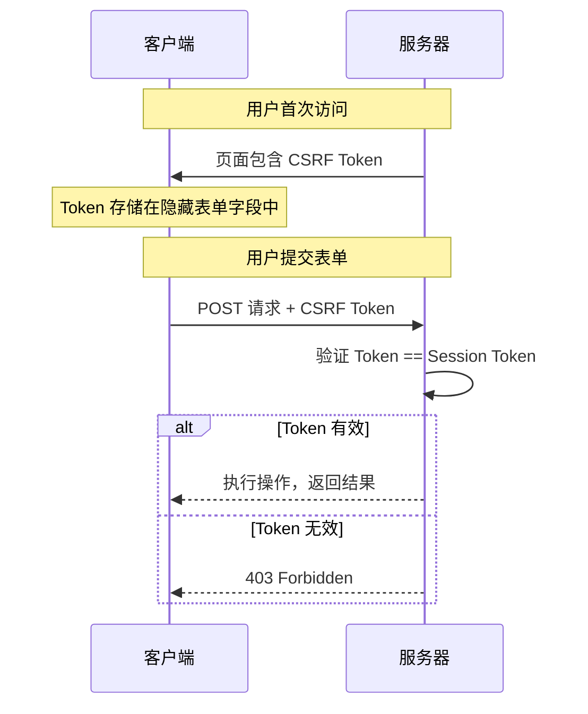
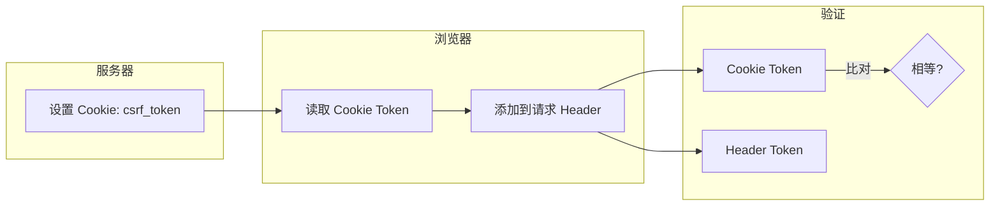

理解了 CSRF 的攻击原理后，防护就变得清晰了——**只要破坏攻击链条中的任意一个环节即可**。但问题是，哪种防护方式最有效？CSRF Token 真的是银弹吗？SameSite Cookie 能否完全替代 Token？如果用户禁用了 Cookie，CSRF 防护还能工作吗？

本文将系统性地讲解各种 CSRF 防护机制，帮助你根据业务场景选择合适的方案。

## 一、CSRF Token：业界标准

### 1.1 Synchronizer Token Pattern

这是最广泛使用的 CSRF 防护模式：

1. 服务器为每个用户会话生成一个随机 Token
2. Token 存储在 Session 中
3. 每个状态变更请求必须携带该 Token
4. 服务器验证 Token 是否与 Session 中的一致



### 1.2 Java 实现：CSRF Token 管理

```java title="CSRF Token 生成与验证"
import javax.servlet.http.HttpSession;
import java.security.SecureRandom;
import java.util.Base64;

public class CsrfTokenManager {
    
    private static final String CSRF_TOKEN_SESSION_KEY = "csrf_token";
    private static final int TOKEN_LENGTH = 32;
    private static final SecureRandom SECURE_RANDOM = new SecureRandom();
    
    /**
     * 生成 CSRF Token
     */
    public static String generateToken() {
        byte[] bytes = new byte[TOKEN_LENGTH];
        SECURE_RANDOM.nextBytes(bytes);
        return Base64.getUrlEncoder().withoutPadding().encodeToString(bytes);
    }
    
    /**
     * 获取或创建 Token
     */
    public static String getOrCreateToken(HttpSession session) {
        String token = (String) session.getAttribute(CSRF_TOKEN_SESSION_KEY);
        
        if (token == null) {
            token = generateToken();
            session.setAttribute(CSRF_TOKEN_SESSION_KEY, token);
        }
        
        return token;
    }
    
    /**
     * 验证 Token
     */
    public static boolean validateToken(HttpSession session, String token) {
        if (token == null || token.isEmpty()) {
            return false;
        }
        
        String sessionToken = (String) session.getAttribute(CSRF_TOKEN_SESSION_KEY);
        
        // 使用常量时间比较，防止时序攻击
        return constantTimeEquals(token, sessionToken);
    }
    
    private static boolean constantTimeEquals(String a, String b) {
        if (a == null || b == null) {
            return false;
        }
        if (a.length() != b.length()) {
            return false;
        }
        int result = 0;
        for (int i = 0; i < a.length(); i++) {
            result |= a.charAt(i) ^ b.charAt(i);
        }
        return result == 0;
    }
}
```

### 1.3 Spring Security CSRF 配置

Spring Security 提供了开箱即用的 CSRF 防护：

```java title="Spring Security CSRF 配置"
@Configuration
@EnableWebSecurity
public class SecurityConfig {
    
    @Bean
    public SecurityFilterChain filterChain(HttpSecurity http) throws Exception {
        http
            // 启用 CSRF 防护
            .csrf(csrf -> csrf
                // 使用 Cookie 方式存储 Token（非 HttpOnly）
                .csrfTokenRepository(CookieCsrfTokenRepository.withHttpOnlyFalse())
                
                // 配置哪些请求忽略 CSRF
                .ignoringAntMatchers("/api/public/**", "/webhook/**")
            )
            // ... 其他配置
        ;
        
        return http.build();
    }
}
```

### 1.4 前端获取和使用 Token

```html title="Thymeleaf 模板"
<!-- 自动添加 CSRF Token -->
<form th:action="@{/transfer}" method="post">
    <input type="hidden" 
           th:name="${_csrf.parameterName}" 
           th:value="${_csrf.token}">
    
    <input type="text" name="toAccount" placeholder="目标账户">
    <input type="number" name="amount" placeholder="金额">
    <button type="submit">转账</button>
</form>
```

```javascript title="Ajax 请求携带 Token"
// 获取 CSRF Token（Spring Security 会将 Token 暴露在 Cookie 中）
function getCsrfToken() {
    return document.cookie
        .match(/XSRF-TOKEN=([^;]+)/)?.[1];
}

// Ajax 请求
fetch('/api/transfer', {
    method: 'POST',
    headers: {
        'Content-Type': 'application/json',
        'X-XSRF-TOKEN': getCsrfToken()  // 自定义 Header
    },
    body: JSON.stringify({
        toAccount: '123456',
        amount: 1000
    })
});
```

## 二、Double Submit Cookie Pattern

### 2.1 原理

当服务器端无法存储 Session（如无状态 API）时，可以使用 Double Submit Cookie 模式：

1. 服务器在 Cookie 中设置 CSRF Token
2. 前端从 Cookie 中读取 Token，添加到请求中
3. 服务器验证 Cookie Token 与请求中的 Token 一致



### 2.2 Java 实现

```java title="Double Submit Cookie 实现"
/**
 * Double Submit Cookie CSRF 防护
 */
public class DoubleSubmitCsrfFilter implements Filter {
    
    private static final String CSRF_HEADER = "X-CSRF-TOKEN";
    private static final String CSRF_COOKIE = "csrf_token";
    
    @Override
    public void doFilter(ServletRequest request, ServletResponse response, 
                        FilterChain chain) throws IOException, ServletException {
        HttpServletRequest httpRequest = (HttpServletRequest) request;
        HttpServletResponse httpResponse = (HttpServletResponse) response;
        
        // 只对状态变更请求进行验证
        if ("POST".equalsIgnoreCase(httpRequest.getMethod()) ||
            "PUT".equalsIgnoreCase(httpRequest.getMethod()) ||
            "DELETE".equalsIgnoreCase(httpRequest.getMethod())) {
            
            // 跳过某些端点
            if (shouldSkipCsrf(httpRequest)) {
                chain.doFilter(request, response);
                return;
            }
            
            // 获取 Cookie 中的 Token
            String cookieToken = getCookieValue(httpRequest, CSRF_COOKIE);
            
            // 获取请求 Header 中的 Token
            String headerToken = httpRequest.getHeader(CSRF_HEADER);
            
            // 如果有 Form 参数，也可以从参数中获取
            if (headerToken == null) {
                headerToken = httpRequest.getParameter("_csrf");
            }
            
            // 验证
            if (cookieToken == null || headerToken == null || 
                !cookieToken.equals(headerToken)) {
                httpResponse.setStatus(HttpServletResponse.SC_FORBIDDEN);
                httpResponse.getWriter().write("CSRF validation failed");
                return;
            }
        }
        
        chain.doFilter(request, response);
    }
    
    /**
     * 设置 CSRF Cookie
     */
    public static void setCsrfCookie(HttpServletResponse response) {
        String token = generateToken();
        Cookie cookie = new Cookie(CSRF_COOKIE, token);
        cookie.setPath("/");
        cookie.setHttpOnly(false);  // 前端需要读取
        cookie.setSecure(true);     // 仅 HTTPS
        cookie.setMaxAge(-1);      // Session 级别
        response.addCookie(cookie);
    }
}
```

## 三、SameSite Cookie

### 3.1 SameSite 属性详解

SameSite 是 Cookie 的一个属性，控制 Cookie 是否在跨站请求中被发送。

| 值 | 行为 | 说明 |
|----|------|------|
| `Strict` | 完全禁止跨站请求 | 用户体验差，如从外部链接跳转到银行 |
| `Lax` | 仅导航请求允许（GET） | 推荐的默认值 |
| `None` | 允许跨站 | 必须配合 `Secure` 使用 |

### 3.2 Java 配置 SameSite

```java title="配置 SameSite Cookie"
@Configuration
public class CookieConfig {
    
    @Bean
    public CookieSerializer cookieSerializer() {
        DefaultCookieSerializer serializer = new DefaultCookieSerializer();
        
        // 设置 SameSite 策略
        serializer.setSameSite("Lax");  // 推荐
        
        // 设置 Secure 属性
        serializer.setUseSecureCookie(true);
        
        // HttpOnly
        serializer.setUseHttpOnlyCookie(true);
        
        return serializer;
    }
}
```

```java title="手动设置 SameSite"
// 手动设置 SameSite Cookie
Cookie cookie = new Cookie("session_id", sessionId);
cookie.setPath("/");
cookie.setHttpOnly(true);
cookie.setSecure(true);

// SameSite 设置
response.addHeader("Set-Cookie", 
    "session_id=" + sessionId + 
    "; Path=/" +
    "; HttpOnly" +
    "; Secure" +
    "; SameSite=Lax");
```

### 3.3 SameSite 的局限性

:::warning SameSite 不是万能的

SameSite Cookie 在以下场景中无法提供保护：

1. **SameSite=None 绕过**：某些遗留系统必须使用 `SameSite=None`，此时 Cookie 会被发送
2. **子域攻击**：如果 `sub.example.com` 存在 XSS，可以访问 `example.com` 的 Cookie（不包括 HttpOnly）
3. **HTTPS 问题**：如果站点同时支持 HTTP，攻击者可能降级到 HTTP 发起攻击
4. **旧浏览器兼容**：某些浏览器不支持 SameSite 属性

**建议**：SameSite 应作为纵深防御，而非唯一的 CSRF 防护。
:::

## 四、Origin 和 Referer Header 验证

### 4.1 Origin Header

Origin Header 由浏览器自动设置，表示请求的来源（协议 + 域名 + 端口）：

```http
Origin: https://example.com
```

**验证逻辑**：

```java title="Origin 验证"
public class OriginValidator {
    
    private static final Set<String> ALLOWED_ORIGINS = Set.of(
        "https://example.com",
        "https://www.example.com",
        "https://app.example.com"
    );
    
    public static boolean validate(HttpServletRequest request) {
        String origin = request.getHeader("Origin");
        
        if (origin == null) {
            // 对于同源请求，浏览器不发送 Origin
            return true;
        }
        
        // 验证 Origin 是否在白名单中
        return ALLOWED_ORIGINS.contains(origin);
    }
}
```

### 4.2 Referer Header

Referer 包含完整的 URL：

```http
Referer: https://example.com/app/transfer
```

**验证逻辑**：

```java title="Referer 验证"
public class RefererValidator {
    
    public static boolean validate(HttpServletRequest request, String expectedDomain) {
        String referer = request.getHeader("Referer");
        
        if (referer == null) {
            // Referer 可能被用户禁用，不应直接拒绝
            return true;
        }
        
        try {
            URL url = new URL(referer);
            String host = url.getHost();
            
            // 验证域名
            return host.equals(expectedDomain) || host.endsWith("." + expectedDomain);
        } catch (MalformedURLException e) {
            return false;
        }
    }
}
```

### 4.3 最佳实践：组合验证

```java title="组合 CSRF 验证"
public class CsrfProtectionFilter implements Filter {
    
    @Override
    public void doFilter(ServletRequest request, ServletResponse response, 
                        FilterChain chain) throws IOException, ServletException {
        HttpServletRequest httpRequest = (HttpServletRequest) request;
        HttpServletResponse httpResponse = (HttpServletResponse) response;
        
        // 1. 检查是否为状态变更请求
        if (isStateChangingRequest(httpRequest)) {
            
            // 2. 验证 Origin 或 Referer
            if (!validateOrigin(httpRequest) && !validateReferer(httpRequest)) {
                httpResponse.setStatus(HttpServletResponse.SC_FORBIDDEN);
                return;
            }
            
            // 3. 验证 CSRF Token
            if (!validateCsrfToken(httpRequest)) {
                httpResponse.setStatus(HttpServletResponse.SC_FORBIDDEN);
                return;
            }
        }
        
        chain.doFilter(request, response);
    }
    
    private boolean isStateChangingRequest(HttpServletRequest request) {
        String method = request.getMethod();
        return "POST".equalsIgnoreCase(method) ||
               "PUT".equalsIgnoreCase(method) ||
               "DELETE".equalsIgnoreCase(method) ||
               "PATCH".equalsIgnoreCase(method);
    }
    
    private boolean validateOrigin(HttpServletRequest request) {
        String origin = request.getHeader("Origin");
        if (origin == null) {
            return true;  // Origin 不存在时跳过
        }
        return allowedOrigins.contains(origin);
    }
    
    private boolean validateReferer(HttpServletRequest request) {
        String referer = request.getHeader("Referer");
        if (referer == null) {
            return true;  // Referer 不存在时依赖 Token
        }
        return allowedDomains.stream().anyMatch(referer::contains);
    }
    
    private boolean validateCsrfToken(HttpServletRequest request) {
        String token = request.getHeader("X-CSRF-TOKEN");
        if (token == null) {
            token = request.getParameter("_csrf");
        }
        if (token == null) {
            return false;
        }
        return csrfTokenManager.validate(request.getSession(), token);
    }
}
```

## 五、密码确认机制

### 5.1 适用场景

对于极高风险操作（如修改登录邮箱、删除账户、转账），即使有 CSRF Token，也可以添加密码确认作为额外验证：

```java title="密码确认验证"
@PostMapping("/settings/change-email")
public String changeEmail(@RequestParam String newEmail,
                         @RequestParam String password,
                         HttpSession session) {
    
    // 1. 验证 CSRF Token
    if (!csrfTokenManager.validate(session, request.getHeader("X-CSRF-TOKEN"))) {
        throw new CSRFException();
    }
    
    // 2. 重新验证密码
    User currentUser = getCurrentUser(session);
    if (!passwordEncoder.matches(password, currentUser.getPasswordHash())) {
        throw new AuthenticationException("密码错误");
    }
    
    // 3. 发送验证邮件到新邮箱
    sendVerificationEmail(currentUser, newEmail);
    
    return "email-change-pending";
}
```

### 5.2 短信/邮件验证码

```java title="二次验证"
@PostMapping("/transfer")
public String transfer(@RequestParam String toAccount,
                      @RequestParam BigDecimal amount,
                      @RequestParam String smsCode,
                      HttpSession session) {
    
    // 验证 CSRF Token
    if (!validateCsrf(session, request)) {
        throw new CSRFException();
    }
    
    // 验证短信验证码
    String expectedCode = (String) session.getAttribute("transfer_sms_code");
    if (!expectedCode.equals(smsCode)) {
        throw new VerificationException("验证码错误");
    }
    
    // 验证码一次性使用
    session.removeAttribute("transfer_sms_code");
    
    // 执行转账
    return executeTransfer(session, toAccount, amount);
}
```

## 六、单页应用（SPA）的 CSRF 防护

### 6.1 SPA 的挑战

SPA 使用 JavaScript 管理路由和状态，传统的 CSRF Token 隐藏表单字段不再适用。

### 6.2 SPA 解决方案

```java title="SPA CSRF Token 管理"
@Configuration
@EnableWebSecurity
public class SpaSecurityConfig {
    
    @Bean
    public SecurityFilterChain filterChain(HttpSecurity http) throws Exception {
        http
            .csrf(csrf -> csrf
                // 使用 Cookie 作为 Token 来源
                .csrfTokenRepository(CookieCsrfTokenRepository.withHttpOnlyFalse())
                // 允许 Cookie 从前端 JavaScript 读取
            )
            // 其他配置
        ;
        
        return http.build();
    }
}
```

```javascript title="前端获取并使用 Token"
class CsrfService {
    
    /**
     * 获取 CSRF Token
     */
    static getToken() {
        const match = document.cookie.match(/XSRF-TOKEN=([^;]+)/);
        return match ? decodeURIComponent(match[1]) : null;
    }
    
    /**
     * 带 CSRF Token 的请求
     */
    static async fetch(url, options = {}) {
        const token = this.getToken();
        
        return fetch(url, {
            ...options,
            headers: {
                ...options.headers,
                'X-XSRF-TOKEN': token,
                'Content-Type': 'application/json'
            },
            credentials: 'include'  // 携带 Cookie
        });
    }
}

// 使用示例
async function transfer(toAccount, amount) {
    const response = await CsrfService.fetch('/api/transfer', {
        method: 'POST',
        body: JSON.stringify({ toAccount, amount })
    });
    
    if (!response.ok) {
        throw new Error('Transfer failed');
    }
    
    return response.json();
}
```

## 七、Spring Security CSRF 完整示例

```java title="完整的 Spring Security CSRF 配置"
@Configuration
@EnableWebSecurity
public class SecurityConfig {
    
    @Bean
    public SecurityFilterChain filterChain(HttpSecurity http) throws Exception {
        http
            // CSRF 防护
            .csrf(csrf -> csrf
                // Cookie 方式存储 Token
                .csrfTokenRepository(CookieCsrfTokenRepository.withHttpOnlyFalse())
                // 忽略特定路径
                .ignoringAntMatchers(
                    "/api/public/**",      // 公开 API
                    "/health",             // 健康检查
                    "/webhook/**"          // 第三方 Webhook
                )
            )
            
            // SameSite Cookie
            .sessionManagement(session -> session
                .sessionCreationPolicy(SessionCreationPolicy.IF_REQUIRED)
            )
            
            // 安全 Header
            .headers(headers -> headers
                .frameOptions().deny()  // 防止点击劫持
                .contentTypeOptions().disable()  // 禁用 MIME 嗅探
            )
        ;
        
        return http.build();
    }
}

@Component
public class CsrfExceptionHandler {
    
    @ExceptionHandler(CSRFException.class)
    @ResponseStatus(HttpStatus.FORBIDDEN)
    public ErrorResponse handleCsrfException(CSRFException e) {
        return new ErrorResponse(
            "CSRF_TOKEN_INVALID",
            "请求验证失败，请刷新页面后重试"
        );
    }
}
```

## 八、防护方案对比

| 方案 | 安全性 | 实现复杂度 | 用户体验影响 | 适用场景 |
|------|--------|-----------|-------------|----------|
| Synchronizer Token | **高** | 中 | 无 | 有 Session 的 Web 应用 |
| Double Submit Cookie | **中高** | 低 | 无 | 无状态 API |
| SameSite=Strict | 中 | 低 | 有（跨导航被拦截） | 内部系统 |
| SameSite=Lax | 中 | 低 | 无 | 面向公众的应用 |
| Origin/Referer | 中 | 低 | 无（可被禁用） | 辅助验证 |
| 密码确认 | **高** | 低 | 有（需输入密码） | 高风险操作 |
| 短信验证码 | **高** | 高 | 有（需输入验证码） | 金融交易 |

:::tip 最佳实践建议
1. **默认启用 CSRF Token**：Spring Security 已默认启用，不要轻易禁用
2. **结合 SameSite Cookie**：添加 SameSite=Lax 作为纵深防御
3. **高风险操作二次验证**：密码确认或短信验证码
4. **忽略公开 API**：无需认证的 API 可以忽略 CSRF
5. **SPA 特殊处理**：使用 Cookie Token + JavaScript Header 方式
:::

## 思考题

**问题 1**：某公司正在从传统的多页应用（MPA）迁移到单页应用（SPA），之前 MPA 使用的是 Spring Security 的 Session-based CSRF Token。迁移到 SPA 后，技术团队讨论了三种方案：

1. 继续使用 Session-based Token，通过 API 获取并存储在前端
2. 改用 Double Submit Cookie 模式
3. 仅依赖 SameSite=Lax Cookie

请分析这三种方案的优缺点，并给出最终推荐。

<details>
<summary>参考答案</summary>

**方案一：继续使用 Session-based Token**

| 优点 | 缺点 |
|------|------|
| 安全性高（Token 存储在服务端） | 需要维护 Session |
| 无 Token 预测风险 | 每次 API 请求都需要验证 Session |
| 符合团队现有技术栈 | 对无状态架构不友好 |

**方案二：Double Submit Cookie**

| 优点 | 缺点 |
|------|------|
| 无需服务端存储 | 如果 Cookie 被攻击者读取，可能被利用 |
| 适合无状态架构 | 无法防止 XSS 窃取 Token（如果 Cookie 可被 JS 读取） |
| 实现相对简单 | |

**方案三：仅依赖 SameSite=Lax**

| 优点 | 缺点 |
|------|------|
| 实现最简单 | 只能防护 GET 导航请求的 CSRF |
| 浏览器原生支持 | POST 请求仍可能遭受 CSRF |
| 无需改动现有代码 | 不防护子域 XSS 攻击 |

**推荐方案：方案一 + SameSite Cookie**

**完整防护架构**：

```javascript title="SPA CSRF Token 管理"
// 1. 登录时获取 Session 和初始 CSRF Token
async function login(username, password) {
    const response = await fetch('/api/login', {
        method: 'POST',
        credentials: 'include',  // 携带 Session Cookie
        headers: {
            'Content-Type': 'application/json'
        },
        body: JSON.stringify({ username, password })
    });
    
    // 2. Session Cookie 已设置
    // 3. 初始 Token 可以从登录响应中获取
    const data = await response.json();
    return {
        sessionCookie: true,  // Spring Security 设置
        csrfToken: data.csrfToken  // 可选：响应体中携带
    };
}

// 4. 后续请求自动携带 Session Cookie
// 5. CSRF Token 从 Spring Security 的 Cookie 获取
function getCsrfToken() {
    const cookies = document.cookie.split(';');
    const csrfCookie = cookies.find(c => c.trim().startsWith('XSRF-TOKEN='));
    return csrfCookie ? decodeURIComponent(csrfCookie.split('=')[1]) : null;
}

// 6. 发送敏感请求时携带 Token
async function sensitiveOperation(data) {
    return fetch('/api/sensitive', {
        method: 'POST',
        credentials: 'include',
        headers: {
            'Content-Type': 'application/json',
            'X-XSRF-TOKEN': getCsrfToken()
        },
        body: JSON.stringify(data)
    });
}
```

**为什么这样推荐**：

1. **Session-based Token 最安全**：即使前端被 XSS 攻破，攻击者也无法直接获取服务端 Session 中的 Token（虽然可以发起请求，但有 Token 在服务端与 Session 绑定）
2. **SameSite=Lax 作为纵深防御**：即使 Token 验证有漏洞，Lax 也能阻止大部分 CSRF
3. **Cookie 存储 Token 方便 SPA 使用**：无需额外状态管理

**关键配置**：

```java title="Spring Security 配置"
@Configuration
@EnableWebSecurity
public class SpaSecurityConfig {
    
    @Bean
    public SecurityFilterChain filterChain(HttpSecurity http) throws Exception {
        http
            // SPA 场景的 CSRF 配置
            .csrf(csrf -> csrf
                // 使用 Cookie 存储 Token，支持前端读取
                .csrfTokenRepository(CookieCsrfTokenRepository.withHttpOnlyFalse())
                // 设置 SameSite（Spring Security 默认不设置，需要手动配置）
                .and()
            )
            // ... 其他配置
        ;
        
        return http.build();
    }
}
```
</details>

**问题 2**：某银行的转账 API 设计如下：

```java
@PostMapping("/transfer")
public TransferResult transfer(@RequestBody TransferRequest request) {
    // 验证登录状态（通过 Session Cookie）
    // 执行转账逻辑
    return new TransferResult("success");
}
```

前端使用 fetch 发送 JSON 请求：
```javascript
fetch('/api/transfer', {
    method: 'POST',
    credentials: 'include',  // 携带 Cookie
    headers: { 'Content-Type': 'application/json' },
    body: JSON.stringify(requestData)
});
```

安全评估发现：虽然使用了 HTTPS，但 CSRF Token 尚未实现。请分析当前方案的安全风险，以及如何改造？

<details>
<summary>参考答案</summary>

**当前方案的安全风险分析**：

**1. CSRF 风险（严重）**

攻击者可以构造恶意页面，诱导已登录用户发起转账：

```html title="CSRF 攻击页面"
<html>
<body>
    <form id="attack" action="https://bank.com/api/transfer" method="POST" 
          enctype="text/plain">
        <!-- 使用 text/plain 绕过部分防护 -->
        <textarea name='{"to":"attacker","amount":100000,"a":"'>
        </textarea>
    </form>
    
    <script>
        document.getElementById('attack').submit();
    </script>
</body>
</html>
```

浏览器会自动携带 Session Cookie，服务器会执行转账。

**2. CORS 风险（如果配置不当）**

如果服务器配置了错误的 CORS，攻击者可以直接 Ajax 请求：

```http
Access-Control-Allow-Origin: *  # 危险！
Access-Control-Allow-Credentials: true  # 更危险！
```

**3. 缺少其他安全 Header**

- 无 CSP：无法防护 XSS
- 无 X-Content-Type-Options：可能被 MIME 嗅探攻击

**改造方案**：

**Step 1: 添加 CSRF Token**

```java title="后端配置"
@Configuration
@EnableWebSecurity
public class BankSecurityConfig {
    
    @Bean
    public SecurityFilterChain filterChain(HttpSecurity http) throws Exception {
        http
            .csrf(csrf -> csrf
                // 允许 API 使用 Cookie Token
                .csrfTokenRepository(CookieCsrfTokenRepository.withHttpOnlyFalse())
                // 只对特定路径启用（排除公开接口）
                .requireCsrfProtectionMatcher(request -> {
                    String path = request.getRequestURI();
                    // 敏感操作需要 CSRF Token
                    return path.startsWith("/api/transfer") ||
                           path.startsWith("/api/account");
                })
            )
            // ... 其他安全配置
        ;
        
        return http.build();
    }
}
```

**Step 2: 前端改造**

```javascript title="前端 CSRF Token"
// 获取 Token
function getCsrfToken() {
    const match = document.cookie.match(/XSRF-TOKEN=([^;]+)/);
    return match ? decodeURIComponent(match[1]) : null;
}

// 安全的转账请求
async function transfer(toAccount, amount) {
    const response = await fetch('/api/transfer', {
        method: 'POST',
        credentials: 'include',  // 携带 Session Cookie
        headers: {
            'Content-Type': 'application/json',
            'X-XSRF-TOKEN': getCsrfToken()  // 携带 CSRF Token
        },
        body: JSON.stringify({
            toAccount,
            amount
        })
    });
    
    if (!response.ok) {
        const error = await response.json();
        throw new Error(error.message || 'Transfer failed');
    }
    
    return response.json();
}
```

**Step 3: 添加安全 Header**

```java title="安全 Header 配置"
@Configuration
public class SecurityHeaderConfig {
    
    @Bean
    public FilterRegistrationBean<SecurityHeaderFilter> securityHeaderFilter() {
        FilterRegistrationBean<SecurityHeaderFilter> registration = 
            new FilterRegistrationBean<>();
        registration.setFilter(new SecurityHeaderFilter());
        registration.addUrlPatterns("/api/*");
        return registration;
    }
}

public class SecurityHeaderFilter implements Filter {
    
    @Override
    public void doFilter(ServletRequest request, ServletResponse response,
                         FilterChain chain) throws IOException, ServletException {
        HttpServletResponse httpResponse = (HttpServletResponse) response;
        
        // 防止 MIME 嗅探
        httpResponse.setHeader("X-Content-Type-Options", "nosniff");
        
        // XSS 防护
        httpResponse.setHeader("X-XSS-Protection", "1; mode=block");
        
        // 防止点击劫持
        httpResponse.setHeader("X-Frame-Options", "DENY");
        
        // CSP
        httpResponse.setHeader("Content-Security-Policy", 
            "default-src 'self'; script-src 'self'; object-src 'none'");
        
        // CORS（严格配置）
        httpResponse.setHeader("Access-Control-Allow-Origin", 
            "https://bank.example.com");  // 精确指定来源
        httpResponse.setHeader("Access-Control-Allow-Credentials", "true");
        httpResponse.setHeader("Access-Control-Allow-Methods", "GET, POST, OPTIONS");
        
        chain.doFilter(request, response);
    }
}
```

**Step 4: 高风险操作二次验证**

```java title="大额转账二次验证"
@PostMapping("/api/transfer")
public TransferResult transfer(@RequestBody TransferRequest request,
                               @RequestHeader(value = "X-CSRF-TOKEN", required = false) String csrfToken,
                               HttpSession session) {
    
    // 1. CSRF Token 验证
    if (!validateCsrf(csrfToken, session)) {
        throw new CsrfException("Invalid CSRF Token");
    }
    
    // 2. 基本验证
    validateTransferRequest(request);
    
    // 3. 大额转账需要二次验证
    if (request.getAmount().compareTo(new BigDecimal("50000")) >= 0) {
        String smsCode = request.getSmsCode();
        if (!validateSmsCode(request.getUserId(), smsCode)) {
            throw new VerificationException("SMS verification failed");
        }
    }
    
    // 4. 执行转账
    return executeTransfer(request);
}
```

**最终推荐的安全架构**：

```
CSRF Token + SameSite Cookie + HTTPS + 安全 Header + 二次验证 + CORS 严格配置
```
</details>
