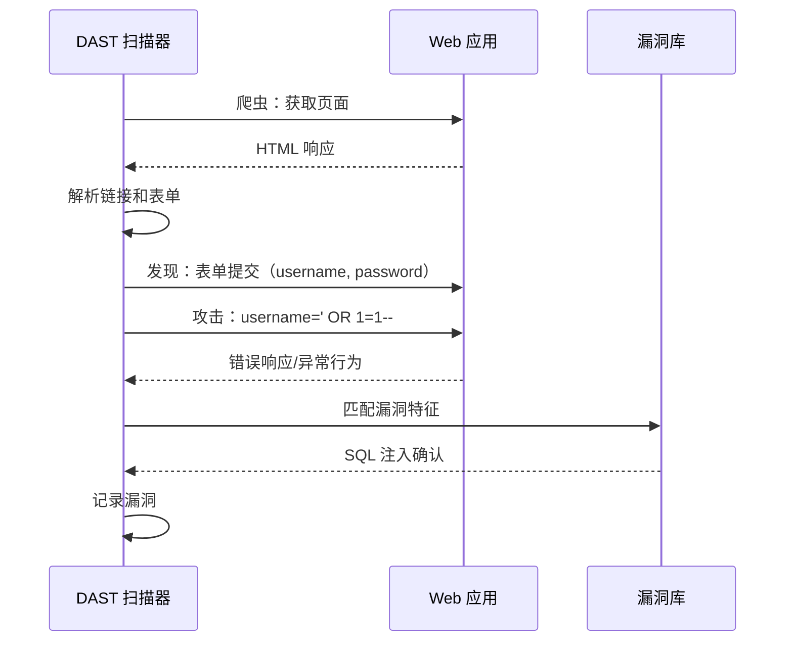
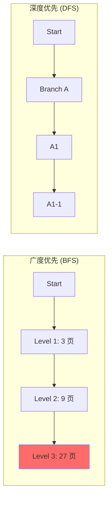

某金融科技公司的渗透测试团队接到了一个有趣的挑战：测试一个新上线的移动支付应用。测试时间只有 48 小时，但应用有 300 多个 API 端点、复杂的业务逻辑和三层认证机制。

如果用传统的渗透测试方法，48 小时根本不够。但测试团队带来了一件秘密武器——DAST 工具。工具在 4 小时内完成了对所有端点的自动化扫描，发现了 47 个漏洞，其中 12 个是高危。最终测试报告指出，这个工具发现的漏洞占了全部漏洞的 60%。

DAST，让动态安全测试从「奢侈品」变成了「日用品」。

## DAST 的定义

DAST（Dynamic Application Security Testing，动态应用安全测试）是一种通过模拟攻击者的行为，在运行时对应用进行黑盒测试的安全检测技术。与 SAST 不同，DAST 不需要访问源代码，而是通过发送精心构造的请求来测试应用的行为。

```mermaid
flowchart LR
    A["DAST 扫描器"] -->|"爬虫请求| B["Web 应用"]
    A -->|"攻击请求| B
    B -->|"响应| A
    A -->|"分析响应| C["漏洞检测"]
    
    style A fill:#54a0ff
    style C fill:#ff6b6b
```

## 工作原理

### 爬虫 + 攻击模式

DAST 的核心工作流程是「发现 + 测试」：



### 漏洞检测方法

DAST 通过观察应用对恶意输入的响应来检测漏洞：

| 漏洞类型 | 检测方法 | 响应特征 |
|---|---|---|
| SQL 注入 | `' OR 1=1--` 等 | SQL 错误信息、异常行为差异 |
| XSS | `<script>alert(1)</script>` | 反射输入、脚本执行 |
| 命令注入 | `; ls` 等 | 命令输出泄露、响应延迟 |
| 路径遍历 | `../../etc/passwd` | 文件内容泄露、403 错误差异 |
| XXE | 外部实体引用 | 响应时间变化、带外数据 |

## 工具对比

### 企业级工具

| 工具 | 开发商 | 特点 | 部署方式 |
|---|---|---|---|
| Burp Suite Professional | PortSwigger | 业界标准，扩展性强 | 桌面应用 |
| Acunetix | Acunetix | 自动化程度高，扫描快速 | SaaS / 本地 |
| Netsparker | Invicti | 高准确性，自动化确认 | SaaS / 本地 |
| AppScan | IBM | 企业级，全面的覆盖 | 本地 |
| Invicti | Invicti | 自动验证，误报率低 | SaaS / 本地 |

### 开源工具

| 工具 | 特点 | 适用场景 |
|---|---|---|
| OWASP ZAP | 开源免费，社区活跃 | 入门、CI/CD 集成 |
| Nuclei | 模板驱动，速度快 | 定制化扫描 |
| SQLMap | SQL 注入专业工具 | 专项渗透测试 |
| Wapiti | Python 实现 | Python 生态 |

### OWASP ZAP 集成

OWASP ZAP（Zed Attack Proxy）是最流行的开源 DAST 工具：

```yaml title="GitHub Actions with OWASP ZAP"
name: DAST Security Scan

on:
  schedule:
    # 每周一凌晨执行
    - cron: '0 2 * * 1'
  workflow_dispatch:
    inputs:
      target_url:
        description: 'Target URL'
        required: true
        default: 'https://staging.example.com'

jobs:
  zap_scan:
    runs-on: ubuntu-latest
    steps:
      - uses: actions/checkout@v4
      
      - name: Run ZAP Scan
        uses: zaproxy/action-baseline@v0.9.0
        with:
          target: ${{ inputs.target_url }}
          cmd_options: '-j'  # 使用 Spider + AJAX Spider
          
      - name: Upload ZAP Report
        uses: actions/upload-artifact@v4
        with:
          name: zap-report
          path: zap_report.html
```

### ZAP API 调用

```bash title="ZAP API 使用示例"
# 启动 ZAP（Docker 模式）
docker run -d -p 8080:8080 owasp/zap2docker-stable zap.sh -daemon -port 8080 -config api.key=your-api-key

# 爬取目标网站
curl -X POST "http://localhost:8080/JSON/spider/action/scan/?url=https://example.com"

# 主动扫描
curl -X POST "http://localhost:8080/JSON/ascan/action/scan/?url=https://example.com&recurse=true"

# 获取扫描进度
curl "http://localhost:8080/JSON/spider/view/status/?scanId=0"

# 获取漏洞报告
curl "http://localhost:8080/JSON/core/view/alerts/?baseurl=https://example.com"
```

## 爬虫策略

### 深度优先 vs 广度优先



| 策略 | 优点 | 缺点 | 适用场景 |
|---|---|---|---|
| BFS | 快速覆盖 | 可能遗漏深层路径 | 时间有限的扫描 |
| DFS | 发现深层漏洞 | 可能忽略并列路径 | 发现隐藏功能 |
| 混合 | 平衡覆盖 | 配置复杂 | 大型应用 |

### 认证处理

DAST 最大的挑战之一是处理认证：

```yaml title="ZAP 认证配置"
# ZAP 认证配置示例
authentication:
  method: form
  parameters:
    url: https://example.com/login
    username: test@example.com
    password: testpass123
    submitFields: submit,login
  
  verification:
    method: regex
    pattern: "Welcome, .*"
    loggedOutRegex: "Login|Unauthorized"

# 使用 Selenium 处理复杂认证
script:
  - name: multi-step-auth.js
    type: httpsender
```

### Session 管理

```java title="ZAP Session 管理"
import org.zaproxy.clientapi.core.*;
import org.zaproxy.clientapi.core.exceptions.ClientApiException;

public class ZapScanner {
    private ClientApi api;
    private String target = "https://example.com";
    
    public void scan() throws ClientApiException {
        // 创建新 Session
        api.core.newSession("", "");
        
        // 设置 Context（包含认证信息）
        int contextId = api.context.newContext("authenticated");
        api.context.includeInContext(contextId, "https://example.com/.*");
        
        // 注册认证脚本
        api.script.loadScript(
            "scriptName",     // 脚本名称
            "authentication", // 脚本类型
            "oracle",         // 脚本引擎
            "auth-script.js", // 脚本文件
            ""                // 参数
        );
        
        // 启用认证
        api.authentication.setLoggedInIndicator(
            contextId, 
            "\"isAuthenticated\":\\s*true"
        );
        
        // 开始扫描
        api.ascan.scan(target, "", "", "", "", "");
    }
}
```

## API 测试

### OpenAPI/Swagger 支持

现代 DAST 工具可以直接导入 API 定义：

```yaml title="OpenAPI 规范示例"
openapi: 3.0.0
info:
  title: Payment API
  version: 1.0.0
paths:
  /api/v1/payment:
    post:
      security:
        - BearerAuth: []
      requestBody:
        content:
          application/json:
            schema:
              type: object
              properties:
                cardNumber:
                  type: string
                cvv:
                  type: string
      responses:
        '200':
          description: Payment successful
```

```bash title="ZAP API Scan"
# 使用 OpenAPI 规范扫描
zap-cli api-scan -f openapi.yaml -t https://api.example.com
```

### GraphQL 测试

GraphQL API 需要专门的测试策略：

```bash title="GraphQL 注入测试"
# Introspection 查询
curl -X POST https://api.example.com/graphql \
  -H "Content-Type: application/json" \
  -d '{"query":"{ __schema { types { name } } }"}'

# 测试 Query 字段注入
curl -X POST https://api.example.com/graphql \
  -H "Content-Type: application/json" \
  -d '{"query":"{ users(limit: 1) { __typename } }"}'

# 测试 Mutation 注入
curl -X POST https://api.example.com/graphql \
  -H "Content-Type: application/json" \
  -d '{"query":"mutation { createUser(input: {name: \"test\"}) { id } }"}'
```

## CI/CD 集成

### 完整 CI/CD 集成示例

```yaml title="GitLab CI - Full DAST Pipeline"
stages:
  - test
  - security
  - deploy

# 环境准备
prepare_environment:
  stage: test
  script:
    - docker-compose up -d
    - wait-for-it.sh service:8080 --timeout=30
  environment:
    name: staging

# DAST 扫描
dast_scan:
  stage: security
  image: owasp/zap2docker-stable:latest
  variables:
    TARGET_URL: "https://staging.example.com"
    ZAP_API_KEY: $ZAP_API_KEY
  script:
    - |
      # 启动 ZAP 守护进程
      zap.sh -daemon -port 8080 -config api.key=$ZAP_API_KEY &
      ZAP_PID=$!
      
      # 等待 ZAP 启动
      sleep 10
      
      # 导入 OpenAPI 规范（如果存在）
      if [ -f api/openapi.yaml ]; then
        curl -X POST "http://localhost:8080/JSON/openapi/action/importFile/?file=/zap/wrk/api/openapi.yaml"
      fi
      
      # 爬取目标
      curl -X POST "http://localhost:8080/JSON/spider/action/scan/?url=$TARGET_URL"
      
      # 等待爬取完成
      while [ $(curl "http://localhost:8080/JSON/spider/view/status/?scanId=0" | jq -r '.status') != "100" ]; do
        sleep 5
      done
      
      # 主动扫描
      curl -X POST "http://localhost:8080/JSON/ascan/action/scan/?url=$TARGET_URL&recurse=true"
      
      # 等待扫描完成（最多 30 分钟）
      for i in {1..360}; do
        status=$(curl "http://localhost:8080/JSON/ascan/view/status/?scanId=0" | jq -r '.status')
        if [ "$status" = "100" ]; then
          break
        fi
        sleep 5
      done
      
      # 生成报告
      curl "http://localhost:8080/JSON/core/view/htmlreport" > zap_report.html
      curl "http://localhost:8080/JSON/core/view/jsonreport" > zap_report.json
      
      # 关闭 ZAP
      kill $ZAP_PID
  artifacts:
    reports:
      dast: zap_report.json
    paths:
      - zap_report.html
    expire_in: 1 week
    when: always
  allow_failure: true  # 漏洞不影响部署，仅告警

# 扫描结果阈值检查
security_gate:
  stage: security
  script:
    - |
      HIGH_COUNT=$(cat zap_report.json | jq '[.site[].alerts[] | select(.riskdesc | contains("High"))] | length')
      echo "High risk vulnerabilities: $HIGH_COUNT"
      
      if [ $HIGH_COUNT -gt 0 ]; then
        echo "Security gate failed: Found $HIGH_COUNT high risk vulnerabilities"
        exit 1
      fi
  rules:
    - if: $CI_MERGE_REQUEST_ID
  needs:
    - dast_scan
```

### 增量扫描策略

```yaml title="Incremental DAST"
# 每天增量扫描（基于变更）
dast_incremental:
  stage: security
  image: owasp/zap2docker-stable:latest
  script:
    - |
      # 获取最近 24 小时变更的 URL
      CHANGED_URLS=$(cat git-changes.txt)
      
      # 只扫描变更的端点
      for url in $CHANGED_URLS; do
        curl -X POST "http://localhost:8080/JSON/ascan/action/scan/?url=$url"
      done
      
      # 生成增量报告
      zap-baseline.py -t https://example.com -l INFO -J zap-incremental.json
```

## 优势与局限性

### DAST 的优势

| 优势 | 说明 |
|---|---|
| 无源代码依赖 | 黑盒测试，不需要代码访问权限 |
| 真实攻击模拟 | 测试应用的实际行为，不受代码结构影响 |
| 误报率低 | 检测到的是真实可利用的漏洞 |
| 快速上手 | 不需要深入理解代码 |
| 发现配置问题 | 可发现部署配置相关的安全问题 |

### DAST 的局限性

:::warning 重要认知
DAST 不是万能的：

1. **覆盖率受限**：只能测试爬虫能发现的端点
2. **认证挑战**：处理复杂认证机制困难
3. **单向测试**：只能测试公开的请求-响应，无法测试服务端回调
4. **性能影响**：扫描可能对被测系统造成负载
5. **业务逻辑漏洞**：无法发现越权、认证绕过等业务逻辑问题
6. **异步问题**：无法有效测试异步操作和后台任务
:::

## 思考题

**问题 1**：某电商网站的 DAST 扫描报告发现了一个高危 SQL 注入漏洞，但开发团队复查代码后认为「这是误报，因为代码使用了 MyBatis ORM」。你如何评估这个情况？

<details>
<summary>参考答案</summary>

**评估步骤**：

1. **确认注入点**
   - 获取扫描报告中的具体请求和响应
   - 确定注入发生的 URL、参数和 payload

2. **分析 ORM 使用方式**
   - MyBatis 的 `#{}` 参数化查询是安全的
   - MyBatis 的 `${}` 直接拼接是危险的
   - 即使使用 ORM，错误的写法仍然可能导致注入

```java
// 安全的写法
@Select("SELECT * FROM users WHERE id = #{userId}")
User findById(@Param("userId") Long userId);

// 危险的写法（注入风险）
@Select("SELECT * FROM users WHERE name = '${username}'")
User findByName(@Param("username") String username);
```

3. **验证漏洞**
   - 在测试环境手动复现注入
   - 观察是否有数据库错误或异常行为
   - 检查是否有 WAF 拦截了测试请求

4. **可能的情况**
   - 如果开发团队使用的是安全的参数化查询：可能是 DAST 工具误报
   - 如果使用了 `${}` 或动态 SQL：漏洞真实存在
   - 如果使用了原生 SQL：漏洞真实存在

**结论**：即使使用了 ORM，注入漏洞仍可能存在。应该通过代码审查和手动测试来确认，而不是直接否认。
</details>

**问题 2**：某公司计划将 DAST 集成到 CI/CD 流程中，但团队担心扫描时间太长（完整扫描需要 2 小时）会影响部署效率。你会如何设计一个兼顾安全性和效率的 DAST 策略？

<details>
<summary>参考答案</summary>

**分层 DAST 策略**：

1. **CI 阶段：快速扫描（5-15 分钟）**
```yaml
# PR/MR 时：只扫描变更 + 高危规则
- 使用增量扫描，只测试变更的功能
- 使用「高风险」规则集，忽略低危漏洞
- 使用 ZAP Baseline Profile
```

2. **CD 阶段：完整扫描（可选，异步）**
```yaml
# 合主干后：完整扫描，但不阻塞部署
- 完整爬取 + 主动扫描
- 扫描在后台异步执行
- 发现高危漏洞时发送告警
```

3. **定时扫描（深度覆盖）**
```yaml
# 每日/每周：全面扫描
- 使用所有规则（包括低危）
- 深度爬取 + 主动扫描
- 生成完整报告，发送给安全团队
```

4. **性能优化**
```yaml
# 1. 排除不需要扫描的路径
excludePaths:
  - /health
  - /metrics
  - /static/**
  
# 2. 限制扫描深度和并发
maxDepth: 5
maxChildren: 100
threadCount: 10

# 3. 使用缓存
- 对登录过程进行缓存
- 跳过已扫描的页面
```

5. **报告分级处理**
```yaml
# 高危：立即告警，阻塞部署
# 中危：记录到安全看板，定期处理
# 低危：纳入技术债务，定期清理
```

**建议的流程**：
1. PR 阶段：快速增量扫描（5-10分钟），阻塞高危漏洞
2. 每日：完整扫描（异步，不阻塞）
3. 每周：安全审查，处理积累的中低危漏洞
</details>